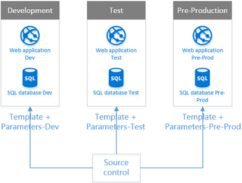
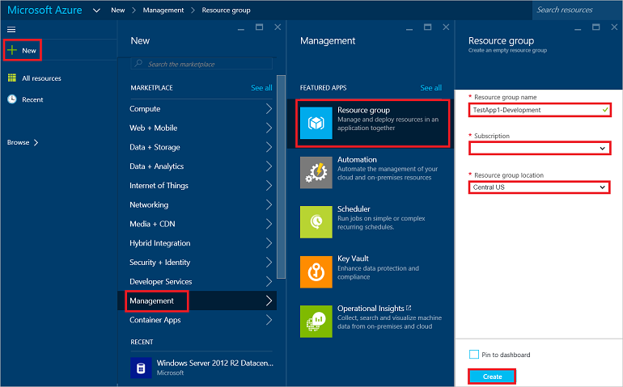
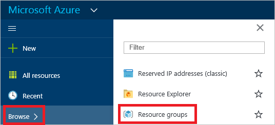
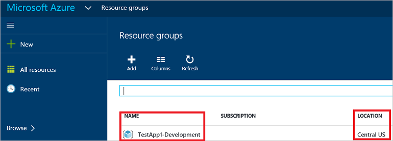
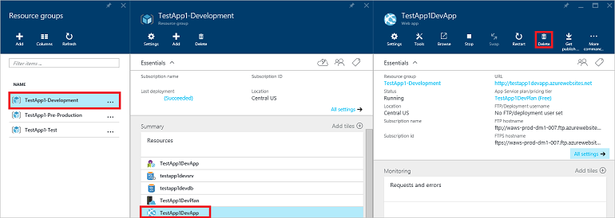
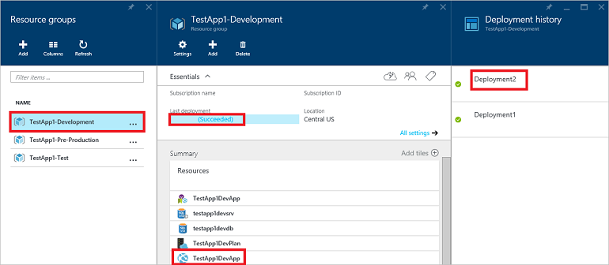
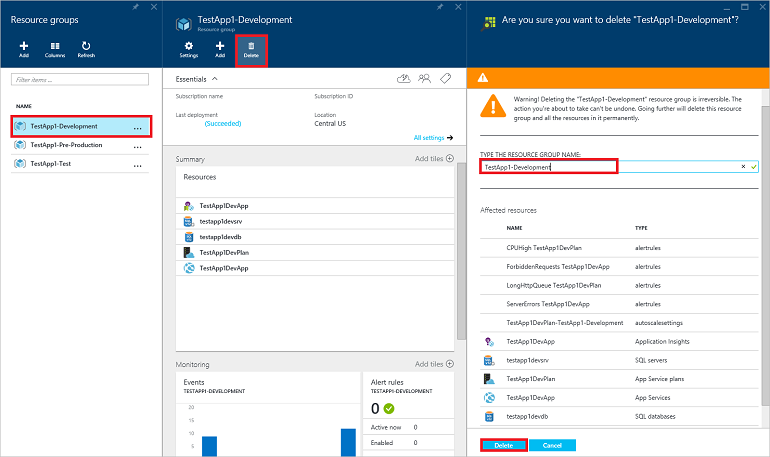

<properties
   pageTitle="Entwicklung und Test-Umgebungen | Microsoft Azure"
   description="Erfahren Sie, wie Azure Ressourcenmanager Vorlagen schnell und einheitlich erstellen und Löschen von Entwicklung und Testen Umgebungen verwenden."
   services="azure-resource-manager"
   documentationCenter="na"
   authors="tfitzmac"
   manager="timlt"
   editor="tysonn"/>

<tags
   ms.service="azure-resource-manager"
   ms.devlang="na"
   ms.topic="article"
   ms.tgt_pltfrm="na"
   ms.workload="na"
   ms.date="01/22/2016"
   ms.author="tomfitz"/>

# Entwicklung und Test-Umgebungen in Microsoft Azure

Mehrere Entwicklung und Testen Umgebungen vor der Bereitstellung in Herstellung Bereitstellen einer benutzerdefinierten Anwendung in der Regel. Bei der Erstellung von Umgebungen lokal sind computing-Ressourcen entweder beschafft oder für jede Umgebung für jede Anwendung vorgesehen sind. Die Umgebungen enthalten häufig mehrere physischen oder virtuellen Computern oder komplexe Automatisierungsskripts mit bestimmten Konfigurationen, die manuell bereitgestellt werden. Bereitstellungen häufig Stunden dauern und dazu führen, dass inkonsistenten Konfigurationen in Umgebungen.

## Szenario ##

Wenn Sie die Entwicklung und Test-Umgebungen in Microsoft Azure bereitstellen, Zahlen Sie nur für die Ressourcen, die Sie verwenden.  In diesem Artikel wird erläutert, wie schnell und konsistente Sie erstellen, beibehalten möchten, und löschen Entwicklung und testen können Umgebungen mit Azure Ressourcenmanager Vorlagen und Parameterdateien, wie unten dargestellt.

Drei Entwicklung und Testen Umgebungen werden oben angezeigt.  Jeder hat Webanwendung und SQL-Datenbank-Ressourcen, die in einer Vorlagendatei angegeben werden.  Die Namen der Anwendung und der Datenbank in jeder Umgebung unterscheiden und in eindeutigen Parameterdateien für jede Umgebung angegeben sind.  

Wenn Sie nicht mit Azure Ressourcenmanager Konzepten vertraut sind, empfiehlt es sich, dass Sie den [Azure Ressourcenmanager Übersicht](azure-resource-manager/resource-group-overview.md) -Artikel lesen, bevor Sie in diesem Artikel lesen.

Möglicherweise möchten zuerst die Schritte in diesem Artikel wechseln, ohne die Artikel verwiesen wird, den schnellen Erfahrung mit Azure Ressourcenmanager Vorlagen Lesen nicht aufgeführt. Wenn Sie die Schritte einmal befunden haben, Sie können zwar erhalten Antworten auf die meisten Fragen der Fertigstellung Ihrer ersten bis Zeit, indem Sie ein wenig weiteren mit den Schritten fort, und lesen den Artikel verwiesen wird.

## Planen der Verwendung von Azure Ressourcen
Nachdem Sie ein Design auf hoher Ebene für eine Anwendung haben, können Sie Folgendes festlegen:

- Welche Azure Ressourcen werden Ihre Anwendung enthalten. Sie möglicherweise erstellen Sie die Anwendung und Bereitstellen als einer Azure Web App mit einer SQL Azure-Datenbank.  Sie können die Anwendung virtuellen-mithilfe von PHP und MySQL oder IIS und SQL Server oder andere unsichere Komponenten erstellen. Im Artikel [Azure-App-Verwaltungsdienst, Cloud-Diensten und virtuellen Computern Vergleich]( app-service-web/choose-web-site-cloud-service-vm.md) kann entscheiden, welche Azure Ressourcen sollten Sie vielleicht für eine Anwendung nutzen möchten.
- Welche Service Level-Bedürfnisse z. B. Verfügbarkeit, Sicherheit und Skalierung, mit der eine Anwendung entsprechen.

## Herunterladen einer vorhandenen Vorlage
Eine Vorlage Azure Ressourcenmanager definiert alle Azure Ressourcen, die Ihrer Anwendung nutzt. Mehrere Vorlagen sind bereits vorhanden, die Sie direkt in der Azure-Portal bereitstellen oder herunterladen, ändern und speichern in einem Steuerelement-System Datenquelle mit Ihrer Anwendungscode.  Führen Sie die Schritte aus, die unten, um eine vorhandene Vorlage herunterzuladen.

1. Navigieren Sie vorhandene Vorlagen im Repository GitHub [Azure Schnellstart Vorlagen](https://github.com/Azure/azure-quickstart-templates/) ein. Klicken Sie in der Liste sehen Sie einen Ordner "[201-Web-app-Sql-Datenbank](https://github.com/Azure/azure-quickstart-templates/tree/master/201-web-app-sql-database)". Da viele benutzerdefinierte Clientanwendungen eine Webanwendung und SQL-Datenbank enthalten, wird diese Vorlage als Beispiel im weiteren Verlauf dieses Artikels erleichtert zu verstehen, wie Sie Vorlagen verwenden. Wenn Sie, zur gemeinsamen Nutzung beabsichtigen von ist-Umgebungen in Ihrer Organisation erstellen, möchte Sie werden vollständig es zu verstehen, indem Sie im Artikel [Bereitstellen einer Web app mit einer SQL-Datenbank](app-service-web/app-service-web-arm-with-sql-database-provision.md) , aber es ist nicht Gegenstand dieses Artikels vollständig alles Erläutern Sie diese Vorlage erstellt und konfiguriert.
Hinweis: in diesem Artikel wurde für die Dezember 2015 Version der Vorlage [201-Web-app-Sql-Datenbank](https://github.com/Azure/azure-quickstart-templates/tree/3f24f7b7e1e377538d1d548eaa6eab2851a21810/201-web-app-sql-database) geschrieben werden. Die Links unterhalb, zeigen Sie auf Vorlage und Parameterdateien werden in dieser Version der Vorlage.
2. Klicken Sie auf die Datei [azuredeploy.json](https://github.com/Azure/azure-quickstart-templates/tree/3f24f7b7e1e377538d1d548eaa6eab2851a21810/201-web-app-sql-database/azuredeploy.json) im Ordner 201-Web-app-Sql-Datenbank, um ihren Inhalt anzuzeigen. Dies ist die Vorlagendatei Azure Ressourcenmanager. 
3. Klicken Sie in den Ansichtsmodus auf die Schaltfläche "[Rohstoffe](https://raw.githubusercontent.com/Azure/azure-quickstart-templates/3f24f7b7e1e377538d1d548eaa6eab2851a21810/201-web-app-sql-database/azuredeploy.json)". 
4. Markieren Sie mit der Maus den Inhalt dieser Datei, und speichern Sie diese auf Ihrem Computer als eine Datei namens "TestApp1 Template.json." 
5. Überprüfen Sie den Vorlageninhalt, und beachten Sie Folgendes:
 - Abschnitt " **Ressourcen** ": in diesem Abschnitt definiert die Typen von Azure Ressourcen, die über diese Vorlage erstellt. Zwischen andere Ressourcentypen erstellt diese Vorlage [Azure Web App](app-service-web/app-service-web-overview.md) und [Azure SQL-Datenbank](sql-database/sql-database-technical-overview.md) -Ressourcen. Wenn Sie ausführen und Verwalten von Web und SQL Server auf virtuellen Computern festlegen möchten, können Sie die "[Iis-2vm-Sql-1vm](https://github.com/Azure/azure-quickstart-templates/tree/master/iis-2vm-sql-1vm)" oder "[Lampe-app](https://github.com/Azure/azure-quickstart-templates/tree/master/lamp-app)" Vorlagen verwenden, aber die Anweisungen in diesem Artikel auf der Vorlage [201-Web-app-Sql-Datenbank basieren](https://github.com/Azure/azure-quickstart-templates/tree/3f24f7b7e1e377538d1d548eaa6eab2851a21810/201-web-app-sql-database) .
 - **Parameter** Abschnitt: in diesem Abschnitt definiert die Parameter, die mit jeder Ressource konfiguriert werden kann. Einige der Parameter in der Vorlage angegeben haben "Standardwert" Eigenschaften, und andere nicht. Wenn Sie mit einer Vorlage Azure Ressourcen bereitstellen, müssen Sie Werte für alle Parameter bereitstellen, die keine Standardwert Eigenschaften in der Vorlage angegeben haben.  Wenn Sie keine Werte für Parameter mit Standardwert Eigenschaften angeben, wird dann für den Standardwert Parameter in der Vorlage angegebene Wert verwendet.

Eine Vorlage definiert, welche Azure Ressourcen erstellt werden und die Parameter jeder Ressource kann mit konfiguriert werden. Sie erhalten weitere Informationen zu Vorlagen und zum Entwerfen eigener durch [bewährte Methoden zum Entwerfen von Vorlagen Azure Ressourcenmanager](best-practices-resource-manager-design-templates.md) Artikel lesen.

## Herunterladen und Anpassen einer vorhandenen Parameterdatei

Obwohl Sie die *gleichen* Azure wahrscheinlich möchten Ressourcen, die in jeder Umgebung erstellt werden, benötigen Sie wahrscheinlich die Konfiguration der Ressourcen für *andere* in jede Umgebung werden vielleicht.  Dies ist die Stelle, an der Parameterdateien nützlich sein. Erstellen Sie Parameterdateien, die eindeutige Werte in jeder Umgebung enthalten die folgenden Schritte durchführen.   

1. Zeigen Sie den Inhalt der Datei [azuredeploy.parameters.json](https://github.com/Azure/azure-quickstart-templates/tree/3f24f7b7e1e377538d1d548eaa6eab2851a21810/201-web-app-sql-database/azuredeploy.parameters.json) im Ordner 201-Web-app-Sql-Datenbank. Dies ist der Parameter für die Vorlagendatei, die Sie im vorherigen Abschnitt gespeichert haben. 
2. Klicken Sie in den Ansichtsmodus auf die Schaltfläche "[Rohstoffe](https://raw.githubusercontent.com/Azure/azure-quickstart-templates/3f24f7b7e1e377538d1d548eaa6eab2851a21810/201-web-app-sql-database/azuredeploy.parameters.json)". 
3. Markieren Sie mit der Maus den Inhalt dieser Datei aus, und speichern sie in drei separate Dateien auf Ihrem Computer mit den folgenden Namen:
 - TestApp1-Parameter-Development.json
 - TestApp1-Parameter-Test.json
 - TestApp1-Parameter-Pre-Production.json

3. Mithilfe von Text oder JSON-Editor, bearbeiten Sie die Entwicklung Umgebung Parameter-Datei, die Sie in Schritt 3, rechts neben die Parameterwerte in der Datei mit den *Werten* rechts neben den **Parameter** unten aufgeführten aufgeführten Werte ersetzen erstellt haben: 
 - **SiteName**: *TestApp1DevApp*
 - **HostingPlanName**: *TestApp1DevPlan*
 - **SiteLocation**: *Der USA – zentral*
 - **ServerName**: *testapp1devsrv*
 - **ServerLocation**: *Der USA – zentral*
 - **AdministratorLogin**: *testapp1Admin*
 - **AdministratorLoginPassword**: *Ersetzen durch Ihr Kennwort*
 - **Datenbankname**: *testapp1devdb*

4. Mit einem Text- oder JSON-Editor bearbeiten die Parameter-Datei in Test-Umgebung, die Sie erstellt haben, klicken Sie in Schritt 3, ersetzen die rechts neben die Werte in der Datei mit den *Werten* der Parameter aufgeführten Werte rechts neben den **Parameter** unten aufgelistet:
 - **SiteName**: *TestApp1TestApp*
 - **HostingPlanName**: *TestApp1TestPlan*
 - **SiteLocation**: *Der USA – zentral*
 - **ServerName**: *testapp1testsrv*
 - **ServerLocation**: *Der USA – zentral*
 - **AdministratorLogin**: *testapp1Admin*
 - **AdministratorLoginPassword**: *Ersetzen durch Ihr Kennwort*
 - **Datenbankname**: *testapp1testdb*

5. Verwenden von Text oder JSON-Editor, bearbeiten Sie die noch nicht produziert Parameterdatei, die Sie in Schritt 3 erstellt haben.  Ersetzen Sie den gesamten Inhalt der Datei durch was es folgt ein:

        {
          "$schema" : "http://schema.management.azure.com/schemas/2015-01-01/deploymentParameters.json#",
          "contentVersion" : "1.0.0.0",
          "parameters" : {
        "administratorLogin" : {
          "value" : "testApp1Admin"
        },
        "administratorLoginPassword" : {
          "value" : "replace with your password"
        },
        "databaseName" : {
          "value" : "testapp1preproddb"
        },
        "hostingPlanName" : {
          "value" : "TestApp1PreProdPlan"
        },
        "serverLocation" : {
          "value" : "Central US"
        },
        "serverName" : {
          "value" : "testapp1preprodsrv"
        },
        "siteLocation" : {
          "value" : "Central US"
        },
        "siteName" : {
          "value" : "TestApp1PreProdApp"
        },
        "sku" : {
          "value" : "Standard"
        },
            "requestedServiceObjectiveName" : {
              "value" : "S1"
        }
          }
        }

In der oben angegebenen noch nicht produziert-Parameterdatei wurden die Parameter **Sku** und **RequestedServiceObjectiveName** *hinzugefügt*, während sie in der Entwicklung und Test Parameter Dateien hinzugefügt wurden nicht. Dies ist, da es Standardwerte für diesen Parameter in der Vorlage angegebenen gibt und in der Entwicklung und Test-Umgebungen, die Standardwerte verwendet werden, aber die noch nicht produziert-Umgebung, die nicht standardmäßige Werte für diese Parameter verwendet werden.

Der Grund dafür, dass keine Standardwerte für diese Parameter in der Umgebung noch nicht produziert verwendeten besteht darin, die Werte für diesen Parameter zu testen, die für Ihre Umgebung Herstellung empfiehlt sich möglicherweise, damit sie auch getestet werden können.  Diese alle Parameter beziehen sich auf den Azure- [Hostinganbieter Web App-Pläne](https://azure.microsoft.com/pricing/details/app-service/)oder **Sku** und Azure [SQL-Datenbank](https://azure.microsoft.com/pricing/details/sql-database/)oder **RequestedServiceObjectiveName** , die von der Anwendung verwendet werden.  Verschiedene Skus und Dienst Ziel Namen verfügen über unterschiedliche Kosten und Features und anderen Dienst Ebene Kennzahlen unterstützen.

In der nachfolgenden Tabelle listet die Standardwerte für diese Parameter angegeben haben, in der Vorlage und die Werte, die anstelle der Standardwerte in der Parameterdatei noch nicht produziert verwendet werden.

| Parameter | Standardwert | Parameterwert-Datei |
|---|---|---|
| **SKU** | Kostenlose | Standard |
| **requestedServiceObjectiveName** | S0 | S1 |

## Erstellen von Umgebungen
Alle Azure Ressourcen müssen innerhalb einer [Ressourcengruppe Azure](azure-resource-manager/resource-group-overview.md)erstellt werden. Ressourcengruppen können Sie Azure Ressourcen gruppieren, damit sie gemeinsam verwaltet werden können.  [Berechtigungen](./active-directory/role-based-access-built-in-roles.md) können, dass bestimmte Personen innerhalb Ihrer Organisation erstellen, ändern, löschen oder, und die Ressourcen darin enthaltenen anzeigen Ressourcengruppen zugewiesen werden.  Benachrichtigungen und Rechnungsinformationen für Ressourcen in der Ressourcengruppe können im [Portal Azure](https://portal.azure.com)angezeigt werden. Ressourcengruppen werden in einer Azure [Region](https://azure.microsoft.com/regions/)erstellt.  In diesem Artikel werden alle Ressourcen in der zentralen US-Region erstellt. Beim Erstellen der ist-Umgebungen starten, werden Sie den Bereich auswählen, der Ihren Anforderungen am besten entspricht. 

Erstellen von Ressourcengruppen für jede Umgebung eine der folgenden Methoden verwenden.  Alle Methoden werden das gleiche Ergebnis erzielen.

###Azure Befehlszeilenschnittstelle)

Stellen Sie sicher, dass Sie die CLI [installiert](xplat-cli-install.md) entweder auf einem Windows, OS X, oder Linux-Computer, und dass Sie [verbunden](xplat-cli-connect.md) Ihr [Azure AD-Konto haben](./active-directory/active-directory-how-subscriptions-associated-directory.md) (auch als ein Konto geschäftlichen oder schulnotizbücher bezeichnet) zu Ihrem Azure-Abonnement. Geben Sie über die Befehlszeile CLI Geben Sie folgenden Befehl zum Erstellen der Ressourcengruppe für die Entwicklung-Umgebung aus.

    azure group create "TestApp1-Development" "Central US"

Der Befehl wird Folgendes zurück, bei Erfolg:

    info:    Executing command group create
    + Getting resource group TestApp1-Development
    + Creating resource group TestApp1-Development
    info:    Created resource group TestApp1-Development
    data:    Id:                  /subscriptions/uuuuuuuu-vvvv-wwww-xxxx-yyyy-zzzzzzzzzzzz/resourceGroups/TestApp1-Development
    data:    Name:                TestApp1-Development
    data:    Location:            centralus
    data:    Provisioning State:  Succeeded
    data:    Tags: null
    data:
    info:    group create command OK

Um der Ressourcengruppe für die Test-Umgebung zu erstellen, geben Sie den folgenden Befehl aus:

    azure group create "TestApp1-Test" "Central US"

Zum Erstellen der Ressourcengruppe für die noch nicht produziert-Umgebung geben Sie den folgenden Befehl aus:

    azure group create "TestApp1-Pre-Production" "Central US"

###PowerShell

Stellen Sie sicher, dass Sie Azure PowerShell 1.01 oder höher auf einem Windows-Computer installiert und haben Ihre [Azure AD-Konto](./active-directory/active-directory-how-subscriptions-associated-directory.md) (auch als ein Konto geschäftlichen oder schulnotizbücher bezeichnet) zu Ihrem Abonnement wie im Artikel [zum Installieren und Konfigurieren von Azure PowerShell](powershell-install-configure.md) ausführlich verbunden. Geben Sie folgenden Befehl zum Erstellen der Ressourcengruppe für die Entwicklung-Umgebung aus einem PowerShell-Eingabeaufforderung.

    New-AzureRmResourceGroup -Name TestApp1-Development -Location "Central US"

Der Befehl wird Folgendes zurück, bei Erfolg:

    ResourceGroupName : TestApp1-Development
    Location          : centralus
    ProvisioningState : Succeeded
    Tags              :
    ResourceId        : /subscriptions/uuuuuuuu-vvvv-wwww-xxxx-yyyy-zzzzzzzzzzzz/resourceGroups/TestApp1-Development

Um der Ressourcengruppe für die Test-Umgebung zu erstellen, geben Sie den folgenden Befehl aus:

    New-AzureRmResourceGroup -Name TestApp1-Test -Location "Central US"

Zum Erstellen der Ressourcengruppe für die noch nicht produziert-Umgebung geben Sie den folgenden Befehl aus:

    New-AzureRmResourceGroup -Name TestApp1-Pre-Production -Location "Central US"

###Azure-portal

1. Melden Sie sich mit dem [Azure-Portal](https://portal.azure.com) mit einem Konto [Azure AD](./active-directory/active-directory-how-subscriptions-associated-directory.md) (auch Arbeit oder Schule genannt). Klicken Sie auf Neu >--> Management--> Ressourcengruppe und geben Sie im Feld Name Ressource Gruppe "TestApp1-Development", wählen Sie Ihr Abonnement, und wählen Sie "Zentralen USA" in das Feld Gruppe Ressource aus, wie in der folgenden Abbildung gezeigt.
   
2. Klicken Sie auf die Schaltfläche erstellen, um die Ressourcengruppe erstellen.
3. Klicken Sie auf Durchsuchen, einen Bildlauf zu Ressourcengruppen, und klicken Sie auf Ressourcengruppen wie unten dargestellt.
    
4. Nach dem Klicken auf Ressourcengruppen sehen Sie das Ressource Gruppen Blade mit Ihrer neuen Ressourcengruppe.
   
5. Erstellen Sie den TestApp1-Test und TestApp1-Pre-Herstellung Ressource gruppiert die gleiche Weise, wie, die Sie die oben aufgeführten TestApp1-Entwicklung Ressourcengruppe erstellt haben.

##Bereitstellen von Ressourcen Umgebungen

Bereitstellen von Azure Ressourcen den Ressourcen Gruppen für jede Umgebung die Vorlagendatei für die Lösung und die Parameterdateien für jede Umgebung mithilfe einer der folgenden Methoden verwenden.  Beide Methoden werden das gleiche Ergebnis erzielen.

###Azure Befehlszeilenschnittstelle)

Geben Sie über die Befehlszeile CLI den Befehl unten Ressourcen der Ressourcengruppe bereitstellen, dass Sie erstellt für die Entwicklungsumgebung ersetzen [Pfad] durch den Pfad zu den Dateien, die Sie in den vorherigen Schritten gespeichert haben.

    azure group deployment create -g TestApp1-Development -n Deployment1 -f [path]TestApp1-Template.json -e [path]TestApp1-Parameters-Development.json 

Nach einem Blick auf eine Nachricht "Warten auf Bereitstellung abgeschlossen" für einige Minuten, der Befehl zurück vor, wenn es erfolgreich ist:

    info:    Executing command group deployment create
    + Initializing template configurations and parameters
    + Creating a deployment
    info:    Created template deployment "Deployment1"
    + Waiting for deployment to complete
    data:    DeploymentName     : Deployment1
    data:    ResourceGroupName  : TestApp1-Development
    data:    ProvisioningState  : Succeeded
    data:    Timestamp          : XXXX-XX-XXT20:20:23.5202316Z
    data:    Mode               : Incremental
    data:    Name                           Type          Value
    data:    -----------------------------  ------------  ----------------------------
    data:    siteName                       String        TestApp1DevApp
    data:    hostingPlanName                String        TestApp1DevPlan
    data:    siteLocation                   String        Central US
    data:    sku                            String        Free
    data:    workerSize                     String        0
    data:    serverName                     String        testapp1devsrv
    data:    serverLocation                 String        Central US
    data:    administratorLogin             String        testapp1Admin
    data:    administratorLoginPassword     SecureString  undefined
    data:    databaseName                   String        testapp1devdb
    data:    collation                      String        SQL_Latin1_General_CP1_CI_AS
    data:    edition                        String        Standard
    data:    maxSizeBytes                   String        1073741824
    data:    requestedServiceObjectiveName  String        S0
    info:    group deployment create command OKx

Wenn der Befehl nicht erfolgreich ist, beheben Sie Fehlermeldungen, und versuchen Sie es erneut.  Häufig auftretende Probleme verwenden Parameterwerte, die Ressource Azure naming Einschränkungen nicht entsprechen. Weitere Tipps zur Problembehandlung finden Sie im Artikel [Problembehandlung Ressource Gruppe Bereitstellungen in Azure](./resource-manager-troubleshoot-deployments-cli.md) .

Geben Sie über die Befehlszeile CLI den Befehl unten Ressourcen der Ressourcengruppe bereitstellen, dass Sie erstellt für die Test-Umgebung ersetzen [Pfad] durch den Pfad zu den Dateien, die Sie in den vorherigen Schritten gespeichert haben.

    azure group deployment create -g TestApp1-Test -n Deployment1 -f [path]TestApp1-Template.json -e [path]TestApp1-Parameters-Test.json

Geben Sie über die Befehlszeile CLI den Befehl unten Ressourcen der Ressourcengruppe bereitstellen, dass Sie erstellt für die Umgebung noch nicht produziert ersetzen [Pfad] durch den Pfad zu den Dateien, die Sie in den vorherigen Schritten gespeichert haben.

    azure group deployment create -g TestApp1-Pre-Production -n Deployment1 -f [path]TestApp1-Template.json -e [path]TestApp1-Parameters-Pre-Production.json
  
###PowerShell

Ein Eingabeaufforderungsfenster Azure PowerShell (Version 1.01 oder höher) Geben Sie folgenden Befehl zum Bereitstellen von Ressourcen der Ressourcengruppe, dass Sie erstellt für die Entwicklungsumgebung ersetzen [Pfad] durch den Pfad zu den Dateien, die Sie in den vorherigen Schritten gespeichert haben.

    New-AzureRmResourceGroupDeployment -ResourceGroupName TestApp1-Development -TemplateFile [path]TestApp1-Template.json -TemplateParameterFile [path]TestApp1-Parameters-Development.json -Name Deployment1 

Nach einem Blick auf einen blinkenden Cursor für einige Minuten, der Befehl zurück vor, wenn es erfolgreich ist:

    DeploymentName    : Deployment1
    ResourceGroupName : TestApp1-Development
    ProvisioningState : Succeeded
    Timestamp         : XX/XX/XXXX 2:44:48 PM
    Mode              : Incremental
    TemplateLink      : 
    Parameters        : 
                        Name             Type                       Value     
                        ===============  =========================  ==========
                        siteName         String                     TestApp1DevApp
                        hostingPlanName  String                     TestApp1DevPlan
                        siteLocation     String                     Central US
                        sku              String                     Free      
                        workerSize       String                     0         
                        serverName       String                     testapp1devsrv
                        serverLocation   String                     Central US
                        administratorLogin  String                     testapp1Admin
                        administratorLoginPassword  SecureString                         
                        databaseName     String                     testapp1devdb
                        collation        String                     SQL_Latin1_General_CP1_CI_AS
                        edition          String                     Standard  
                        maxSizeBytes     String                     1073741824
                        requestedServiceObjectiveName  String                     S0        
                        
    Outputs           :

  Wenn der Befehl nicht erfolgreich ist, beheben Sie Fehlermeldungen, und versuchen Sie es erneut.  Häufig auftretende Probleme verwenden Parameterwerte, die Ressource Azure naming Einschränkungen nicht entsprechen. Weitere Tipps zur Problembehandlung finden Sie im Artikel [Problembehandlung Ressource Gruppe Bereitstellungen in Azure](./resource-manager-troubleshoot-deployments-powershell.md) .

  Befehlszeile PowerShell Geben Sie den Befehl unten Ressourcen der Ressourcengruppe bereitstellen, dass Sie erstellt für die Test-Umgebung ersetzen [Pfad] durch den Pfad zu den Dateien, die Sie in den vorherigen Schritten gespeichert haben.

    New-AzureRmResourceGroupDeployment -ResourceGroupName TestApp1-Test -TemplateFile [path]TestApp1-Template.json -TemplateParameterFile [path]TestApp1-Parameters-Test.json -Name Deployment1

  Befehlszeile PowerShell Geben Sie den Befehl unten Ressourcen der Ressourcengruppe bereitstellen, dass Sie erstellt für die Umgebung noch nicht produziert ersetzen [Pfad] durch den Pfad zu den Dateien, die Sie in den vorherigen Schritten gespeichert haben.

    New-AzureRmResourceGroupDeployment -ResourceGroupName TestApp1-Pre-Production -TemplateFile [path]TestApp1-Template.json -TemplateParameterFile [path]TestApp1-Parameters-Pre-Production.json -Name Deployment1

Die Vorlage und Parameter-Dateien können in einem Steuerelement-Quellcodeverwaltungssystem Versionsnummern und mit Ihrer Anwendungscode verwaltet sein.  Sie können auch die Befehle oben, um Dateien Skripts und speichern diese mit Ihrem Code auch speichern.

> [AZURE.NOTE] Sie können die Vorlage direkt, indem Sie auf die Schaltfläche "Bereitstellen zu Azure" im Artikel [Bereitstellen einer Web App mit einer SQL-Datenbank](https://azure.microsoft.com/documentation/templates/201-web-app-sql-database/) in Azure bereitstellen.  Sie möglicherweise hilfreich dies Vorlagen lernen, jedoch nicht aktivieren, Version, bearbeiten und Sie zum Linkziel speichern Sie Ihre Vorlage und Parameter Werte mit Ihrer Anwendungscode, damit weitere Details zu dieser Methode können nicht in diesem Artikel behandelt wird.

## Verwalten von Umgebungen
Während der Entwicklung kann die Konfiguration von Azure Ressourcen in verschiedenen Umgebungen inkonsistent absichtlich oder versehentlich geändert werden.  Dies kann während des Anwendungsentwicklungszyklus unnötige Problembehandlung und Behebung des Problems führen.

1. Ändern der Umgebungen durch Öffnen der [Azure-Portal](https://portal.azure.com)an. 
2. Melden Sie sich mit demselben Konto, das Sie verwendet, um die oben aufgeführten Schritte hinein. 
3. Wie in der Abbildung unten, klicken Sie auf Durchsuchen--> Ressourcengruppen (möglicherweise müssen einen Bildlauf nach unten zu Ressourcengruppen finden Sie unter) angezeigt.
   
4. Nach dem Klicken auf Ressourcengruppen in der Abbildung oben, sehen Sie sich die Ressource Gruppen Blade und drei zusammengefasst, die Sie in einem vorherigen Schritt erstellt haben, wie in der folgenden Abbildung gezeigt. Klicken Sie auf die Ressourcengruppe TestApp1-Entwicklung und das Blade, das die Ressourcen, die Vorlage in der TestApp1-Entwicklung Ressource Gruppe Bereitstellung gestellten in einem vorherigen Schritt erstellte Listen wird angezeigt.  Löschen der Ressource TestApp1DevApp Web App auf TestApp1DevApp in das TestApp1-Entwicklung Ressource Gruppe Blade und dann in das TestApp1DevApp Web app Blade auf Löschen.
   
5. Klicken Sie auf "Ja", wenn das Portal gefragt werden, ob Sie wissen, dass die Ressource gelöscht werden soll. Das TestApp1-Entwicklung Ressource Gruppe Blade schließen und erneut öffnen werden jetzt es ohne das Web app angezeigt, die Sie soeben gelöscht haben.  Der Inhalt der Ressourcengruppe unterscheiden sich nun als sie sollten. Sie können weiteren experimentieren, indem mehrere Ressourcen aus mehreren Ressourcengruppen löschen oder sogar ändern Konfiguration von Einstellungen für einige der Ressourcen. Anstatt mithilfe des Azure-Portals löschen Sie eine Ressource aus einer Ressourcengruppe, könnten Sie verwenden Sie den Befehl PowerShell [AzureResource entfernen](https://msdn.microsoft.com/library/azure/dn757676.aspx) oder die oder "Azure Ressource"-Löschbefehl über die Befehlszeile zum Durchführen derselben Aufgabe.
6. Zum Abrufen aller Ressourcen und Konfiguration, die in den Ressourcengruppen wieder in den Zustand sein, die sie in werden sollen, Bereitstellen Sie die Umgebungen den Ressourcen Gruppen mit der gleichen Befehle, die Sie im Abschnitt [Bereitstellen Ressourcen Umgebungen](#deploy-resources-to-environments) erneut, aber ersetzen Sie "Deployment1" mit "Einrichtung2."
7.  Siehe Abschnitt "Zusammenfassung" TestApp1-Entwicklung vorher in das Bild angezeigt, die in Schritt 4, sehen Sie sich, dass die Web-app, die Sie im Portal im vorherigen Schritt gelöscht vorhanden ist, erneut, so, wie Sie eine beliebige andere Ressourcen möglicherweise soll löschen. Wenn Sie die Konfiguration von Ressourcen geändert haben, können Sie auch überprüfen, dass diese wieder auf die Werte in den Parameterdateien zu eingerichtet haben. Einer der Vorteile der Bereitstellung Ihrer Umgebungen mit Azure Ressourcenmanager Vorlagen ist, dass Sie einfach die Umgebungen wieder in einen bekannten Status zu einem beliebigen Zeitpunkt erneut bereitstellen können.
8. Wenn Sie auf den Text unter "Letzte Bereitstellung" in der nachstehenden Abbildung klicken, sehen Sie eine Blade, in dem den Bereitstellung Verlauf für die Ressourcengruppe angezeigt.  Da Sie den Namen "Deployment1" für die erste Bereitstellung und "Einrichtung2" für die zweite Bereitstellung verwendet haben, müssen Sie zwei Einträge.  Indem Sie auf eine Bereitstellung wird eine Blade angezeigt werden, die mit den Ergebnissen für jede Bereitstellung angezeigt.
  

## Löschen von Umgebungen
Nachdem Sie mit einer Umgebung abgeschlossen haben, möchten Sie es löschen, sodass Sie Verwendung für Azure Ressourcen anfallen nicht, die Sie nicht mehr verwenden.  Löschen von Umgebungen ist noch einfacher als erstellen können.  In den vorherigen Schritten einzelne Azure Ressourcengruppen für jede Umgebung erstellt wurden, und klicken Sie dann Ressourcen in den Ressourcengruppen bereitgestellt wurden. 

Löschen der Umgebungen mit einer der folgenden Methoden an.  Alle Methoden werden das gleiche Ergebnis erzielen.

### Azure CLI

Geben Sie aus einer CLI dazu aufgefordert werden Folgendes ein:

    azure group delete "TestApp1-Development"

Wenn Sie dazu aufgefordert werden, geben Sie y, und drücken Sie die EINGABETASTE, um die Entwicklungsumgebung und alle Ressourcen zu entfernen. Nach ein paar Minuten wird der Befehl Folgendes zurück:

    info:    group delete command OK

Geben Sie eine Aufforderung CLI vor, um die verbleibenden Umgebungen zu löschen:

    azure group delete "TestApp1-Test"
    azure group delete "TestApp1-Pre-Production"
  
### PowerShell

Geben Sie folgenden Befehl zum Löschen der Ressourcengruppe und den gesamten Inhalt aus einer Befehlszeile Azure PowerShell (Version 1.01 oder höher).    

    Remove-AzureRmResourceGroup -Name TestApp1-Development

Wenn Sie aufgefordert werden, wenn Sie wissen, dass Sie die Ressourcengruppe entfernen möchten, geben Sie y, gefolgt von dem Sie die EINGABETASTE.

Geben Sie Folgendes ein, um die verbleibenden Umgebungen zu löschen:

    Remove-AzureRmResourceGroup -Name TestApp1-Test
    Remove-AzureRmResourceGroup -Name TestApp1-Pre-Production

### Azure-portal

1. Navigieren Sie im Portal Azure Ressource Gruppen wie im vorherigen Schritte. 
2. Wählen Sie die TestApp1-Entwicklung Ressourcengruppe aus, und klicken Sie dann in der Gruppe-Blade-TestApp1-Entwicklung Ressourcen auf Löschen. Ein neuer Blade wird angezeigt. Geben Sie den Namen der Ressource Gruppe ein, und klicken auf die Schaltfläche löschen.

3. Löschen den TestApp1-Test und TestApp1-Pre-Herstellung Ressource gruppiert die gleiche Weise, wie, die Sie die TestApp1-Entwicklung Ressourcengruppe gelöscht haben.

Unabhängig von der Methode, die Sie verwenden, die Ressourcengruppen und alle Ressourcen, die sie enthalten nicht mehr vorhanden, und Sie werden nicht mehr Abrechnung Ausgaben für die Ressourcen zu tätigen.  

Um die Azure minimieren Ressource Auslastung Ausgaben, die Sie während der Anwendungsentwicklung, die Sie zum Planen [Azure Automatisierung](automation/automation-intro.md) verwenden können anfallen Einzelvorgänge:

- Beenden von virtuellen Computern am Ende jeder Tag und starten Sie diese am Anfang eines jeden Tag.
- Löschen von ganzen Umgebungen am Ende jeder Tag und Neuerstellen am Anfang eines jeden Tag.
 
Jetzt, da Sie Erfahrung haben, wie einfach es ist, erstellen, verwalten, und löschen die Entwicklung und Testen Umgebungen, können Sie weitere Informationen konnten dazu, was Sie nur nach weiteren ein wenig mit den oben aufgeführten Schritten und die Bezüge in diesem Artikel enthaltenen lesen.

## Nächste Schritte

- [Zuweisen der administrativen Kontrolle](./active-directory/role-based-access-control-configure.md) zu anderen Ressourcen in jeder-Umgebung, indem Sie bestimmte Rollen, die die Möglichkeit, eine Teilmenge der Vorgänge Azure Ressourcen durchzuführen Microsoft Azure AD-Gruppen oder Benutzern zuweisen.
- [Zuweisen von Kategorien](resource-group-using-tags.md) , die Ressource Gruppen für jede Umgebung und/oder den einzelnen Ressourcen. Sie möglicherweise Ihrer Ressourcengruppen eine Kategorie "Umgebung" hinzu, und legen Sie seinen Wert auf den Namen Ihrer Umgebung entsprechen. Kategorien können besonders hilfreich sein, wenn Sie Ressourcen für Abrechnung oder Management organisieren müssen.
- Überwachen Sie Benachrichtigungen und Abrechnung für Ressourcen Gruppieren von Ressourcen in der [Azure-Portal](https://portal.azure.com)an.
