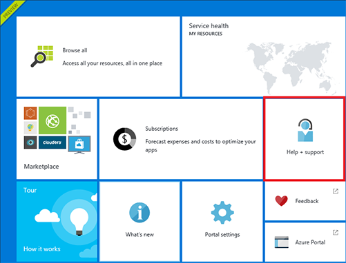
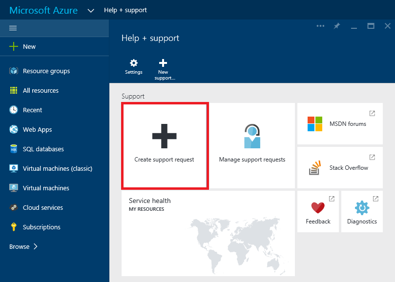
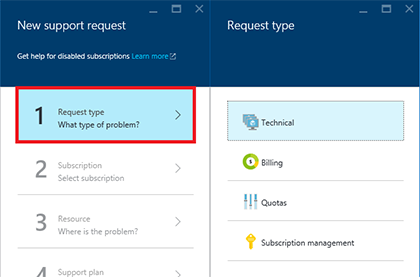
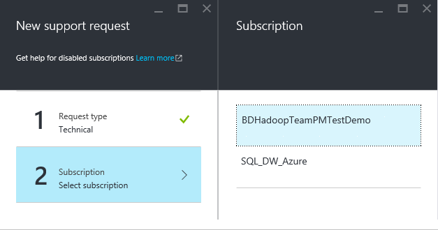
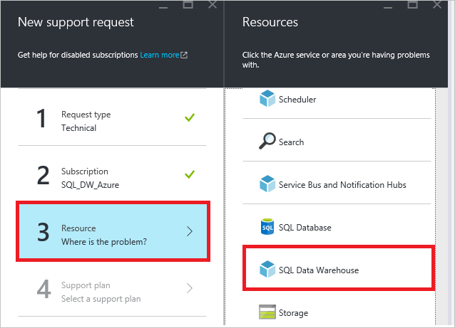
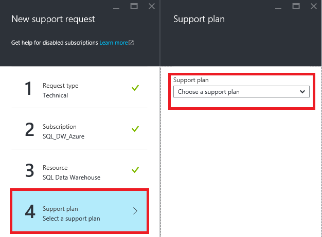
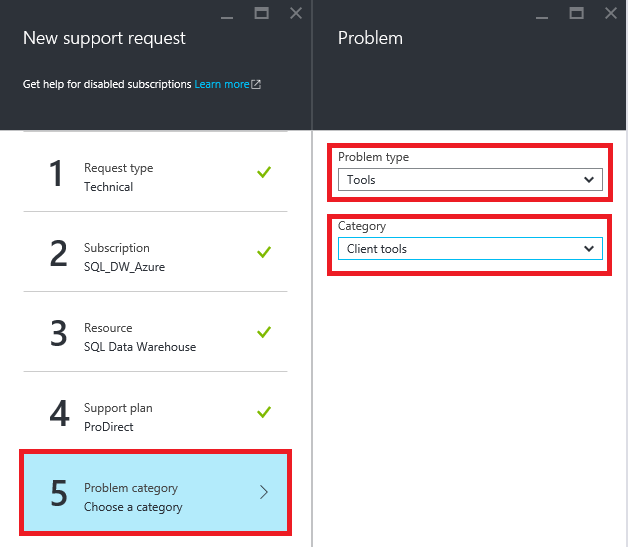
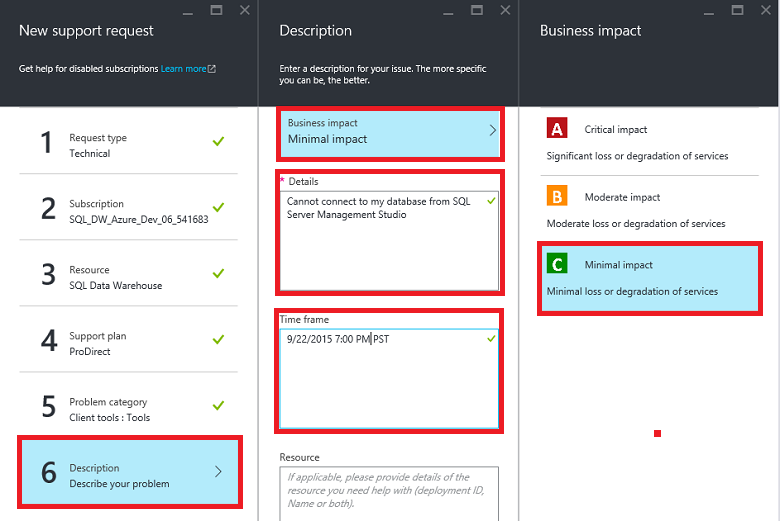
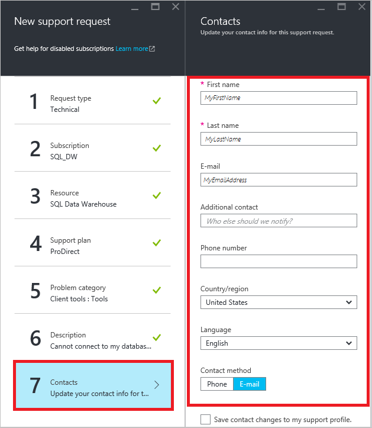
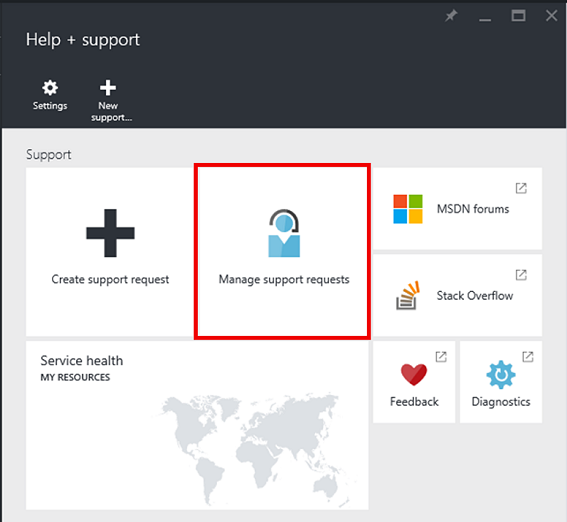

<properties
   pageTitle="So erstellen Sie ein Ticket Support für SQL Data Warehouse | Microsoft Azure"
   description="Informationen zum Support-Ticket in Azure SQL-Data Warehouse zu erstellen."
   services="sql-data-warehouse"
   documentationCenter="NA"
   authors="sonyam"
   manager="barbkess"
   editor=""/>

<tags
   ms.service="sql-data-warehouse"
   ms.devlang="NA"
   ms.topic="get-started-article"
   ms.tgt_pltfrm="NA"
   ms.workload="data-services"
   ms.date="09/01/2016"
   ms.author="sonyama;barbkess"/>

# So erstellen Sie ein Ticket Support für SQL Data Warehouse
 
Wenn Sie die gibt es Probleme mit der SQL-Data Warehouse, erstellen Sie ein ein Support-Ticketgenehmigungsserver, damit unser engineering-Team helfen kann.

## Erstellen einer Support-ticket

1. Öffnen Sie das [Azure-Portal][]an.

2. Klicken Sie auf dem Startbildschirm auf die Kachel **Hilfe + Support** .

    

3. Klicken Sie auf der Hilfe + Support Blade, **Supportanfrage erstellen**klicken.

    
    
     

4. Wählen Sie den **Typ anfordern**.

    
    
    >[AZURE.NOTE]  Standardmäßig weist jede SQLServer (z. B. myserver.database.windows.net) ein **DTU Kontingent** von 45.000. Dieses Kontingent ist einfach Sicherheit beschränkt. Sie können Ihr Kontingent erhöhen, indem Sie eine Support-Ticket erstellen und *Kontingent* als den Anforderungstyp auswählen. Zum Berechnen der DTU müssen, die Summe der 7.5 multiplizieren, die [DWU][] erforderlich. Angenommen, Sie zwei DW6000s auf einem SQLServer hosten möchte, dann sollten Sie ein DTU Kontingent von 90.000 anfordern.  Sie können Ihre DTU Stromverbrauch aus dem SQL Server-Blade im Portal anzeigen. Angehaltene und dauerhaften angehaltene Datenbanken zählen gegen das Kontingent DTU. 

5. Wählen Sie das **Abonnement** , die die Datenbank mit dem Problem hostet, das Sie melden möchten.

    

6. Wählen Sie **SQL Datawarehouse** , wie die Ressource.

    

7. Wählen Sie Ihre [Azure unterstützen Plan][]aus.

    - **Kontingent und Abonnement Management** Abrechnungssupport ist auf allen Ebenen der Support verfügbar.
    - **Seitenumbruch-Fix** wird durch [Developer][], [Standard][], [Professional direkte][] oder [Premier][] Support unterstützt. Probleme sind Probleme Kunden bei der Verwendung von Azure, in einer angemessenen Annahme, dass die Microsoft das Problem verursacht vorhanden ist.
    - **Entwicklertools mentoring** und **Beratungsdienste** sind auf der [Direkten Professional][] und [Premier][] Support verfügbar. 
    
    Wenn Sie einen Premier support-Plan verfügen, können Sie auch SQL Data Warehouse melden zusammenhängende Probleme im [Microsoft Premier-Onlineportal][].  Erfahren Sie mehr über die verschiedenen Support-Pläne, einschließlich Umfang, Reaktionszeiten, Preise usw. finden Sie in der [Azure support-Pläne][Azure unterstützen planen] .  Häufig gestellte Fragen zur Azure unterstützen Sie, finden Sie unter [Azure häufig gestellte Fragen zu unterstützen][].  

    

8. Wählen Sie den **Problemtyp** und die **Kategorie**ein.

    

9. Beschreiben Sie das Problem, und wählen Sie die Ebene von geschäftlichen.

    

10. Ihre **Kontaktinformationen** für dieses Support-Ticket wird bereits ausgefüllt werden. Aktualisieren Sie dies bei Bedarf.

    

11. Klicken Sie auf **Erstellen** , um die Anfrage abzusenden.

## Überwachen von Support-ticket

Nachdem Sie die Anfrage gesendet haben, wird der Azure Sie Supportteam. Um Ihren Status der Anfrage und Details zu überprüfen, klicken Sie auf dem Dashboard **Verwalten Kundendienstanfragen** auf.

## Weitere Ressourcen

Darüber hinaus können Sie mit der Community SQL Data Warehouse [Stapelüberlauf][] oder im [Azure SQL Data Warehouse MSDN-Forum][]verbinden.

<!--Image references--> 

<!--Article references--> 
[DWU]: ./sql-data-warehouse-overview-what-is.md#data-warehouse-units

<!--MSDN references--> 

<!--Other web references--> 
[Azure-portal]: https://portal.azure.com/
[Azure-Support-plan]: https://azure.microsoft.com/support/plans/?WT.mc_id=Support_Plan_510979/  
[Entwicklertools]: https://azure.microsoft.com/support/plans/developer/  
[Standard]: https://azure.microsoft.com/support/plans/standard/  
[Professionelle direkte]: https://azure.microsoft.com/support/plans/prodirect/  
[Premier]: https://azure.microsoft.com/support/plans/premier/  
[Azure-Support-FAQs]: https://azure.microsoft.com/support/faq/
[Microsoft Premier-Onlineportal]: https://premier.microsoft.com/
[Stapelüberlauf]: https://stackoverflow.com/questions/tagged/azure-sqldw/
[Azure SQL Data Warehouse MSDN-forum]: https://social.msdn.microsoft.com/Forums/home?forum=AzureSQLDataWarehouse/

