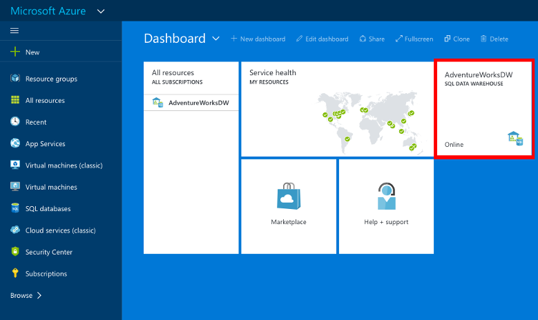

<properties
   pageTitle="Erstellen eines Data Warehouse von SQL Azure-Portal | Microsoft Azure"
   description="Informationen Sie zum Erstellen einer Azure SQL-Data Warehouse Azure-Portal"
   services="sql-data-warehouse"
   documentationCenter="NA"
   authors="barbkess"
   manager="jhubbard"
   editor=""
   tags="azure-sql-data-warehouse"/>

<tags
   ms.service="sql-data-warehouse"
   ms.devlang="NA"
   ms.topic="hero-article"
   ms.tgt_pltfrm="NA"
   ms.workload="data-services"
   ms.date="08/25/2016"
   ms.author="barbkess;lodipalm;sonyama"/>

# Erstellen einer SQL Azure Datawarehouse

> [AZURE.SELECTOR]
- [Azure-portal](sql-data-warehouse-get-started-provision.md)
- [TSQL](sql-data-warehouse-get-started-create-database-tsql.md)
- [PowerShell](sql-data-warehouse-get-started-provision-powershell.md)

In diesem Lernprogramm verwendet Azure-Portal um zu einem SQL Data Warehouse zu erstellen, die eine Beispieldatenbank AdventureWorksDW enthält.

## Erforderliche Komponenten

Um anzufangen, müssen Sie folgende Aktionen ausführen:

- **Azure-Konto**: Besuchen [Azure kostenlose Testversion][] oder [MSDN Azure Gutschriften][] ein Konto zu erstellen.
- **SQL Azure-Server**: Weitere Einzelheiten finden Sie unter [Erstellen einer logischen Azure SQL-Datenbank-Server mit dem Azure-Portal][] .

> [AZURE.NOTE] Erstellen einer SQL Data Warehouse möglicherweise einen neuen berechenbaren Dienst.  Weitere Informationen hierzu finden Sie unter [SQL Data Warehouse Preise][] .

## Erstellen einer SQL Datawarehouse

1. Melden Sie sich mit dem [Azure-Portal](https://portal.azure.com)aus.

2. Klicken Sie auf **+ neue** > **Daten + Speicher** > **SQL Datawarehouse**.

    

3. In das Blade **SQL Data Warehouse** ausfüllen die Informationen erforderlich, und drücken Sie dann 'Erstellen' zu erstellen.

    

    - **Server**: Es wird empfohlen, wählen Sie zuerst Ihre Server.  

    - **Datenbankname**: der Name, der zum Verweisen auf SQL Data Warehouse verwendet wird.  Sie müssen auf dem Server eindeutig sein.
    
    - **Leistung**: Es wird empfohlen, beginnend mit 400 [DWUs][DWU]. Sie können den Schieberegler nach links oder rechts, um die Leistung des Datawarehouse anpassen oder skalieren nach der Erstellung nach oben oder unten verschieben.  Weitere Informationen zu DWUs zu erhalten, finden Sie auf [dieselbe Skalierung](./sql-data-warehouse-manage-compute-overview.md) oder unsere [Preise Seite][SQL Data Warehouse Preise]unserer Dokumentation. 

    - **Abonnements**: Wählen Sie das [Abonnement] , die diese SQL Data Warehouse zum Abrechnen wird.

    - **Ressourcengruppe**: [Ressourcengruppen] [ Resource group] sind Container, die eine Sammlung von Azure Ressourcen verwalten können. Weitere Informationen zu [Ressourcengruppen](../azure-resource-manager/resource-group-overview.md).

    - **Wählen Sie die Quelle**: Klicken Sie auf **Quelle auswählen** > **Stichprobe**. Azure wird automatisch die Option **Wählen Stichproben** mit AdventureWorksDW eingetragen.

> [AZURE.NOTE] Die Standardsortierreihenfolge für eine SQL Data Warehouse ist SQL_Latin1_General_CP1_CI_AS. Wenn eine andere Sortierung benötigt wird, kann [T-SQL][] zum Erstellen der Datenbank für eine andere Sortierung verwendet werden.

4. Klicken Sie auf **Erstellen** , um Ihre SQL Data Warehouse zu erstellen.

5. Warten Sie einige Minuten. Wenn Ihr Datawarehouse fertig ist, sollten Sie [Azure-Portal](https://portal.azure.com)zurückgegeben werden. Sie können Ihr SQL Data Warehouse suchen, auf Dashboard des aufgeführt, unter der SQL-Datenbanken oder in der Gruppe der Ressource, die Sie verwendet, um sie zu erstellen. 

    

[AZURE.INCLUDE [SQL Database create server](../../includes/sql-database-create-new-server-firewall-portal.md)] 

## Nächste Schritte

Jetzt, da Sie eine SQL Data Warehouse erstellt haben, Sie sind bereit zum [Verbinden](./sql-data-warehouse-connect-overview.md) und Abfragen zu beginnen.

Um Daten in SQL Data Warehouse zu laden, finden Sie unter der [Übersicht zu laden](./sql-data-warehouse-overview-load.md).

Wenn Sie versuchen, eine vorhandene Datenbank in SQL Data Warehouse migrieren, finden Sie unter [Übersicht über die Migration](./sql-data-warehouse-overview-migrate.md) der oder verwenden Sie [Migrationsdienstprogramm](./sql-data-warehouse-migrate-migration-utility.md).

Firewall-Regeln können auch mit Transact-SQL konfiguriert sein. Weitere Informationen finden Sie unter [Sp_set_firewall_rule][] und [Sp_set_database_firewall_rule][].

Es ist auch eine gute Idee, um anzuzeigen, die [bewährte Methoden][].

<!--Article references-->
[Erstellen Sie einen logischen Azure SQL-Datenbankserver mit Azure-portal]: ../sql-database/sql-database-get-started.md#create-an-azure-sql-database-logical-server
[Create an Azure SQL Database logical server with PowerShell]: ../sql-database/sql-database-get-started-powershell.md#database-setup-create-a-resource-group-server-and-firewall-rule
[resource groups]: ../resource-group-template-deploy-portal.md
[Bewährte Methoden]: sql-data-warehouse-best-practices.md
[DWU]: sql-data-warehouse-overview-what-is.md#data-warehouse-units
[Abonnement]: ../azure-glossary-cloud-terminology.md#subscription
[resource group]: ../azure-glossary-cloud-terminology.md#resource-group
[T-SQL]: ./sql-data-warehouse-get-started-create-database-tsql.md
 
<!--MSDN references-->
[sp_set_firewall_rule]: https://msdn.microsoft.com/library/dn270017.aspx
[sp_set_database_firewall_rule]: https://msdn.microsoft.com/library/dn270010.aspx

<!--Other Web references-->
[SQL Data Warehouse Preise]: https://azure.microsoft.com/pricing/details/sql-data-warehouse/
[Azure kostenlose Testversion]: https://azure.microsoft.com/pricing/free-trial/?WT.mc_id=A261C142F
[MSDN Azure Gutschriften]: https://azure.microsoft.com/pricing/member-offers/msdn-benefits-details/?WT.mc_id=A261C142F

