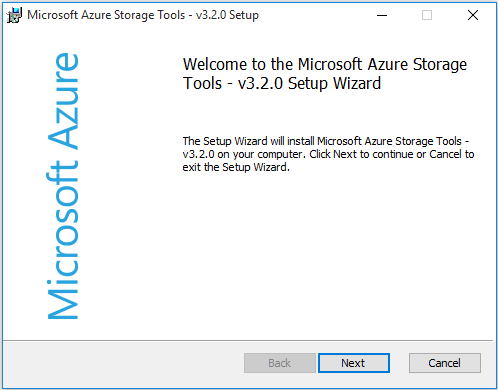
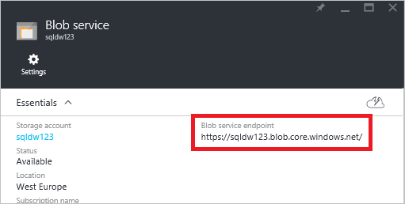

<properties
   pageTitle="Laden Sie die Daten aus SQL Server in Azure SQL-Data Warehouse (PolyBase) | Microsoft Azure"
   description="Verwendet Bcp So exportieren Sie Daten aus SQL Server in flachen Dateien, AZCopy zum Importieren von Daten in Azure Blob-Speicher und PolyBase, um die Daten in Azure SQL-Data Warehouse Aufnahme an."
   services="sql-data-warehouse"
   documentationCenter="NA"
   authors="ckarst"
   manager="barbkess"
   editor=""/>

<tags
   ms.service="sql-data-warehouse"
   ms.devlang="NA"
   ms.topic="get-started-article"
   ms.tgt_pltfrm="NA"
   ms.workload="data-services"
   ms.date="06/30/2016"
   ms.author="cakarst;barbkess;sonyama"/>


# <a name="load-data-with-polybase-in-sql-data-warehouse"></a>Laden Sie die Daten mit PolyBase in SQL Data Warehouse

> [AZURE.SELECTOR]
- [SSIS](sql-data-warehouse-load-from-sql-server-with-integration-services.md)
- [PolyBase](sql-data-warehouse-load-from-sql-server-with-polybase.md)
- [bcp](sql-data-warehouse-load-from-sql-server-with-bcp.md)

In diesem Lernprogramm erfahren, wie Daten mithilfe von AzCopy und PolyBase in SQL Data Warehouse zu laden. Wenn Sie fertig sind, sehen Sie so:

- Verwenden Sie zum Kopieren von Daten zu Azure Blob-Speicher AzCopy
- Erstellen von Datenbankobjekten, um die Daten zu definieren
- Führen Sie eine T-SQL-Abfrage, um die Daten zu laden.

>[AZURE.VIDEO loading-data-with-polybase-in-azure-sql-data-warehouse]

## <a name="prerequisites"></a>Erforderliche Komponenten

Um dieses Lernprogramm durchgehen, müssen Sie

- Eine SQL Data Warehouse-Datenbank.
- Ein Konto Azure-Speicher vom Typ Standard lokal redundante Speicherung (Standard-LRS) Standard Geo-redundante Speicher (Standard-GRS) oder Standard-Lesezugriff Geo-redundante Speicher (Standard-RAGRS).
- Befehlszeile AzCopy-Programm. Herunterladen Sie und installieren Sie der [neuesten Version von AzCopy][] die mit Microsoft Azure-Speicher-Tools installiert wird.

    


## <a name="step-1-add-sample-data-to-azure-blob-storage"></a>Schritt 1: Hinzufügen von Beispieldaten zu Azure Blob-Speicher

Um Daten zu laden, müssen wir einige Beispieldaten in einer Azure Blob-Speicher zu setzen. In diesem Schritt Auffüllen wir eine Speicher Azure Blob mit Beispieldaten aus. Wir werden später PolyBase verwenden, um diese Beispieldaten in Ihrer Datenbank SQL Data Warehouse zu laden.

### <a name="a-prepare-a-sample-text-file"></a>A Vorbereiten einer Stichprobe Textdatei

So bereiten Sie eine Beispieltextdatei vor:

1. Öffnen Sie den Editor, und kopieren Sie die folgenden Zeilen mit Daten in einer neuen Datei. Speichern Sie dies in Ihrer lokalen temporäres Verzeichnis als % temp%\DimDate2.txt.

```
20150301,1,3
20150501,2,4
20151001,4,2
20150201,1,3
20151201,4,2
20150801,3,1
20150601,2,4
20151101,4,2
20150401,2,4
20150701,3,1
20150901,3,1
20150101,1,3
```

### <a name="b-find-your-blob-service-endpoint"></a>B. Suchen nach der Blob-Endpunkt

So suchen Sie Ihre Blob-Endpunkt

1. Wählen Sie aus dem Azure-Portal **Durchsuchen** > **Speicher-Konten**.
2. Wählen Sie das Speicherkonto, das Sie verwenden möchten.
3. Klicken Sie in das Konto Speicher Blade auf Blobs

    

1. Speichern Sie Ihre BLOB-Service-Endpunkt-URL für später ein.

    

### <a name="c-find-your-azure-storage-key"></a>C. Suchen Sie nach der Schlüssel Azure-Speicher

So suchen Sie den Key Azure-Speicher

1. Wählen Sie aus dem Azure-Portal **Durchsuchen** > **Speicher-Konten**.
2. Klicken Sie auf das Speicherkonto, das Sie verwenden möchten.
3. Wählen Sie **Alle Einstellungen** > **Zugriffstasten**.
4. Klicken Sie auf das Kopieren, um eine der Zugriffstasten in die Zwischenablage zu kopieren.

    

### <a name="d-copy-the-sample-file-to-azure-blob-storage"></a>D EINGETRAGEN. Kopieren Sie die Beispieldatei in Azure Blob-Speicher

So kopieren die Daten in Azure Blob-Speicher:

1. Öffnen Sie ein Eingabeaufforderungsfenster, und wechseln Sie in das Installationsverzeichnis AzCopy. Dieser Befehl ändert sich in der Standard-Installationsverzeichnis auf einem 64-Bit-Windows-Client.

    ```
    cd /d "%ProgramFiles(x86)%\Microsoft SDKs\Azure\AzCopy"
    ```

1. Führen Sie den folgenden Befehl aus, um die Datei hochzuladen. Geben Sie Ihre BLOB-Service-Endpunkt-URL für <blob service endpoint URL> und Ihren kontoschlüssel Azure-Speicher für < Azure_storage_account_key >.

    ```
    .\AzCopy.exe /Source:C:\Temp\ /Dest:<blob service endpoint URL> /datacontainer/datedimension/ /DestKey:<azure_storage_account_key> /Pattern:DimDate2.txt
    ```

Siehe auch: [Erste Schritte mit der AzCopy Befehlszeilenprogramms][neueste Version von AzCopy].

### <a name="e-explore-your-blob-storage-container"></a>E. Untersuchen des BLOB-Speicher Containers

Um die Datei anzuzeigen, die Sie auf Blob-Speicher hochgeladen haben:

1. Kehren Sie zu Ihrem Blob-Service-Karte vorausgesetzt.
2. Klicken Sie unter Container doppelklicken Sie auf **Datencontainers**.
3. Wenn Sie den Pfad zu Ihren Daten untersuchen, klicken Sie auf den Ordner **Datedimension** und die hochgeladene Datei **DimDate2.txt**werden angezeigt.
4. Um Eigenschaften anzuzeigen, klicken Sie auf **DimDate2.txt**.
5. Beachten Sie, dass das Blob Eigenschaften Blade, können Sie herunterladen oder löschen Sie die Datei.

    


## <a name="step-2-create-an-external-table-for-the-sample-data"></a>Schritt 2: Erstellen einer externen Tabelle für die Beispieldaten

In diesem Abschnitt erstellen wir eine externe Tabelle, die die Beispieldaten definiert.

PolyBase verwendet externe Tabellen, um die Daten im Azure Blob-Speicher zuzugreifen. Da die Daten nicht in SQL Data Warehouse gespeichert ist, übernimmt PolyBase Authentifizierung mit externen Daten mithilfe einer Datenbank ausgelegte Anmeldeinformationen an.

Das Beispiel in diesem Schritt verwendet diese Transact-SQL-Anweisungen zum Erstellen einer externen Tabelle.

- [Create Master Key (Transact-SQL)][] , um das Geheimnis der Datenbank verschlüsseln ausgelegte Anmeldeinformationen.
- [Erstellen von Datenbank ausgelegte-Anmeldeinformationen (Transact-SQL)][] Authentifizierungsinformationen für Ihr Konto Azure-Speicher angeben.
- [Externe Datenquelle erstellen (Transact-SQL)][] , um den Speicherort Ihrer Azure Blob-Speicher anzugeben.
- [Erstellen externer-Dateiformat (Transact-SQL)][] zum Angeben des Formats der Daten.
- [Externe Tabelle erstellen (Transact-SQL)][] , um anzugeben, die Definition der Tabelle und den Speicherort der Daten.

Führen Sie diese Abfrage für die Data Warehouse SQL-Datenbank. Es wird eine externe Tabelle mit dem Namen DimDate2External im Dbo-Schema, das auf die DimDate2.txt Beispieldaten in der Azure Blob-Speicher verweist erstellt.


```sql
-- A: Create a master key.
-- Only necessary if one does not already exist.
-- Required to encrypt the credential secret in the next step.

CREATE MASTER KEY;


-- B: Create a database scoped credential
-- IDENTITY: Provide any string, it is not used for authentication to Azure storage.
-- SECRET: Provide your Azure storage account key.


CREATE DATABASE SCOPED CREDENTIAL AzureStorageCredential
WITH
    IDENTITY = 'user',
    SECRET = '<azure_storage_account_key>'
;


-- C: Create an external data source
-- TYPE: HADOOP - PolyBase uses Hadoop APIs to access data in Azure blob storage.
-- LOCATION: Provide Azure storage account name and blob container name.
-- CREDENTIAL: Provide the credential created in the previous step.

CREATE EXTERNAL DATA SOURCE AzureStorage
WITH (
    TYPE = HADOOP,
    LOCATION = 'wasbs://<blob_container_name>@<azure_storage_account_name>.blob.core.windows.net',
    CREDENTIAL = AzureStorageCredential
);


-- D: Create an external file format
-- FORMAT_TYPE: Type of file format in Azure storage (supported: DELIMITEDTEXT, RCFILE, ORC, PARQUET).
-- FORMAT_OPTIONS: Specify field terminator, string delimiter, date format etc. for delimited text files.
-- Specify DATA_COMPRESSION method if data is compressed.

CREATE EXTERNAL FILE FORMAT TextFile
WITH (
    FORMAT_TYPE = DelimitedText,
    FORMAT_OPTIONS (FIELD_TERMINATOR = ',')
);


-- E: Create the external table
-- Specify column names and data types. This needs to match the data in the sample file.
-- LOCATION: Specify path to file or directory that contains the data (relative to the blob container).
-- To point to all files under the blob container, use LOCATION='.'

CREATE EXTERNAL TABLE dbo.DimDate2External (
    DateId INT NOT NULL,
    CalendarQuarter TINYINT NOT NULL,
    FiscalQuarter TINYINT NOT NULL
)
WITH (
    LOCATION='/datedimension/',
    DATA_SOURCE=AzureStorage,
    FILE_FORMAT=TextFile
);


-- Run a query on the external table

SELECT count(*) FROM dbo.DimDate2External;

```


In SQL Server-Objekt-Explorer in Visual Studio können Sie die externen Dateiformat, externen Datenquelle und der Tabelle DimDate2External anzeigen.


## <a name="step-3-load-data-into-sql-data-warehouse"></a>Schritt 3: Laden von Daten in SQL Data Warehouse

Nachdem die externe Tabelle erstellt wurde, können Sie laden Sie die Daten in eine neue Tabelle oder in einer vorhandenen Tabelle einzufügen.

- Führen Sie die [CREATE TABLE AS SELECT (Transact-SQL)][] -Anweisung, um die Daten in einer neuen Tabelle zu laden. Die neue Tabelle wird in der Abfrage genannten Spalten enthalten. Die Datentypen der Spalten werden die Datentypen in der Definition externe Tabelle entsprechen.
- Verwenden Sie zum Laden der Daten in einer vorhandenen Tabelle die [Einfügen... SELECT (Transact-SQL)][] Anweisung.

```sql
-- Load the data from Azure blob storage to SQL Data Warehouse

CREATE TABLE dbo.DimDate2
WITH
(   
    CLUSTERED COLUMNSTORE INDEX,
    DISTRIBUTION = ROUND_ROBIN
)
AS
SELECT * FROM [dbo].[DimDate2External];
```

## <a name="step-4-create-statistics-on-your-newly-loaded-data"></a>Schritt 4: Erstellen von Statistiken für Ihre Daten neu geladen

SQL Data Warehouse nicht automatisch erstellen oder AutoUpdate-Statistik. Um die hohe abfrageleistung zu erzielen, ist es daher wichtig zum Erstellen von Statistiken für die einzelnen Spalten in jeder Tabelle nach dem ersten Laden. Es ist es wichtig, Statistik nach wesentlichen Änderungen in den Daten zu aktualisieren.

In diesem Beispiel wird die neue Tabelle DimDate2 einspaltige Statistiken erstellt.

```sql
CREATE STATISTICS [DateId] on [DimDate2] ([DateId]);
CREATE STATISTICS [CalendarQuarter] on [DimDate2] ([CalendarQuarter]);
CREATE STATISTICS [FiscalQuarter] on [DimDate2] ([FiscalQuarter]);
```

Weitere Informationen finden Sie unter [Statistics][].  


## <a name="next-steps"></a>Nächste Schritte
Finden Sie die [PolyBase-Leitfaden][] für Weitere Informationen, die Sie kennen sollten, wie Sie eine Lösung entwickeln, die PolyBase verwendet.

<!--Image references-->


<!--Article references-->
[PolyBase in SQL Data Warehouse Tutorial]: ./sql-data-warehouse-get-started-load-with-polybase.md
[Load data with bcp]: ./sql-data-warehouse-load-with-bcp.md
[Statistik]: ./sql-data-warehouse-tables-statistics.md
[Leitfaden für PolyBase]: ./sql-data-warehouse-load-polybase-guide.md
[neueste Version von AzCopy]: ../storage/storage-use-azcopy.md

<!--External references-->
[supported source/sink]: https://msdn.microsoft.com/library/dn894007.aspx
[copy activity]: https://msdn.microsoft.com/library/dn835035.aspx
[SQL Server destination adapter]: https://msdn.microsoft.com/library/ms141095.aspx
[SSIS]: https://msdn.microsoft.com/library/ms141026.aspx


[Erstellen der EXTERNEN Datenquelle (Transact-SQL)]:https://msdn.microsoft.com/library/dn935022.aspx
[Erstellen von EXTERNEN DATEIFORMAT (Transact-SQL)]:https://msdn.microsoft.com/library/dn935026.aspx
[Erstellen Sie externe Tabelle (Transact-SQL)]:https://msdn.microsoft.com/library/dn935021.aspx

[DROP EXTERNAL DATA SOURCE (Transact-SQL)]:https://msdn.microsoft.com/library/mt146367.aspx
[DROP EXTERNAL FILE FORMAT (Transact-SQL)]:https://msdn.microsoft.com/library/mt146379.aspx
[DROP EXTERNAL TABLE (Transact-SQL)]:https://msdn.microsoft.com/library/mt130698.aspx

[Erstellen Sie die Tabelle AS SELECT (Transact-SQL)]:https://msdn.microsoft.com/library/mt204041.aspx
[EINFÜGEN VON... Wählen Sie (Transact-SQL)]:https://msdn.microsoft.com/library/ms174335.aspx
[Erstellen von MASTER KEY (Transact-SQL)]:https://msdn.microsoft.com/library/ms174382.aspx
[CREATE CREDENTIAL (Transact-SQL)]:https://msdn.microsoft.com/library/ms189522.aspx
[Erstellen von ausgelegte Anmeldeinformationen für die Datenbank (Transact-SQL)]:https://msdn.microsoft.com/library/mt270260.aspx
[DROP CREDENTIAL (Transact-SQL)]:https://msdn.microsoft.com/library/ms189450.aspx
