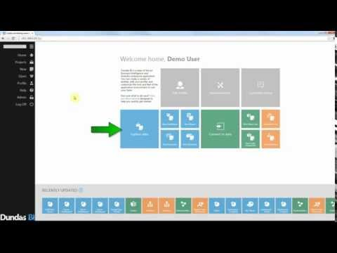
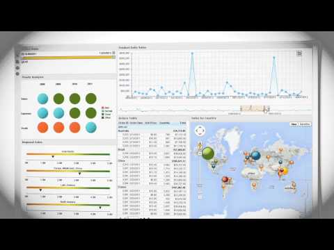
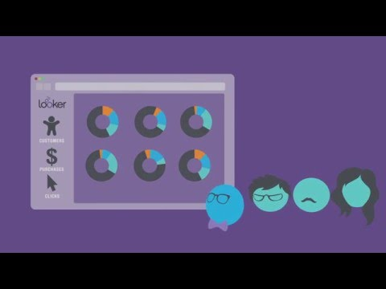
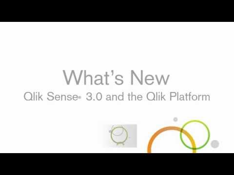
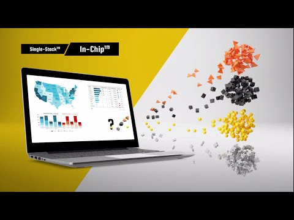
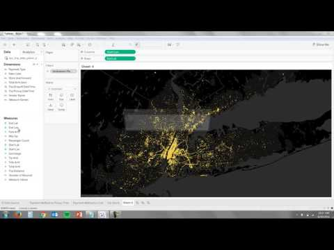
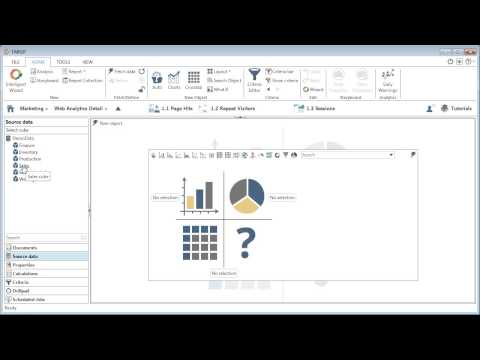
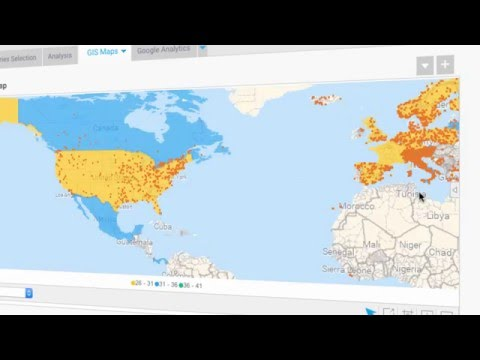

<properties
   pageTitle="SQL Data Warehouse Business Intelligence Partner | Microsoft Azure"
   description="Listen mit Drittanbieter-Business Intelligence-Partner mit Lösungen, die SQL Data Warehouse unterstützen."
   services="sql-data-warehouse"
   documentationCenter="NA"
   authors="jrowlandjones"
   manager="barbkess"
   editor=""/>

<tags
   ms.service="sql-data-warehouse"
   ms.devlang="NA"
   ms.topic="article"
   ms.tgt_pltfrm="NA"
   ms.workload="data-services"
   ms.date="08/17/2016"
   ms.author="jrj;barbkess;sonyama"/>

# SQL Data Warehouse Business Intelligence Partner

Um Ihre End-to-End-Datawarehouse-Lösung erstellen, wählen Sie aus einer Vielzahl von gängigen Tools.  In diesem Artikel hervorgehoben Microsoft Partnerunternehmen mit Business Intelligence (BI) Lösungen Azure SQL-Data Warehouse unterstützt.

## Unsere Business Intelligence-Partner

| Partner | Beschreibung | Links | Videos |
| ------- | ----------- | ----- | ------ |
| ![Birst][1] |**Birst** Birst ist ein globaler Füllzeichen in BI Cloud und Analytics. Unternehmen können eine vertrauenswürdige Quelle der Daten innerhalb des Kontexts von jedem Benutzer Business-erstellen. Dann können Sie Business-Benutzer in der gesamten Organisation Berichten und Analysieren von Informationen mit hervorragende BI-Tools.| [Marketplace][birst_marketplace] [Website][birst_website] [Twitter][birst_twitter] [YouTube][birst_youtube] | |
| ![ClearStory-Daten][2] |**ClearStory-Daten** ClearStory Daten ermöglicht Fast-Zyklus Analyse über verschiedenartige in SQL Data Warehouse gespeicherten Daten an. Die ClearStory integriert Spark-basierten Plattform und Analysefunktionen Anwendung Geschwindigkeit Datenzugriff und Harmonisierung der unterschiedlichen Datasets. Sie ermöglichen schnelle, gemeinsame datenauswertung, das verschafft Geschäftskunden Dank um Einsichten zu erhalten.| [Website][clearstory_website] [Datenblatt][clearstory_datasheet] [Twitter][clearstory_twitter] [YouTube][clearstory_youtube] | |
| ![Dell Statistica][3] |**Dell Statistica** Dell Statistica ist eine erweiterte Analytics-Plattform, mit der Organisationen über die Zukunft Vorhersagen, Prozesse optimieren, reduzieren Kosten und Umsatz zu erhöhen.  Dell Statistica big Data Analytics vereinfacht, optimiert die Implementierung und Bereitstellung, nützliche Einblicke aus Text extrahiert und können Ihr Unternehmen. | [Marketplace][dell_statistica_marketplace] [Website][dell_statistica_website] [Datenblatt][dell_statistica_datasheet] [Twitter][dell_statistica_twitter] [YouTube][dell_statistica_youtube] |  |
| ![Dundas][4] |**Dundas BI** Dundas Visualisierung von Daten ist ein führende, globale Anbieter von Software für Business Intelligence und Visualisierung von Daten.  Dundas Dashboards, Berichterstattung und Analytics visuelle Daten bieten nahtlose Integration in branchenanwendungen, bessere Entscheidungen und schnellere Einblicke aktivieren. | [Marketplace][dundas_bi_marketplace] [Website][dundas_bi_website] [Datenblatt][dundas_bi_datasheet] [Twitter][dundas_bi_twitter] [YouTube][dundas_bi_youtube] |  |
| ![Jinfonet][5] |**JReport** JReport ist eine eingebettet werden BI-Lösung für Unternehmen. Die Lösung ermöglicht Benutzern das Erstellen von Berichten, Dashboards und Datenanalyse Cloud, big Data und Transaktionen Datenquellen. Mit einer Visualisierung von Daten, können Sie Ihre eigenen Berichte und Daten Discovery für agiles, klicken Sie auf die dynamische entscheidungsfindung durchführen.| [Website][jinfonet_website] [Datenblatt][jinfonet_datasheet] [Twitter][jinfonet_twitter] [YouTube][jinfonet_youtube] |  |
| ![LogiAnalytics][6] |**Logi Analytics** Zusammen, ermöglicht Logi Analytics und Azure SQL-Data Warehouse Ihrer Organisation zu sammeln, analysieren und auf den größten und am häufigsten unterschiedlichen Datensätzen in der Welt sofort handeln. | [Marketplace][logianalytics_marketplace] [Website][logianalytics_website] [Datenblatt][logianalytics_datasheet] [Twitter][logianalytics_twitter] [YouTube][logianalytics_youtube] |  |
| ![Looker][7] |**Looker BI** Looker bietet jeder im Unternehmen die Möglichkeit, durchsuchen und die Daten, die Ihr Unternehmen Laufwerke zu verstehen. Darüber hinaus stehen Looker die Daten Analysten ein Layers flexible und wieder verwendbare Modellierung zum Steuern und die Daten curate.  Unternehmen haben ihre Kultur mit Looker als Abgaskatalysators grundlegend transformiert. | [Marketplace][looker_marketplace] [Website][looker_website] [Datenblatt][looker_datasheet] [Twitter][looker_twitter] [YouTube][looker_youtube] |  |
| ![Qlik][8] |**Qlik sinnvoll Enterprise** Laufwerk Einblicke Suche mit den Daten Visualisierung app, die jeder verwenden kann. Mit Qlik sinnvoll kann jeder in Ihrer Organisation einfach flexible, interaktive Visualisierungen erstellen und treffen von Entscheidungen auf aussagekräftige.| [Website][qlik_website] [Twitter][qlik_twitter] [YouTube][qlik_youtube] |  |
| ![SiSense][9] |**SiSense** SiSense ist eine vollständig-Stapel Business Intelligence-Software, die mit Tools, die ein Unternehmen benötigt stammen, analysieren und Visualisieren von Daten: eine leistungsfähige analytical Datenbank, die Möglichkeit, mehrere Datenquellen, Datenextraktion von einfachen (ETL) und Visualisierung von Daten webbasierten teilnehmen. Die analysieren und Visualisieren großen Datenmengen mit SiSense BI und Analytics heute beginnen. | [Marketplace][sisense_marketplace] [Website][sisense_website] [Datenblatt][sisense_datasheet] [Twitter][sisense_twitter] [YouTube][sisense_youtube] |  |
| ![Tableaus][10] |**Tableaus** Self-service-Analytics des Tableaus Hilfe jeder sehen und deren Daten über viele Arten von Daten aus einer flachen Dateien an Datenbanken verstehen. Tableaus muss einen Verbinder systemeigenen, optimierten Microsoft Azure SQL Data Warehouse, der Livedaten und im Arbeitsspeicher unterstützt. | [Marketplace][tableau_marketplace] [Website][tableau_website] [Datenblatt][tableau_datasheet] [Twitter][tableau_twitter] [YouTube][tableau_youtube] |  |
| ![Targit][11] |**Targit** Targit Entscheidung Suite bietet BI und Analytics-Plattform, die in Echtzeit Dashboards, Analytics Self-service, benutzerfreundlichen reporting, verblüffende mobile Funktionen und einfache Datenermittlung Technologie in einer einzigen, zusammenhängenden Lösung bietet. Targit bietet Unternehmen das Ende dienen. | [Marketplace][targit_marketplace] [Website][targit_website] [Twitter][targit_twitter] [YouTube][targit_youtube] |  |
| ![Gelbflossenthun][12] |**Gelbflossenthun** Gelbflossenthun ist von oben BI Cloud-Anbieter für die Ad-hoc-Berichte und Dashboards nach BARC bewertet. Die BI-Umfrage. Verbinden mit Azure SQL-Data Warehouse, und klicken Sie dann mit erstellen und freigeben ansprechender Berichte und Dashboards ausgezeichnete Onlinezusammenarbeit BI und Speicherort Intelligence-Features. | [Marketplace][yellowfin_marketplace] [Website][yellowfin_website] [Datenblatt][yellowfin_datasheet] [Twitter][yellowfin_twitter] [YouTube][yellowfin_youtube] |  |

<!--https://img.youtube.com/vi/0b8sPW2UHrU/0.jpg-->

## Nächste Schritte

Weitere Informationen zu einigen anderen unserer Partner finden Sie unter [Data Integration Partner] [ di_partners] und [Datenverwaltung Partner][dm_partners].

<!--Image references-->
[1]: ./media/sql-data-warehouse-partner-business-intelligence/birst_logo.png
[2]: ./media/sql-data-warehouse-partner-business-intelligence/clearstory_data_logo.png
[3]: ./media/sql-data-warehouse-partner-business-intelligence/dell_statistica_logo.png
[4]: ./media/sql-data-warehouse-partner-business-intelligence/dundas_software_logo.png
[5]: ./media/sql-data-warehouse-partner-business-intelligence/jinfonet_logo.png
[6]: ./media/sql-data-warehouse-partner-business-intelligence/logianalytics_logo.png
[7]: ./media/sql-data-warehouse-partner-business-intelligence/looker_logo.png
[8]: ./media/sql-data-warehouse-partner-business-intelligence/qlik_logo.png
[9]: ./media/sql-data-warehouse-partner-business-intelligence/sisense_logo.png
[10]: ./media/sql-data-warehouse-partner-business-intelligence/tableau_sparkle_logo.png
[11]: ./media/sql-data-warehouse-partner-business-intelligence/targit_logo.png
[12]: ./media/sql-data-warehouse-partner-business-intelligence/yellowfin_logo.png

<!--Article links-->
[bi_partners]: ./sql-data-warehouse-partner-business-intelligence.md
[dm_partners]: ./sql-data-warehouse-partner-data-management.md
[di_partners]: ./sql-data-warehouse-partner-data-integration.md

<!--Website links -->
[birst_website]:https://www.birst.com/
[clearstory_website]:http://www.clearstorydata.com/
[dell_statistica_website]:http://software.dell.com/MSFT_Stat_ref/
[dundas_bi_website]:http://www.dundas.com/dundas-bi
[jinfonet_website]:http://www.jinfonet.com/product/jreport-designer
[logianalytics_website]:http://www.logianalytics.com/
[looker_website]:https://looker.com/partners/microsoft-azure/
[qlik_website]:http://www.qlik.com/us/products/qlik-sense/enterprise
[sisense_website]:https://www.sisense.com/product/
[tableau_website]:http://www.tableau.com/
[targit_website]:https://www.targit.com/en/software/deployment/targitonazure
[yellowfin_website]:http://www.yellowfinbi.com/

<!--Get Started Links-->
[qlik_getstarted]:http://www.qlik.com/us/products/qlik-sense/getting-started

<!--Datasheet Links-->
<!--[birst_datasheet]:-->
[clearstory_datasheet]:http://www.clearstorydata.com/wp-content/uploads/2016/05/ClearStoryData-PO01-062015-01-2.pdf
[dell_statistica_datasheet]:https://software.dell.com/documents/statistica-data-miner-datasheet-69284.pdf
[dundas_bi_datasheet]:http://www.dundas.com/resource/getwhitepaper?whitePaperName=27-05-2016-Dundas-BI-Product-Brief-_-Embedded-Analytics%2FEckerson-Group-EBI-Report-DundasProduct-Brief.pdf
[jinfonet_datasheet]:http://www.jinfonet.com/products/JReport%20Brief.pdf
[logianalytics_datasheet]:https://www.logianalytics.com/datasheet/logi-info/
[looker_datasheet]:https://info.looker.com/h/i/229169578-looker-for-microsoft-azure
<!--[qlik_datasheet]:http://www.qlik.com/en/resource-library/the-qlikview-product-family-->
[sisense_datasheet]:https://pages.sisense.com/rs/601-OXE-081/images/Product%20Highlights.pdf
[tableau_datasheet]:http://www.tableau.com/stories/workbook/azure-sql-data
<!--[targit_datasheet]:-->
[yellowfin_datasheet]:http://www.yellowfinbi.com/Document.i4?DocumentId=877299

<!--Marketplace Links -->
[birst_marketplace]:https://azure.microsoft.com/en-gb/marketplace/partners/birst/birst/
<!--[clearstory_marketplace]:-->
[dell_statistica_marketplace]:https://azure.microsoft.com/en-us/marketplace/partners/dell-software/statistica-data-miner/ 
[dundas_bi_marketplace]:https://azure.microsoft.com/en-us/marketplace/partners/dundas/dundas-bi/ 
<!--[jinfonet_marketplace]:-->
[logianalytics_marketplace]:https://azure.microsoft.com/en-us/marketplace/partners/logi-analytics/logi-info-11/ 
[looker_marketplace]:https://azure.microsoft.com/en-us/marketplace/partners/looker/looker-analytics-platform-326/ 
<!--[qlik_marketplace]:https://azure.microsoft.com/en-us/marketplace/partners/qliktech-international-ab/qlikview/ -->
[sisense_marketplace]:https://azure.microsoft.com/en-us/marketplace/partners/sisense/sisense-byol/ 
[tableau_marketplace]:https://azure.microsoft.com/en-us/marketplace/partners/tableau/tableau-server/
[targit_marketplace]:https://azure.microsoft.com/en-us/marketplace/partners/targit/targit-decision-suite/ 
[yellowfin_marketplace]:https://azure.microsoft.com/en-us/marketplace/partners/yellowfin/yellowfin-for-azure-byol/

<!--Press links-->
<!--[birst_press]:-->
[clearstory_press]:http://www.clearstorydata.com/press/clearstory-data-paired-with-new-microsoft-azure-sql-data-warehouse-release-provides-highly-scalable-data-analysis-at-apache-spark-speed/
<!--[dell_statistica_press]:-->
[dundas_bi_press]:https://www.dundas.com/about/news/24-06-2015-dundas-data-visualization-provides-seamless-integration-with-microsoft-azure-and-azure-sql-data-warehouse
<!--[jinfonet_press]:-->
[logianalytics_press]:http://www.logianalytics.com/logi-news/announcing-logi-info-integration-with-azure-sql-data-warehouse/
[looker_press]:https://looker.com/news/press/looker-brings-self-serve-analytics-to-microsoft-azure
<!--[qlik_press]:-->
<!--[sisense_press]:-->
[tableau_press]:https://www.tableau.com/about/blog/2015/7/visualizing-data-cloud-microsoft-azure-tableau-online-40832 
<!--[targit_press]:-->
<!--[yellowfin_press]:-->

<!--YouTube links-->
[birst_youtube]:https://www.youtube.com/user/BirstBI
[clearstory_youtube]:https://www.youtube.com/user/ClearStoryData
[dell_statistica_youtube]:https://www.youtube.com/user/DellSoftwareVideo
[dundas_bi_youtube]:https://www.youtube.com/user/dundasdv
[jinfonet_youtube]:https://www.youtube.com/user/JinfonetSoftware
[logianalytics_youtube]:https://www.youtube.com/user/LogiXMLblog
[looker_youtube]:https://www.youtube.com/user/LookerData
[qlik_youtube]:https://www.youtube.com/user/qlikview
[sisense_youtube]:https://www.youtube.com/user/sisenseanalytics
[tableau_youtube]:https://www.youtube.com/user/tableausoftware
[targit_youtube]:https://www.youtube.com/user/TargitAS
[yellowfin_youtube]:https://www.youtube.com/user/YellowfinTeam

<!--Twitter links-->
[birst_twitter]:https://twitter.com/BirstBI
[clearstory_twitter]:https://twitter.com/ClearStoryData
[dell_statistica_twitter]:https://twitter.com/DellStatistica
[dundas_bi_twitter]:https://twitter.com/dundasdata
[jinfonet_twitter]:https://twitter.com/Jinfonet
[logianalytics_twitter]:https://twitter.com/LogiAnalytics
[looker_twitter]:https://twitter.com/LookerData
[qlik_twitter]:https://twitter.com/qlik
[sisense_twitter]:https://twitter.com/Sisense
[tableau_twitter]:https://twitter.com/tableau
[targit_twitter]:https://twitter.com/TARGIT
[yellowfin_twitter]:https://twitter.com/YellowfinBI
