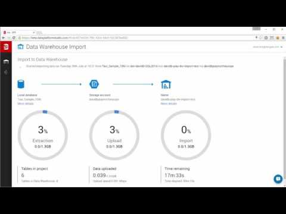

<properties
   pageTitle="SQL Data Warehouse Daten Integrationspartner | Microsoft Azure"
   description="Listen mit Drittanbieter-Partner mit Daten Integration Lösungen, die Azure SQL-Data Warehouse unterstützen."
   services="sql-data-warehouse"
   documentationCenter="NA"
   authors="jrowlandjones"
   manager="barbkess"
   editor=""/>

<tags
   ms.service="sql-data-warehouse"
   ms.devlang="NA"
   ms.topic="article"
   ms.tgt_pltfrm="NA"
   ms.workload="data-services"
   ms.date="08/17/2016"
   ms.author="jrj;barbkess;sonyama"/>

# SQL Data Warehouse Daten Integrationspartner

Um Ihre End-to-End-Datawarehouse-Lösung erstellen, wählen Sie aus einer Vielzahl von gängigen Tools. In diesem Artikel werden die Microsoft Partnerunternehmen mit Daten Integration Lösungen Azure SQL-Data Warehouse unterstützt hervorgehoben.

## Unsere Daten Integrationspartner

| Partner | Beschreibung | Links | Videos |
| ------- | ----------- |------ | ------ |
| ![Alteryx][1] | **Alteryx**  Alteryx-Designers stellt einen Workflow wiederholt für Analytics Self-service-Daten, die zur tieferen Einsichten in Stunden, die nicht den normalen Herkömmliche Ansätze Wochen führt! Alteryx-Designer werden Daten Analysten durch Kombinieren von Daten Vorbereitung, Daten Überlagerung und Analytics – Vorhersage, statistische und räumliche – mithilfe der gleichen intuitive Benutzeroberfläche können. | [Marketplace][alteryx_marketplace] [Website][alteryx_designer_website] [Datenblatt][alteryx_designer_datasheet] [Twitter][alteryx_designer_twitter] [YouTube][alteryx_designer_youtube] |  |
| ![Attunity][2] | **Attunity** Attunity CloudBeam bietet eine automatisierte und optimierte Lösung für das Laden von Daten in SQL Data Warehouse. Mit einem Design "auf Laden" vereinfacht, und sowohl Stapel laden als auch inkrementell Replikation aus vielen heterogenen Datenbanken, einschließlich SQL Server, Oracle, DB2, Sybase und MySQL Beschleunigung. | [Marketplace][attunity_marketplace] [Schnellstart][attunity_quickstart] [Website][attunity_cloudbeam_website] [Datenblatt][attunity_cloudbeam_datasheet] [Twitter][attunity_cloudbeam_twitter] [YouTube][attunity_cloudbeam_youtube] |  |
| ![Bryte Betriebssysteme][3] | **Bryte Betriebssysteme** Bryte Systeme Automatisierung Datenübertragung in SQL Data Warehouse aus verschiedenen Datenbanken und Quellen verwendet. Bryte Systeme hat sich Daten Verlagerung und Integration Technologien auf. Skalierbare cloudbasierten Daten Lager und Daten Seen zu Einsichten für eine Steigerung Bau. | [Marketplace][bryte_systems_marketplace] [Website][bryte_systems_azure_website] | |
| ![Informatica][4] | **Informatica Cloud** Informatica Cloud Integration Portfolio können Sie ganz einfach zu verschiedenen Cloud, lokal, mobile und sozialen Datenquellen verbinden. Informatica Cloud können Sie Ihre relevanten und vertrauenswürdigen Unternehmensinformationen effizientes freigeben. Wir bieten die am häufigsten vollständige Suite Cloud-Integration für Stapel und in Echtzeit Mustern, Cloud Test datenverwaltung cloud Qualität der Daten sowie cloud master Programme für die Verwaltung. | [Marketplace][informatica_Cloud_Services_marketplace] [Kostenlose Testversion][informatica_cloud_free_trial] [Lizenz-Informationen][informatica_cloud_services_config] [Website][informatica_Cloud_Services_website] [Datenblatt][informatica_cloud_datasheet] [Twitter][informatica_cloud_twitter] [YouTube][informatica_cloud_youtube] | |
| ![Informatica][4] | **Informatica PowerCenter** Informatica ist einer der weltweit am häufigsten erkennbar ist unabhängigen Anbieter von Software für Integration. PowerCenter bildet die Grundlage für alle Daten Integration Initiativen. Verwenden Sie für Analytics, Datawarehousing, Anwendungsmigration, Konsolidierung oder Daten Governance PowerCenter ein. | [Marketplace (Standard)][informatica_PowerCenter_std_marketplace] [Marketplace (Erweitert)][informatica_PowerCenter_adv_marketplace] [Website][informatica_PowerCenter_website] [Datenblatt][informatica_powercenter_datasheet] [Twitter][informatica_powercenter_twitter] [YouTube][informatica_powercenter_youtube] | |
| ![Redgate][5] | **Redgate Daten Plattform Studio (Preview)** Die Redgate Daten Plattform Studio bietet eine einfache und zuverlässige Möglichkeit zum Migrieren von mit lokalen SQL-Datenbanken zu Azure SQL-Data Warehouse. Es wurde entwickelt, um für eine vollständig automatisierte Migration smart Entscheidungen treffen und einmaligen Steuerdatei für die Nutzung ist kostenlos. | [Website][redgate_website] [Twitter][redgate_twitter] [YouTube][redgate_youtube] |  |
| ![SnapLogic][6] | **SnapLogic** Die SnapLogic Integrationsplattform als Dienst (iPaaS) ermöglicht Kunden, um schnell die Daten in die und aus Microsoft Azure SQL-Data Warehouse übertragen.  SnapLogic bietet die Möglichkeit, hundert Applications, Services und IoT-Szenarien in eine Lösung integrieren. Bieten Sie eine schnelle, effektive Einsichten in der Cloud, lokal oder im Hybridmodus mit SnapLogic! | [Marketplace][snaplogic_marketplace] [Website][snaplogic_website] [Datenblatt][snaplogic_datasheet] [Twitter][snaplogic_twitter] [YouTube][snaplogic_youtube] |  |

## Nächste Schritte

Weitere Informationen zu einigen anderen unserer Partner finden Sie unter [Business Intelligence Partner] [ bi_partners] und [Datenverwaltung Partner][dm_partners].

<!--Image references-->
[1]: ./media/sql-data-warehouse-partner-data-integration/alteryx_logo.png
[2]: ./media/sql-data-warehouse-partner-data-integration/attunity_logo.png
[3]: ./media/sql-data-warehouse-partner-data-integration/bryte_systems_logo.png
[4]: ./media/sql-data-warehouse-partner-data-integration/informatica_logo.png
[5]: ./media/sql-data-warehouse-partner-data-integration/redgate_logo.png
[6]: ./media/sql-data-warehouse-partner-data-integration/snaplogic_logo.png

<!--Article links-->
[bi_partners]: ./sql-data-warehouse-partner-business-intelligence.md
[dm_partners]: ./sql-data-warehouse-partner-data-management.md
[di_partners]: ./sql-data-warehouse-partner-data-integration.md

<!--ebook Links-->

<!--Configuration Guides-->
[informatica_cloud_services_config]:https://kb.informatica.com/proddocs/Product%20Documentation/5/IC_Winter2016_MicrosoftAzureSQLDataWarehouseConnectorGuide_en.pdf

<!--Datasheet Links-->
[alteryx_designer_datasheet]:http://www.alteryx.com/sites/default/files/resources/files/alt-designer-ds.pdf
[attunity_cloudbeam_datasheet]:http://www.attunity.com/sites/default/files/content/attunity-azure-solution-sheet.pdf
<!--[bryte_systems_azure_datasheet]:-->
[informatica_cloud_datasheet]:https://www.informatica.com/content/dam/informatica-com/global/amer/us/collateral/data-sheet/cloud-integration-platform_data-sheet_2711.pdf
[informatica_powercenter_datasheet]:https://www.informatica.com/content/dam/informatica-com/global/amer/us/collateral/brochure/powercenter_brochure_6659.pdf
[snaplogic_datasheet]:http://campaigns.snaplogic.com/rs/055-FYJ-916/images/SnapLogic-for-Microsoft-Cortana.pdf

<!--Free Trial-->
[informatica_cloud_free_trial]:https://www.informatica.com/products/cloud-integration/connectivity/microsoft-azure-connector.html

<!--Website Links -->
[alteryx_designer_website]:http://www.alteryx.com/products/alteryx-designer/
[attunity_cloudbeam_website]:http://www.attunity.com/attunity-cloudbeam-for-azure/
[bryte_systems_azure_website]:http://www.bryte.com.au/azure-integration/
[informatica_Cloud_Services_website]:https://www.informatica.com/products/cloud-integration.html
[informatica_PowerCenter_website]:https://www.informatica.com/products/data-integration/powercenter.html
[redgate_website]:http://dataplatformstudio.com/
[snaplogic_website]:https://www.snaplogic.com/solutions/microsoft-cortana-analytics-integration/

<!--Marketplace Links -->
[alteryx_marketplace]:https://azure.microsoft.com/en-us/marketplace/partners/alteryx/alteryx-designer/
[attunity_marketplace]:https://azure.microsoft.com/en-gb/marketplace/partners/attunity-cloudbeam/cloudbeam-dw-byol/ 
[bryte_systems_marketplace]:https://azure.microsoft.com/en-gb/marketplace/partners/bryte/bryteflow-cdc-free-trial/ 
[informatica_Cloud_Services_marketplace]:https://azure.microsoft.com/en-us/marketplace/partners/informatica-cloud/informatica-cloud/
[informatica_PowerCenter_std_marketplace]:https://azure.microsoft.com/en-us/marketplace/partners/informatica/informatica-powercenter-standard-10-0pc-std-10-0-windows/
[informatica_PowerCenter_adv_marketplace]:https://azure.microsoft.com/en-us/marketplace/partners/informatica/informatica-powercenter-advanced-10-0pc-adv-10-0-ubuntu/ 
<!--[redgate_marketplace]:-->
[snaplogic_marketplace]:https://azure.microsoft.com/en-us/marketplace/partners/snaplogic/snaplogic-elastic-integration-windows/ 

<!--Quickstart_links-->
[attunity_quickstart]:http://www.attunity.com/sites/default/files/product_resource/quick_start_guide_attunity_cloudbeam_for_microsoft_azure.pdf

<!--PressRelease_links-->
[alteryx_designer_press]:https://www.alteryx.com/press-releases/alteryx-now-enables-data-analysts-to-perform-in-database-blending-in-microsoft-azure 
[attunity_cloudbeam_press]:http://www.attunity.com/news/attunity-launches-cloud-data-warehouse-solutions-microsoft-azure
[bryte_systems_azure_press]:http://medianet.com.au/releases/release-details?id=837667
<!--[informatica_Cloud_Services_press]:-->
<!--[informatica_PowerCenter_press]:-->
<!--[redgate_press]:-->
[snaplogic_press]:https://www.snaplogic.com/press-releases/snaplogic-introduces-support-for-microsoft-azure-sql-data-warehouse

<!--YouTube-->
[alteryx_designer_youtube]:https://www.youtube.com/user/alteryx
[attunity_cloudbeam_youtube]:https://www.youtube.com/user/Attunity
<!--[bryte_systems_azure_youtube]:-->
[informatica_Cloud_youtube]:https://www.youtube.com/user/InformaticaOnDemand
[informatica_PowerCenter_youtube]:https://www.youtube.com/user/InformaticaCorp
[redgate_youtube]:https://www.youtube.com/user/RedGateVideos
[snaplogic_youtube]:https://www.youtube.com/user/snapLogicInc

<!--Twitter-->
[alteryx_designer_twitter]:https://twitter.com/alteryx
[attunity_cloudbeam_twitter]:https://twitter.com/attunity
<!--[bryte_systems_azure_twitter]:-->
[informatica_cloud_twitter]:https://twitter.com/infacloud
[informatica_powercenter_twitter]:https://twitter.com/Informatica
[redgate_twitter]:https://twitter.com/DataPlatform_S
[snaplogic_twitter]:https://twitter.com/snaplogic
