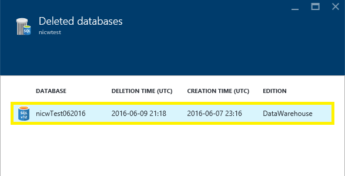

<properties
   pageTitle="Wiederherstellen einer SQL Azure Datawarehouse (Portal) | Microsoft Azure"
   description="Azure Portals Aufgaben zum Wiederherstellen einer Azure SQL-Data Warehouse."
   services="sql-data-warehouse"
   documentationCenter="NA"
   authors="Lakshmi1812"
   manager="barbkess"
   editor=""/>

<tags
   ms.service="sql-data-warehouse"
   ms.devlang="NA"
   ms.topic="article"
   ms.tgt_pltfrm="NA"
   ms.workload="data-services"
   ms.date="09/21/2016"
   ms.author="lakshmir;barbkess;sonyama"/>

# Wiederherstellen einer SQL Azure Datawarehouse (Portal)

> [AZURE.SELECTOR]
- [(Übersicht)][]
- [Portal][]
- [PowerShell][]
- [REST][]

In diesem Artikel erfahren Sie, wie eine Azure SQL Data Warehouse mithilfe der Azure-Portal wiederherstellen.

## Vorbemerkung

**Überprüfen Sie Ihre DTU Kapazität aus.** Jede SQL Data Warehouse gehostet wird von einer SQLServer (z. B. myserver.database.windows.net) die ein DTU Kontingent hat.  Bevor Sie eine SQL Data Warehouse wiederherstellen können, überprüfen Sie Folgendes der SQLServer verfügt über genügend verbleibende DTU Kontingent für die Datenbank, die wiederhergestellt wird. Erfahren Sie, wie erforderlich DTU berechnen oder weitere DTU anfordern finden Sie unter [DTU Kontingent Änderung anfordern][].

## Wiederherstellen einer Datenbank aktiven oder angehalten

Zum Wiederherstellen einer Datenbank:

1. Melden Sie sich bei der [Azure-portal][]
2. Klicken Sie auf der linken Seite des Bildschirms Wählen Sie **Durchsuchen** , und wählen Sie dann auf **SQL Server**
    
    
    
3. Navigieren Sie zu dem Server, und wählen Sie es aus
    
    

4. Suchen nach SQL Data Warehouse, die Sie wiederherstellen aus, und wählen Sie ihn möchten
    
    
5. Am oberen Rand der Data Warehouse Blade klicken Sie auf **Wiederherstellen**
    
    

6. Geben Sie einen neuen **Namen der Datenbank**
7. Wählen Sie den neuesten **Wiederherstellen Punkt**
    1. Stellen Sie sicher, dass Sie den neuesten Wiederherstellungspunkt auswählen.  Da Wiederherstellungspunkte in UTC angezeigt werden, ist in manchen Fällen die Standardoption dargestellt nicht der neuesten Wiederherstellungspunkt an.
    
    

8. Klicken Sie auf **OK**
9. Der Datenbank Wiederherstellungsprozess wird ausgeführt und mithilfe von **BENACHRICHTIGUNGEN** überwacht werden können

>[AZURE.NOTE] Nachdem die Wiederherstellung abgeschlossen ist, können Sie die wiederhergestellte Datenbank nach folgenden [Konfigurieren Ihrer Datenbank nach der Wiederherstellung][]konfigurieren.

## Wiederherstellen einer gelöschten Datenbank

Eine gelöschte Datenbank wiederherzustellen:

1. Melden Sie sich bei der [Azure-portal][]
2. Klicken Sie auf der linken Seite des Bildschirms Wählen Sie **Durchsuchen** , und wählen Sie dann auf **SQL Server**
    
    

3. Navigieren Sie zu dem Server, und wählen Sie es aus
    
    

4. Führen Sie einen Bildlauf nach unten bis zum Abschnitt mit Vorgängen auf Blade des Servers
5. Klicken Sie auf die Kachel **Datenbanken gelöscht**
    
    

6. Wählen Sie die gelöschte Datenbank, die Sie wiederherstellen möchten.
    
    

7. Geben Sie einen neuen **Namen der Datenbank**
    
    
    
8. Klicken Sie auf **OK**
9. Der Datenbank Wiederherstellungsprozess wird ausgeführt und mithilfe von **BENACHRICHTIGUNGEN** überwacht werden können

>[AZURE.NOTE] Zum Konfigurieren Ihrer Datenbank nach Abschluss die Wiederherstellung finden Sie in [Ihrer Datenbank nach der Wiederherstellung konfigurieren][]. 

## Nächste Schritte
Weitere Informationen über die Business Continuity-Features von Azure SQL-Datenbank-Editionen, lesen Sie die [Azure SQL-Datenbank Business Continuity (Übersicht)][].

<!--Image references-->

<!--Article references-->
[Azure SQL-Datenbank Business Continuity (Übersicht)]: ./sql-database-business-continuity.md
[(Übersicht)]: ./sql-data-warehouse-restore-database-overview.md
[Portal]: ./sql-data-warehouse-restore-database-portal.md
[PowerShell]: ./sql-data-warehouse-restore-database-powershell.md
[REST]: ./sql-data-warehouse-restore-database-rest-api.md
[Konfigurieren Sie die Datenbank nach der Wiederherstellung]: ./sql-database-disaster-recovery.md#configure-your-database-after-recovery
[Anfordern einer Änderung der DTU Kontingent]: ./sql-data-warehouse-get-started-create-support-ticket.md#request-quota-change

<!--MSDN references-->

<!--Blog references-->

<!--Other Web references-->
[Azure-portal]: https://portal.azure.com/
