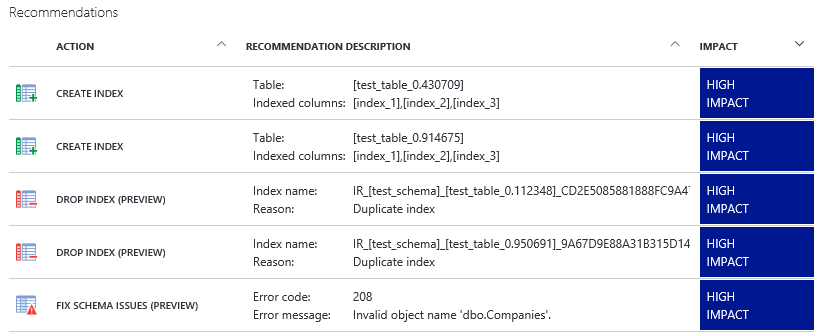
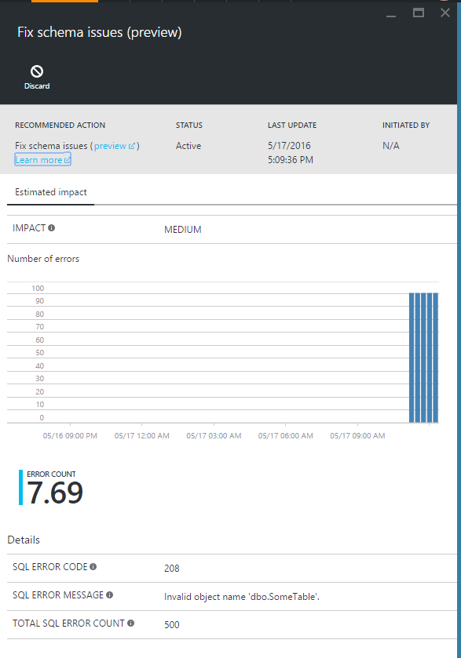
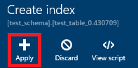
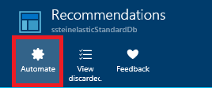
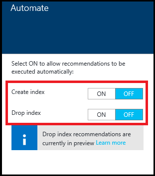
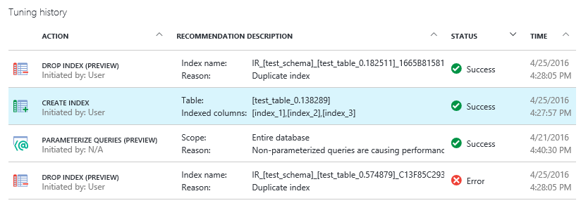
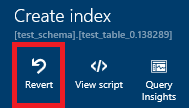
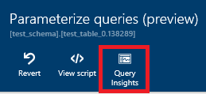

<properties 
   pageTitle="Azure SQL-Datenbank Advisor über das Azure-Portal | Microsoft Azure" 
   description="Sie können den Azure SQL-Datenbank Advisor Azure-Portal zu überprüfen und implementieren Empfehlungen für Ihre vorhandene SQL-Datenbanken, die aktuelle Abfrage Leistung können verwenden." 
   services="sql-database" 
   documentationCenter="" 
   authors="stevestein" 
   manager="jhubbard" 
   editor="monicar"/>

<tags
   ms.service="sql-database"
   ms.devlang="na"
   ms.topic="article"
   ms.tgt_pltfrm="na"
   ms.workload="data-management" 
   ms.date="09/30/2016"
   ms.author="sstein"/>

# SQL-Datenbank Advisor über das Azure-portal

> [AZURE.SELECTOR]
- [SQL-Datenbank Advisor (Übersicht)](sql-database-advisor.md)
- [Portal](sql-database-advisor-portal.md)

Können die Azure SQL-Datenbank Advisor Azure-Portal zu überprüfen und implementieren Empfehlungen für Ihre vorhandene SQL-Datenbanken, die aktuelle abfrageleistung verbessert werden kann.

## Anzeigen von Empfehlungen

Die Empfehlungen-Seite ist, in dem Sie die oben gegebenen Empfehlungen basierend auf der potenziellen Auswirkung für optimale Leistung anzeigen. Sie können auch den Status der zurückliegenden Vorgänge anzeigen. Wählen Sie eine Empfehlungen oder Status, um weitere Details anzuzeigen.

Zum Anzeigen und Empfehlungen anwenden möchten, benötigen Sie die richtige [Steuerung des Benutzerzugriffs rollenbasierte](../active-directory/role-based-access-control-configure.md) Berechtigungen in Azure. **Reader**, **SQL DB** Teilnehmerberechtigungen Ansicht Empfehlungen und **Besitzer**erforderlich sind, **SQL DB** Teilnehmerberechtigungen auszuführenden Aktionen erforderlich sind; Erstellen oder Indizes löschen und indexerstellung Abbrechen.

1. Melden Sie sich mit dem [Azure-Portal](https://portal.azure.com/)aus.
2. Klicken Sie auf **Weitere Dienste** > **SQL-Datenbanken**, und wählen Sie Ihre Datenbank.
5. Klicken Sie auf die **Leistung Empfehlungen** zum Anzeigen der verfügbaren Empfehlungen für die ausgewählte Datenbank.

> [AZURE.NOTE] Um Empfehlungen eine Datenbank abrufen müssen zu einem Tag der Verwendung aufweisen, und es muss mindestens eine Aktivität werden. Es muss auch mindestens eine konsistente Aktivität können. Der SQL-Datenbank Advisor können einfacher konsistente Abfrage Mustern optimieren, als es für zufällige Tupfen Aktivitätsschübe kann. Wenn keine Empfehlungen verfügbar sind, sollten die **Leistung Empfehlungen** Seite eine Nachricht, warum bereitstellen.

Hier ist ein Beispiel für "Schema Problem beheben" Empfehlungen im Azure-Portal aus.

Empfehlungen sind nach der potenziellen Auswirkung auf die Systemleistung in die folgenden vier Kategorien sortiert werden:

| Einfluss | Beschreibung |
| :--- | :--- |
| Hohe | Empfehlungen im Zusammenhang mit hoher Einfluss sollte der wichtigste Leistung durch bereitstellen. |
| Mittel | Mittlere Auswirkung Empfehlungen sollte die Leistung verbessert, aber nicht wesentlich. |
| "Niedrig" | Geringe Auswirkung Empfehlungen sollte eine bessere Leistung als ohne bereitstellen, aber Verbesserungen möglicherweise nicht signifikante. 

### Empfehlungen entfernen aus der Liste.

Wenn die Liste der Empfehlungen Elemente, die Sie aus der Liste entfernen möchten enthält, können Sie verwerfen Sie empfohlen:

1. Wählen Sie in der Liste der **Empfehlungen**empfohlen.
2. Klicken Sie auf das Blade **Details** auf **verwerfen** .

Falls gewünscht, können Sie wieder zu der Liste **Empfehlungen** gelöschte Elemente hinzufügen:

1. Klicken Sie auf das **Empfehlungen** Blade auf **Ansicht verworfen**.
1. Wählen Sie ein Element verworfen aus der Liste, um dessen Details anzuzeigen.
1. Klicken Sie optional auf **Verwerfen rückgängig zu machen** , um den Index zurück zur **empfohlenen**Hauptfenster Liste hinzuzufügen.

## Anwenden von Empfehlungen

SQL-Datenbank Advisor haben Sie die vollständige Kontrolle über die wie Empfehlungen sind aktiviert, verwenden eine der folgenden drei Optionen: 

- Wenden Sie einzelne Empfehlungen eine jeweils ein.
- Aktivieren den Advisor Empfehlungen automatisch angewendet (aktuell nur Index Empfehlungen gilt).
- Führen Sie zum Implementieren eines Empfehlungen manuell das empfohlene T-SQL-Skript für Ihre Datenbank ein.

Wählen Sie alle Empfehlungen entsprechenden Details anzeigen, und klicken Sie auf **Skript anzeigen** aus, um die genauen Details des Erstellungsweise der Empfehlungen überprüfen.

Die Datenbank bleibt online während der Advisor empfohlen – gilt mit SQL-Datenbank Advisor nie Schaltet eine Datenbank offline.

### Anwenden eines einzelnen Empfehlungen

Sie können überprüfen und akzeptieren Empfehlungen eine nacheinander.

1. Klicken Sie auf das Blade **Empfehlungen** empfohlen.
2. Klicken Sie auf das Blade **Details** auf **Übernehmen**.

    

### Automatische Index Management aktivieren

Sie können den SQL-Datenbank Advisor Empfehlungen automatisch implementieren festlegen. Sobald Empfehlungen zur Verfügung stehen, werden sie automatisch angewendet werden. Wie wird mit allen Indexoperationen vom Dienst verwaltet werden, ist der Leistung durch negative empfohlen wiederhergestellt werden.

1. Wählen Sie auf der Blade **Empfehlungen** **automatisieren**aus:

    

2. Legen Sie den Advisor automatisch die Indizes **Erstellen** oder zu **Löschen** :

    

### Führen Sie die empfohlenen T-SQL-Skript manuell aus.

Wählen Sie alle Empfehlungen aus, und klicken Sie dann auf **Skript anzeigen**. Führen Sie dieses Skript für Ihre Datenbank empfohlen manuell anzuwenden.

*Indizes, die manuell ausgeführt werden, nicht überwacht und für Auswirkung auf die Leistung vom Dienst überprüft werden* , damit es vorgeschlagen wird, dass Sie diese Indizes nach der Erstellung zu bestätigen, dass diese Leistungsgewinne bereitstellen und anpassen oder löschen sie bei Bedarf überwachen. Ausführliche Informationen zum Erstellen von Indizes finden Sie unter [CREATE INDEX (Transact-SQL)](https://msdn.microsoft.com/library/ms188783.aspx).

### Abbrechen des Empfehlungen

Empfehlungen, die in dem Status **Ausstehend**, **Überprüfen**oder **Erfolg** sind können abgebrochen werden. Empfehlungen im Zusammenhang mit dem Status **ausführenden** können nicht abgebrochen werden.

1. Wählen Sie eine Empfehlungen im Bereich **Verlauf optimieren** , um das Blade **Empfehlungen Details** zu öffnen.
2. Klicken Sie auf **Abbrechen** , um das Abbrechen der Anwendung empfohlen.

## Überwachen von Vorgängen

Anwenden eines Empfehlungen möglicherweise nicht sofort erfolgt. Ausführliche Informationen zum Status von Vorgängen Empfehlungen im Portal. Im folgenden sind die möglichen Status, denen in ein Index werden können:

| Status | Beschreibung |
| :--- | :--- |
| Ausstehend | Wenden Sie Empfehlungen Befehl eingegangen sind und für die Ausführung geplant ist. |
| Ausführen | Empfohlen wird angewendet. |
| Erfolg | Empfehlungen wurde erfolgreich angewendet. |
| Fehler | Fehler bei der Anwendung empfohlen. Dies kann es sich ein vorübergehendes Problem oder oftmals ein Schema ändern in der Tabelle und das Skript ist nicht mehr gültig. |
| Gesamtergebnis | Die Empfehlungen angewendet wurde, aber gilt nicht-leistungsfähigen als wurde und automatisch zurückgesetzt. |
| Rückgängig gemacht | Die Empfehlungen wurde zurückgesetzt. |

Klicken Sie auf eine Empfehlungen in Bearbeitung in der Liste um weitere Details anzuzeigen:

### Es wird empfohlen

Wenn Sie den Advisor verwendet, um die Empfehlungen anzuwenden wird (d. h., dass Sie das T-SQL-Skript nicht manuell ausgeführt haben) es automatisch ihn Wiederherstellen der Leistung durch einen negativen findet. Wenn Sie aus irgendeinem Grund Sie einfach eine Empfehlungen zurückkehren möchten, können Sie die Folgendes ausführen:

1. Wählen Sie im Bereich **Optimieren Verlauf** erfolgreich angewendete empfohlen.
2. Klicken Sie auf das Blade **Empfehlungen Details** auf **Wiederherstellen** .

## Überwachen der Leistung durch Index Empfehlungen

Nachdem Empfehlungen erfolgreich implementiert werden (aktuell, Vorgänge indizieren und Abfragen Empfehlungen nur parametrisieren) klicken Sie auf das Empfehlungen Details Blade [Abfrage Leistung Einsichten](sql-database-query-performance.md) zu öffnen und der Leistung durch Ihre erste Abfragen finden Sie unter **Abfrage Einsichten** .

## Zusammenfassung

SQL-Datenbank Advisor Leitfaden zum Verbessern der Leistung der SQL-Datenbank. Durch die Bereitstellung von T-SQL-Skripts, sowie Einzelperson und vollständig automatischen (aktuell nur Index), bietet der Advisor hilfreich Unterstützung Optimieren Ihrer Datenbank und schließlich Verbessern der Leistung von Abfragen.

## Nächste Schritte

Überwachen Sie Ihre Empfehlungen und weiterhin anwenden, um die Leistung zu optimieren. Datenbanken sind dynamisch und kontinuierlich ändern. SQL-Datenbank Advisor weiterhin überwachen und Vorschläge, wie, die potenziell Ihrer Datenbank Leistung verbessern können. 

 - Übersicht über die SQL-Datenbank Advisor finden Sie unter [Advisor der SQL-Datenbank](sql-database-advisor.md) .
 - Finden Sie unter [Abfrage Leistung Einblicken](sql-database-query-performance.md) , um Informationen zum Anzeigen der Leistung durch Ihre erste Abfragen.

## Zusätzliche Ressourcen

- [Abfrage-Store](https://msdn.microsoft.com/library/dn817826.aspx)
- [INDEX ERSTELLEN](https://msdn.microsoft.com/library/ms188783.aspx)
- [Rollenbasierte Access-Steuerelement](../active-directory/role-based-access-control-configure.md)

