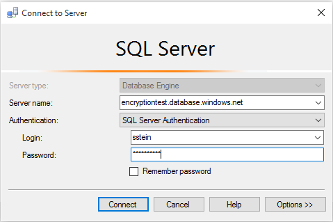

<properties
    pageTitle="Immer verschlüsselt: Schützen Sie vertrauliche Daten in Azure SQL-Datenbank mit Verschlüsselung der Datenbank | Microsoft Azure"
    description="Schützen Sie vertrauliche Daten in einer SQL-Datenbank in Minuten."
    keywords="Daten-Verschlüsselung, Verschlüsselungsschlüssels, Cloud-Verschlüsselung"
    services="sql-database"
    documentationCenter=""
    authors="stevestein"
    manager="jhubbard"
    editor="cgronlun"/>

<tags
    ms.service="sql-database"
    ms.workload="data-management"
    ms.tgt_pltfrm="na"
    ms.devlang="na"
    ms.topic="article"
    ms.date="07/18/2016"
    ms.author="sstein"/>

# Immer verschlüsselt: Schützen Sie vertrauliche Daten in SQL-Datenbank und speichern Sie Ihrer Schlüssel für die Verschlüsselung Azure-Taste Tresor

> [AZURE.SELECTOR]
- [Azure Key Tresor](sql-database-always-encrypted-azure-key-vault.md)
- [Zertifikat-Windows store](sql-database-always-encrypted.md)

In diesem Artikel wird gezeigt, wie vertrauliche Daten in einer SQL-Datenbank mit Daten-Verschlüsselung mit dem [Assistenten immer verschlüsselt](https://msdn.microsoft.com/library/mt459280.aspx) in [SQL Server Management Studio (SSMS)](https://msdn.microsoft.com/library/hh213248.aspx)gesichert werden kann. Darüber hinaus Anweisungen, die zeigen, wie Sie jede Verschlüsselungsschlüssels in Azure-Taste Tresor gespeichert werden.

Verschlüsselte ist immer eine neue Daten Verschlüsselung Technologie in Azure SQL-Datenbank und SQL Server, mit die Schutz statischer vertrauliche Daten auf dem Server, während der Bewegung zwischen Client und Server, und während die Daten verwendet werden. Verschlüsselte ist immer sichergestellt, dass vertrauliche Daten nie als nur-Text innerhalb der Datenbanksystem angezeigt wird. Nachdem Sie Daten Verschlüsselung konfiguriert haben, können nur Clientanwendungen oder app-Servern mit Zugriff auf die Schlüssel nur-Text-Daten zugreifen. Ausführliche Informationen finden Sie unter [Immer verschlüsselt (Datenbankmodul)](https://msdn.microsoft.com/library/mt163865.aspx).

Nachdem Sie die Datenbank für immer verschlüsselt konfiguriert haben, erstellen Sie eine Clientanwendung in c# mit Visual Studio für die Arbeit mit der verschlüsselten Daten.

Informationen Sie zum Einrichten von immer verschlüsselt für eine SQL Azure-Datenbank, und führen Sie die Schritte in diesem Artikel. In diesem Artikel erfahren Sie, wie Sie die folgenden Aufgaben ausführen:

- Mithilfe des Assistenten immer verschlüsselt in SSMS [um immer verschlüsselt Tasten](https://msdn.microsoft.com/library/mt163865.aspx#Anchor_3)zu erstellen.
    - Erstellen Sie eine [Spalte Master Key (CMK)](https://msdn.microsoft.com/library/mt146393.aspx).
    - Erstellen eines [Verschlüsselungsschlüssels für Spalte (CEK)](https://msdn.microsoft.com/library/mt146372.aspx).
- Erstellen einer Datenbanktabelle und verschlüsseln Spalten.
- Erstellen Sie eine Anwendung, die fügt, markiert, und zeigt die Daten aus der verschlüsselten Spalten an.

## Erforderliche Komponenten

In diesem Lernprogramm verwenden müssen Sie:

- Ein Azure-Konto und Ihr Abonnement. Wenn Sie eine, melden Sie sich für eine [kostenlose Testversion](https://azure.microsoft.com/pricing/free-trial/)besitzen.
- [SQL Server Management Studio](https://msdn.microsoft.com/library/mt238290.aspx) Version 13.0.700.242 oder höher.
- [.NET Framework 4.6](https://msdn.microsoft.com/library/w0x726c2.aspx) oder höher (auf dem Clientcomputer).
- [Visual Studio](https://www.visualstudio.com/downloads/download-visual-studio-vs.aspx).
- [Azure PowerShell](../powershell-install-configure.md), Version 1.0 oder höher. Typ **(Get-Modul Azure - ListAvailable). Version** sehen, welche Version von PowerShell Sie ausgeführt werden.

## Aktivieren der Clientanwendung auf den Dienst SQL-Datenbank zuzugreifen

Sie müssen Ihre Clientanwendung zum Einrichten der erforderlichen Authentifizierung und beim Abrufen der *ClientId* und *geheim* , für die Authentifizierung Ihrer Anwendungs in den folgenden Code werden den SQL-Datenbank-Dienst zugreifen aktivieren.

1. Öffnen Sie das [Azure klassischen-Portal](http://manage.windowsazure.com)an.
2. Wählen Sie aus **Active Directory** , und klicken Sie auf die Active Directory-Instanz, die der Anwendung verwendet wird.
3. Klicken Sie auf **Anwendungen**, und klicken Sie dann auf **Hinzufügen**.
4. Geben Sie einen Namen für die Anwendung (zum Beispiel: *MyClientApp*), wählen Sie **WEB-Anwendung**, und klicken Sie auf den Pfeil, um den Vorgang fortzusetzen.
5. Für das **Signieren-an-URL** und die **APP-ID-URI** können geben einen gültigen URL (beispielsweise *http://myClientApp*) und fortsetzen.
6. Klicken Sie auf **Konfigurieren**.
7. Kopieren Sie Ihre **Kunden-ID**an. (Wird dieser Wert im Code später erforderlich.)
8. Wählen Sie im Abschnitt **Tasten** **1 Jahr** aus der Dropdownliste **Wählen Sie eine Dauer** ein. (Die Taste kopieren Sie nach dem Speichern in Schritt 14.)
11. Führen Sie einen Bildlauf nach unten, und klicken Sie auf **Anwendung hinzufügen**.
12. Belassen Sie **Anzeigen** zu **Microsoft-Apps** , und wählen Sie **Microsoft Azure Servicemanagement**. Klicken Sie auf das Häkchen, um den Vorgang fortzusetzen.
13. Wählen Sie aus der Dropdownliste **Berechtigungen delegiert** **Access Azure Servicemanagement** aus.
14. Klicken Sie auf **Speichern**.
15. Kopieren Sie den Schlüsselwert im Abschnitt **Tasten** ein, nach dem Beendigung speichern. (Wird dieser Wert im Code später erforderlich.)

## Erstellen eines Key Tresor zum Speichern Ihrer Schlüssel

Jetzt, da Ihre app Client konfiguriert ist, und Sie haben Ihre Kunden-ID, ist es Zeit, erstellen ein Key Tresor und deren Zugriffsrichtlinie konfigurieren, damit Sie und Ihre Anwendung die Tresor des geheimen Daten (die immer verschlüsselt Schlüssel) zugreifen können. Die Berechtigungen *Erstellen*, *Abrufen*, *Liste*, *Melden Sie sich*, *Stellen Sie sicher*, *WrapKey*und *UnwrapKey* sind für das Erstellen eines neuen Spalte Master Schlüssels und zum Einrichten von Verschlüsselung mit SQL Server Management Studio erforderlich.

Sie können schnell ein Key Tresor durch Ausführen der folgenden Skripts erstellen. Eine ausführliche Erläuterung von dieser Cmdlets und Weitere Informationen zum Erstellen und Konfigurieren einer Key Tresor finden Sie unter [Erste Schritte mit Azure Schlüssel Tresor](../Key-Vault/key-vault-get-started.md).

    $subscriptionName = '<your Azure subscription name>'
    $userPrincipalName = '<username@domain.com>'
    $clientId = '<client ID that you copied in step 7 above>'
    $resourceGroupName = '<resource group name>'
    $location = '<datacenter location>'
    $vaultName = 'AeKeyVault'

    Login-AzureRmAccount
    $subscriptionId = (Get-AzureRmSubscription -SubscriptionName $subscriptionName).SubscriptionId
    Set-AzureRmContext -SubscriptionId $subscriptionId

    New-AzureRmResourceGroup –Name $resourceGroupName –Location $location
    New-AzureRmKeyVault -VaultName $vaultName -ResourceGroupName $resourceGroupName -Location $location

    Set-AzureRmKeyVaultAccessPolicy -VaultName $vaultName -ResourceGroupName $resourceGroupName -PermissionsToKeys create,get,wrapKey,unwrapKey,sign,verify,list -UserPrincipalName $userPrincipalName
    Set-AzureRmKeyVaultAccessPolicy  -VaultName $vaultName  -ResourceGroupName $resourceGroupName -ServicePrincipalName $clientId -PermissionsToKeys get,wrapKey,unwrapKey,sign,verify,list

## Erstellen Sie eine leere SQL-Datenbank
1. Melden Sie sich mit dem [Azure-Portal](https://portal.azure.com/)aus.
2. Wechseln Sie zu der **neuen** > **Daten + Speicher** > **SQL-Datenbank**.
3. Erstellen Sie eine **leere** Datenbank mit dem Namen **des Technologieüberblicks** auf einem neuen oder vorhandenen Server. Detaillierte Anweisungen zum Erstellen einer Datenbank im Azure-Portal finden Sie unter [Erstellen einer SQL-Datenbank in Minuten](sql-database-get-started.md).

    

Sie benötigen die Verbindung später im Lernprogramm Zeichenfolge, also nachdem Sie die Datenbank erstellt haben, navigieren Sie zu der neuen Technologieüberblick Datenbank, und kopieren Sie die Verbindungszeichenfolge. Sie können die Verbindungszeichenfolge zu einem beliebigen Zeitpunkt abrufen, aber es ist einfach, um ihn in der Azure-Portal zu kopieren.

1. Wechseln Sie zu der **SQL-Datenbanken** > **Technologieüberblick** > **Datenbank Verbindungszeichenfolgen anzeigen**.
2. Kopieren Sie die Verbindungszeichenfolge für **ADO.NET**.

    

## Verbinden Sie mit der Datenbank mit SSMS

Öffnen Sie SSMS und auf dem Server mit der Datenbank Technologieüberblick verbinden.

1. SSMS zu öffnen. (Wechseln Sie zu **Verbinden** > **-Datenbankmodul** an, das **mit Server verbinden** -Fenster zu öffnen, wenn er nicht geöffnet ist.)
2. Geben Sie Ihren Servernamen und die Anmeldeinformationen ein. Der Servernamen finden Sie in der SQL-Datenbank Blade und in der Verbindungszeichenfolge Sie zuvor kopiert haben. Geben Sie den vollständigen Servernamen ein, einschließlich *database.windows.net*.

    

Wenn das **Neue Firewall-Regel** -Fenster geöffnet wird, melden Sie sich bei Azure und Erstellen einer neuen Firewallregel für Sie SSMS lassen.

## Erstellen einer Tabelle

In diesem Abschnitt erstellen Sie eine Tabelle Patienten Daten aufnehmen soll. Es ist nicht ursprünglich verschlüsselt – konfigurieren Sie Verschlüsselung im nächsten Abschnitt.

1. Erweitern Sie **Datenbanken**aus.
1. Mit der rechten Maustaste in der Datenbank **Technologieüberblick** , und klicken Sie auf **Neue Abfrage**.
2. Die neue Abfragefenster und **Ausführen** der folgenden Transact-SQL (T-SQL) fügen sie.

        CREATE TABLE [dbo].[Patients](
         [PatientId] [int] IDENTITY(1,1),
         [SSN] [char](11) NOT NULL,
         [FirstName] [nvarchar](50) NULL,
         [LastName] [nvarchar](50) NULL,
         [MiddleName] [nvarchar](50) NULL,
         [StreetAddress] [nvarchar](50) NULL,
         [City] [nvarchar](50) NULL,
         [ZipCode] [char](5) NULL,
         [State] [char](2) NULL,
         [BirthDate] [date] NOT NULL
         PRIMARY KEY CLUSTERED ([PatientId] ASC) ON [PRIMARY] );
         GO

## Verschlüsseln von Spalten (immer verschlüsselt konfigurieren)

SSMS bietet einen Assistenten, der Sie ganz einfach immer verschlüsselt durch das Einrichten der Spalte Master-Taste, Verschlüsselungsschlüssels für Spalte und verschlüsselten Spalten für Sie konfigurieren können.

1. Erweitern Sie **Datenbanken** > **Technologieüberblick** > **Tabellen**.
2. Mit der rechten Maustaste in der Tabelle **an** , und wählen Sie **Spalten verschlüsseln** , um den Assistenten immer verschlüsselt zu öffnen:

    

Der Assistent immer verschlüsselt enthält, in den folgenden Abschnitten: **Auswahl einer Spalte**, die **Master Key-Konfiguration**, **Prüfung**und **Zusammenfassung**.

### Auswahl einer Spalte##

Klicken Sie auf der Seite **Einführung** zum Öffnen der **Ausgewählten Spalte** Seite auf **Weiter** . Auf dieser Seite, wählen Sie die Spalten zu verschlüsseln, [den Typ der Verschlüsselung, und welche Verschlüsselungsschlüssels Spalte (CEK)](https://msdn.microsoft.com/library/mt459280.aspx#Anchor_2) verwenden.

Verschlüsseln Sie **Versicherungsnummer** und **Geburtsdatum** Informationen für die einzelnen Patienten an. Die Spalte Versicherungsnummer wird deterministisch Verschlüsselung, verwendet unterstützt Gleichheit Suchvorgänge, Verknüpfungen und Gruppieren nach. Die BirthDate-Spalte wird zufällige Verschlüsselung, verwenden Sie die Vorgänge nicht unterstützt.

Legen Sie den **Typ der Verschlüsselung** für die Spalte Versicherungsnummer auf **deterministische** und die Spalte Geburtsdatum **Randomized**ein. Klicken Sie auf **Weiter**.

### Master Key-Konfiguration###

Die Seite **Master Key Konfiguration** ist, wo Sie Ihre CMK einrichten, und wählen Sie die Taste Store aus, in dem die CMK gespeichert werden. Derzeit können Sie eine CMK in Windows Store Zertifikat, Azure-Taste Tresor oder einem Hardwaresicherheitsmodul (HSM) speichern.

In diesem Lernprogramm erfahren, wie Ihre Tasten in Azure-Taste Tresor gespeichert.

1.     Wählen Sie aus **Azure Key Tresor**.
1.     Wählen Sie die gewünschte Key Tresor aus der Dropdownliste aus.
1.     Klicken Sie auf **Weiter**.

### Überprüfung###

Verschlüsseln jetzt die Spalten oder speichern ein PowerShell-Skripts zu einem späteren Zeitpunkt ausführen können. In diesem Lernprogramm wählen Sie **Weiter zu jetzt fertig stellen** aus, und klicken Sie auf **Weiter**.

### Zusammenfassung ###

Stellen Sie sicher, dass die Einstellungen sind alle korrigieren, und klicken Sie auf **Fertig stellen** , um die Einrichtung für immer verschlüsselt abzuschließen.

### Überprüfen des Assistenten Aktionen

Nachdem der Assistent abgeschlossen ist, wird die Datenbank für immer verschlüsselt festgelegt. Der Assistent ausgeführt, die folgenden Aktionen aus:

- Erstellt eine Spalte Master-Taste, und es in Azure-Taste Tresor gespeichert.
- Erstellt eine Spalte Verschlüsselungsschlüssels und Azure-Taste Tresor Kehrmatrix.
- So konfiguriert, dass die ausgewählten Spalten für die Verschlüsselung. Tabelle Patienten hat aktuell keine Daten, aber alle vorhandenen Daten in den ausgewählten Spalten ist nun verschlüsselt.

Sie können die Erstellung der Schlüssel in SSMS überprüfen, indem Sie erweitern **Technologieüberblick** > **Sicherheit** > **Tasten immer verschlüsselt**.

## Erstellen einer Clientanwendung, mit die die verschlüsselten Daten zusammenarbeitet

Jetzt, da immer verschlüsselt eingerichtet haben, können Sie eine Anwendung erstellen, die *fügt* und *markiert* die verschlüsselten Spalten durchführt.  

> [AZURE.IMPORTANT] Wenn nur-Text-Daten auf dem Server mit Spalten immer verschlüsselt übergeben, muss die Anwendung [SqlParameter](https://msdn.microsoft.com/library/system.data.sqlclient.sqlparameter.aspx) Objekte verwenden. Übergeben Literale Werten ohne SqlParameter Objekte ergibt in eine Ausnahme.

1. Öffnen Sie Visual Studio und Erstellen einer neuen c# Console-Anwendung. Stellen Sie sicher, dass Ihr Projekt auf **.NET Framework 4.6** oder höher festgelegt ist.
2. Nennen Sie das Projekt **AlwaysEncryptedConsoleAKVApp** , und klicken Sie auf **OK**.

3. Installieren Sie die folgenden NuGet Pakete **Tools**Anzeigebereich durch > **NuGet Package Manager** > **Paket-Manager-Konsole**.

Führen Sie diese beiden Codezeilen in der Paket-Manager-Verwaltungskonsole.

    Install-Package Microsoft.SqlServer.Management.AlwaysEncrypted.AzureKeyVaultProvider
    Install-Package Microsoft.IdentityModel.Clients.ActiveDirectory

## Ändern der Verbindungszeichenfolge so, dass immer verschlüsselt aktivieren

In diesem Abschnitt wird erläutert, wie immer verschlüsselt in Ihrer Datenbank-Verbindungszeichenfolge aktivieren.

Wenn immer verschlüsselt aktivieren möchten, müssen Sie die Verbindungszeichenfolge das Schlüsselwort **Spalte Verschlüsselung Einstellung** hinzu, und legen Sie ihn auf **aktiviert**.

Sie können dies direkt in der Verbindungszeichenfolge festlegen, oder Sie können mithilfe von [SqlConnectionStringBuilder](https://msdn.microsoft.com/library/system.data.sqlclient.sqlconnectionstringbuilder.aspx)festlegen. Die Anwendung Stichprobe im nächsten Abschnitt wird gezeigt, wie **SqlConnectionStringBuilder**verwenden.

### Aktivieren Sie immer verschlüsselt in der Verbindungszeichenfolge

Fügen Sie das folgende Schlüsselwort in der Verbindungszeichenfolge.

    Column Encryption Setting=Enabled

### Aktivieren Sie immer mit SqlConnectionStringBuilder verschlüsselt

Im folgende Code veranschaulicht, wie immer verschlüsselt aktivieren, indem Sie die Einstellung [SqlConnectionStringBuilder.ColumnEncryptionSetting](https://msdn.microsoft.com/library/system.data.sqlclient.sqlconnectionstringbuilder.columnencryptionsetting.aspx) [aktiviert](https://msdn.microsoft.com/library/system.data.sqlclient.sqlconnectioncolumnencryptionsetting.aspx).

    // Instantiate a SqlConnectionStringBuilder.
    SqlConnectionStringBuilder connStringBuilder =
       new SqlConnectionStringBuilder("replace with your connection string");

    // Enable Always Encrypted.
    connStringBuilder.ColumnEncryptionSetting =
       SqlConnectionColumnEncryptionSetting.Enabled;

## Registrieren Sie sich den Azure-Taste Tresor-Anbieter

Im folgende Code veranschaulicht, wie den Azure-Taste Tresor Provider mit dem ADO.NET-Treiber zu registrieren.

    private static ClientCredential _clientCredential;

    static void InitializeAzureKeyVaultProvider()
    {
       _clientCredential = new ClientCredential(clientId, clientSecret);

       SqlColumnEncryptionAzureKeyVaultProvider azureKeyVaultProvider =
          new SqlColumnEncryptionAzureKeyVaultProvider(GetToken);

       Dictionary<string, SqlColumnEncryptionKeyStoreProvider> providers =
          new Dictionary<string, SqlColumnEncryptionKeyStoreProvider>();

       providers.Add(SqlColumnEncryptionAzureKeyVaultProvider.ProviderName, azureKeyVaultProvider);
       SqlConnection.RegisterColumnEncryptionKeyStoreProviders(providers);
    }

## Immer verschlüsselte Beispiel Console-Anwendung

In diesem Beispiel wird veranschaulicht, wie Sie:

- Ändern der Verbindungszeichenfolge so, dass immer verschlüsselt aktivieren.
- Registrieren Sie Azure-Taste Tresor als der Anwendung Key Store Anbieter.  
- Einfügen von Daten in der verschlüsselten Spalten.
- Wählen Sie einen Datensatz durch Filtern nach einem bestimmten Wert in einer verschlüsselten Spalte ein.

Ersetzen Sie den Inhalt von **"Program.cs"** mit den folgenden Code ein. Ersetzen Sie die Verbindungszeichenfolge für die globale ConnectionString Variable in der Zeile, die die Main-Methode mit Ihrer gültige Verbindungszeichenfolge aus dem Azure-Portal direkt vorangestellt ist. Dies ist der einzige Änderung, die Sie an diesem Code vornehmen müssen.

Führen Sie die app, um die Aktion immer verschlüsselt angezeigt werden.

    using System;
    using System.Collections.Generic;
    using System.Linq;
    using System.Text;
    using System.Threading.Tasks;
    using System.Data;
    using System.Data.SqlClient;
    using Microsoft.IdentityModel.Clients.ActiveDirectory;
    using Microsoft.SqlServer.Management.AlwaysEncrypted.AzureKeyVaultProvider;

    namespace AlwaysEncryptedConsoleAKVApp
    {
    class Program
    {
        // Update this line with your Clinic database connection string from the Azure portal.
        static string connectionString = @"<connection string from the portal>";
        static string clientId = @"<client id from step 7 above>";
        static string clientSecret = "<key from step 13 above>";

        static void Main(string[] args)
        {
            InitializeAzureKeyVaultProvider();

            Console.WriteLine("Signed in as: " + _clientCredential.ClientId);

            Console.WriteLine("Original connection string copied from the Azure portal:");
            Console.WriteLine(connectionString);

            // Create a SqlConnectionStringBuilder.
            SqlConnectionStringBuilder connStringBuilder =
                new SqlConnectionStringBuilder(connectionString);

            // Enable Always Encrypted for the connection.
            // This is the only change specific to Always Encrypted
            connStringBuilder.ColumnEncryptionSetting =
                SqlConnectionColumnEncryptionSetting.Enabled;

            Console.WriteLine(Environment.NewLine + "Updated connection string with Always Encrypted enabled:");
            Console.WriteLine(connStringBuilder.ConnectionString);

            // Update the connection string with a password supplied at runtime.
            Console.WriteLine(Environment.NewLine + "Enter server password:");
            connStringBuilder.Password = Console.ReadLine();

            // Assign the updated connection string to our global variable.
            connectionString = connStringBuilder.ConnectionString;

            // Delete all records to restart this demo app.
            ResetPatientsTable();

            // Add sample data to the Patients table.
            Console.Write(Environment.NewLine + "Adding sample patient data to the database...");

            InsertPatient(new Patient()
            {
                SSN = "999-99-0001",
                FirstName = "Orlando",
                LastName = "Gee",
                BirthDate = DateTime.Parse("01/04/1964")
            });
            InsertPatient(new Patient()
            {
                SSN = "999-99-0002",
                FirstName = "Keith",
                LastName = "Harris",
                BirthDate = DateTime.Parse("06/20/1977")
            });
            InsertPatient(new Patient()
            {
                SSN = "999-99-0003",
                FirstName = "Donna",
                LastName = "Carreras",
                BirthDate = DateTime.Parse("02/09/1973")
            });
            InsertPatient(new Patient()
            {
                SSN = "999-99-0004",
                FirstName = "Janet",
                LastName = "Gates",
                BirthDate = DateTime.Parse("08/31/1985")
            });
            InsertPatient(new Patient()
            {
                SSN = "999-99-0005",
                FirstName = "Lucy",
                LastName = "Harrington",
                BirthDate = DateTime.Parse("05/06/1993")
            });

            // Fetch and display all patients.
            Console.WriteLine(Environment.NewLine + "All the records currently in the Patients table:");

            foreach (Patient patient in SelectAllPatients())
            {
                Console.WriteLine(patient.FirstName + " " + patient.LastName + "\tSSN: " + patient.SSN + "\tBirthdate: " + patient.BirthDate);
            }

            // Get patients by SSN.
            Console.WriteLine(Environment.NewLine + "Now lets locate records by searching the encrypted SSN column.");

            string ssn;

            // This very simple validation only checks that the user entered 11 characters.
            // In production be sure to check all user input and use the best validation for your specific application.
            do
            {
                Console.WriteLine("Please enter a valid SSN (ex. 999-99-0003):");
                ssn = Console.ReadLine();
            } while (ssn.Length != 11);

            // The example allows duplicate SSN entries so we will return all records
            // that match the provided value and store the results in selectedPatients.
            Patient selectedPatient = SelectPatientBySSN(ssn);

            // Check if any records were returned and display our query results.
            if (selectedPatient != null)
            {
                Console.WriteLine("Patient found with SSN = " + ssn);
                Console.WriteLine(selectedPatient.FirstName + " " + selectedPatient.LastName + "\tSSN: "
                    + selectedPatient.SSN + "\tBirthdate: " + selectedPatient.BirthDate);
            }
            else
            {
                Console.WriteLine("No patients found with SSN = " + ssn);
            }

            Console.WriteLine("Press Enter to exit...");
            Console.ReadLine();
        }

        private static ClientCredential _clientCredential;

        static void InitializeAzureKeyVaultProvider()
        {

            _clientCredential = new ClientCredential(clientId, clientSecret);

            SqlColumnEncryptionAzureKeyVaultProvider azureKeyVaultProvider =
              new SqlColumnEncryptionAzureKeyVaultProvider(GetToken);

            Dictionary<string, SqlColumnEncryptionKeyStoreProvider> providers =
              new Dictionary<string, SqlColumnEncryptionKeyStoreProvider>();

            providers.Add(SqlColumnEncryptionAzureKeyVaultProvider.ProviderName, azureKeyVaultProvider);
            SqlConnection.RegisterColumnEncryptionKeyStoreProviders(providers);
        }

        public async static Task<string> GetToken(string authority, string resource, string scope)
        {
            var authContext = new AuthenticationContext(authority);
            AuthenticationResult result = await authContext.AcquireTokenAsync(resource, _clientCredential);

            if (result == null)
                throw new InvalidOperationException("Failed to obtain the access token");
            return result.AccessToken;
        }

        static int InsertPatient(Patient newPatient)
        {
            int returnValue = 0;

            string sqlCmdText = @"INSERT INTO [dbo].[Patients] ([SSN], [FirstName], [LastName], [BirthDate])
     VALUES (@SSN, @FirstName, @LastName, @BirthDate);";

            SqlCommand sqlCmd = new SqlCommand(sqlCmdText);

            SqlParameter paramSSN = new SqlParameter(@"@SSN", newPatient.SSN);
            paramSSN.DbType = DbType.AnsiStringFixedLength;
            paramSSN.Direction = ParameterDirection.Input;
            paramSSN.Size = 11;

            SqlParameter paramFirstName = new SqlParameter(@"@FirstName", newPatient.FirstName);
            paramFirstName.DbType = DbType.String;
            paramFirstName.Direction = ParameterDirection.Input;

            SqlParameter paramLastName = new SqlParameter(@"@LastName", newPatient.LastName);
            paramLastName.DbType = DbType.String;
            paramLastName.Direction = ParameterDirection.Input;

            SqlParameter paramBirthDate = new SqlParameter(@"@BirthDate", newPatient.BirthDate);
            paramBirthDate.SqlDbType = SqlDbType.Date;
            paramBirthDate.Direction = ParameterDirection.Input;

            sqlCmd.Parameters.Add(paramSSN);
            sqlCmd.Parameters.Add(paramFirstName);
            sqlCmd.Parameters.Add(paramLastName);
            sqlCmd.Parameters.Add(paramBirthDate);

            using (sqlCmd.Connection = new SqlConnection(connectionString))
            {
                try
                {
                    sqlCmd.Connection.Open();
                    sqlCmd.ExecuteNonQuery();
                }
                catch (Exception ex)
                {
                    returnValue = 1;
                    Console.WriteLine("The following error was encountered: ");
                    Console.WriteLine(ex.Message);
                    Console.WriteLine(Environment.NewLine + "Press Enter key to exit");
                    Console.ReadLine();
                    Environment.Exit(0);
                }
            }
            return returnValue;
        }

        static List<Patient> SelectAllPatients()
        {
            List<Patient> patients = new List<Patient>();

            SqlCommand sqlCmd = new SqlCommand(
              "SELECT [SSN], [FirstName], [LastName], [BirthDate] FROM [dbo].[Patients]",
                new SqlConnection(connectionString));

            using (sqlCmd.Connection = new SqlConnection(connectionString))

            using (sqlCmd.Connection = new SqlConnection(connectionString))
            {
                try
                {
                    sqlCmd.Connection.Open();
                    SqlDataReader reader = sqlCmd.ExecuteReader();

                    if (reader.HasRows)
                    {
                        while (reader.Read())
                        {
                            patients.Add(new Patient()
                            {
                                SSN = reader[0].ToString(),
                                FirstName = reader[1].ToString(),
                                LastName = reader["LastName"].ToString(),
                                BirthDate = (DateTime)reader["BirthDate"]
                            });
                        }
                    }
                }
                catch (Exception ex)
                {
                    throw;
                }
            }

            return patients;
        }

        static Patient SelectPatientBySSN(string ssn)
        {
            Patient patient = new Patient();

            SqlCommand sqlCmd = new SqlCommand(
                "SELECT [SSN], [FirstName], [LastName], [BirthDate] FROM [dbo].[Patients] WHERE [SSN]=@SSN",
                new SqlConnection(connectionString));

            SqlParameter paramSSN = new SqlParameter(@"@SSN", ssn);
            paramSSN.DbType = DbType.AnsiStringFixedLength;
            paramSSN.Direction = ParameterDirection.Input;
            paramSSN.Size = 11;

            sqlCmd.Parameters.Add(paramSSN);

            using (sqlCmd.Connection = new SqlConnection(connectionString))
            {
                try
                {
                    sqlCmd.Connection.Open();
                    SqlDataReader reader = sqlCmd.ExecuteReader();

                    if (reader.HasRows)
                    {
                        while (reader.Read())
                        {
                            patient = new Patient()
                            {
                                SSN = reader[0].ToString(),
                                FirstName = reader[1].ToString(),
                                LastName = reader["LastName"].ToString(),
                                BirthDate = (DateTime)reader["BirthDate"]
                            };
                        }
                    }
                    else
                    {
                        patient = null;
                    }
                }
                catch (Exception ex)
                {
                    throw;
                }
            }
            return patient;
        }

        // This method simply deletes all records in the Patients table to reset our demo.
        static int ResetPatientsTable()
        {
            int returnValue = 0;

            SqlCommand sqlCmd = new SqlCommand("DELETE FROM Patients");
            using (sqlCmd.Connection = new SqlConnection(connectionString))
            {
                try
                {
                    sqlCmd.Connection.Open();
                    sqlCmd.ExecuteNonQuery();

                }
                catch (Exception ex)
                {
                    returnValue = 1;
                }
            }
            return returnValue;
        }
    }

    class Patient
    {
        public string SSN { get; set; }
        public string FirstName { get; set; }
        public string LastName { get; set; }
        public DateTime BirthDate { get; set; }
    }
    }

## Stellen Sie sicher, dass die Daten verschlüsselt sind

Sie können schnell überprüfen, dass die tatsächlichen Daten auf dem Server verschlüsselt ist, indem Sie Abfragen von Daten Patienten mit SSMS (über die aktuelle Verbindung, **Spalte Verschlüsselung Einstellung** nicht noch nicht aktiviert ist).

Führen Sie die folgende Abfrage in der Datenbank Technologieüberblick aus.

    SELECT FirstName, LastName, SSN, BirthDate FROM Patients;

Sie können sehen, dass die verschlüsselten Spalten nicht nur-Text-Daten enthalten.

   

Wenn SSMS Zugriff auf die nur-Text-Daten verwenden möchten, können Sie Hinzufügen der *Spalte Verschlüsselung Einstellung = aktiviert* Parameter, um die Verbindung.

1. Klicken Sie im SSMS mit der rechten Maustaste in des Servers unter **Objekt-Explorer** , und wählen Sie **Trennen**.
2. Klicken Sie auf **Verbinden** > **-Datenbankmodul** an, öffnen Sie das Fenster **mit Server verbinden** , und klicken Sie auf **Optionen**.
3. Klicken Sie auf **Weitere Verbindungsparameter** und Typ **Spalte Verschlüsselung Einstellung = aktiviert**.

    

4. Führen Sie die folgende Abfrage in der Datenbank Technologieüberblick.

        SELECT FirstName, LastName, SSN, BirthDate FROM Patients;

     Sie können jetzt im Nur-Text-Daten in den verschlüsselten Spalten anzeigen.

    

## Nächste Schritte
Nachdem Sie eine Datenbank, die immer verschlüsselt verwendet erstellen, sollten Sie die folgenden Aktionen ausführen:

- [Drehen und Ihre Schlüssel Aufräumen](https://msdn.microsoft.com/library/mt607048.aspx).
- [Migrieren von Daten, die bereits mit immer verschlüsselt verschlüsselt sind](https://msdn.microsoft.com/library/mt621539.aspx).

## Weitere Informationen

- [Immer verschlüsselt (Cliententwicklung)](https://msdn.microsoft.com/library/mt147923.aspx)
- [Transparente-Verschlüsselung](https://msdn.microsoft.com/library/bb934049.aspx)
- [SQL Server-Verschlüsselung](https://msdn.microsoft.com/library/bb510663.aspx)
- [Immer verschlüsselte-Assistenten](https://msdn.microsoft.com/library/mt459280.aspx)
- [Immer verschlüsselte blog](http://blogs.msdn.com/b/sqlsecurity/archive/tags/always-encrypted/)
