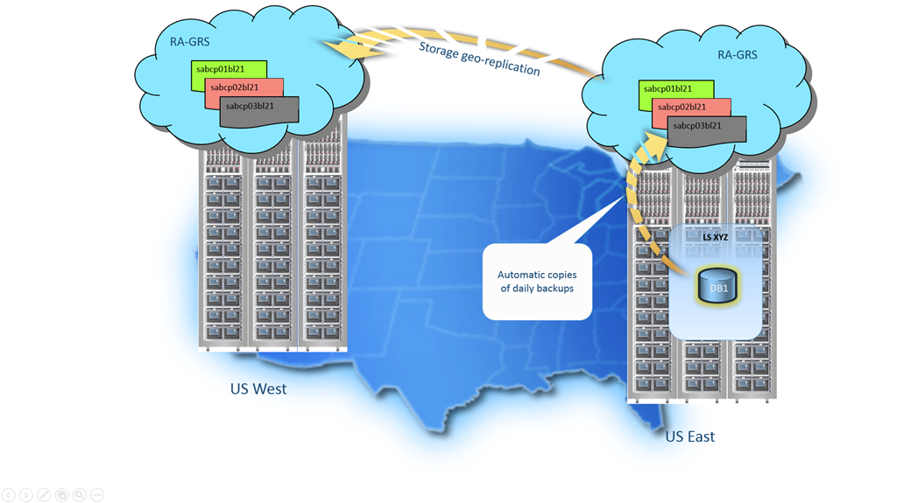

<properties
   pageTitle="SQL-Datenbank Sicherungskopien - automatische, Geo redundante | Microsoft Azure" 
   description="SQL-Datenbank automatisch erstellt eine lokale Sicherung fünf Minuten und verwendet Azure-Lesezugriff Geo redundante Speicher (RAS-GRS) Geo-redundante verwendet werden. "
   services="sql-database"
   documentationCenter=""
   authors="CarlRabeler"
   manager="jhubbard"
   editor="monicar"/>

<tags
   ms.service="sql-database"
   ms.devlang="NA"
   ms.topic="article"
   ms.tgt_pltfrm="NA"
   ms.workload="NA"
   ms.date="10/20/2016"
   ms.author="carlrab;barbkess"/>

<!------------------
This topic is annotated with TEMPLATE guidelines for FEATURE TOPICS.

Metadata guidelines

pageTitle
    60 characters or less. Includes name of the feature - primary benefit. Not the same as H1. Its 60 characters or fewer including all characters between the quotes and the Microsoft Azure site identifier.

description
    115-145 characters. Duplicate of the first sentence in the introduction. This is the abstract of the article that displays under the title when searching in Bing or Google. 

    Example: "SQL Database automatically creates a local database backup every few minutes and uses Azure read-access geo-redundant storage for geo-redundancy."
------------------>

<!----------------

TEMPLATE GUIDELINES for feature topics

The Feature Topic is a one-pager (ok, sometimes longer) that explains a capability of the product or service. It explains what the capability is and characteristics of the capability.  

It is a "learning" topic, not an action topic.

DO explain this:
    • Definition of the feature terminology.  i.e., What is a database backup?
    • Characteristics and capabilities of the feature. (How the feature works)
    • Common uses with links to overview topics that recommend when to use the feature.
    • Reference specifications (Limitations and Restrictions, Permissions, General Remarks, etc.)
    • Next Steps with links to related overviews, features, and tasks.

DON'T explain this:
    • How to steps for using the feature (Tasks)
    • How to solve business problems that incorporate the feature (Overviews)
------------------->

<!------------------
GUIDELINES for the H1 
    
    The H1 should answer the question "What is in this topic?" Write the H1 heading in conversational language and use search key words as much as possible. Since this is a learning topic, make sure the title indicates that and doesn't mislead people to think this will tell them how to do tasks.  
    
    To help people understand this is a learning topic and not an action topic, start the title with "Learn about ... "

    Heading must use an industry standard term. If your feature is a proprietary name like "Elastic database pools", use a synonym. For example:    "Learn about elastic database pools for multi-tenant databases". In this case multi-tenant database is the industry-standard term that will be an anchor for finding the topic.

-------------------->

# Erfahren Sie mehr über Sicherungskopien SQL-Datenbank

<!------------------
    GUIDELINES for introduction
    
    The introduction is 1-2 sentences.  It is optimized for search and sets proper expectations about what to expect in the article. It should contain the top key words that you are using throughout the article.The introduction should be brief and to the point of what the feature is, what it is used for, and what's in the article. 

    If the introduction is short enough, your article can pop to the top in Google Instant Answers.

    In this example:
    
 

Sentence #1 Explains what the article will cover, which is what the feature is or does. This is also the metadata description. 
    SQL Database automatically creates a local database backup every five minutes and uses Azure read-access geo-redundant storage (RA-GRS) to provide geo-redundancy. 

Sentence #2 Explains why I should care about this.  
    Database backups are an essential part of any business continuity and disaster recovery strategy because they protect your data from accidental corruption or deletion.

-------------------->

SQL-Datenbank automatisch erstellt eine lokale Sicherung alle paar Minuten und Azure-Lesezugriff Geo redundante Speicher Geo-Redundanzgründen verwendet. Datenbanksicherungskopien sind ein wesentlicher Bestandteil jeder Strategie Business Continuity- und Disaster Wiederherstellung, da Ihre Daten aus unbeabsichtigtes Beschädigung oder Löschung zu schützen. 

<!-- This image needs work, so not putting it in right now.

This diagram shows SQL Database running in the US East region. It creates a database backup every five minutes, which it stores locally to Azure Read Access Geo-redundant Storage (RA-GRS). Azure uses geo-replication to copy the database backups to a paired data center in the US West region.

-->

<!---------------
GUIDELINES for the first ## H2.

    The first ## describes what the feature encompasses and how it is used. It points to related task articles.
    
    For consistency, being the heading with "What is ... "
----------------->

## Was ist eine Sicherungskopie der SQL-Datenbank?  

<!-- 
    Explains what a SQL Database backup is and answers an important question that people want to know.
-->

Eine Sicherungskopie der SQL-Datenbank enthält sowohl lokale Datenbank und Geo redundante Sicherungen. Diese Sicherungskopien werden automatisch und ohne zusätzliche Kosten erstellt. Sie brauchen nichts Unternehmen, um sie auftreten können.

<!----------------- 
    Explains first component of the backup feature
------------------>

Für lokale datensicherungen verwendet SQL-Datenbank SQL Server-Technologie, um die [vollständige](https://msdn.microsoft.com/library/ms186289.aspx), [Differenz](https://msdn.microsoft.com/library/ms175526.aspx )und [Transaktionslog](https://msdn.microsoft.com/library/ms191429.aspx) Sicherungskopien erstellen. Die Transaktion Log Sicherungen erfolgen alle fünf Minuten, wodurch Sie eine Point-in-Time wiederherstellen auf dem gleichen Server ausführen, der die Datenbank hostet. Wenn Sie eine Datenbank wiederherstellen, ermittelt der Dienst dem vollständigen, Differenz und Transaktion sich anmelden Sicherungskopien wiederhergestellt werden müssen.

<!--------------- 
    Explicit list of what to do with a local backup. "Use a ..." helps people to scan the topic and find the uses quickly.
---------------->

Verwenden Sie eine lokale Datenbank sichern in:

- Wiederherstellen einer Datenbank in eine Zeitangabe Punkt innerhalb der Aufbewahrungszeitraum an. Mit einer Sicherungskopie der Datenbank können Sie Wiederherstellen einer Datenbank in eine Zeitangabe Punkt, eine gelöschte Datenbank wiederherstellen, um die Zeit, die es wurde gelöscht oder Wiederherstellen einer Datenbank auf einem anderen geografische Region. Wenn Sie eine Wiederherstellung durchführen zu können, finden Sie unter [Wiederherstellen einer Datenbank aus einer Sicherungskopie der Datenbank](sql-database-recovery-using-backups.md).

- Kopieren einer Datenbank mit einem SQLServer in der gleichen oder einem anderen Region. Die Kopie ist überführen konsistent mit der aktuellen SQL-Datenbank. Um eine Kopie ausführen zu können, finden Sie unter [Datenbank kopieren](sql-database-copy.md).

- Archivieren Sie eine Sicherungskopie der Datenbank über die Sicherung Aufbewahrungszeitraum an. Um ein Archiv und Datei [Exportieren eine SQL-Datenbank auf einem BACPAC](sql-database-export.md) ausgeführt werden. Dann können Sie die BACPAC zu langfristiges Speicher archivieren und außerhalb Ihrer Aufbewahrungszeitraum zu speichern. Oder verwenden Sie die BACPAC, um eine Kopie der Datenbank in SQL Server, entweder lokal oder in einer Azure-virtuellen Computern (virtueller Computer) übertragen.

<!----------------- 
    Explains first component of the backup feature
------------------>

Nach Geo redundante Sicherungskopien verwendet SQL-Datenbank [Replikation Azure-Speicher](../storage/storage-redundancy.md). SQL-Datenbank speichert die lokale Datenbanksicherungsdateien in einem Konto [Lesezugriff Geo redundante Speicher (RAS-GRS)](../storage/storage-redundancy.md#read-access-geo-redundant-storage) . Azure repliziert die Sicherungsdateien eines [gepaarten Datacenter](../best-practices-availability-paired-regions.md). 

<!--------------- 
    Explicit list of what to do with a geo-redundant backup. "Use a ..." helps people to scan the topic and find the uses quickly.
---------------->

Verwenden einer Geo redundante Sicherung auf:

- Wiederherstellen einer Datenbank in ein anderes geografische Region ein, für den Fall, dass Sie die Sicherungskopie der Datenbank von Ihrem primären Datenbankregion zugreifen können. 

>[AZURE.NOTE] In Azure-Speicher bezieht sich der Ausdruck *Replikation* zum Kopieren von Dateien von einem Ort zu einem anderen ein. Der SQL- *Datenbankreplikation* bezieht sich auf planmäßigen auf mehrere sekundäre Datenbanken mit einer primären Datenbank synchronisiert. 

<!----------------
    The next ## H2's discuss key characteristics of how the feature works. The title is in conversational language and asks the question that will be answered.
------------------->
## Wie viel Speicherplatz Sicherung kostenlos einbezogen werden?

SQL-Datenbank bietet bis zu 200 % Ihrer Speicherkapazität maximale bereitgestellte Datenbank als Sicherung Speicher ohne zusätzliche Kosten. Beispielsweise, wenn Sie eine Instanz Standard DB mit einer bereitgestellte DB Größe von 250 GB haben, müssen Sie 500 GB zusätzliche Speicherkapazität kostenlos. Wenn die Datenbank den bereitgestellten Sicherung Speicher überschreitet, können Sie auswählen, den Aufbewahrungszeitraum durch Kontaktieren des Supports Azure zu verringern. Eine weitere Möglichkeit besteht darin zusätzliche Sicherung Speicher bezahlen, die mit dem Standardsatz Lesezugriff geografischen redundante Speicherung (RAS-GRS) in Rechnung gestellt. 

## Wie oft geschehen Sicherungskopien?

Für lokale Datenbanksicherungskopien geschehen, vollständige Datenbanksicherungskopien wöchentlich, Differenz Datenbank Sicherungen erfolgen stündlich und Transaktion melden Sie sich, die Sicherungskopien fünf Minuten erfolgen. Unmittelbar nach eine Datenbank erstellt wurde, wird die erste vollständige Sicherung geplant. Normalerweise innerhalb von 30 Minuten abgeschlossen ist, jedoch können länger dauern, wenn die Datenbank großem Umfang ist. Beispielsweise kann die ursprüngliche Sicherung auf eine wiederhergestellte Datenbank oder eine Datenbankkopie länger dauern. Nach der ersten vollständigen Sicherung werden alle Weitere Sicherungskopien automatisch geplant und im Hintergrund im Hintergrund verwaltet. Die genaue Anzeigedauer vollständigen und [Differenz](https://msdn.microsoft.com/library/ms175526.aspx) Datenbanksicherungskopien wird bestimmt, wie sie die Arbeitsbelastung für insgesamt System Salden. 

Nach Geo redundante Sicherungskopien werden vollständige und Differenz Sicherungskopien planmäßig Replikation Azure-Speicher kopiert.

## Wie lange behalten Sie meine Sicherungskopien?

Jede Sicherung SQL-Datenbank weist einen Aufbewahrungszeitraum an, der auf den [Dienst Ebene](sql-database-service-tiers.md) der Datenbank basiert. Der Aufbewahrungszeitraum für eine Datenbank in der:

<!------------------

    Using a list so the information is easy to find when scanning.
------------------->

- Standard-Ebene ist sieben Tage.
- Standard-Service-Ebene ist 35 Tagen.
- Premium Service Ebene ist 35 Tagen.

Wenn Sie die Datenbank aus der Standard oder Premium Service Ebenen mit grundlegenden Downgrade vornehmen, werden die Sicherungskopien sieben Tage lang gespeichert. Alle vorhandene Sicherungskopien, die älter als sieben Tage sind nicht mehr verfügbar. 

Wenn Sie die Datenbank von der Standard-Ebene in Standard oder Premium aktualisieren, behält SQL-Datenbank vorhandene Sicherungskopien, bis sie 35 Tage alt sind. Neue Sicherungskopien behält, wie sie für 35 Tagen auftreten.
 
Wenn Sie eine Datenbank löschen, behält SQL-Datenbank die Sicherungskopien auf die gleiche Weise, die es für eine online-Datenbank auch machen würden. Nehmen Sie beispielsweise an, dass Sie eine einfache Datenbank löschen, die einen Aufbewahrungszeitraum von sieben Tagen enthält. Eine Sicherung, die vier Tage alt ist ist für drei weitere Tage gespeichert.

>[AZURE.IMPORTANT]
    Wenn Sie dem SQL Azure-Server, hostet SQL-Datenbanken löschen, werden alle Datenbanken, die auf dem Server gehören ebenfalls gelöscht werden und nicht wiederhergestellt werden. Sie können keine Wiederherstellen eines gelöschten Servers.

<!-------------------
OPTIONAL section
## Best practices 
--------------------->

<!-------------------
OPTIONAL section
## General remarks
--------------------->

<!-------------------
OPTIONAL section
## Limitations and restrictions
--------------------->

<!-------------------
OPTIONAL section
## Metadata
--------------------->

<!-------------------
OPTIONAL section
## Performance
--------------------->

<!-------------------
OPTIONAL section
## Permissions
--------------------->

<!-------------------
OPTIONAL section
## Security
--------------------->

<!-------------------
GUIDELINES for Next Steps

    The last section is Next Steps. Give a next step that would be relevant to the customer after they have learned about the feature and the tasks associated with it.  Perhaps point them to one or two key scenarios that use this feature.

    You don't need to repeat links you have already given them.
--------------------->

## Nächste Schritte

Datenbanksicherungskopien sind ein wesentlicher Bestandteil jeder Strategie Business Continuity- und Disaster Wiederherstellung, da Ihre Daten aus unbeabsichtigtes Beschädigung oder Löschung zu schützen. Sehen wie das Sichern von Datenbanken in eine breitere Strategie, finden Sie unter [Übersicht über die Business Continuity](sql-database-business-continuity.md).

