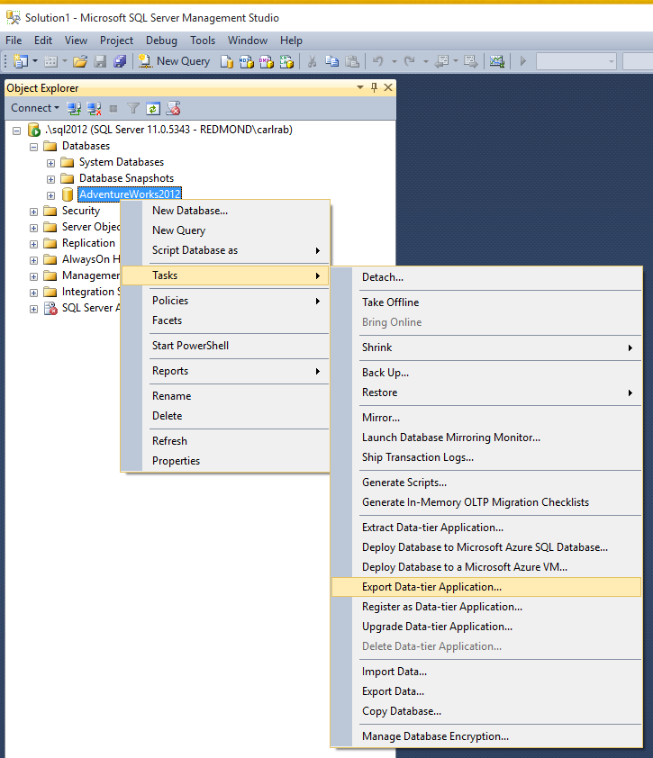

<properties
   pageTitle="Exportieren eine SQL Server-Datenbank in eine BACPAC-Datei, die mit SQL Server Management Studio | Microsoft Azure"
   description="Microsoft Azure SQL-Datenbank Datenbankmigration Datenbank exportieren, exportieren BACPAC Datei Exportieren von Daten in Anwendung-Assistenten"
   services="sql-database"
   documentationCenter=""
   authors="CarlRabeler"
   manager="jhubbard"
   editor=""/>

<tags
   ms.service="sql-database"
   ms.devlang="NA"
   ms.topic="article"
   ms.tgt_pltfrm="NA"
   ms.workload="data-management"
   ms.date="08/16/2016"
   ms.author="carlrab"/>

# Exportieren einer SQL Server-Datenbank in eine BACPAC-Datei, die mit SQL Server Management Studio

> [AZURE.SELECTOR]
- [SSMS](sql-database-cloud-migrate-compatible-export-bacpac-ssms.md)
- [SqlPackage](sql-database-cloud-migrate-compatible-export-bacpac-sqlpackage.md)

 
In diesem Artikel wird gezeigt, wie eine SQL Server-Datenbank in eine [BACPAC](https://msdn.microsoft.com/library/ee210546.aspx#Anchor_4) -Datei, die mit dem Exportieren von Daten in Anwendung-Assistenten in SQL Server Management Studio zu exportieren. 

1. Stellen Sie sicher, dass Sie die neueste Version von SQL Server Management Studio verfügen. Neue Versionen von Management Studio werden mit den Azure-Portal synchron bleiben monatliche aktualisiert.

     > [AZURE.IMPORTANT] Es wird empfohlen, dass Sie immer die neueste Version von Management Studio verwenden, um mit Microsoft Azure und SQL-Datenbank-Updates synchronisiert werden. [Aktualisieren von SQL Server Management Studio](https://msdn.microsoft.com/library/mt238290.aspx).

2. Öffnen Sie Management Studio, und Verbinden mit der Quelldatenbank im Objekt-Explorer.

    

3. Mit der rechten Maustaste im Objekt-Explorer Quelldatenbank, zeigen Sie auf **Aufgaben**, und klicken Sie auf **Exportieren der Anwendung Datenebene...**

    

4. Konfigurieren Sie im Export-Assistenten die exportieren, um die BACPAC-Datei speichern, um entweder Speicherort auf einer lokalen Festplatte oder in einer Azure BLOB-ein. Die exportierte BACPAC enthält immer das vollständige Datenbankschema und standardmäßig Daten aus allen Tabellen. Wenn Sie Daten aus einigen oder allen Tabellen ausschließen möchten, verwenden Sie die Registerkarte Erweitert. Sie entscheiden möglicherweise, beispielsweise nur die Daten für den Verweis Tabellen und nicht aus allen Tabellen exportieren.

***Wichtige*** Beim Exportieren eines BACPAC in Azure Blob-Speicher verwenden Sie standard Speicherung. Importieren einer BACPAC von Premium Speicher wird nicht unterstützt.

    

## Nächste Schritte

- [Neueste Version von SSDT](https://msdn.microsoft.com/library/mt204009.aspx)
- [Neueste Version von SQL Server Management Studio](https://msdn.microsoft.com/library/mt238290.aspx)
- [Importieren einer BACPAC mit SSMS mit Azure SQL-Datenbank](sql-database-cloud-migrate-compatible-import-bacpac-ssms.md)
- [Importieren Sie eine BACPAC in SQL Azure-Datenbank SqlPackage](sql-database-cloud-migrate-compatible-import-bacpac-sqlpackage.md)
- [Importieren einer BACPAC Azure SQL-Datenbank Azure-Portal](sql-database-import.md)
- [Importieren Sie eine BACPAC in SQL Azure-Datenbank PowerShell](sql-database-import-powershell.md)

## Zusätzliche Ressourcen

- [SQL-Datenbank V12](sql-database-v12-whats-new.md)
- [Transact-SQL teilweise oder nicht unterstützte Funktionen](sql-database-transact-sql-information.md)
- [Migrieren von SQL Server - Datenbanken mit SQL Server Migrations-Assistenten](http://blogs.msdn.com/b/ssma/)
