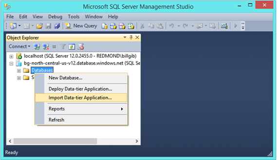
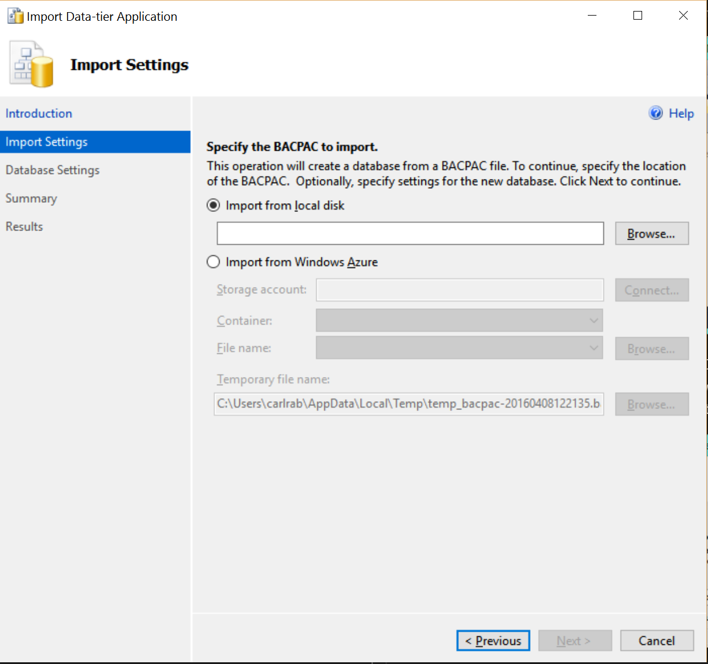
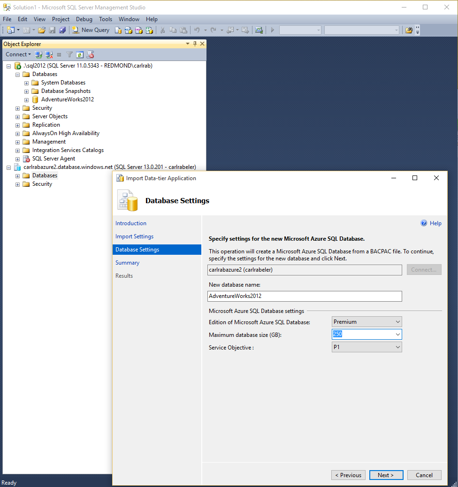

<properties
   pageTitle="Migrieren einer SQL Server-Datenbank mit Azure SQL-Datenbank | Microsoft Azure"
   description="Microsoft Azure SQL-Datenbank Datenbank bereitstellen, Datenbankmigration-Datenbank importieren, exportieren Datenbank Migrations-Assistenten"
   services="sql-database"
   documentationCenter=""
   authors="CarlRabeler"
   manager="jhubbard"
   editor=""/>

<tags
   ms.service="sql-database"
   ms.devlang="NA"
   ms.topic="article"
   ms.tgt_pltfrm="NA"
   ms.workload="sqldb-migrate"
   ms.date="08/24/2016"
   ms.author="carlrab"/>

# Importieren von BACPAC mit SSMS mit SQL-Datenbank

> [AZURE.SELECTOR]
- [SSMS](sql-database-cloud-migrate-compatible-import-bacpac-ssms.md)
- [SqlPackage](sql-database-cloud-migrate-compatible-import-bacpac-sqlpackage.md)
- [Azure-portal](sql-database-import.md)
- [PowerShell](sql-database-import-powershell.md)

In diesem Artikel veranschaulicht, wie Importieren aus einer Datei [BACPAC](https://msdn.microsoft.com/library/ee210546.aspx#Anchor_4) mit SQL-Datenbank mit dem Exportieren von Daten in Anwendung-Assistenten in SQL Server Management Studio.

> [AZURE.NOTE] Die folgenden Schritten wird vorausgesetzt, dass Sie Ihre logische SQL Azure-Instanz bereits bereitgestellt haben und die Verbindungsinformationen zur hand haben.

1. Stellen Sie sicher, dass Sie die neueste Version von SQL Server Management Studio verfügen. Neue Versionen von Management Studio werden mit den Azure-Portal synchron bleiben monatliche aktualisiert.

     > [AZURE.IMPORTANT] Es wird empfohlen, dass Sie immer die neueste Version von Management Studio verwenden, um mit Microsoft Azure und SQL-Datenbank-Updates synchronisiert werden. [Aktualisieren von SQL Server Management Studio](https://msdn.microsoft.com/library/mt238290.aspx).

2. Verbinden mit Ihrer Azure SQL-Datenbankserver, mit der rechten Maustaste in des Ordners **Datenbanken** , und klicken Sie auf **Importieren Datenebene Anwendung...**

    

3.  Um die Datenbank in Azure SQL-Datenbank zu erstellen, Importieren einer BACPAC-Datei von Ihrem lokalen Laufwerk, oder wählen Sie das Konto Azure-Speicher und die Container, dem Sie die Datei BACPAC hochgeladen.

    

     > [AZURE.IMPORTANT] Verwenden Sie beim Importieren einer BACPAC aus Azure Blob-Speicher standard-Speicher. Importieren einer BACPAC von Premium Speicher wird nicht unterstützt.

4.  Geben Sie den **neuen Datenbanknamen** für die Datenbank auf Azure SQL-DB, festlegen Sie **Edition von Microsoft Azure SQL-Datenbank** (Service Schicht), **Maximale Datenbankgröße**und **Dienst Ziel** (Leistungsstufe).

    

5.  Klicken Sie auf **Weiter** , und dann auf **Fertig stellen** , um die Datei BACPAC in einer neuen Datenbank auf dem Server Azure SQL-Datenbank importieren.

6. Verwenden die Objekt-Explorer, Herstellen einer Verbindung mit Ihrer migrierte Datenbank in Ihrer Azure SQL-Datenbankserver.

6.  Verwenden des Azure-Portals an, zeigen Sie Ihrer Datenbank und deren Eigenschaften an.

## Nächste Schritte

- [Neueste Version von SSDT](https://msdn.microsoft.com/library/mt204009.aspx)
- [Neueste Version von SQL Server Management Studio](https://msdn.microsoft.com/library/mt238290.aspx)

## Zusätzliche Ressourcen

- [SQL-Datenbank V12](sql-database-v12-whats-new.md)
- [Transact-SQL teilweise oder nicht unterstützte Funktionen](sql-database-transact-sql-information.md)
- [Migrieren von SQL Server - Datenbanken mit SQL Server Migrations-Assistenten](http://blogs.msdn.com/b/ssma/)
