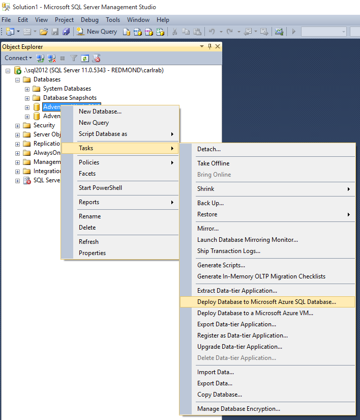
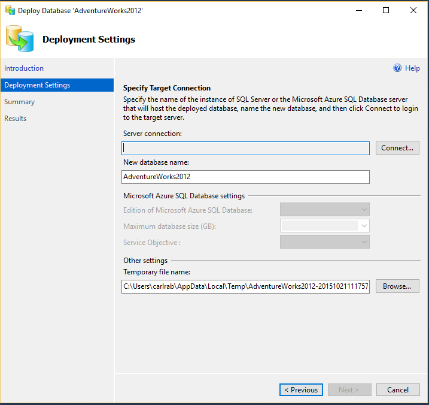
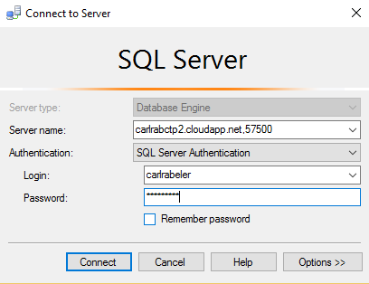
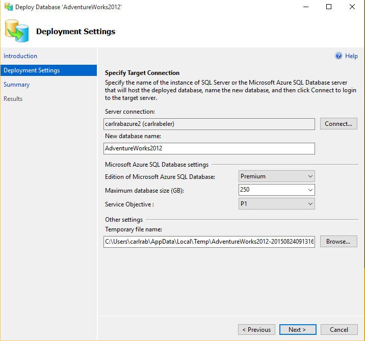

<properties
   pageTitle="Migrieren von SQL Server-Datenbank mit SQL-Datenbank, die mit Microsoft Azure-Datenbank-Assistent-Datenbank bereitstellen | Microsoft Azure"
   description="Microsoft Azure SQL-Datenbank Datenbankmigration Microsoft Azure-Datenbank-Assistent"
   services="sql-database"
   documentationCenter=""
   authors="CarlRabeler"
   manager="jhubbard"
   editor=""/>

<tags
   ms.service="sql-database"
   ms.devlang="NA"
   ms.topic="article"
   ms.tgt_pltfrm="NA"
   ms.workload="sqldb-migrate"
   ms.date="08/24/2016"
   ms.author="carlrab"/>

# Migrieren von SQL Server-Datenbank mit SQL-Datenbank, die mit Microsoft Azure-Datenbank-Assistent-Datenbank bereitstellen

> [AZURE.SELECTOR]
- [SSMS Migrations-Assistenten](sql-database-cloud-migrate-compatible-using-ssms-migration-wizard.md)
- [Exportieren in Datendatei BACPAC](sql-database-cloud-migrate-compatible-export-bacpac-ssms.md)
- [Importieren von BACPAC-Datei](sql-database-cloud-migrate-compatible-import-bacpac-ssms.md)
- [Transaktionsreplikation](sql-database-cloud-migrate-compatible-using-transactional-replication.md)

Die Datenbank bereitstellen, Microsoft Azure-Datenbank-Assistenten in SQL Server Management Studio migriert einer [SQL Server-kompatible Datenbank](sql-database-cloud-migrate.md) direkt in Ihrem Azure SQL-Datenbankserver an.

## Verwenden Sie die Datenbank bereitstellen, Microsoft Azure-Datenbank-Assistent

> [AZURE.NOTE] Den folgenden Schritten wird vorausgesetzt, dass Sie eine [SQL-Datenbankserver bereitgestellt](https://azure.microsoft.com/documentation/learning-paths/sql-database-training-learn-sql-database/)haben.

1. Stellen Sie sicher, dass Sie die neueste Version von SQL Server Management Studio verfügen. Neue Versionen von Management Studio werden mit den Azure-Portal synchron bleiben monatliche aktualisiert.

    > [AZURE.IMPORTANT] Es wird empfohlen, dass Sie immer die neueste Version von Management Studio verwenden, um mit Microsoft Azure und SQL-Datenbank-Updates synchronisiert werden. [Aktualisieren von SQL Server Management Studio](https://msdn.microsoft.com/library/mt238290.aspx).

2. Öffnen Sie Management Studio, und Verbinden mit SQL Server-Datenbank im Objekt-Explorer migriert werden.
3. Mit der rechten Maustaste in der Datenbank im Objekt-Explorer, zeigen Sie auf **Aufgaben**, und klicken Sie auf **Bereitstellen Datenbank mit Microsoft Azure SQL-Datenbank...**

    

4.  Klicken Sie in den Einsatz-Assistenten auf **Weiter**, und klicken Sie dann auf **Verbinden** , um die Verbindung zu Ihrer SQL-Datenbankserver konfigurieren.

    

5. Geben Sie im Dialogfeld auf Server verbinden Ihre Verbindungsinformationen zum SQL-Datenbankserver herstellen.

    

5.  Geben Sie Folgendes für die [BACPAC](https://msdn.microsoft.com/library/ee210546.aspx#Anchor_4) -Datei, die mit diesem Assistenten während des Migrationsvorgangs erstellt:

 - Der **Name der neuen Datenbank** 
 - Die **Edition von Microsoft Azure SQL-Datenbank** ([Service-Ebene](sql-database-service-tiers.md))
 - Die **Maximale Datenbankgröße**
 - Der **Dienst Ziel** (Leistungsstufe)
 - Der **Name der temporären Datei**  

    

6.  Abschließen des Assistenten. Je nach Größe und Komplexität der Datenbank kann Bereitstellung viele Stunden in wenigen Minuten dauern. Wenn der Assistent Kompatibilitätsprobleme erkennt, Fehler auf dem Bildschirm angezeigt werden, und die Migration nicht weiter. Anleitungen zum Beheben von Kompatibilitätsproblemen Datenbank finden Sie unter [Datenbank Kompatibilitätsprobleme zu beheben](sql-database-cloud-migrate-fix-compatibility-issues.md).

7.  Verwenden die Objekt-Explorer, Herstellen einer Verbindung mit Ihrer migrierte Datenbank in Ihrer Azure SQL-Datenbankserver.
8.  Verwenden des Azure-Portals an, zeigen Sie Ihrer Datenbank und deren Eigenschaften an.

## Nächste Schritte

- [Neueste Version von SSDT](https://msdn.microsoft.com/library/mt204009.aspx)
- [Neueste Version von SQL Server Management Studio](https://msdn.microsoft.com/library/mt238290.aspx)

## Zusätzliche Ressourcen

- [SQL-Datenbank V12](sql-database-v12-whats-new.md)
- [Transact-SQL teilweise oder nicht unterstützte Funktionen](sql-database-transact-sql-information.md)
- [Migrieren von SQL Server - Datenbanken mit SQL Server Migrations-Assistenten](http://blogs.msdn.com/b/ssma/)
