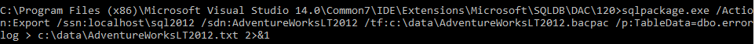
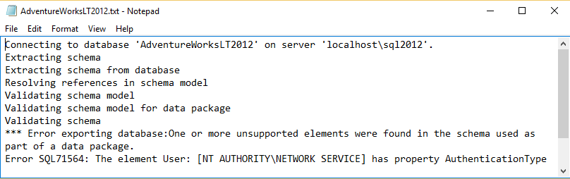

<properties
   pageTitle="Ermitteln Sie die SQL-Datenbank-Kompatibilität mit SqlPackage.exe | Microsoft Azure"
   description="Microsoft Azure SQL-Datenbank, Datenbankmigration, Kompatibilität SqlPackage SQL-Datenbank"
   services="sql-database"
   documentationCenter=""
   authors="CarlRabeler"
   manager="jhubbard"
   editor=""/>

<tags
   ms.service="sql-database"
   ms.devlang="NA"
   ms.topic="article"
   ms.tgt_pltfrm="NA"
   ms.workload="sqldb-migrate"
   ms.date="08/24/2016"
   ms.author="carlrab"/>

# Ermitteln Sie die SQL-Datenbank-Kompatibilität mit SqlPackage.exe

> [AZURE.SELECTOR]
- [SSDT](sql-database-cloud-migrate-fix-compatibility-issues-ssdt.md)
- [SqlPackage](sql-database-cloud-migrate-determine-compatibility-sqlpackage.md)
- [SSMS](sql-database-cloud-migrate-determine-compatibility-ssms.md)
- [Upgrade Advisor](http://www.microsoft.com/download/details.aspx?id=48119)
- [SAMW](sql-database-cloud-migrate-fix-compatibility-issues.md)

In diesem Artikel erfahren Sie, ob eine SQL Server-Datenbank zum Migrieren zu SQL-Datenbank mit dem [SqlPackage](https://msdn.microsoft.com/library/hh550080.aspx) Eingabeaufforderungsfenster Programm kompatibel ist.

## Verwenden von SqlPackage.exe

1. Öffnen Sie ein Eingabeaufforderungsfenster, und ändern Sie ein Verzeichnis mit der neuesten Version von sqlpackage.exe. Dieses Programm im Lieferumfang von der neuesten Versionen von [SQL Server Management Studio](https://msdn.microsoft.com/library/mt238290.aspx) und [SQL Server Data Tools für Visual Studio](https://msdn.microsoft.com/library/mt204009.aspx), oder Sie können die neueste Version von [SqlPackage](https://www.microsoft.com/en-us/download/details.aspx?id=53876) direkt vom Microsoft Downloadcenter herunterladen.
2. Führen Sie den folgenden Befehl aus SqlPackage mit den folgenden Argumenten für Ihre Umgebung an:

    ' sqlpackage.exe /Action:Export /ssn: < Servername > /sdn: < Datenbankname > /tf: /p:TableData < Target_file > = < schema_name.table_name >>< Output_file > 2 > & 1'

  	| Argumente  | Beschreibung  |
  	|---|---|
  	| < Servername >  | Quelle-Servernamens  |
  	| < Datenbankname >  | Name der Quelldatenbank  |
  	| < Target_file >  | Dateinamen und einen Speicherort für die Datei BACPAC  |
  	| < schema_name.table_name >  | die Tabellen für die Daten in der Zieldatei Ausgabe sind  |
  	| < Output_file >  | der Dateiname und Speicherort für die Ausgabedatei mit Fehlern, sofern vorhanden  |

    Der Grund für das Argument /p:TableName ist, dass wir nur exportieren Sie die Daten aus allen Tabellen, anstatt Kompatibilitätsgründen Datenbank zum Exportieren nach Azure SQL-DB V12 testen möchten. Das Argument exportieren für sqlpackage.exe unterstützt 0 (null) Tabellen extrahieren leider nicht. Sie müssen mindestens eine Tabelle, beispielsweise eine einzelne kleine Tabelle angeben. Die < Output_file > enthält den Bericht von Fehlern. Die "> 2 > & 1" pipes sowohl den Standardfehler infolge beim Ausführen Befehls in die der angegebenen Ausgabedatei als auch die Ausgabe der standard-Zeichenfolge.

    

3. Öffnen Sie die Ausgabedatei, und überprüfen Sie die Kompatibilitätsfehler, falls vorhanden. 

    

## Nächste Schritte

- [Neueste Version von SSDT](https://msdn.microsoft.com/library/mt204009.aspx)
[neueste Version von SQL Server Management Studio](https://msdn.microsoft.com/library/mt238290.aspx)
- [Beheben von Datenbankmigration Kompatibilitätsprobleme](sql-database-cloud-migrate.md#fix-database-migration-compatibility-issues)
- [Migrieren einer SQL Server-kompatiblen Datenbank mit SQL-Datenbank](sql-database-cloud-migrate.md#migrate-a-compatible-sql-server-database-to-sql-database)

## Zusätzliche Ressourcen

- [SQL-Datenbank V12](sql-database-v12-whats-new.md)
- [Transact-SQL teilweise oder nicht unterstützte Funktionen](sql-database-transact-sql-information.md)
- [Migrieren von SQL Server - Datenbanken mit SQL Server Migrations-Assistenten](http://blogs.msdn.com/b/ssma/)
