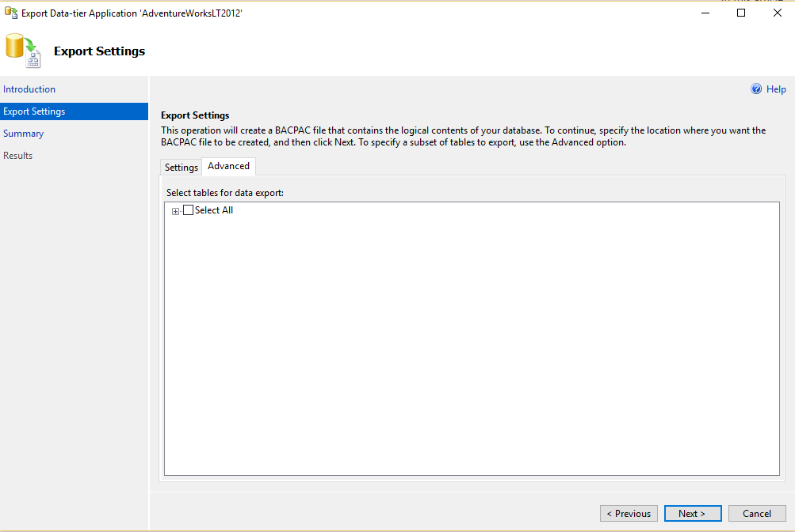
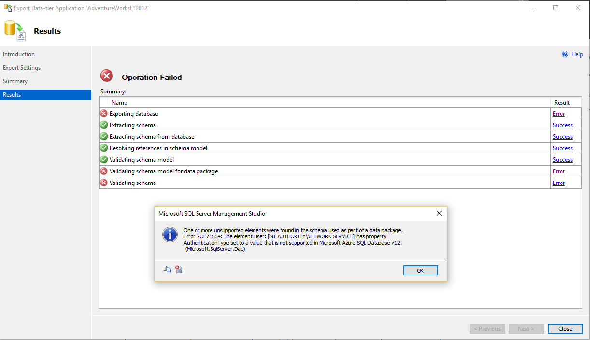

<properties
   pageTitle="Verwenden von SQL Server Management Studio zum Bestimmen der SQL-Datenbank-Kompatibilität vor der Migration mit Azure SQL-Datenbank | Microsoft Azure"
   description="Microsoft Azure SQL-Datenbank, Datenbankmigration, SQL-Datenbank Kompatibilität, Exportieren von Daten in Application Wizard"
   services="sql-database"
   documentationCenter=""
   authors="CarlRabeler"
   manager="jhubbard"
   editor=""/>

<tags
   ms.service="sql-database"
   ms.devlang="NA"
   ms.topic="article"
   ms.tgt_pltfrm="NA"
   ms.workload="sqldb-migrate"
   ms.date="08/29/2016"
   ms.author="carlrab"/>

# Verwenden von SQL Server Management Studio zum Bestimmen der SQL-Datenbank-Kompatibilität vor der Migration mit Azure SQL-Datenbank

> [AZURE.SELECTOR]
- [SSDT](sql-database-cloud-migrate-fix-compatibility-issues-ssdt.md)
- [SqlPackage](sql-database-cloud-migrate-determine-compatibility-sqlpackage.md)
- [SSMS](sql-database-cloud-migrate-determine-compatibility-ssms.md)
- [Upgrade Advisor](http://www.microsoft.com/download/details.aspx?id=48119)
- [SAMW](sql-database-cloud-migrate-fix-compatibility-issues.md)
 
In diesem Artikel finden Sie Informationen ermitteln, ob einer SQL Server-Datenbank ist kompatibel mit SQL-Datenbank mit dem Exportieren von Daten in Anwendung-Assistenten in SQL Server Management Studio migrieren.

## Verwenden von SQL Server Management Studio

1. Stellen Sie sicher, dass Sie die neueste Version von SQL Server Management Studio verfügen. Neue Versionen von Management Studio werden mit den Azure-Portal synchron bleiben monatliche aktualisiert.

     > [AZURE.IMPORTANT] Es wird empfohlen, dass Sie immer die neueste Version von Management Studio verwenden, um mit Microsoft Azure und SQL-Datenbank-Updates synchronisiert werden. [Aktualisieren von SQL Server Management Studio](https://msdn.microsoft.com/library/mt238290.aspx).

2. Öffnen Sie Management Studio, und Verbinden mit der Quelldatenbank im Objekt-Explorer.
3. Mit der rechten Maustaste im Objekt-Explorer Quelldatenbank, zeigen Sie auf **Aufgaben**, und klicken Sie auf **Exportieren der Anwendung Datenebene...**

    

4. Klicken Sie im Export-Assistenten klicken Sie auf **Weiter**, und klicken Sie dann auf der Registerkarte **Einstellungen** konfigurieren Sie die exportieren, um die Datei BACPAC zu einem lokalen Speicherort oder in einer Azure Blob speichern. Wenn Sie keine Kompatibilitätsprobleme Datenbank haben, wird eine BACPAC-Datei gespeichert. Treten Kompatibilitätsprobleme, werden sie angezeigt werden, klicken Sie auf die Verwaltungskonsole werden.

    

5. Klicken Sie auf der **Registerkarte "Erweitert"** , und deaktivieren Sie das Kontrollkästchen **Alles auswählen** , zum Exportieren von Daten zu überspringen. Unser Ziel ist zu diesem Zeitpunkt nur die Kompatibilität testen.

    

6. Klicken Sie auf **Weiter** , und klicken Sie dann auf **Fertig stellen**. Kompatibilitätsprobleme bei der Datenbank, angezeigt werden, falls vorhanden, nachdem der Assistent das Schema prüft.

    

7. Wenn keine Fehler angezeigt werden, Ihre Datenbank kompatibel ist, und Sie sind bereit zum Migrieren. Wenn Fehler auftreten, müssen Sie sie zu reparieren. Wenn der Fehler anzeigen möchten, klicken Sie auf **Fehler** für **Überprüfung Schema**. 
    

8.  Wenn die *. BACPAC Datei wurde erfolgreich erstellt, und klicken Sie dann Ihre Datenbank mit SQL-Datenbank kompatibel ist, und Sie können nun migrieren.

## Nächste Schritte

- [Neueste Version von SSDT](https://msdn.microsoft.com/library/mt204009.aspx)
- [Neueste Version von SQL Server Management Studio](https://msdn.microsoft.com/library/mt238290.aspx)
- [Beheben von Datenbankmigration Kompatibilitätsprobleme](sql-database-cloud-migrate.md#fix-database-migration-compatibility-issues)
- [Migrieren einer SQL Server-kompatiblen Datenbank mit SQL-Datenbank](sql-database-cloud-migrate.md#migrate-a-compatible-sql-server-database-to-sql-database)

## Zusätzliche Ressourcen

- [SQL-Datenbank V12](sql-database-v12-whats-new.md)
- [Transact-SQL teilweise oder nicht unterstützte Funktionen](sql-database-transact-sql-information.md)
- [Migrieren von SQL Server - Datenbanken mit SQL Server Migrations-Assistenten](http://blogs.msdn.com/b/ssma/)
