<properties
   pageTitle="Beheben von Problemen mit SQL Server-Datenbank Kompatibilität vor der Migration mit SQL-Datenbank | Microsoft Azure"
   description="Microsoft Azure SQL-Datenbank, Datenbankmigration, Kompatibilität, SQL Azure Migrations-Assistenten SSDT"
   services="sql-database"
   documentationCenter=""
   authors="CarlRabeler"
   manager="jhubbard"
   editor=""/>

<tags
   ms.service="sql-database"
   ms.devlang="NA"
   ms.topic="article"
   ms.tgt_pltfrm="NA"
   ms.workload="sqldb-migrate"
   ms.date="08/24/2016"
   ms.author="carlrab"/>

# Migrieren einer SQL Server-Datenbank mit Azure SQL-Datenbank mit SQL Server Data Tools für Visual Studio 

> [AZURE.SELECTOR]
- [SSDT](sql-database-cloud-migrate-fix-compatibility-issues-ssdt.md)
- [SqlPackage](sql-database-cloud-migrate-determine-compatibility-sqlpackage.md)
- [SSMS](sql-database-cloud-migrate-determine-compatibility-ssms.md)
- [Upgrade Advisor](http://www.microsoft.com/download/details.aspx?id=48119)
- [SAMW](sql-database-cloud-migrate-fix-compatibility-issues.md)

In diesem Artikel erfahren Sie, zu erkennen und Beheben von SQL Server-Datenbank-Kompatibilitätsprobleme mit den SQL Server Data Tools für Visual Studio vor der Migration mit Azure SQL-Datenbank.

## Mithilfe von SQL Server Data Tools für Visual Studio

Verwenden Sie SQL Server Data Tools für Visual Studio ("SSDT"), um das Datenbankschema in Visual Studio-Datenbank für die Analyse Projekt zu importieren. Zum Analysieren, geben Sie die Zielplattform für das Projekt als SQL-Datenbank V12 und anschließend das Projekt erstellen. Wenn die Erstellung erfolgreich ist, ist die Datenbank kompatibel. Wenn das Erstellen fehlschlägt, können Sie den Fehler in SSDT (oder eine der anderen in diesem Thema erläuterten Tools) beheben. Nachdem das Projekt erfolgreich erstellt wurde, können Sie ihn wieder als Kopie der Quelldatenbank veröffentlichen. Die Daten vergleichen-Funktion können in SSDT Sie um die Daten aus der Quelldatenbank in die kompatibel V12 von Azure SQL-Datenbank zu kopieren. Anschließend können Sie diese aktualisierten Datenbank migrieren. Wenn Sie diese Option verwenden möchten, laden Sie die [neueste Version von SSDT](https://msdn.microsoft.com/library/mt204009.aspx).

  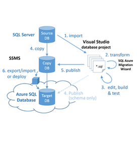

  > [AZURE.NOTE] Schema only Migration erforderlich ist, kann das Schema direkt mit Azure SQL-Datenbank direkt in Visual Studio veröffentlicht werden. Verwenden Sie diese Methode, wenn das Datenbankschema weitere Änderungen nicht von alleine Migrations-Assistenten bearbeitet werden können erfordert.

## Erkennen von Kompatibilitätsprobleme mit SQL Server Data Tools für Visual Studio
   
1.  Öffnen Sie den **SQL Server-Objekt-Explorer** in Visual Studio. **Hinzufügen von SQL Server** Verbindung mit SQL Server-Instanz, enthält die Datenbank migriert verwenden. Suchen Sie die Datenbank im Objekt-Explorer, mit der rechten Maustaste in der Datenbank, und wählen Sie **Neues Projekt erstellen**     
    
    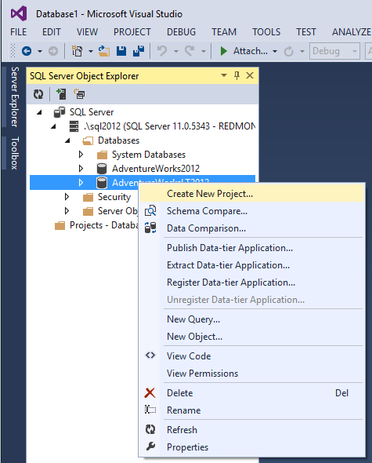    
   
2.  Konfigurieren der importeinstellungen **nur anwendungsspezifische Objekte**importieren. Deaktivieren Sie die Optionen zum Importieren von Folgendes: Benutzernamen, Berechtigungen und Einstellungen für die Datenbank auf die verwiesen wird.    

    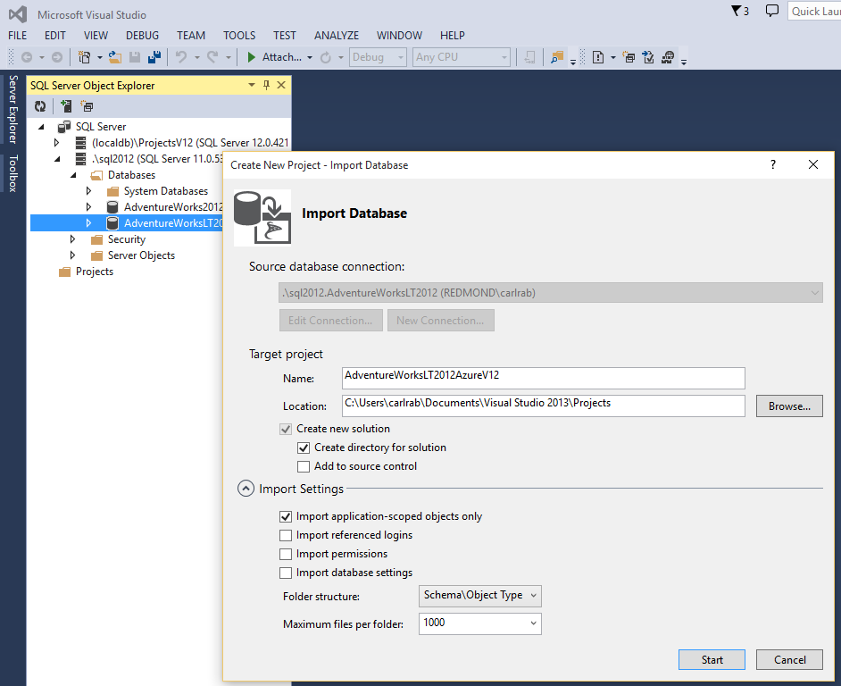    

3.  Klicken Sie auf **Starten** , um die Datenbank zu importieren und das Projekt, enthält eine T-SQL-Skriptdatei für jedes Objekt in der Datenbank erstellen. Die Skriptdateien werden in Ordnern innerhalb des Projekts geschachtelt.    

    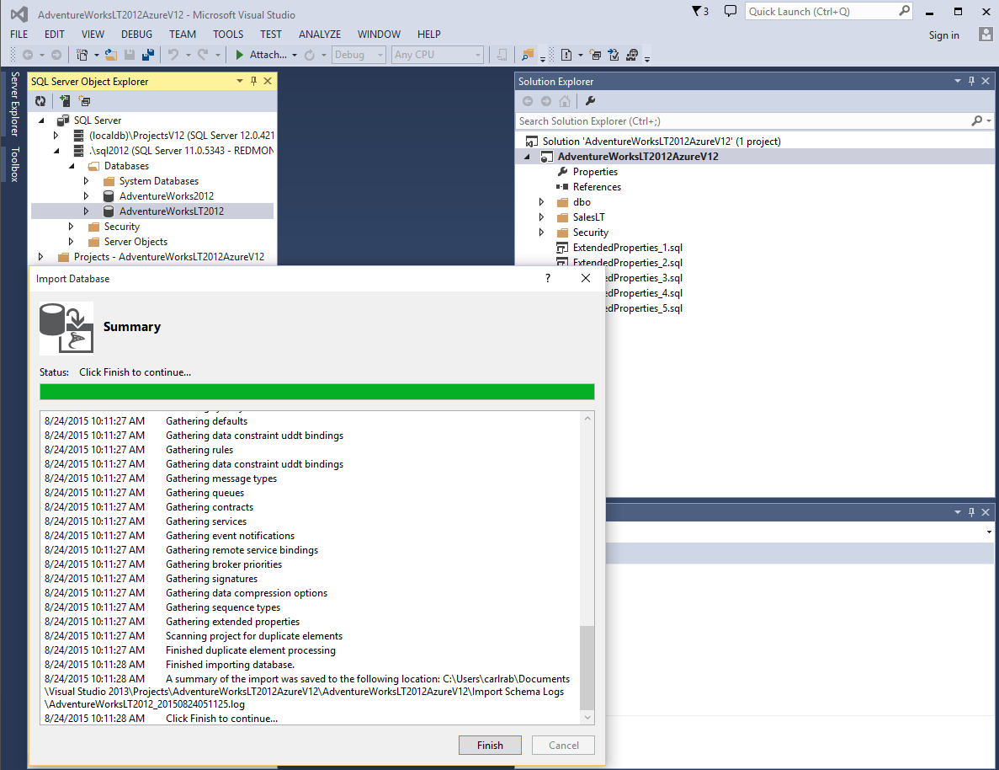    

4.  In der Visual Studio-Lösung-Explorer mit der rechten Maustaste in des Projekts, und wählen Sie Eigenschaften aus. Konfigurieren Sie auf der Einstellungsseite **Project** die Ziel-Plattform Microsoft Azure SQL-Datenbank V12 aus.    
    
    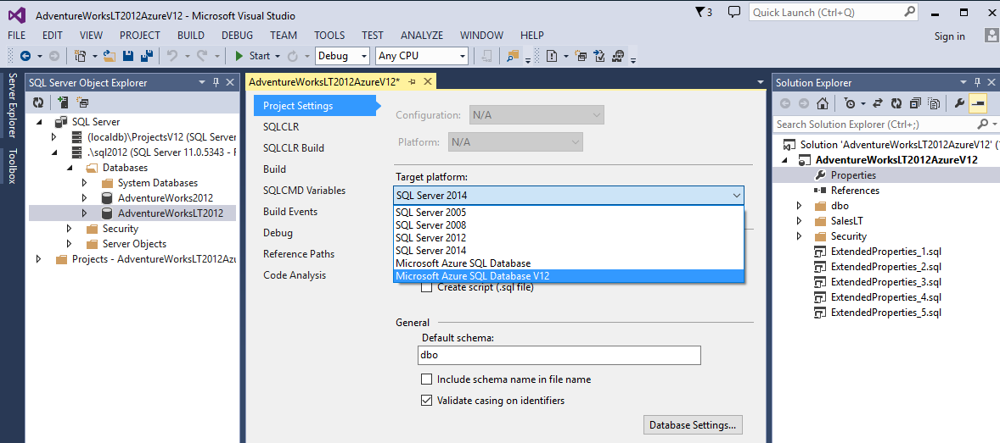    
    
5.  Mit der rechten Maustaste in des Projekts, und wählen Sie **Erstellen** , um das Projekt zu erstellen.    
    
    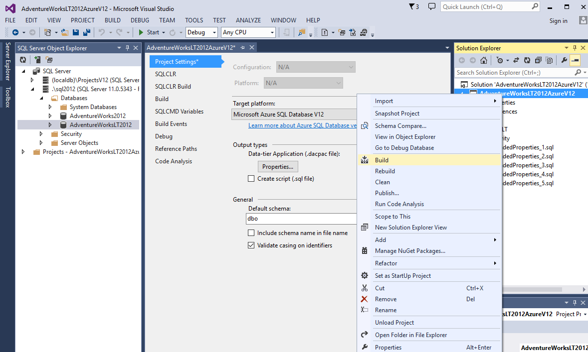    
    
6.  Die **Liste der Fehler** zeigt jede Inkompatibilität. In diesem Fall ist der Benutzername NT-AUTORITÄT\NETZWERKDIENST nicht kompatibel. Da es inkompatibel ist, können kommentieren Sie es aus oder entfernen sie die (und welche Auswirkung das Entfernen dieser Anmeldung und Rolle aus der Datenbank Lösung Adresse).     
    
    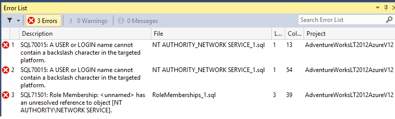    
    
## Beheben von Kompatibilitätsproblemen mit SQL Server Data Tools für Visual Studio

1.  Doppelklicken Sie auf das erste Skript, um das Skript in einem Abfragefenster und kommentieren Sie das Skript zu öffnen, und führen Sie das Skript.     
    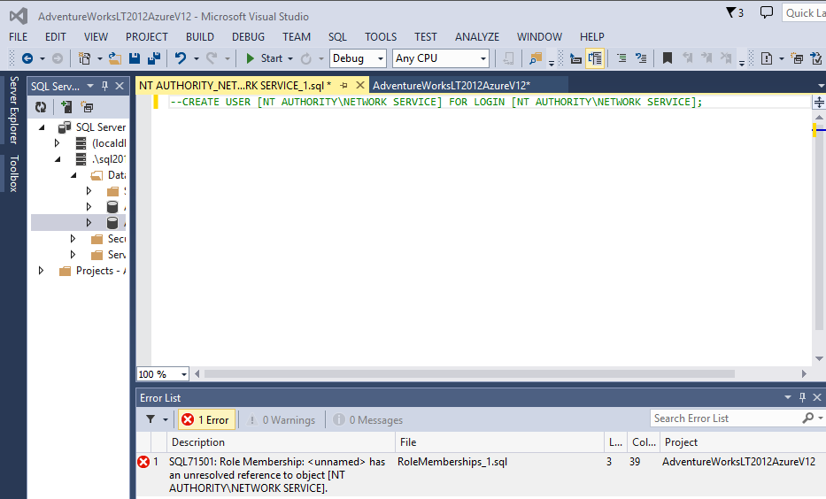

2.  Wiederholen Sie diesen Vorgang für jedes Skript mit Inkompatibilität durch, bis keine Fehler bleiben.    
    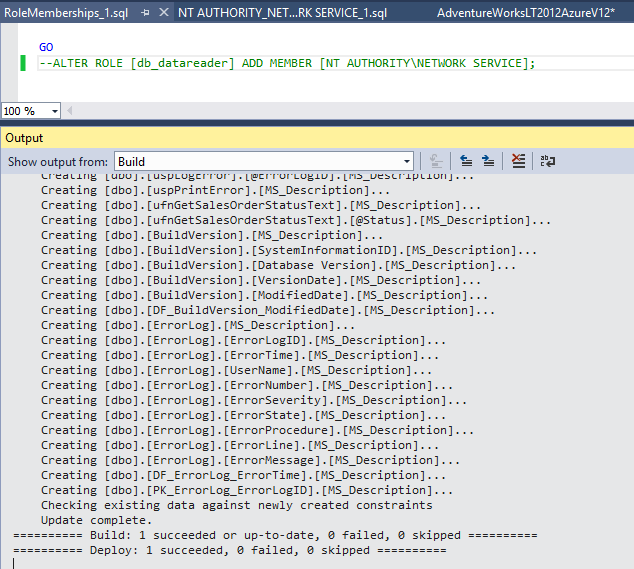
    
3.  Wenn die Datenbank fehlerfrei ist, mit der rechten Maustaste in des Projekts, und wählen Sie **Veröffentlichen**. Eine Kopie der Quelldatenbank erstellt und veröffentlicht wird (es wird dringend empfohlen, eine Kopie zu Beginn verwenden).     
 - Bevor Sie veröffentlichen, je nach Datenquelle SQL Server-Version (früher als SQL Server 2014), müssen Sie möglicherweise zum Zurücksetzen des Projekts, die Ziel-Plattform zur Bereitstellung aktivieren.     
 - Wenn Sie eine ältere SQL Server-Datenbank migrieren, stellen Sie alle Features in das Projekt, die in der SQL Server-Datenquelle nicht unterstützt werden, bis die Datenbank auf eine neuere Version von SQL Server zu migrieren.     

        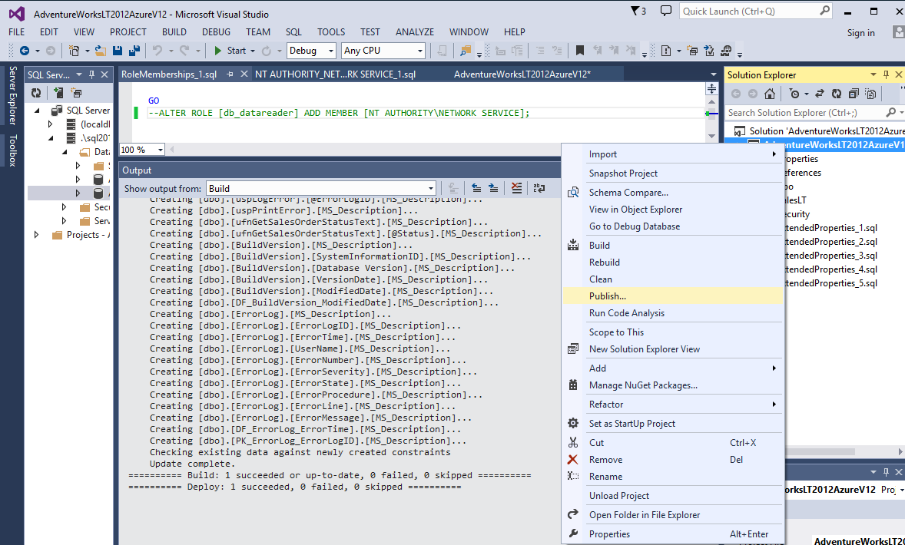    
    
        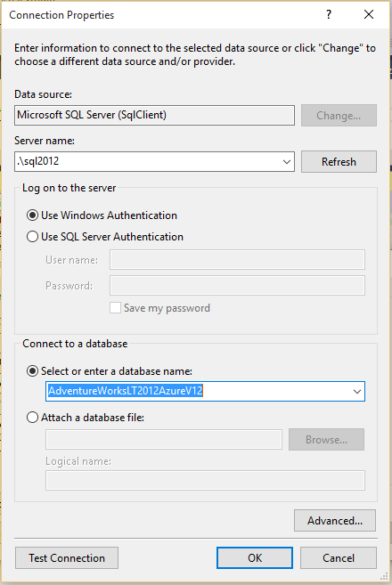    
        
4.  In SQL Server-Objekt-Explorer mit der rechten Maustaste in der Datenbank, und klicken Sie auf **Datenvergleich**. Vergleichen das Projekt, um die ursprüngliche Datenbank hilft Ihnen zu verstehen, welche Änderungen vorgenommen wurden vom Assistenten. Wählen Sie Ihre Azure SQL-V12 Version der Datenbank aus, und klicken Sie dann auf **Fertig stellen**.    
    
    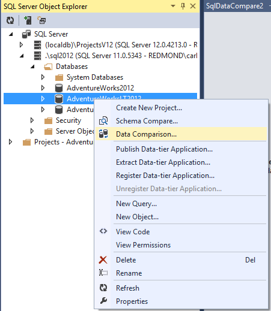    
    
    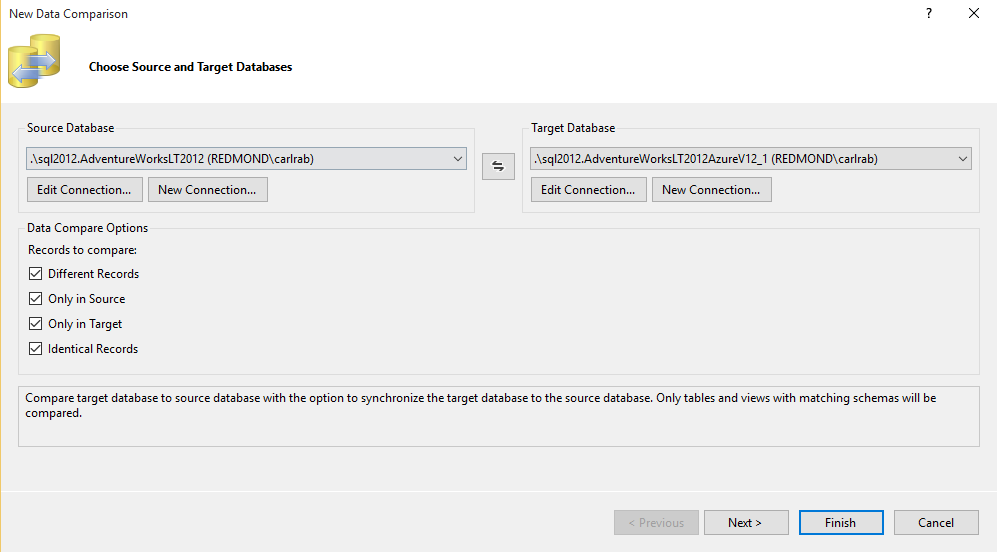    

5.  Überprüfen Sie die Unterschiede erkannt, und klicken Sie dann auf **Ziel aktualisieren** zum Migrieren von Daten aus der Quelldatenbank in die V12 von Azure SQL-Datenbank.     
    
    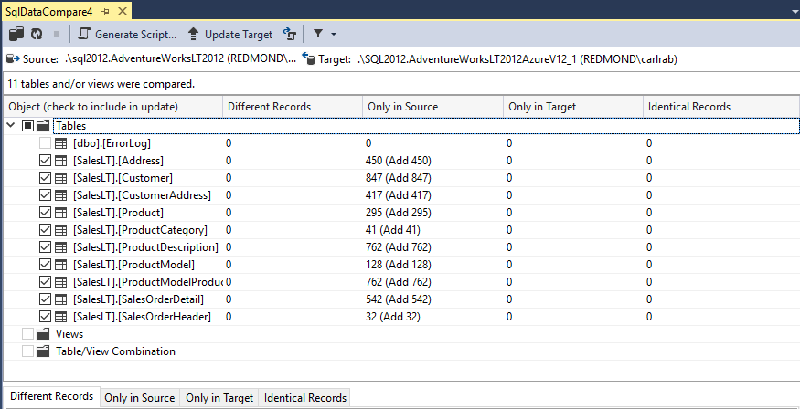    
    
6.  Wählen Sie eine Bereitstellungsmethode aus. Finden Sie unter [eine SQL Server-kompatible Datenbank mit SQL-Datenbank migrieren.](sql-database-cloud-migrate.md)  

## Nächste Schritte

- [Neueste Version von SSDT](https://msdn.microsoft.com/library/mt204009.aspx)
- [Neueste Version von SQL Server Management Studio](https://msdn.microsoft.com/library/mt238290.aspx)

## Zusätzliche Ressourcen

- [SQL-Datenbank V12](sql-database-v12-whats-new.md)
- [Transact-SQL teilweise oder nicht unterstützte Funktionen](sql-database-transact-sql-information.md)
- [Migrieren von SQL Server - Datenbanken mit SQL Server Migrations-Assistenten](http://blogs.msdn.com/b/ssma/)
