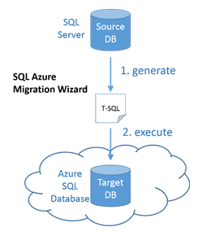

<properties
   pageTitle="Beheben von Problemen mit SQL Server-Datenbank Kompatibilität vor der Migration mit SQL-Datenbank | Microsoft Azure"
   description="Microsoft Azure SQL-Datenbank, Datenbankmigration, Kompatibilität, SQL Azure-Assistent für die Migration"
   services="sql-database"
   documentationCenter=""
   authors="CarlRabeler"
   manager="jhubbard"
   editor=""/>

<tags
   ms.service="sql-database"
   ms.devlang="NA"
   ms.topic="article"
   ms.tgt_pltfrm="NA"
   ms.workload="sqldb-migrate"
   ms.date="08/24/2016"
   ms.author="carlrab"/>

# Verwenden von SQL Azure-Assistent für die Migration zum Beheben von SQL Server-Datenbank Kompatibilitätsprobleme vor der Migration mit Azure SQL-Datenbank

> [AZURE.SELECTOR]
- Verwenden von [SQL Azure Migrations-Assistenten](sql-database-cloud-migrate-fix-compatibility-issues.md)
- Verwenden von [SSDT](sql-database-cloud-migrate-fix-compatibility-issues-ssdt.md)
- Verwenden von [SSMS](sql-database-cloud-migrate-fix-compatibility-issues-ssms.md)

In diesem Artikel erfahren Sie, zu erkennen und Beheben von SQL Server-Datenbank-Kompatibilitätsprobleme mit dem SQL Azure Migrations-Assistenten vor der Migration mit Azure SQL-Datenbank.

## Verwenden von SQL Azure-Migrations-Assistenten

Mithilfe des [Assistenten für die Migration von SQL Azure](http://sqlazuremw.codeplex.com/) CodePlex Tools um ein T-SQL-Skript aus einer Quelldatenbank inkompatiblen zu generieren. Dieses Skript wird vom Assistenten, mit der SQL-Datenbank kompatibel wird dann transformiert. Sie dann Herstellen einer Verbindung mit SQL Azure-Datenbank zum Ausführen des Skripts. Dieses Tool analysiert auch Spur Dateien Ermittlung Kompatibilitätsprobleme. Das Skript kann mit nur Schemas generiert werden oder kann Daten in BCP Format einschließen. Zusätzliche Dokumentation, einschließlich schrittweise Anleitung ist auf CodePlex im [Assistenten für die Migration von SQL Azure](http://sqlazuremw.codeplex.com/)verfügbar.  

 

  > [AZURE.NOTE] Nicht alle inkompatible Schema, die vom Assistenten erkannt werden kann von deren integrierten Transformationen festgelegt werden. Inkompatible Skript, das adressiert werden kann, werden als fehlerhaft, mit Kommentaren an das generierte Skript eingefügt, gemeldet. Wenn viele Fehler erkannt werden, verwenden Sie entweder Visual Studio oder SQL Server Management Studio durchgehen und Beheben von jedem Fehler, der mit der Migrations-Assistent für SQL Server nicht behoben werden konnten.

## Nächste Schritte

- [Neueste Version von SSDT](https://msdn.microsoft.com/library/mt204009.aspx)
- [Neueste Version von SQL Server Management Studio](https://msdn.microsoft.com/library/mt238290.aspx)
- [Migrieren einer SQL Server-kompatiblen Datenbank mit SQL-Datenbank](sql-database-cloud-migrate.md#migrate-a-compatible-sql-server-database-to-sql-database)

## Zusätzliche Ressourcen

- [SQL-Datenbank V12](sql-database-v12-whats-new.md)
- [Transact-SQL teilweise oder nicht unterstützte Funktionen](sql-database-transact-sql-information.md)
- [Migrieren von SQL Server - Datenbanken mit SQL Server Migrations-Assistenten](http://blogs.msdn.com/b/ssma/)
