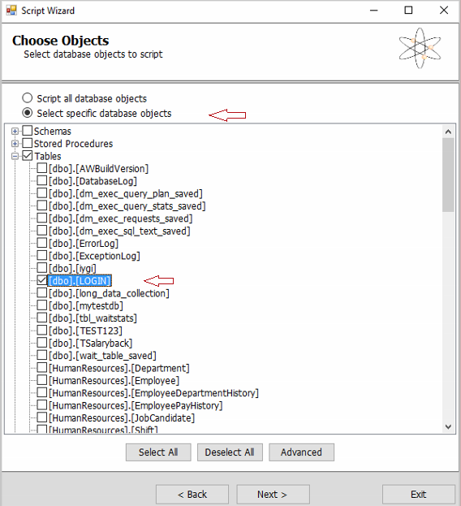
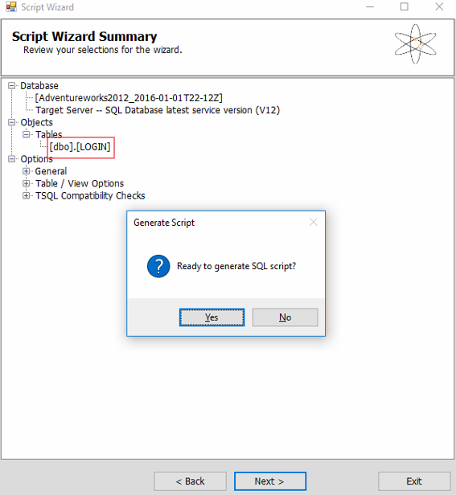
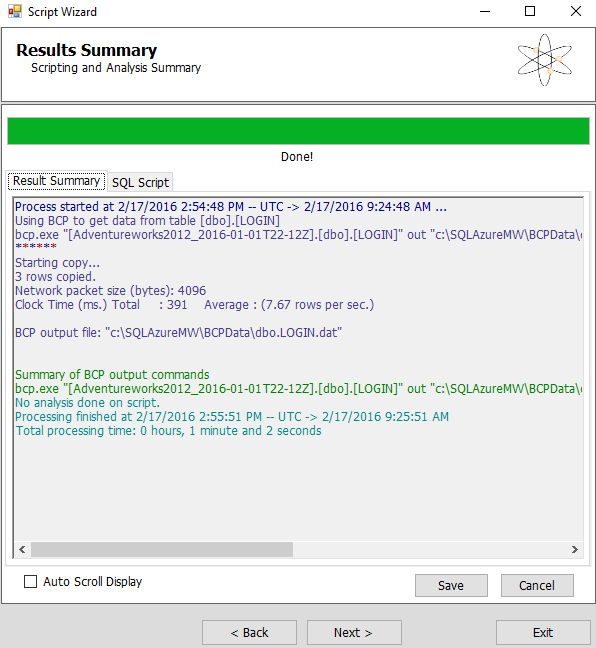

<properties
    pageTitle="Wiederherstellen eine einzelne Tabelle aus Azure SQL-Datenbank sichern | Microsoft Azure"
    description="Erfahren Sie, wie Sie eine einzelne Tabelle aus Azure SQL-Datenbank sichern wiederherstellen."
    services="sql-database"
    documentationCenter=""
    authors="dalechen"
    manager="felixwu"
    editor=""/>

<tags
    ms.service="sql-database"
    ms.workload="data-management"
    ms.tgt_pltfrm="na"
    ms.devlang="na"
    ms.topic="article"
    ms.date="08/31/2016"
    ms.author="daleche"/>

# Zum Wiederherstellen einer einzelnen Tabelle aus einer Sicherung Azure SQL-Datenbank

Sie können eine Situation auftreten, in dem Sie versehentlich geändert einiger Daten in einer SQL-Datenbank, und möchten nun die einzelne betroffene Tabelle wiederherstellen. Dieser Artikel beschreibt, wie Sie eine einzelne Tabelle in einer Datenbank aus einer SQL-Datenbank [Automatische Sicherungskopien](sql-database-automated-backups.md)wiederherstellen.

## Vorbereitende Schritte: Benennen Sie die Tabelle, und stellen Sie eine Kopie der Datenbank wieder her
1. Kennzeichnen Sie die Tabelle in der SQL Azure-Datenbank, die Sie durch die wiederhergestellte Kopie ersetzen möchten. Verwenden Sie Microsoft SQL Management Studio, um die Tabelle umzubenennen. Benennen Sie beispielsweise die Tabelle als &lt;Tabellenname&gt;_old.

    **Notiz** Zur Vermeidung von blockiert werden, stellen Sie sicher, dass keine Aktivität ausgeführt wird, klicken Sie auf die Tabelle, die Sie umbenennen möchten. Wenn Probleme auftreten, stellen Sie sicher, die Durchführung dieses Verfahrens während eines Wartungszeitfensters.

2. Wiederherstellen einer Sicherungskopie der Datenbank an eine Stelle in der Zeit, die Sie wiederherstellen, um mit den Schritten [Punkt-In_Time wiederherstellen](sql-database-recovery-using-backups.md#point-in-time-restore) möchten.

    **Notizen**:
    - Der Namen der Datenbank wiederhergestellt werden im Format DB-Name + TimeStamp; beispielsweise **Adventureworks2012_2016-01-01T22-12Z**. Dieser Schritt wird nicht auf dem Server den vorhandenen Datenbanknamen überschreiben. Dies ist ein Maß für die Sicherheit, und es hat sollen, können Sie die wiederhergestellte Datenbank zu überprüfen, bevor sie legen Sie ihre aktuelle Datenbank, und benennen Sie die wiederhergestellte Datenbank für die Verwendung der Herstellung.
    - Alle Ebenen in der Leistung von grundlegenden als Premium werden vom Dienst, mit unterschiedlichen Sicherung Aufbewahrung Kennzahlen, je nach der Ebene automatisch gesichert:

| DB wiederherstellen | Grundlegende Ebene | Standard-Ebenen | Premium Ebenen |
| :-- | :-- | :-- | :-- |
|  Zeitpunkt wiederherstellen |  Wiederherstellen eines Punkt, innerhalb von 7 Tagen|Einen Punkt in 35 Tagen wiederherstellen| Einen Punkt in 35 Tagen wiederherstellen|

## Kopieren die Tabelle aus der wiederhergestellten Datenbank mithilfe des Migrationstools für SQL-Datenbank
1. Herunterladen Sie und installieren Sie den [Assistenten für die Migration von SQL-Datenbank](https://sqlazuremw.codeplex.com).

2. Öffnen Sie den SQL-Datenbank Migrations-Assistenten, auf der Seite **Select Process** , wählen Sie **die Datenbank unter Analysieren/migrieren**, und klicken Sie dann auf **Weiter**.

3. Klicken Sie im Dialogfeld **mit Server verbinden** gelten Sie die folgenden Einstellungen:
 - **Servername**: Ihr SQL Azure-Instanz
 - **Authentifizierung**: **SQL Server-Authentifizierung**. Geben Sie Ihre Anmeldeinformationen ein.
 - **Datenbank**: **Master DB (Listen auf allen Datenbanken)**.
 - **Notiz** Standardmäßig speichert der Assistent Ihre Anmeldeinformationen an. Wenn Sie sie nicht möchten, wählen Sie **Anmeldeinformationen vergessen**.

4. Wählen Sie im Dialogfeld **Datenquelle auswählen** den Namen der wiederhergestellten Datenbank aus dem Abschnitt **vorbereitenden Schritte** als Quelle aus, und klicken Sie dann auf **Weiter**.

    

5. Wählen Sie die Option **Wählen Sie bestimmte Datenbankobjekte aus** , und wählen Sie dann auf die Table(or tables), die Sie auf dem Zielserver migrieren möchten, klicken Sie im Dialogfeld **Wählen Sie Objekte** .

6. Klicken Sie auf der Seite **Zusammenfassung der Skript-Assistenten** auf **Ja** , wenn Sie aufgefordert werden, zu, ob Sie zum Generieren einer SQL-Skript bereit sind. Sie haben auch die Möglichkeit, das Skript TSQL zur späteren Verwendung zu speichern.

7. Klicken Sie auf der Seite **Ergebnisse Zusammenfassung** auf **Weiter**.

8. Klicken Sie auf der Seite **Ziel-Server-Verbindung einrichten** klicken Sie auf **Verbindung mit Server herstellen**, und geben Sie die Details wie folgt:
    - **Servername**: Ziel-Server-Instanz
    - **Authentifizierung**: **SQL Server-Authentifizierung**. Geben Sie Ihre Anmeldeinformationen ein.
    - **Datenbank**: **Master DB (Listen auf allen Datenbanken)**. Diese Option Listet alle Datenbanken auf dem Server.

    

9. Klicken Sie auf **Verbinden**, wählen Sie die Zieldatenbank, der Sie die Tabelle, um verschieben möchten, und klicken Sie dann auf **Weiter**. Dies sollte Fertig stellen, das zuvor erstelltes Skript ausgeführt sollte, und es der neu verschobenen Tabelle in die Zieldatenbank kopiert.

## Überprüfungsschritt
1. Abfragen und Testen der neu kopierten Tabelle aus, um sicherzustellen, dass die Daten intakt sind. Nach der Bestätigung können Sie das Tabellenformular umbenannte **vorbereitenden Schritte** im Abschnitt löschen. (z. B. &lt;Tabellenname&gt;_old).

## Nächste Schritte

[Automatische Sicherungskopien SQL-Datenbank](sql-database-automated-backups.md)
