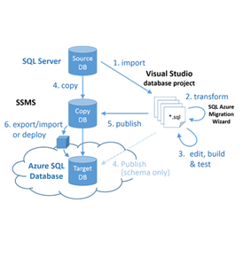

<properties
   pageTitle="Migration von SQL Server-Datenbank mit SQL-Datenbank | Microsoft Azure"
   description="Erfahren Sie, wie etwa lokalen SQL Server-Datenbankmigration zu SQL Azure-Datenbank in der Cloud. Verwenden Sie Datenbank Migrations-Tools, um Kompatibilität vor der Datenbankmigration zu testen."
   keywords="Datenbank Migration, Migration von Sql Server-Datenbank, die Datenbank Migrations-Tools, Datenbank migrieren, Sql-Datenbank migrieren"
   services="sql-database"
   documentationCenter=""
   authors="CarlRabeler"
   manager="jhubbard"
   editor=""/>

<tags
   ms.service="sql-database"
   ms.devlang="NA"
   ms.topic="article"
   ms.tgt_pltfrm="NA"
   ms.workload="sqldb-migrate"
   ms.date="08/24/2016"
   ms.author="carlrab"/>

# Migration von SQL Server-Datenbank mit SQL-Datenbank in der cloud

In diesem Artikel erfahren Sie, wie Sie einer lokalen SQL Server 2005-Datenbank oder höher mit Azure SQL-Datenbank migrieren. In dieser Datenbank Migrationsvorgangs migrieren Sie Ihr Schema und Ihre Daten aus SQL Server-Datenbank in der aktuellen Umgebung in SQL-Datenbank. Um erfolgreich ausgeführt werden kann, muss die vorhandene Datenbank zuerst einen Testanruf Kompatibilität übergeben. Mit [SQL-Datenbank V12](sql-database-v12-whats-new.md)gibt es einige verbleibende Kompatibilitätsprobleme als Problem im Zusammenhang mit Server Ebene und Cross-Datenbank-Vorgänge. Datenbanken und Anwendungen, die auf aufsetzen [teilweise oder nicht unterstützte Funktionen](sql-database-transact-sql-information.md) benötigen einige erneut Technik um diese Inkompatibilität zu beheben, bevor die SQL Server-Datenbank migriert werden kann.

Zum Migrieren von die folgenden Schritte sind Sie ausführen:

- **Test Kompatibilitätsgründen**: Überprüfen Sie die Datenbankkompatibilität mit [SQL-Datenbank V12](sql-database-v12-whats-new.md). 
- **Beheben von Kompatibilitätsprobleme, sofern vorhanden**: Wenn die Validierung fehlschlägt, müssen Sie die Überprüfungsfehler beheben.  
- **Ausführen der migration** Nachdem Sie Ihre Datenbank kompatibel ist, können Sie eine oder mehrere Methoden zum Durchführen der Migration verwenden. 

SQL Server bietet verschiedene Methoden, um diese Aufgaben zu erreichen. Dieser Artikel enthält eine Übersicht über die verfügbaren Methoden für jeden Vorgang an. Das folgende Diagramm veranschaulicht die Schritte und die Methoden.

  
  
 > [AZURE.NOTE] Zum Migrieren einer SQL Server - Datenbank, einschließlich Microsoft Access, Sybase, MySQL Oracle und DB2 mit SQL Azure-Datenbank, finden Sie unter [Migrations-Assistenten von SQL Server](http://blogs.msdn.com/b/ssma/).

## Datenbank-Migrationstools testen Kompatibilität mit SQL Server-Datenbank mit SQL-Datenbank

Klicken Sie zum Testen SQL-Datenbank Kompatibilitätsprobleme Vorbereitung des Migrationsvorgangs Datenbank aus, verwenden Sie eine der folgenden Methoden:

> [AZURE.SELECTOR]
- [SSDT](sql-database-cloud-migrate-fix-compatibility-issues-ssdt.md)
- [SqlPackage](sql-database-cloud-migrate-determine-compatibility-sqlpackage.md)
- [SSMS](sql-database-cloud-migrate-determine-compatibility-ssms.md)
- [Upgrade Advisor](http://www.microsoft.com/download/details.aspx?id=48119)
- [SAMW](sql-database-cloud-migrate-fix-compatibility-issues.md)

- [SQL Server Data Tools für Visual Studio ("SSDT")](sql-database-cloud-migrate-fix-compatibility-issues-ssdt.md): SSDT die neuesten Kompatibilität Regeln verwendet, um SQL-Datenbank V12 Inkompatibilität zu erkennen. Wenn Inkompatibilität erkannt werden, können Sie direkt in diesem Tool erkannte Probleme beheben. Diese Methode ist die empfohlene Methode zum Testen und Beheben von Problemen mit SQL-Datenbank V12 Kompatibilität. 
- [SqlPackage](sql-database-cloud-migrate-determine-compatibility-sqlpackage.md): SqlPackage ist ein Befehlszeilenprogramm, die tests auf Kompatibilität Probleme und generiert einen Bericht mit den gefundenen Kompatibilitätsprobleme. Wenn Sie dieses Tool verwenden, stellen Sie sicher, dass Sie die neueste Version verwenden, um die neuesten Kompatibilität Regeln verwenden. Wenn Fehler gefunden werden, müssen Sie ein anderes Tool beheben alle gefundenen Kompatibilitätsprobleme - verwenden SSDT empfiehlt sich.  
- [Das Exportieren Datenebene Anwendung-Assistenten in SQL Server Management Studio](sql-database-cloud-migrate-determine-compatibility-ssms.md): mit diesem Assistenten erkennt und meldet Fehler auf dem Bildschirm. Wenn dies nicht der Fehler erkannt werden, können Sie fortfahren und führen Sie die Migration mit SQL-Datenbank. Wenn Fehler gefunden werden, müssen Sie ein anderes Tool beheben alle gefundenen Kompatibilitätsprobleme - verwenden SSDT empfiehlt sich.
- [Der Microsoft SQL Server 2016 Upgrade Advisor Preview](http://www.microsoft.com/download/details.aspx?id=48119): dieses Tool eigenständigen, die derzeit in der Vorschau befindet, erkennt und erzeugt einen Bericht der SQL-Datenbank V12 Inkompatibilität. Dieses Tool verfügt noch nicht über die neuesten Kompatibilität Regeln. Wenn keine Fehler gefunden werden, können Sie fortfahren und führen Sie die Migration mit SQL-Datenbank. Wenn Fehler gefunden werden, müssen Sie ein anderes Tool beheben alle gefundenen Kompatibilitätsprobleme - verwenden SSDT empfiehlt sich. 
- [SQL Azure-Migrations-Assistenten ("SAMW")](sql-database-cloud-migrate-fix-compatibility-issues.md): SAMW ist ein Codeplex-Tool, das die Azure SQL-Datenbank V11 Kompatibilität Regeln verwendet, um Azure SQL-Datenbank V12 Inkompatibilität zu erkennen. Wenn Inkompatibilität erkannt werden, können einige Probleme direkt in diesem Tool behoben werden. Dieses Tool bietet Inkompatibilität, die nicht korrigiert werden müssen. Es wurde des ersten Azure SQL-Datenbank-Unterstützung verfügbaren Migrationstools und aktiv von SQL Server-Community unterstützt wird. Dieses Tool kann auch die Migration von innerhalb des Tools selbst durchführen. 

## Beheben von Datenbankmigration Kompatibilitätsprobleme

Wenn Kompatibilitätsprobleme erkannt werden, müssen Sie diese beheben, bevor Sie mit der Migration der SQL Server-Datenbank. Es gibt eine Vielzahl von Kompatibilitätsprobleme, die möglicherweise auftreten, je nach beide können, klicken Sie auf die Version von SQL Server in der Quelldatenbank und die Komplexität der Datenbank, die Sie migrieren. Ältere Versionen von SQL Server müssen weitere Kompatibilitätsprobleme. Verwenden Sie die folgenden Ressourcen, zusätzlich zu einem spezifischen Internet Suchergebnissen mithilfe Ihrer Suchmaschine Auswahlmöglichkeiten:

- [SQL Server-Datenbank-Features in Azure SQL-Datenbank nicht unterstützt.](sql-database-transact-sql-information.md)
- [Nicht mehr vorhandene Datenbank-Engine-Funktionalität in SQLServer 2016](https://msdn.microsoft.com/library/ms144262%28v=sql.130%29)
- [Nicht mehr vorhandene Datenbank-Engine-Funktionalität in SQLServer 2014](https://msdn.microsoft.com/library/ms144262%28v=sql.120%29)
- [Nicht mehr vorhandene Datenbank-Engine-Funktionalität in SQLServer 2012](https://msdn.microsoft.com/library/ms144262%28v=sql.110%29)
- [Nicht mehr vorhandene Datenbank-Engine-Funktionalität in SQL Server 2008 R2](https://msdn.microsoft.com/library/ms144262%28v=sql.105%29)
- [Nicht mehr vorhandene Datenbank-Engine-Funktionalität in SQLServer 2005](https://msdn.microsoft.com/library/ms144262%28v=sql.90%29)

Zusätzlich zu den im Internet suchen und verwenden diese Ressourcen, verwenden Sie den [MSDN SQL Server-Community-Foren](https://social.msdn.microsoft.com/Forums/sqlserver/home?category=sqlserver) oder [StackOverflow](http://stackoverflow.com/).

Verwenden Sie eine der folgenden Migrations-Tools, die gefundenen Probleme zu beheben:

> [AZURE.SELECTOR]
- [SSDT](sql-database-cloud-migrate-fix-compatibility-issues-ssdt.md)
- [SSMS](sql-database-cloud-migrate-fix-compatibility-issues-ssms.md)
- [SAMW](sql-database-cloud-migrate-fix-compatibility-issues.md)

- Verwenden Sie [SQL Server Data Tools für Visual Studio ("SSDT")](sql-database-cloud-migrate-fix-compatibility-issues-ssdt.md): Wenn SSDT verwenden möchten, Sie Datenbankschema importieren in SQL Server Data Tools für Visual Studio "SSDT") und erstellen Sie das Projekt für eine SQL-Datenbank V12 Bereitstellung. Klicken Sie dann beheben Sie alle gefundenen Kompatibilitätsprobleme in SSDT. Wenn Sie fertig sind, synchronisieren Sie die Änderungen an der Quelldatenbank (oder eine Kopie der Quelldatenbank. SSDT gibt es zurzeit die empfohlene Methode zum Testen und Beheben von Problemen mit SQL-Datenbank V12 Kompatibilität. Folgen Sie den Link für eine [Exemplarische Vorgehensweise mithilfe von SSDT](sql-database-cloud-migrate-fix-compatibility-issues-ssdt.md)aus.
- Verwenden von [SQL Server Management Studio ("SSMS")](sql-database-cloud-migrate-fix-compatibility-issues-ssms.md): Wenn SSMS verwenden möchten, führen Sie Transact-SQL-Befehle zum Beheben der Fehler mit einem anderen Tool erkannt. Diese Methode ist hauptsächlich für fortgeschrittene Benutzer das Datenbankschema direkt in der Quelldatenbank ändern. 
- Verwenden Sie [SQL Azure-Migrations-Assistenten ("SAMW")](sql-database-cloud-migrate-fix-compatibility-issues.md): Wenn SAMW verwenden möchten, Sie Transact-SQL-Skript aus der Quelldatenbank generieren. Der Assistent wandelt das Skript, wann immer möglich, um das Schema mit der SQL-Datenbank V12 kompatibel zu machen. Wenn Sie fertig sind, kann SAMW mit SQL-Datenbank V12 zum Ausführen dieses Skripts verbinden. Dieses Tool analysiert auch Spur Dateien Ermittlung Kompatibilitätsprobleme. Das Skript kann mit nur Schemas generiert werden oder kann Daten in BCP Format einschließen.

## Migrieren einer SQL Server-kompatiblen Datenbank mit SQL-Datenbank

Wenn Sie eine SQL Server-kompatible Datenbank migrieren, Microsoft auf verschiedene Weise Migration für verschiedene Szenarien. Die von Ihnen gewählte Methode richtet sich nach der Fehlertoleranz für Ausfallzeiten, die Größe und Komplexität der SQL Server-Datenbank und Ihrer Verbindung zu den Microsoft Azure Cloud.  

> [AZURE.SELECTOR]
- [SSMS Migrations-Assistenten](sql-database-cloud-migrate-compatible-using-ssms-migration-wizard.md)
- [Exportieren in Datendatei BACPAC](sql-database-cloud-migrate-compatible-export-bacpac-ssms.md)
- [Importieren von BACPAC-Datei](sql-database-cloud-migrate-compatible-import-bacpac-ssms.md)
- [Transaktionsreplikation](sql-database-cloud-migrate-compatible-using-transactional-replication.md)

Zum Auswählen der Migrationsmethode ist die erste Frage an, wenn Sie sich leisten können die Datenbank aus der Herstellung während der Migration ausführen. Migrieren einer Datenbank während der aktive Transaktionen auftreten kann Inkonsistenzen und die Datenbank möglicherweise beschädigt führen. Es gibt viele Methoden zum Stoppen einer Datenbank, Client-Konnektivität zum Erstellen einer [Datenbankmomentaufnahme](https://msdn.microsoft.com/library/ms175876.aspx)zu deaktivieren.

Verwenden Sie zum Migrieren von mit minimaler Ausfallzeit [SQL Server Transaktionsreplikation](sql-database-cloud-migrate-compatible-using-transactional-replication.md) ein, wenn die Datenbank die Transaktionen Replikation erfüllt. Wenn Sie sich langweilig leisten können oder einer Migrations Testen einer Datenbank Herstellung für die Migration höher durchführen, sollten Sie einen der folgenden drei Methoden:

- [Assistent für die Migration SSMS](sql-database-cloud-migrate-compatible-using-ssms-migration-wizard.md): für kleine und mittlere Datenbanken, Migrieren einer kompatiblen SQL Server 2005-Datenbank oder höher ist so einfach wie die [Datenbank bereitstellen, Microsoft Azure-Datenbank-Assistenten](sql-database-cloud-migrate-compatible-using-ssms-migration-wizard.md) in SQL Server Management Studio ausgeführt.
- [BACPAC-Datei exportieren](sql-database-cloud-migrate-compatible-export-bacpac-ssms.md) und dann auf [aus Datei BACPAC importieren](sql-database-cloud-migrate-compatible-import-bacpac-ssms.md): Wenn Sie für das Medium in große Datenbanken, verwenden eine Datei [BACPAC](https://msdn.microsoft.com/library/ee210546.aspx#Anchor_4) und Connectivity Herausforderung (keine Konnektivität, niedriger Bandbreite oder Timeoutprobleme) haben. Bei dieser Methode können exportieren Sie die SQL Server-Schema und die Daten in eine BACPAC Datei. Klicken Sie dann importieren Sie die Datei BACPAC in SQL-Datenbank mit dem Exportieren von Daten in Anwendung-Assistenten in SQL Server Management Studio oder dem [SqlPackage](https://msdn.microsoft.com/library/hh550080.aspx) Eingabeaufforderungsfenster Programm.
- Gemeinsames Verwenden von BACPAC und BCP: Verwenden Sie eine Datei [BACPAC](https://msdn.microsoft.com/library/ee210546.aspx#Anchor_4) und [BCP](https://msdn.microsoft.com/library/ms162802.aspx) für größere Datenbanken größer Parallelisierung zur Erhöhung der Leistung zu erzielen, obgleich mit komplexeren. Können Sie bei dieser Methode das Schema und die Daten getrennt.
 - [Exportieren Sie das Schema nur für eine Datei BACPAC](sql-database-cloud-migrate-compatible-export-bacpac-ssms.md).
 - [Importieren Sie das Schema nur aus der BACPAC-Datei](sql-database-cloud-migrate-compatible-import-bacpac-ssms.md) in SQL-Datenbank.
 - Verwenden Sie [BCP](https://msdn.microsoft.com/library/ms162802.aspx) zum Extrahieren der Daten in flachen Dateien und dann auf [parallele laden](https://technet.microsoft.com/library/dd425070.aspx) diese Dateien in Azure SQL-Datenbank.

     

## Nächste Schritte

- [Die Microsoft SQL Server 2016 Upgrade Advisor Vorschau](http://www.microsoft.com/download/details.aspx?id=48119)
- [Neueste Version von SSDT](https://msdn.microsoft.com/library/mt204009.aspx)
- [Neueste Version von SQL Server Management Studio](https://msdn.microsoft.com/library/mt238290.aspx)

##Zusätzliche Ressourcen

- [SQL-Datenbank V12](sql-database-v12-whats-new.md)
[Transact-SQL teilweise oder nicht unterstützte Funktionen](sql-database-transact-sql-information.md)
- [Migrieren von SQL Server - Datenbanken mit SQL Server Migrations-Assistenten](http://blogs.msdn.com/b/ssma/)
