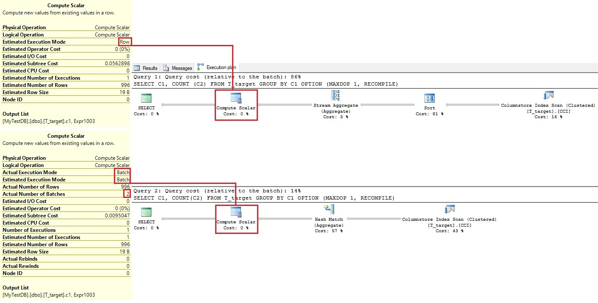
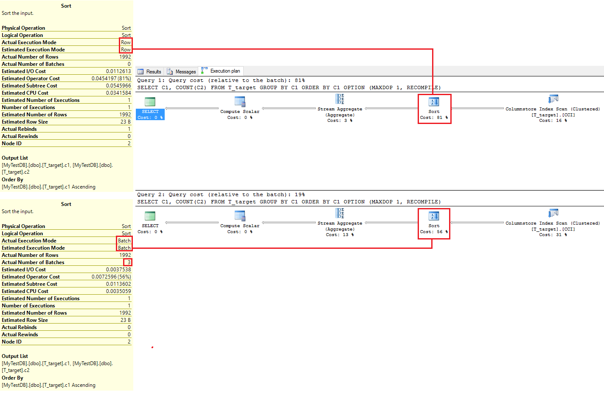

<properties
    pageTitle="Kompatibilität abgleichen möchten, wie Sie bewerten | Microsoft Azure"
    description="Schritte und Tools zum bestimmen, welche Ebene Kompatibilitätsmodus für Ihre Datenbank auf Azure SQL-Datenbank oder Microsoft SQL Server geeignet ist."
    services="sql-database"
    documentationCenter=""
    authors="alainlissoir"
    manager="jhubbard"
    editor=""/>

<tags
    ms.service="sql-database"
    ms.workload="data-management"
    ms.devlang="NA"
    ms.tgt_pltfrm="NA"
    ms.topic="article"
    ms.date="08/08/2016"
    ms.author="alainl"/>


# <a name="improved-query-performance-with-compatibility-level-130-in-azure-sql-database"></a>Verbesserte Leistung von Abfragen mit Kompatibilität Ebene 130 in Azure SQL-Datenbank


Azure SQL-Datenbank wird transparent hundert Tausende von Datenbanken auf vielen verschiedenen Kompatibilität Ebenen ausgeführt unter Beibehaltung und Gewährleistung der Abwärtskompatibilität auf die entsprechende Version von Microsoft SQL Server für alle seiner Kunden!

Daher wird verhindert, dass nichts Kunden, die vorhandenen Datenbanken auf das aktuelle Kompatibilität alter von Vorteile durch die neue Abfrage Optimizer und Abfrage-Prozessor-Features. Als Erinnerung Unterhaltungsverlauf die Ausrichtung des auf Kompatibilität Standardberechtigungsstufen SQL-Versionen werden wie folgt:

- 100: in SQL Server 2008 und SQL Azure-Datenbank V11.
- 110: in SQL Server 2012 und SQL Azure-Datenbank V11.
- 120: in SQL Server 2014 und SQL Azure-Datenbank V12.
- 130: in SQL Server 2016 und SQL Azure-Datenbank V12.


> [AZURE.IMPORTANT] Beginnen in der **Mitte Juni 2016**in SQL Azure-Datenbank, werden die Kompatibilität Standardstufe 130 anstelle von 120 für **neu erstellte** Datenbanken.
> 
> Datenbanken, die vor dem Teil Juni 2016 erstellt werden *nicht* betroffen, und sorgen für die aktuelle Ebene der Kompatibilität (100, 110 oder 120). Datenbanken, die Migrieren von Azure SQL-Datenbank-Version, dass V11 zu V12 deren Kompatibilität Ebene keine wird geändert.


In diesem Artikel untersuchen wir die Vorteile von Kompatibilität Ebene 130, und wie Sie diese Vorteile nutzen können. Wir Adressieren Sie die Seite möglichen Effekte auf die abfrageleistung für die vorhandenen SQL Applications.


## <a name="about-compatibility-level-130"></a>Informationen zur Kompatibilität abgleichen 130


Wenn Sie die aktuelle Ebene der Kompatibilität der Datenbank wissen möchten, führen Sie zunächst die folgende Transact-SQL-Anweisung.


```
SELECT compatibility_level
    FROM sys.databases
    WHERE name = '<YOUR DATABASE_NAME>’;
```


Bevor diese Änderung bis Ebene 130 für **neu** erstellte Datenbanken geschieht, lassen Sie uns festzustellen, welche diese Änderung alle zu durchlaufen einiger Abfragebeispiele sehr einfache und finden Sie unter wie jeder von Nutzen sein kann.

Abfrageverarbeitung in relationalen Datenbanken kann sehr komplex sein und kann dazu führen, dass viele Computerwissenschaft und Mathematik Auswahlmöglichkeiten gehörende Entwurf und-Verhalten zu verstehen. In diesem Dokument aus wurde der Inhalt absichtlich vereinfacht, um sicherzustellen, dass jede Person mit minimalen technischen Hintergrundinformationen kann grundlegende Informationen zu den Einfluss der Änderung der Kompatibilität und bestimmen, wie es Applikationen profitieren kann.

Lassen Sie uns einen Blick auf die Ebene Kompatibilität 130, was bei der Tabelle beiträgt.  Weitere Details finden Sie unter [ALTER DATABASE Kompatibilität Level (Transact-SQL)](https://msdn.microsoft.com/library/bb510680.aspx), aber es folgt eine kurze Zusammenfassung:

- Der Einfügevorgang eine einfügen-Select-Anweisung können multi-threaded oder lauten einen parallelen Plan, während er sich vor diesen Vorgang Single threaded wurde.
- Arbeitsspeicher optimiert ist Tabelle und der Tabelle Variablen Abfragen parallele Pläne jetzt haben können während er sich vor diesem Vorgang auch Single-threaded wurde.
- Statistik für Tabelle Speicher optimiert können jetzt Stichproben genommen und automatisch aktualisiert werden. Finden Sie unter [neuerungen in der Datenbank-Engine: In-Memory OLTP](https://msdn.microsoft.com/library/bb510411.aspx#InMemory) für weitere Details.
- Stapel Modus V/s ändert Zeile Modus mit Spalte Store Indizes
  - Klicken Sie auf eine Tabelle mit einer Spalte Store Index sortiert sind jetzt im Stapelverarbeitungsmodus.
  - Windowing Aggregate arbeiten nun in Stapelverarbeitungsmodus z. B. TSQL POSITIVEN/LEAD Anweisungen.
  - Abfragen Spalte Store Tabellen mit mehreren distinct-Klauseln, die im Stapelverarbeitungsmodus ausgeführt werden.
  - Abfragen, die unter DOP = 1 oder mit einem seriellen Plan auch werden im Stapelverarbeitungsmodus ausgeführt.
- Letzte, Kardinalität Abschätzung Verbesserungen sind tatsächlich mit Kompatibilität Ebene 120, in Kürze aber für diejenigen ausführen auf einer unteren Ebene der Kompatibilität (d. h. 100 oder 110), verschieben auf Kompatibilität bringen Ebene 130 auch diese Verbesserungen, und diese können auch die abfrageleistung Anwendungen profitieren.


## <a name="practicing-compatibility-level-130"></a>Kompatibilität Ebene 130 üben


Erste kommen wir einige Tabellen, Indizes und zufällige Daten erstellt, um einige dieser neuen Funktionen zu üben. Beispiele für die TSQL Skripts können unter SQL Server 2016 oder unter Azure SQL-Datenbank ausgeführt werden. Stellen Sie jedoch beim Erstellen einer SQL Azure-Datenbank sicher, dass Sie mindestens eine Datenbank P2 auswählen, da Sie benötigen mindestens ein paar Kerne zulassen Multi-Thread und daher diese Funktionen nutzen.


```
-- Create a Premium P2 Database in Azure SQL Database

CREATE DATABASE MyTestDB
    (EDITION=’Premium’, SERVICE_OBJECTIVE=’P2′);
GO

-- Create 2 tables with a column store index on
-- the second one (only available on Premium databases)

CREATE TABLE T_source
    (Color varchar(10), c1 bigint, c2 bigint);

CREATE TABLE T_target
    (c1 bigint, c2 bigint);

CREATE CLUSTERED COLUMNSTORE INDEX CCI ON T_target;
GO

-- Insert few rows.

INSERT T_source VALUES
    (‘Blue’, RAND() * 100000, RAND() * 100000),
    (‘Yellow’, RAND() * 100000, RAND() * 100000),
    (‘Red’, RAND() * 100000, RAND() * 100000),
    (‘Green’, RAND() * 100000, RAND() * 100000),
    (‘Black’, RAND() * 100000, RAND() * 100000);

GO 200

INSERT T_source SELECT * FROM T_source;

GO 10
```


Nun ein Überblick zu einigen der Abfrage Verarbeitung Features in Kürze mit Kompatibilität Ebene 130.


## <a name="parallel-insert"></a>Parallele einfügen


Ausführen der folgenden TSQL Anweisungen führt den Einfügevorgang unter Kompatibilität Ebene 120 und 130, die jeweils den Einfügevorgang in einem einzelnen threaded Modell (120), und klicken Sie in einem multi-threaded Modell (130) ausgeführt wird.


```
-- Parallel INSERT … SELECT … in heap or CCI
-- is available under 130 only

SET STATISTICS XML ON;

ALTER DATABASE MyTestDB
    SET COMPATIBILITY_LEVEL = 120;
GO 

-- The INSERT part is in serial

INSERT t_target WITH (tablock)
    SELECT C1, COUNT(C2) * 10 * RAND()
        FROM T_source
        GROUP BY C1
    OPTION (RECOMPILE);

ALTER DATABASE MyTestDB
    SET COMPATIBILITY_LEVEL = 130
GO

-- The INSERT part is in parallel

INSERT t_target WITH (tablock)
    SELECT C1, COUNT(C2) * 10 * RAND()
        FROM T_source
        GROUP BY C1
    OPTION (RECOMPILE);

SET STATISTICS XML OFF;
```


Durch den Abfrageplan, betrachtet, deren grafisch oder deren XML-Inhalt der tatsächliche anfordern, können Sie feststellen, welche Kardinalität Abschätzung Funktion zur Wiedergabe ist. Betrachten der Pläne durch parallel auf Abbildung 1, können wir klar sehen, dass die Spalte Store einfügen Ausführung von serielle in 120 mit Parallel in 130 verläuft. Beachten Sie, dass die Änderung des Symbols in den 130 Plan mit zwei parallele Pfeile, einschließlich der Darstellung der Fakultät, das jetzt die Ausführung Iterator Iterator tatsächlich um parallele ist. Wenn Sie große Einfügevorgänge abgeschlossen haben, wird die parallele Ausführung, bei der Anzahl der Core, stehen Ihnen zur Verfügung, in der Datenbank, verknüpft eine bessere Leistung; bis zu 100 Mal kein schneller abhängig von Ihrer Situation!


*Abbildung 1: Einfügevorgang ändert sich von serielle in Parallel mit Kompatibilität abgleichen 130.*


## <a name="serial-batch-mode"></a>SERIELLE Stapelverarbeitungsmodus


Auf ähnliche Weise ermöglicht das Verschieben von auf Kompatibilität Ebene 130 bei der Verarbeitung von Zeilen mit Daten Modus Stapelverarbeitung aus. Stapel Modus Vorgänge sind zunächst nur verfügbar, wenn Sie einen Store Spaltenindex angeordnet haben. Zweites, ein Stapel steht normalerweise ~ 900 Zeilen anhand eine Codelogik für Multikernprozessoren CPU, höhere Hauptspeicherdurchsatz optimiert und nutzt direkt auf die komprimierten Daten für die Spalte Store, wann immer möglich. Unter diesen Umständen SQL Server 2016 verarbeiten kann ~ 900 Zeilen gleichzeitig, statt 1 Zeile zu dem Zeitpunkt, und daher die insgesamt Aufwand Kosten des Vorgangs durch den gesamten Stapel, verringern Gesamtkosten zeilenweise zeichnen jetzt freigegeben ist. Dieser freigegebenen Betrag von Vorgängen im Grunde in Kombination mit der Spalte Store Komprimierung verringert die Wartezeit verbindet eine SELECT Stapel Modus. Finden weitere Details zu der Spalte Store können und Stapel Modus am [Columnstore Indizes Guide](https://msdn.microsoft.com/library/gg492088.aspx).


```
-- Serial batch mode execution

SET STATISTICS XML ON;

ALTER DATABASE MyTestDB
    SET COMPATIBILITY_LEVEL = 120;
GO

-- The scan and aggregate are in row mode

SELECT C1, COUNT (C2)
    FROM T_target
    GROUP BY C1
    OPTION (MAXDOP 1, RECOMPILE);
GO

ALTER DATABASE MyTestDB
    SET COMPATIBILITY_LEVEL = 130;
GO 

– The scan and aggregate are in batch mode,
-- and force MAXDOP to 1 to show that batch mode
-- also now works in serial mode.

SELECT C1, COUNT(C2)
    FROM T_target
    GROUP BY C1
    OPTION (MAXDOP 1, RECOMPILE);
GO

SET STATISTICS XML OFF;
```


Als unter angezeigt wird indem Sie die Abfrage nebeneinander Pläne, auf Abbildung 2, können wir beobachten finden Sie unter der Verarbeitungsmodus wurde geändert, mit der Ebene der Kompatibilität und daher, wenn Sie die Abfragen in beiden Kompatibilität Ebene ganz ausführen, wir die meiste Verarbeitungszeit sehen haben, in der Zeile Modus (86 %) im Vergleich zu den Stapelverarbeitungsmodus (14 %), wo 2 Blattnamen verarbeitet wurden klicken. Das Dataset vergrößern, wird die Vorteile vergrößern.


*Abbildung 2: Aktivieren Sie Vorgang Änderungen von serielle Stapel im Modus mit Kompatibilität Ebene 130.*





## <a name="batch-mode-on-sort-execution"></a>Stapelverarbeitungsmodus auf Ausführung sortieren


Ähnlich wie oben, aber zu einem Sortiervorgang angewendete der Übergang aus der Zeile Modus (Kompatibilität Ebene 120) Stapelverarbeitungsmodus (Kompatibilität Ebene 130) verbessert die Leistung des Sortiervorgangs denselben Gründen.


```
-- Batch mode on sort execution

SET STATISTICS XML ON;

ALTER DATABASE MyTestDB
    SET COMPATIBILITY_LEVEL = 120;
GO

-- The scan and aggregate are in row mode

SELECT C1, COUNT(C2)
    FROM T_target
    GROUP BY C1
    ORDER BY C1
    OPTION (MAXDOP 1, RECOMPILE);
GO

ALTER DATABASE MyTestDB
    SET COMPATIBILITY_LEVEL = 130;
GO

-- The scan and aggregate are in batch mode,
-- and force MAXDOP to 1 to show that batch mode
-- also now works in serial mode.

SELECT C1, COUNT(C2)
    FROM T_target
    GROUP BY C1
    ORDER BY C1
    OPTION (MAXDOP 1, RECOMPILE);
GO

SET STATISTICS XML OFF;
```


Sichtbar – nebeneinander auf Abbildung 3, sehen Sie, dass der Sortiervorgang im Modus Zeile repräsentiert 81 % der Kosten, der Stapelverarbeitungsmodus nur 19 % der Kosten (jeweils 81 % und 56 % auf die Sortierung selbst).


*Abbildung 3: Sortiervorgang ändert sich von Zeile in Stapelverarbeitungsmodus mit Kompatibilität Ebene 130.*





Offensichtlich, enthalten in diesen Beispielen nur Dutzende Tausende von Zeilen, d. h. nichts, wann die Daten in die meisten SQL Server verfügbar heutzutage anzeigen. Stattdessen einfach project diese gegen Millionen von Zeilen, und dies kann in mehrere Minuten für jeden Tag ausstehend die Art der Ihrer Arbeitsbelastung gespart Ausführung übersetzen.


## <a name="cardinality-estimation-ce-improvements"></a>Verbesserung der Kardinalität Abschätzung (CE)


Mit SQL Server 2014 eingeführt, eine Datenbank auf einer Ebene Kompatibilität 120 oder höher ausgeführt werden Nutzen der neuen Kardinalität Abschätzung Funktionalität. Kardinalität Abschätzung ist im Wesentlichen die Logik verwendet, um zu bestimmen, wie SQLServer eine Abfrage basierend auf deren geschätzte Kosten ausgeführt wird. Abschätzung rechnet mit der Eingabe von Statistiken Objekte, die Abfrage beteiligt zugeordnet. In der Praxis auf hoher Kardinalität Abschätzung Funktionen sind Zeile zählen schätzt zusammen mit Informationen über die Verteilung der Werte, distinct Wert zählt, und die doppelten zählt enthalten, der Tabellen und Objekte, die in der Abfrage verwiesen wird. Erste diese schätzt falschen, können nicht benötigter Festplatten-wegen unzureichender Arbeitsspeicher gewährt (d. h. TempDB verschüttete) oder eine Auswahl von einer Ausführung serielle Pläne über eine Ausführung paralleler Pläne dazu führen, dass ein paar zu nennen. Abschluss können falsche schätzt zu einer gesamten Leistungsabfall der Ausführung der Abfrage führen. Auf der anderen Seite leads bessere schätzt, genauere schätzt, um eine bessere Abfrage Ausführungen!

Wie bereits erwähnt, sind Abfrage Optimierungen und schätzt eine komplizierte Angelegenheit, aber wenn Sie weitere Informationen zur Abfrage-Pläne und Kardinalität Rechner möchten, können Sie zu dem Dokument am [Optimieren Ihrer Abfrage-Pläne mit der SQL Server 2014 Kardinalität Rechner](https://msdn.microsoft.com/library/dn673537.aspx) für eingehender verweisen.


## <a name="which-cardinality-estimation-do-you-currently-use"></a>Welche Kardinalität Abschätzung verwenden Sie zurzeit?


Zum bestimmen, welche Kardinalität-Schätzung die Abfragen ausgeführt werden, klicken Sie unter wir verwenden einfach die Abfrage Beispielen darunter. Beachten Sie, dass dieses erste Beispiel unter Kompatibilität Ebene 110, dass dies die Verwendung der alten Kardinalität Abschätzung Funktionen ausgeführt werden soll.


```
-- Old CE

ALTER DATABASE MyTestDB
    SET COMPATIBILITY_LEVEL = 110;
GO

SET STATISTICS XML ON;

SELECT [c1]
    FROM [dbo].[T_target]
    WHERE [c1] > 20000;
GO

SET STATISTICS XML OFF;
```


Nach Abschluss der Ausführung klicken Sie auf die XML-Link, und schauen Sie sich die Eigenschaften des ersten Iterators wie unten dargestellt. Beachten Sie den Namen der Eigenschaft aufgerufen CardinalityEstimationModelVersion aktuell auf 70 festlegen. Es bedeutet nicht, dass die Datenbank Kompatibilität auf die Version SQL Server 7.0 (auf 110 in der obigen TSQL Anweisungen als sichtbar festgelegt) festgelegt ist, aber den Wert 70 einfach die legacy Kardinalität Abschätzung Funktionalität verfügbar seit SQL Server 7.0, das keine Bereiche Überarbeitungen bis SQL Server 2014 wurde darstellt (die mit einer Ebene Kompatibilität von 120 stammt).


*Abbildung 4: Der CardinalityEstimationModelVersion wird auf 70 festgelegt, wenn eine Ebene Kompatibilität der 110 oder unter Verwendung.*


Alternativ können Sie die Kompatibilität Ebene zu 130 ändern, und deaktivieren Sie die Verwendung der neuen Funktion Kardinalität Abschätzung mithilfe der LEGACY_CARDINALITY_ESTIMATION auf mit [ALTER Datenbank ausgelegte Konfiguration](https://msdn.microsoft.com/library/mt629158.aspx)festlegen. Dies wird genau mit 110 Gesichtspunkt eine Schätzung Kardinalität (Funktion), während der Verwendung der neuesten abfrageverarbeitung Kompatibilität Ebene identisch sein. Auf diese Weise die neue Abfrage, die Verarbeitung von Features, die mit der neuesten Kompatibilität Ebene (d. h. Stapelverarbeitungsmodus) in Kürze nutzbringend können bei Bedarf weiterhin auf die alte Kardinalität Abschätzung Funktionalität aufsetzen.


```
-- Old CE

ALTER DATABASE MyTestDB
    SET COMPATIBILITY_LEVEL = 130;
GO

ALTER DATABASE
    SCOPED CONFIGURATION
    SET LEGACY_CARDINALITY_ESTIMATION = ON;
GO

SET STATISTICS XML ON;

SELECT [c1]
    FROM [dbo].[T_target]
    WHERE [c1] > 20000;
GO

SET STATISTICS XML OFF;
```


Einfach Verschieben der Ebene Kompatibilität 120 oder 130 ermöglicht die neue Kardinalität Abschätzung Funktionalität. In diesem Fall die Standardeinstellung CardinalityEstimationModelVersion wird festgelegt entsprechend 120 oder 130 als unter sichtbar.


```
-- New CE

ALTER DATABASE MyTestDB
    SET COMPATIBILITY_LEVEL = 130;
GO

ALTER DATABASE
    SCOPED CONFIGURATION
    SET LEGACY_CARDINALITY_ESTIMATION = OFF;
GO

SET STATISTICS XML ON;

SELECT [c1]
    FROM [dbo].[T_target]
    WHERE [c1] > 20000;
GO

SET STATISTICS XML OFF;
```


*Abbildung 5: Die CardinalityEstimationModelVersion wird auf 130 festgelegt, wenn Sie eine Ebene Kompatibilität von 130 verwenden.*


## <a name="witnessing-the-cardinality-estimation-differences"></a>Unmittelbare Zeugen die Kardinalität Abschätzung Unterschiede


Nun führen wir etwas komplexer Abfragen im Zusammenhang mit einem INNER JOIN mit einer WHERE-Klausel mit einigen Prädikate, und sehen wir uns die Zeile zählen Schätzung aus der alten Kardinalität Abschätzung Funktion zuerst.


```
-- Old CE row estimate with INNER JOIN and WHERE clause

ALTER DATABASE MyTestDB
    SET COMPATIBILITY_LEVEL = 130;
GO

ALTER DATABASE
    SCOPED CONFIGURATION
    SET LEGACY_CARDINALITY_ESTIMATION = ON;
GO

SET STATISTICS XML ON;

SELECT T.[c2]
    FROM
                   [dbo].[T_source] S
        INNER JOIN [dbo].[T_target] T  ON T.c1=S.c1
    WHERE
        S.[Color] = ‘Red’  AND
        S.[c2] > 2000  AND
        T.[c2] > 2000
    OPTION (RECOMPILE);
GO

SET STATISTICS XML OFF;
```


Effektiv beim Ausführen dieser Abfrage gibt 200,704 Zeilen, während die Schätzung Zeile mit den alten Kardinalität Abschätzung Funktionen 194,284 Zeilen Ansprüche. Offensichtlich, wie vor dem gesagt, diese Zeile zählen Ergebnisse auch hängen wie oft Sie die vorherigen Beispielen für ausgeführt haben, das die Beispieltabellen immer wieder bei jeder Ausführung ausfüllt. Offensichtlich, die Prädikate in Ihrer Abfrage außerdem Einfluss auf die tatsächliche Abschätzung abgesehen davon, dass das Tisch-Shape, Daten von Inhalten, und wie diese Daten tatsächlich miteinander koordinieren.


*Abbildung 6: Die Zeile zählen Schätzung ist 194,284 oder 6.000 Zeilen deaktiviert aus den 200,704 Zeilen erwartet.*


Auf die gleiche Weise lassen Sie uns jetzt ausführen die gleiche Abfrage mit der neuen Kardinalität Abschätzung Funktionalität.


```
-- New CE row estimate with INNER JOIN and WHERE clause

ALTER DATABASE MyTestDB
    SET COMPATIBILITY_LEVEL = 130;
GO

ALTER DATABASE
    SCOPED CONFIGURATION
    SET LEGACY_CARDINALITY_ESTIMATION = OFF;
GO

SET STATISTICS XML ON;

SELECT T.[c2]
    FROM
                   [dbo].[T_source] S
        INNER JOIN [dbo].[T_target] T  ON T.c1=S.c1
    WHERE
        S.[Color] = ‘Red’  AND
        S.[c2] > 2000  AND
        T.[c2] > 2000
    OPTION (RECOMPILE);
GO

SET STATISTICS XML OFF;
```


Betrachten der nachstehend, wir nun erkennen, dass die Zeile Schätzung 202,877, oder viel näher und höher als die alte Kardinalität Abschätzung ist.

*Abbildung 7: Die Zeile zählen Schätzung ist jetzt 202,877, statt 194,284.*


In der Praxis das Ergebnis ist 200,704 Zeilen (hängt alle davon ab, wie oft Sie die vorherigen Beispielen Abfragen ausgeführt haben, sondern wichtiger, da TSQL Zufallszahl ()-Anweisung verwendet, die ist-Werte zurückgegeben können variieren aus einem ausführen zur nächsten). In diesem Beispiel werden neue Kardinalität Abschätzung daher besser Abschätzung die Anzahl der Zeilen, da 202,877 viel näher 200,704, als 194,284 ist! Die letzten, wenn Sie ändern die WHERE-Klausel auf Prädikate (sondern ">" z. B.), könnten anlegen der schätzt zwischen dem alten und neuen Kardinalität Funktion sogar noch anders ab, je nachdem, wie viele entspricht abrufen kann.

Offensichtlich, stellt in diesem Fall ~ 6000 Zeilen Deaktivieren von Zählung werden keine große Datenmenge in einigen Fällen dar. Nun Transponieren, die diese Option, um Millionen von Zeilen über mehrere Tabellen und komplexere Abfragen und gelegentlich den geschätzten Deaktivieren von Millionen von Zeilen und können daher das Risiko von den falschen Ausführungsplan auswählen auszurichten oder Anfordern eines keine ausreichenden Arbeitsspeicher gewährt TempDB verschüttete und daher mehr e/a-führenden sein kann sehr viel höher sind.

Wenn Sie die Möglichkeit, Übung haben dieser Vergleich mit der am häufigsten verwendete Abfragen und Datasets, und sehen Sie sich nach verbleibenden Teil der alten und neuen schätzt sind betroffen, während einige weitere deaktivieren aus der Praxis oder einige andere nur einfach näher auf die aktuelle Zeile nur kommen könnte tatsächlich zurückgegebenen in den Ergebnismengen ermittelt. Alle, wird die Form der Ihre Abfragen, die SQL Azure-Datenbank Merkmale, die Art und die Größe von Ihrem Datasets und die verfügbaren über diese Statistiken abhängig sind. Wenn Sie nur Ihre Instanz Azure SQL-Datenbank erstellt haben, müssen die Abfrage Optimizer erstellen seine Kenntnisse von Grund auf statt Wiederverwenden von Statistiken, der aus der vorherigen Abfrage wird ausgeführt. Ja, sind die schätzt sehr kontextbezogene und fast speziell für jede Situation Server und Anwendung. Es ist ein wichtiger Aspekt beachten müssen!


## <a name="some-considerations-to-take-into-account"></a>Einige Überlegungen in Betracht ziehen


Obwohl die meisten Auslastung profitieren würden, von der Kompatibilität Ebene 130, bevor Sie die Kompatibilität Ebene für die Herstellung Umgebung eingeführt haben Sie im Wesentlichen 3 Optionen:

1. Sie wechseln zur Kompatibilität Ebene 130 und finden Sie unter wie Aktionen ausführen. Falls Sie feststellen, dass einige Regressionen, Sie einfach nur die Kompatibilität Ebene wieder auf die ursprüngliche Ebene oder 130 beibehalten und nur reverse Kardinalität Abschätzung zurück zu den legacy-Modus (wie bereits dargelegt, dies selbständig lösen Sie das Problem).
2. Sie sorgfältig Testen Ihrer vorhandenen Applikationen ähnliche Herstellung Auslastung, Feinabstimmung, und überprüfen die Leistung vor dem Wechsel zu Herstellung. Bei Problemen wie oben, Sie können immer kehren Sie zu der ursprünglichen Kompatibilität Ebene oder einfach stornieren Kardinalität Abschätzung zurück zur legacy-Modus.
3. Als die letzte Möglichkeit, und die letzte Möglichkeit, diese Fragen beantwortet werden ist die Abfrage Store nutzen. Dies ist die empfohlene Option des heutigen! Zur Unterstützung die Analyse Ihrer Abfragen unter Kompatibilität 120 abgleichen oder unten im Vergleich zu 130, wir kann nicht empfehlen Ihnen genug Abfrage Store verwenden. Abfrage-Store gehört zum Lieferumfang der neuesten Version von Azure SQL-Datenbank V12 und wurde entwickelt, um Ihnen bei der Behandlung von Leistungsproblemen helfen. Stellen Sie sich im Abfrage-Store als eine Aufzeichnung Flight Daten, für die Datenbank sammeln und präsentieren detaillierte Verlaufsinformationen zu allen Abfragen. Dies erleichtert deutlich Leistung Analysen Verkürzung der diagnose und Behebung von Problemen. Finden Sie weitere Informationen zur [Abfrage Store: Aufzeichnung einer Flight-Daten für die Datenbank](https://azure.microsoft.com/blog/query-store-a-flight-data-recorder-for-your-database/).


AT der auf hoher Ebene, wenn Sie bereits eine Reihe von Datenbanken, die auf Ebene der Kompatibilität 120 oder unter ausgeführt haben, und planen einige Felder in 130 verschieben, oder weil Ihre Arbeitsbelastung Bereitstellung von neuen Datenbanken, die automatisch bald festgelegt werden standardmäßig so 130, erwägen Sie die folgende Verfahren anwenden:

- Aktivieren Sie vor dem Ändern der neuen Kompatibilität Ebene in der Herstellung, Abfrage speichern. Sie können weitere Informationen zum [Ändern der Kompatibilitätsmodus Datenbank, und verwenden Sie den Abfrage-Store](https://msdn.microsoft.com/library/bb895281.aspx) verweisen.
- Als Nächstes testen Sie aller wichtigen Auslastung mit Vertreter Daten und Abfragen eines produktionsähnlichen Umgebung und vergleichen die Leistung erfahrener und laut Abfrage speichern. Wenn einige Regressionen auftreten, können Sie identifizieren die Regression Abfragen mit dem Abfrage-Store und verwenden Sie den Option Abfrage Store erzwingen Plan (QuickInfos anheften planen). In diesem Fall Sie endgültig mit der Kompatibilität Ebene 130 bleiben, und verwenden den Abfrageplan unter seinem früheren als vorgeschlagenen, indem Sie die Abfrage speichern.
- Wenn Sie die neuen Features und Funktionen von SQL Azure-Datenbank (die 2016 von SQL Server ausgeführt wird) nutzen möchten, aber hängen von Änderungen eingebracht hat, um die Kompatibilität Ebene 130, als letzte Möglichkeit, könnten Sie sollten Sie erwägen, die Kompatibilität Ebene wieder auf die Ebene, die Ihre Arbeitsbelastung geeignet ist, mithilfe einer ALTER DATABASE-Anweisung, erzwingen. Jedoch zuerst, beachten Sie, dass der Abfrage Store Plan anheften Option die beste Option ist, da nicht mit 130 im Grunde Ebene der Funktionalität von einer älteren Version von SQL Server zur Vermeidung ist.
- Wenn Sie mandantenfähigen Applikationen Tag mehrere Datenbanken haben, kann die Bereitstellung Logik Ihrer Datenbanken für ein einheitliches Kompatibilität in allen Datenbanken erfüllen aktualisieren werden; alten und neu eingerichtete diejenigen. Die Leistung Ihrer Anwendung Arbeitsbelastung könnte vertrauliche an, dass einige Datenbanken auf Kompatibilität von verschiedenen Ebenen ausgeführt werden, und daher könnte Kompatibilität Ebene Konsistenz über eine beliebige Datenbank erforderlich, um die gleichen Oberfläche an Ihre Kunden alle überall bereitstellen. Beachten Sie, dass es ist keiner vorgeschrieben, abhängig von wirklich wie die Kompatibilität Ebene Ihrer Anwendung auswirken.
- Hinsichtlich der Kardinalität Abschätzung und ändern die Kompatibilität Ebene, bevor Sie fortfahren produziert wie, empfiehlt es letzten, Testen Ihre Arbeitsbelastung Herstellung neue Maßgabe um festzustellen, ob eine Anwendung aus der Kardinalität Abschätzung Verbesserungen Vorteile.


## <a name="conclusion"></a>Abschluss


Mit Azure SQL-Datenbank alle SQL Server 2016 Erweiterungen nutzen kann Ihrer Abfrage Ausführungen klar verbessern. Genauso wie-ist! Natürlich muss wie alle neuen Features eine ordnungsgemäße Auswertung erfolgen, um den genauen Bedingungen bestimmen unter dem Ihrer Datenbank Arbeitsbelastung das beste. Die Erfahrung zeigt, dass die meisten Arbeitsbelastung auszuführenden mindestens transparent unter Kompatibilität Ebene 130, während der Nutzung von neue Abfrage Verarbeiten von Funktionen und neue Kardinalität Abschätzung erwartet werden. Die unter dem Gesichtspunkt sind, realistischerweise, es gibt immer einige Ausnahmen und Aktionen gemischte Fälligkeitsdatums Diligence ist eine wichtige Bewertung zu bestimmen, wie viel Sie diesen Optimierungen nutzen können. Und erneut im Abfrage-Store können eine große Hilfe in dieser Arbeit erledigen!

SQL Azure Weiterentwicklung, können Sie in Zukunft eine Ebene Kompatibilität 140 erwarten. Wenn die Uhrzeit geeignet ist, wird zunächst was diese Stufe zukünftige Kompatibilität 140 bringen wird, sprechen, wie wir kurz erörtert welche Kompatibilität Ebene 130 heute Onlineschalten ist.

Jetzt, lassen Sie uns nicht vergessen haben, ab Juni 2016, Azure SQL-Datenbank ändert sich die Kompatibilität Standardstufe von 120 zu 130 für neu erstellte Datenbanken. Achten Sie!


## <a name="references"></a>Verweise


- [Was ist neu in der Datenbank-Engine](https://msdn.microsoft.com/library/bb510411.aspx#InMemory)

- [Blog: Abfrage Store: Aufzeichnung einer Flight-Daten für die Datenbank, indem Sie Borko Novakovic, 8 2016 Juni](https://azure.microsoft.com/blog/query-store-a-flight-data-recorder-for-your-database/)

- [ALTER DATABASE Kompatibilität Level (Transact-SQL)](https://msdn.microsoft.com/library/bb510680.aspx)

- [ALTER DATABASE AUSGELEGTE KONFIGURATION](https://msdn.microsoft.com/library/mt629158.aspx)

- [Kompatibilität Ebene 130 für SQL Azure-Datenbank V12](https://azure.microsoft.com/updates/compatibility-level-130-for-azure-sql-database-v12/)

- [Optimieren Ihrer Abfrage Pläne mit dem SQLServer 2014 Kardinalität Rechner](https://msdn.microsoft.com/library/dn673537.aspx)

- [Leitfaden für Columnstore Indizes](https://msdn.microsoft.com/library/gg492088.aspx)

- [Blog: Verbesserte Leistung von Abfragen mit Kompatibilität Ebene 130 in SQL Azure-Datenbank von Alain Lissoir, Mai 6 2016](https://blogs.msdn.microsoft.com/sqlserverstorageengine/2016/05/06/improved-query-performance-with-compatibility-level-130-in-azure-sql-database/)


<!--
Improved Query Performance with Compatibility Level 130 in Azure SQL Database

May 6, 2016 by Alain Lissoir (AlainL), on GitHub 'alainlissoir'.

https://blogs.msdn.microsoft.com/sqlserverstorageengine/2016/05/06/improved-query-performance-with-compatibility-level-130-in-azure-sql-database/

..... Now, above.
....................
..... Soon, below?

CAPS / MSDN ideally, but instead on ACom:
.. # Assess effects of latest compatibility level on query performance, how to

sql-database-compatibility-level-query-performance-130.md

genemi = MightyPen , 2016-05-20  Friday  17:00pm
-->
