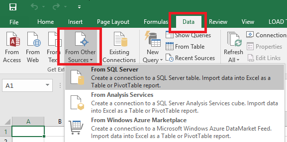
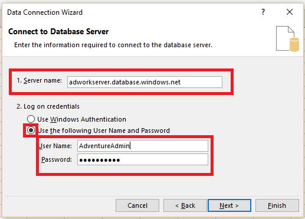
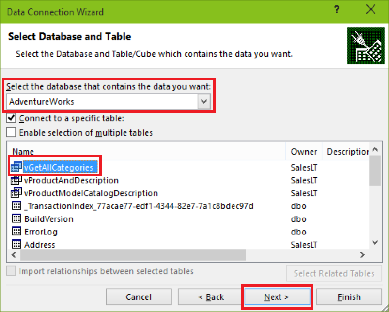
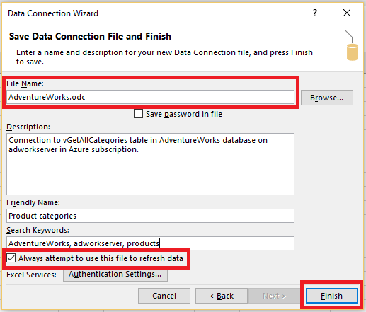
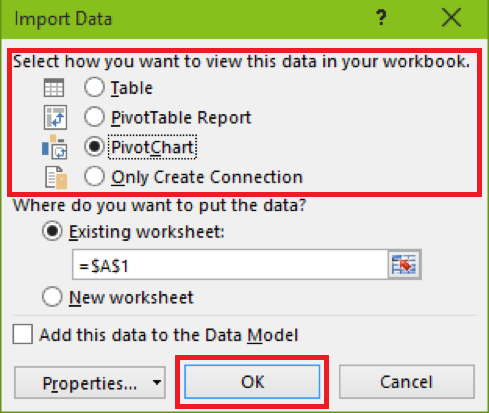
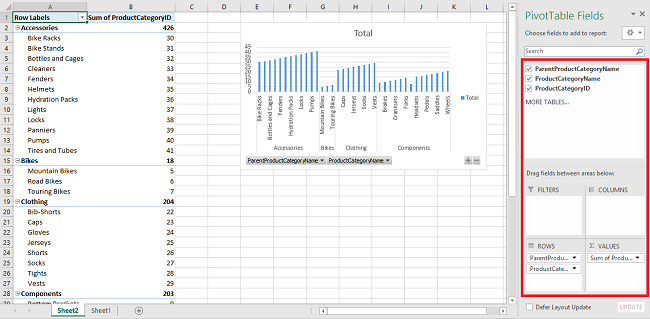
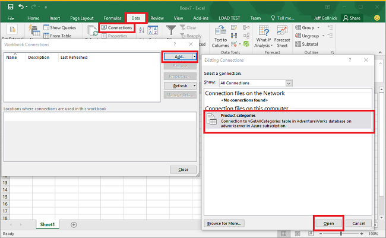

<properties
    pageTitle="Herstellen einer Verbindung SQL-Datenbank mit Excel | Microsoft Azure"
    description="Erfahren Sie, wie Microsoft Excel mit SQL Azure-Datenbank in der Cloud zu verbinden. Importieren von Daten in Excel für Berichte und Daten damit arbeiten."
    services="sql-database"
    keywords="Verbinden von excel in Sql, Importieren von Daten nach excel"
    documentationCenter=""
    authors="joseidz"
    manager="jhubbard"
    editor=""/>

<tags
    ms.service="sql-database"
    ms.workload="data-management"
    ms.tgt_pltfrm="na"
    ms.devlang="na"
    ms.topic="get-started-article"
    ms.date="07/05/2016"
    ms.author="joseidz"/>

# SQL-Datenbank-Lernprogramm: Herstellen einer Verbindung eine SQL Azure-Datenbank mit Excel und Erstellen eines Berichts

> [AZURE.SELECTOR]
- [Visual Studio](sql-database-connect-query.md)
- [SSMS](sql-database-connect-query-ssms.md)
- [Excel](sql-database-connect-excel.md)

Erfahren Sie, wie Sie Excel mit einer SQL-Datenbank in der Cloud verbinden, damit Sie Daten importieren und Tabellen und Diagramme auf der Grundlage der Werte in der Datenbank erstellen können. In diesem Lernprogramm, die Sie die Verbindung zwischen Excel und eine Datenbanktabelle einrichten möchten, speichern Sie die Datei, die Daten und die Verbindungsinformationen für Excel speichert, und klicken Sie dann Erstellen einer PivotChart aus den Datenbankwerten.

Sie benötigen eine in Azure SQL-Datenbank, bevor Sie beginnen. Wenn Sie eine besitzen, finden Sie unter [Erstellen Ihrer ersten SQL-Datenbank](sql-database-get-started.md) in einer Datenbank mit Beispieldaten von und Ausführen von in wenigen Minuten abrufen. In diesem Artikel erhalten Sie Beispieldaten in Excel importieren, aus diesen Artikel, aber Sie können ähnliche Schritte sind für Ihre eigenen Daten.

Sie benötigen außerdem eine Instanz von Excel. In diesem Artikel verwendet [Microsoft Excel 2016](https://products.office.com/en-US/).

## Herstellen einer Verbindung einer SQL-Datenbank mit Excel und erstellen Sie eine Odc-Datei

1.  Um Excel mit SQL-Datenbank herstellen, öffnen Sie Excel und Erstellen einer neuen Arbeitsmappe oder eine vorhandene Excel-Arbeitsmappe zu öffnen.

2.  Klicken Sie auf **Daten**in der Menüleiste am oberen Rand der Seite, klicken Sie auf **Aus anderen Quellen**, und klicken Sie dann auf **Von SQL Server**.

    

    Der Datenverbindungs-Assistent wird geöffnet.

3.  Geben Sie im Dialogfeld **zum Datenbankserver verbinden** der SQL-Datenbank- **Servernamen** in das Formular mit herstellen möchten <*Servername*>**. database.windows.net**. Beispielsweise **adworkserver.database.windows.net**.

4.  Klicken Sie unter **Anmeldeinformationen**klicken Sie auf **den folgenden Benutzernamen und das Kennwort verwenden**, geben Sie den **Benutzernamen** und das **Kennwort** Sie einrichten für die SQL-Datenbankserver, wenn Sie es erstellt haben, und klicken Sie dann auf **Weiter**.

    

    > [AZURE.TIP] Abhängig von Ihrer Umgebung Netzwerk Sie möglicherweise nicht verbinden, oder Sie können möglicherweise die Verbindung verloren gehen, wenn der SQL-Datenbankserver Verkehr über Ihre IP-Adresse zulassen nicht. Wechseln Sie zum [Azure-Portal](https://portal.azure.com/)an, klicken Sie auf SQL Server, klicken Sie auf dem Server, klicken Sie unter Einstellungen auf Firewall, und fügen Sie Ihre IP-Adresse hinzu. Details finden Sie unter [Konfigurieren der Firewall-Einstellungen](sql-database-configure-firewall-settings.md) .

5. Wählen Sie im Dialogfeld **Datenbank und Tabelle wählen** die Datenbank, aus der Liste mit arbeiten möchten, und klicken Sie dann auf die Tabellen oder Sichten mit arbeiten soll (Wir haben ein **vGetAllCategories**), und klicken Sie dann auf **Weiter**.

    

    Im Dialogfeld **Datenverbindungsdatei speichern und Fertig stellen** geöffnet, wo Sie Informationen über den Office-Datenbankdatei Verbindung (Datenbankabfragedateien) erhalten, die Excel verwendet. Lassen Sie die Standardeinstellungen oder Ihre Auswahl anpassen können.

6. Sie können lassen Sie die Standardeinstellungen, aber Notieren Sie den **Dateinamen** im besonderen. Eine **Beschreibung**, einen **Anzeigenamen**und **Stichwörtern** helfen Ihnen und anderen Benutzern Denken Sie daran, was Sie eine Verbindung zur, und suchen die Verbindung. Klicken Sie auf **immer versuchen, diese Datei zum Aktualisieren von Daten zu verwenden** , wenn Sie die Verbindungsinformationen in der Odc-Datei gespeichert ist, damit es aktualisieren kann, wenn Sie zu verbinden, und klicken Sie dann auf **Fertig stellen**möchten.

    

    Im Dialogfeld **Daten importieren** wird angezeigt.

## Importieren von Daten in Excel und Erstellen einer PivotChart
Jetzt, da Sie die Verbindung hergestellt und die Datei mit Daten und Verbindungsinformationen erstellt haben, sind Sie gerade lesen, um die Daten zu importieren.

1. Im Dialogfeld **Daten importieren** klicken Sie auf die Option zum Präsentieren von Daten auf dem Arbeitsblatt verwendet werden soll, und dann auf **OK**. Wir haben entschieden, **PivotChart**. Sie können auch auswählen, um ein **Neues Arbeitsblatt** zu erstellen oder **Hinzufügen, diese Daten zu einem Datenmodell**. Weitere Informationen zu Datenmodellen finden Sie unter [Erstellen eines Datenmodells in Excel](https://support.office.com/article/Create-a-Data-Model-in-Excel-87E7A54C-87DC-488E-9410-5C75DBCB0F7B). Klicken Sie auf **Eigenschaften** zum Erforschen von Informationen zu der Odc-Datei, die Sie im vorherigen Schritt erstellt haben und Optionen für die Aktualisierung der Daten auswählen.

    

    Das Arbeitsblatt verfügt jetzt über eine leere PivotTables und PivotCharts.

8. Wählen Sie unter **PivotTable-Felder**alle die Kontrollkästchen für die Felder, die Sie anzeigen möchten.

    

> [AZURE.TIP]Wenn Sie andere Excel-Arbeitsmappen und Arbeitsblätter zu der Datenbank herstellen möchten, klicken Sie auf **Daten**, klicken Sie auf **Verbindungen**, klicken Sie auf **Hinzufügen**, wählen Sie die Verbindung aus, die Sie aus der Liste erstellt haben, und klicken Sie dann auf **Öffnen**.
> 

## Nächste Schritte

- Informationen zum [Verbinden mit SQL-Datenbank mit SQL Server Management Studio](sql-database-connect-query-ssms.md) für erweiterte Abfragen und Analyse.
- Informationen Sie zu den Vorteilen von [flexible Pools](sql-database-elastic-pool.md).
- Informationen zum [Erstellen einer Web-Anwendungs, die auf SQL-Datenbank auf die Back-End eine Verbindung herstellt](../app-service-web/web-sites-dotnet-deploy-aspnet-mvc-app-membership-oauth-sql-database.md).
