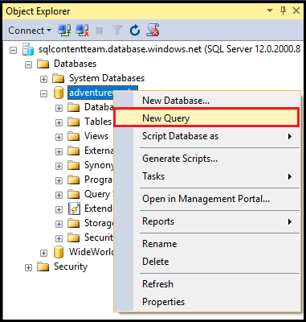

<properties
    pageTitle="Verbinden mit SQL-Datenbank - SQL Server Management Studio | Microsoft Azure"
    description="Erfahren Sie, wie Sie mithilfe von SQL Server Management Studio (SSMS) mit auf Azure SQL-Datenbank zu verbinden. Führen Sie dann eine Stichprobe Abfrage mit Transact-SQL (T-SQL)."
    metaCanonical=""
    keywords="Verbinden Sie mit Sql-Datenbank, Sql Server Management studio"
    services="sql-database"
    documentationCenter=""
    authors="stevestein"
    manager="jhubbard"
    editor="" />

<tags
    ms.service="sql-database"
    ms.workload="data-management"
    ms.tgt_pltfrm="na"
    ms.devlang="na"
    ms.topic="get-started-article"
    ms.date="08/17/2016"
    ms.author="sstein;carlrab" />

# Verbinden mit SQL-Datenbank mit SQL Server Management Studio und Ausführen einer Stichproben T-SQL-Abfrage

> [AZURE.SELECTOR]
- [Visual Studio](sql-database-connect-query.md)
- [SSMS](sql-database-connect-query-ssms.md)
- [Excel](sql-database-connect-excel.md)

In diesem Artikel werden die Herstellung der Verbindung mit einer SQL Azure-Datenbank mithilfe von SQL Server Management Studio (SSMS). Nach erfolgreich eine Verbindung herstellen, führen wir eine einfache (T-SQL) Transact-SQL-Abfrage zum Überprüfen der Kommunikation mit der Datenbank.

[AZURE.INCLUDE [SSMS Install](../../includes/sql-server-management-studio-install.md)]

[AZURE.INCLUDE [SSMS Connect](../../includes/sql-database-sql-server-management-studio-connect-server-principal.md)]

## Beispiele für Abfragen ausführen

Nachdem Sie eine Verbindung zu Ihrem Server herstellen, können Sie eine Verbindung mit einer Datenbank und Ausführen einer Abfrage für die Stichprobe. Wenn Sie mit dem Schreiben von Abfragen nicht vertraut sind, finden Sie unter [Schreiben von Transact-SQL-Anweisungen](https://msdn.microsoft.com/library/ms365303.aspx).

1. Navigieren Sie in **Objekt-Explorer**zu einer Datenbank auf dem Server, wie etwa der Beispieldatenbank **AdventureWorks** aus.
2. Mit der rechten Maustaste in der Datenbank, und wählen Sie dann auf **Neue Abfrage**:

    

3. Abfragefenster kopieren Sie und fügen Sie die folgenden ein:

        SELECT
        CustomerId
        ,Title
        ,FirstName
        ,LastName
        ,CompanyName
        FROM SalesLT.Customer;

4. Klicken Sie auf die Schaltfläche **Ausführen** :

    

## Nächste Schritte

Sie können T-SQL-Anweisungen zum Erstellen und Verwalten von Datenbanken in Azure auf die gleiche Weise können Sie mit SQL Server verwenden. Wenn Sie bei der Verwendung von T-SQL mit SQL Server vertraut sind, finden Sie unter [Azure SQL-Datenbank-Transact-SQL-Informationen)](sql-database-transact-sql-information.md) für eine Zusammenfassung der Unterschiede.

Wenn Sie mit der T-SQL vertraut sind, finden Sie unter [Lernprogramm: Writing Transact-SQL-Anweisungen](https://msdn.microsoft.com/library/ms365303.aspx) und [Transact-SQL-Referenz (Datenbankmodul)](https://msdn.microsoft.com/library/bb510741.aspx).

Um die ersten Schritte bei der Erstellung Datenbankbenutzer und Datenbank-Benutzer-Administratoren finden Sie unter [Erste Schritte mit Azure SQL-Datenbank-Sicherheit](sql-database-get-started-security.md)

Weitere Informationen zu SSMS finden Sie unter [Verwenden SQL Server Management Studio](https://msdn.microsoft.com/library/ms174173.aspx).
