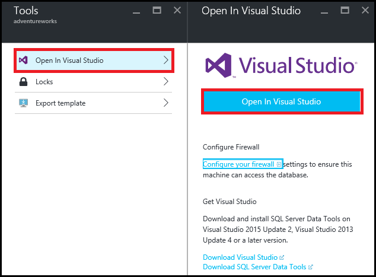
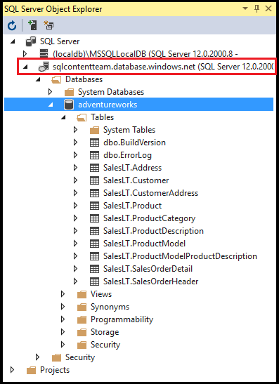
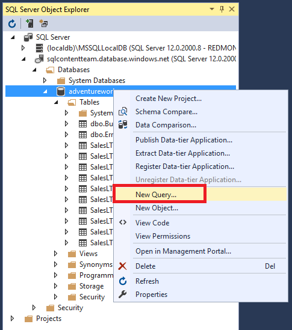
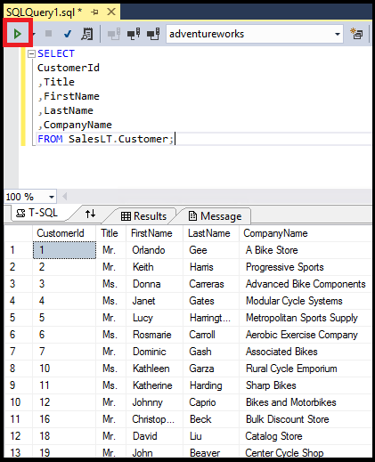

<properties
    pageTitle="Verbinden mit SQL-Datenbank mithilfe einer Abfrage c# | Microsoft Azure"
    description="Schreiben Sie ein Programm in c# Abfragen und Verbinden mit SQL-Datenbank. Informationen zu IP-Adressen, Verbindungszeichenfolgen, sicheres anmelden und kostenlosen Visual Studio."
    services="sql-database"
    keywords="c#-Datenbankabfrage, c#-Abfrage, Herstellen einer Verbindung mit der Datenbank, SQL C#"
    documentationCenter=""
    authors="stevestein"
    manager="jhubbard"
    editor=""/>

<tags
    ms.service="sql-database"
    ms.workload="data-management"
    ms.tgt_pltfrm="na"
    ms.devlang="dotnet"
    ms.topic="get-started-article"
    ms.date="08/17/2016"
    ms.author="stevestein"/>

# Verbinden Sie mit einer SQL-Datenbank mit Visual Studio

> [AZURE.SELECTOR]
- [Visual Studio](sql-database-connect-query.md)
- [SSMS](sql-database-connect-query-ssms.md)
- [Excel](sql-database-connect-excel.md)

Erfahren Sie, wie die Verbindung zu einer SQL Azure-Datenbank in Visual Studio. 

## Erforderliche Komponenten

Informationen zum Verbinden mit einer SQL-Datenbank mit Visual Studio benötigen Sie Folgendes: 

- Eine Verbindung zu SQL-Datenbank. In diesem Artikel wird die **AdventureWorks** -Beispieldatenbank verwendet. Um der Datenbank AdventureWorks zu erhalten, finden Sie unter [Erstellen der Demo-Datenbank](sql-database-get-started.md).

- Visual Studio-2013-Update 4 (oder höher). Microsoft stellt jetzt Visual Studio-Community für *kostenlos*.
 - [Herunterladen von Visual Studio-Community](http://www.visualstudio.com/products/visual-studio-community-vs)
 - [Weitere Optionen zum Freigeben von Visual Studio](http://www.visualstudio.com/products/free-developer-offers-vs.aspx)

## Öffnen Sie Visual Studio vom Azure-portal

1. Melden Sie sich mit dem [Azure-Portal](https://portal.azure.com/)an.

2. Klicken Sie auf **Weitere Dienste** > **SQL-Datenbanken**
3. Öffnen Sie das **AdventureWorks** Datenbank Blade durch Suchen und auf die *AdventureWorks* -Datenbank.

6. Klicken Sie auf die Schaltfläche **Tools** am oberen Rand der Datenbank Blade:

    

7. Klicken Sie auf **in Visual Studio öffnen** (Wenn Sie Visual Studio benötigen, klicken Sie auf den Link herunterladen):

    

8. Visual Studio öffnet, wobei das Fenster **Verbinden und Server** , die bereits auf dem Server und die Datenbank im Portal ausgewählte Verbindung festlegen.  (Klicken Sie auf **Optionen** , um sicherzustellen, dass die Verbindung mit der richtigen Datenbank festgelegt ist.) Geben Sie Ihr Administratorkennwort Server ein, und klicken Sie auf **Verbinden**.

    

8. Wenn Sie nicht über einen Firewall-Regelsatz verfügen können IP-Adresse Ihres Computers, die Meldung *kann keine Verbindung herstellen* können. Um eine Firewall-Regel erstellen zu können, finden Sie unter [Konfigurieren einer Azure SQL-Datenbank-Server Ebene Firewall-Regel](sql-database-configure-firewall-settings.md).

9. Nach dem erfolgreich eine Verbindung herstellen, öffnet **SQL Server-Objekt-Explorer** -Fenster mit einer Verbindung mit Ihrer Datenbank ein.

    

## Ausführen einer Abfrage für die Stichprobe

Jetzt, da wir die Datenbank besteht, anzeigen die folgenden Schritten eine einfache Abfrage ausführen:

2. Mit der rechten Maustaste in der Datenbank, und wählen Sie dann auf **Neue Abfrage**.

    

3. Klicken Sie im Abfrage kopieren Sie, und fügen Sie den folgenden Code ein.

        SELECT
        CustomerId
        ,Title
        ,FirstName
        ,LastName
        ,CompanyName
        FROM SalesLT.Customer;

4. Klicken Sie auf die Schaltfläche **Ausführen** , um die Abfrage auszuführen:

    

## Nächste Schritte

- Öffnen der SQL-Datenbanken in Visual Studio verwendet SQL Server Data Tools. Weitere Informationen hierzu finden Sie unter [SQL Server Data Tools](https://msdn.microsoft.com/library/hh272686.aspx).
- Informationen zum Verbinden mit einer SQL-Datenbank mithilfe von Code finden Sie unter [Verbinden mit SQL-Datenbank mithilfe von .NET (c#)](sql-database-develop-dotnet-simple.md).

