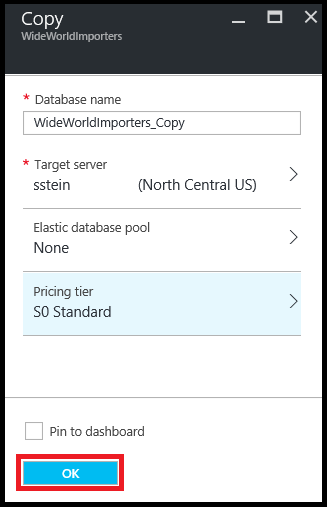

<properties
    pageTitle="Kopieren eine Azure SQL-Datenbank mit dem Portal Azure | Microsoft Azure"
    description="Erstellen einer Kopie einer SQL Azure-Datenbank"
    services="sql-database"
    documentationCenter=""
    authors="stevestein"
    manager="jhubbard"
    editor=""/>

<tags
    ms.service="sql-database"
    ms.devlang="NA"
    ms.date="09/19/2016"
    ms.author="sstein"
    ms.workload="data-management"
    ms.topic="article"
    ms.tgt_pltfrm="NA"/>

# Kopieren einer Azure SQL-Datenbank mithilfe des Azure-Portals

> [AZURE.SELECTOR]
- [(Übersicht)](sql-database-copy.md)
- [Azure-portal](sql-database-copy-portal.md)
- [PowerShell](sql-database-copy-powershell.md)
- [T-SQL](sql-database-copy-transact-sql.md)

Die folgenden Schritte gezeigt, wie in einer SQL-Datenbank mit dem [Azure-Portal](https://portal.azure.com) auf den gleichen oder einem anderen Server zu kopieren.

Wenn Sie eine SQL-Datenbank kopieren möchten, benötigen Sie die folgenden Elemente:

- Ein Azure-Abonnement. Wenn Sie ein Abonnement Azure lediglich **Kostenlose Testversion** am oberen Rand dieser Seite klicken Sie auf, und klicken Sie dann wieder zum Ende der in diesem Artikel.
- Einer SQL-Datenbank zu kopieren. Wenn Sie nicht mit eine SQL-Datenbank verfügen, erstellen eine folgen die Schritten in diesem Artikel: [Erstellen Ihrer ersten Azure SQL-Datenbank](sql-database-get-started.md).

## Kopieren Sie die SQL-Datenbank

Öffnen Sie die SQL-Datenbank-Seite für die Datenbank, die Sie kopieren möchten:

1.  Wechseln Sie zum [Azure-Portal](https://portal.azure.com)an.
2.  Klicken Sie auf **Weitere Dienste** > **SQL-Datenbanken**, und klicken Sie dann auf die gewünschte Datenbank.
3.  Klicken Sie auf **Kopieren**, klicken Sie auf der Seite SQL-Datenbank:

    

1.  Klicken Sie auf der Seite **Kopieren** wird eine Standard-Datenbankname bereitgestellt. Geben Sie einen anderen Namen ein, wenn Sie möchten (alle Datenbanken auf einem Server müssen eindeutige Namen haben).
2.  Wählen Sie einen **Ziel-Server**. Der Ziel-Server ist, in dem die Datenbankkopie erstellt wird. Sie können die Datenbank auf demselben Server oder einem anderen Server kopieren. Sie können einen Server erstellen oder wählen Sie einen vorhandenen Server aus der Liste aus. 
3.  Nachdem Sie die **Ziel-Server**, **flexible Datenbank Ressourcenpool**und **Preise Ebene** Optionen ausgewählt aktiviert sein wird. Wenn der Server einem Ressourcenpool verfügt, können Sie die Datenbank hinein kopieren.
3.  Klicken Sie auf **OK** , um den Kopiervorgang zu starten.

    

## Überwachen des Fortschritts von der kopieren

- Nach dem Start der kopieren, klicken Sie auf der Portalseite Benachrichtigung Details.

    ![Benachrichtigung][3]
 
    ![Monitor][4]

## Stellen Sie sicher, dass die Datenbank auf dem Server live ist

- Klicken Sie auf **Weitere Dienste** > **SQL-Datenbanken** , und überprüfen Sie die neue Datenbank ist **Online**.

## Beheben von Benutzernamen

Um den Benutzernamen aufgelöst nach Abschluss des Kopiervorgangs, finden Sie unter [Benutzernamen auflösen](sql-database-copy-transact-sql.md#resolve-logins-after-the-copy-operation-completes)

## Nächste Schritte

- Übersicht über das Kopieren einer Azure SQL-Datenbank finden Sie unter [kopieren eine SQL Azure-Datenbank](sql-database-copy.md) .
- Kopieren eine Datenbank mithilfe der PowerShell [Kopieren einer SQL Azure-Datenbank mithilfe der PowerShell](sql-database-copy-powershell.md) finden Sie unter.
- [Kopieren einer SQL Azure-Datenbank mithilfe von T-SQL](sql-database-copy-transact-sql.md) kopieren eine Datenbank mithilfe von Transact-SQL finden Sie unter.
- Informationen Sie, [wie zum Verwalten der Sicherheit von SQL Azure-Datenbank nach der Wiederherstellung](sql-database-geo-replication-security-config.md) Informationen zum Verwalten von Benutzern und Benutzernamen, beim Kopieren einer Datenbank auf einem anderen logischen Server.

## Zusätzliche Ressourcen

- [Verwalten von Benutzernamen](sql-database-manage-logins.md)
- [Verbinden mit SQL-Datenbank mit SQL Server Management Studio, und führen Sie eine Stichproben T-SQL-Abfrage](sql-database-connect-query-ssms.md)
- [Exportieren Sie die Datenbank in einer BACPAC](sql-database-export.md)
- [Business Continuity (Übersicht)](sql-database-business-continuity.md)
- [SQL-Datenbank-Dokumentation](https://azure.microsoft.com/documentation/services/sql-database/)

<!--Image references-->
[1]: ./media/sql-database-copy-portal/copy.png
[2]: ./media/sql-database-copy-portal/copy-ok.png
[3]: ./media/sql-database-copy-portal/copy-notification.png
[4]: ./media/sql-database-copy-portal/monitor-copy.png

