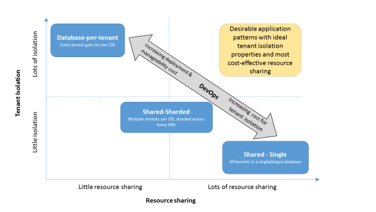

<properties
   pageTitle="Entwerfen von Mustern für mandantenfähigen SaaS Applikationen und Azure SQL-Datenbank | Microsoft Azure"
   description="In diesem Artikel werden die Anforderungen und allgemeine Daten Architektur Mustern mandantenfähigen-Datenbank, die in einen Cloud-Umgebung ausgeführt Applications berücksichtigen müssen, und die verschiedenen vor-und Nachteile dieser Muster zugeordnet. Es wird erläutert, wie SQL Azure-Datenbank, mit deren flexible Pools und flexible Tools helfen diese Anforderungen ohne Kompromisse Weise beheben."
   keywords=""
   services="sql-database"
   documentationCenter=""
   authors="CarlRabeler"
   manager="jhubbard"
   editor=""/>

<tags
   ms.service="sql-database"
   ms.devlang="NA"
   ms.topic="article"
   ms.tgt_pltfrm="NA"
   ms.workload="sqldb-design"
   ms.date="08/24/2016"
   ms.author="carlrab"/>

# Entwerfen von Mustern für mandantenfähigen SaaS Applikationen und Azure SQL-Datenbank

In diesem Artikel können Sie über die Anforderungen und die gleichen Daten Architektur Mustern mandantenfähigen Software als eine Datenbank dienstanwendungen (SaaS) erfahren, die in einer Cloud-Umgebung ausgeführt werden. Es wird erläutert, die Faktoren, die Sie berücksichtigen müssen, und die vor-und Nachteile der verschiedenen entwurfmustern ist. Flexible Pools und flexible Tools in SQL Azure-Datenbank können Sie Ihre spezifischen Bedürfnisse ohne Kompromisse bei anderen Ziele helfen.

Entwickler stellen manchmal Optionen, die beim Entwerfen von Datenmodellen Mandanten, für die Datenebenen von Applications mandantenfähigen deren langfristiges wohl verwenden. Zunächst möglicherweise mindestens, ein Entwickler einfache Entwicklung und Cloud Service Provider senken als wichtiger als Mandanten Isolation oder der Anwendung Skalierbarkeit wahrnehmen. Diese Auswahl kann später zu Kunden zufrieden Bedenken und teure Kurs-Korrektur führen.

Eine mandantenfähigen Anwendung ist eine Anwendung in einen Cloud-Umgebung gehostet und demselben Satz von Hunderte oder Tausende von Mandanten, die nicht freigeben oder finden Sie unter Daten gegenseitig-Dienste bereitstellt. Ein Beispiel ist eine SaaS-Anwendung, die Dienste für den Mandanten in einer Cloud gehosteten Umgebung bereitstellt.

## Mandantenfähigen Applikationen

In Clientanwendungen mandantenfähigen können einfach Daten und Arbeitsbelastung aufgeteilt werden. Sie können Daten und Arbeitsbelastung, z. B. entlang der Begrenzung Mandanten, aufteilen, da die meisten Anfragen innerhalb der Grenzen von einem Mandanten auftreten. Die Eigenschaft wird bei der Daten und die Arbeitsbelastung, und sie die Anwendung Muster in diesem Artikel beschriebenen bevorzugt.

Entwickler verwenden Sie diese Art von Anwendung über das gesamte Spektrum der Cloud-basierten Anwendungen, einschließlich:

- Partner datenbankanwendungen, die in der Cloud als SaaS Applikationen umgestellt wurden wird sind
- SaaS entwickelte für die Cloud von Grund nach oben
- Direkte, unsere Kunden Applikationen
- Mitarbeiter zugänglichen Enterprise applications

SaaS-Anwendungen, die für die Cloud und solchen mit Wurzeln vorgesehen sind sind als datenbankanwendungen in der Regel für partner mandantenfähigen Programme. Diese SaaS Applikationen liefern eine Anwendung spezielle Software als Dienst an ihren Mandanten. Mandanten können Zugriff auf den Anwendungsdienst und vollständige Besitzrechte für die zugeordneten Daten als Teil der Anwendung gespeichert haben. Aber wenn Sie die Vorteile von SaaS nutzen zu können, müssen Mandanten Übergabe einige Kontrolle über ihre eigenen Daten. Sie vertrauen den SaaS-Dienstanbieter, um ihre Daten aus anderen Mandanten Daten sicherer und isoliert beibehalten. Beispiele für diese Art von mandantenfähigen SaaS Anwendung sind MYOB, SnelStart und Salesforce.com. Jede dieser Anwendung kann entlang Mandanten Grenzen und den Support die Anwendung entwerfen Muster aus, die in diesem Artikel besprochen aufgeteilt werden.

Programme, die einen direkten Dienst bereitstellen zu Kunden oder Mitarbeiter in einer Organisation (oft als Benutzer und nicht als Mandanten bezeichnet) sind eine andere Kategorie des Spektrums mandantenfähigen Anwendung. Kunden abonnieren Sie den Dienst und nicht besitzen, die Daten, die der Dienstanbieter sammelt und speichert. Dienstanbieter müssen weniger strenge Anforderungen Daten mit ihrer Kunden isoliert voneinander jenseits Regierung vorgegebenen für Verbraucher zu verstoßen beibehalten. Beispiele für diese Art von Kunden zugänglichen mandantenfähigen Anwendung sind Medien Inhaltsanbietern wie Netflix, Spotify und Xbox LIVE. Weitere Beispiele für Applikationen einfach partitionierbare sind unsere Kunden, die Internet-Skala Applikationen oder Internet der Dinge (IoT) Anwendungen in der einzelnen Kunden oder Gerät können Sie dienen als eine Partition. Partitionsgrenzen können Benutzer und Geräte trennen.

Nicht alle Applikationen Partition einfach entlang einer einzelnen Eigenschaft wie Mandanten, Kunden, Benutzer oder Gerät. Eine komplexe Enterprise-Ressource, die Planung (ERP)-Anwendung, hat beispielsweise Produkte, Kunden und Bestellungen. Es hat in der Regel ein komplexes Schema mit Tausendertrennzeichen hochgradig verbundener Tabellen.

Keine Strategie Einzelpartition kann gelten für alle Tabellen und über die Anwendung Arbeitsbelastung arbeiten. Dieser Artikel befasst sich mandantenfähigen Applications, die einfach partitionierbare Daten und Auslastung aufweisen.

## Mandantenfähigen Anwendung Entwurf vor-und Nachteile

Das Design Muster, das in der Regel ein Anwendungsentwickler mandantenfähigen wählt basiert auf einer die folgenden Faktoren berücksichtigen:

-   **Grad der Isolation Mandanten**. Der Entwickler muss, um sicherzustellen, dass keine Mandanten unerwünschte mit anderen Mandanten Daten zugreifen. Die Anforderung Isolation erstreckt sich auf andere Eigenschaften wie zum Schutz vor laut Nachbarn, die zum Wiederherstellen von Daten von einem Mandanten und Mandanten-spezifische Anpassungen implementieren.
-   **Ressourcenkosten Cloud**. Eine Anwendung SaaS muss Kosten Mitbewerber werden. Ein Anwendungsentwickler mandantenfähigen könnten Sie entscheiden für niedrigere Kosten in die Verwendung des Cloudressourcen, wie z. B. Speicher optimieren und Kosten zu berechnen.
-   **Steigern der DevOps**. Ein Anwendungsentwickler mandantenfähigen muss Isolation Schutz einbinden, beibehalten möchten, und die Integrität ihrer Anwendung und Datenbankschema überwachen und Behandeln von Problemen mit Mandanten. Komplexität der Anwendungsentwicklung und den Betrieb übersetzt direkt an höhere Kosten und fordert mit Mandanten zufrieden.
-   **Skalierbarkeit**. Zum erfolgreichen SaaS Betrieb muss unbedingt die Möglichkeit, inkrementell weitere Mandanten und Kapazität für den Mandanten, die sie benötigen.

Jeder dieser Faktoren weist vor-und Nachteile im Vergleich zu einer anderen. Die günstigsten Cloud Geschenk nicht die bequemste Entwicklung-Nutzung anbieten können. Es ist wichtig, ein Entwickler Wahl zu diesen Optionen und deren vor-und Nachteile während des Entwurfsprozesses Anwendung zu treffen.

Ein Entwicklungsmuster beliebte besteht darin, mehrere Mandanten in einen oder mehrere Datenbanken packen. Die Vorteile von diesem Ansatz sind niedrigere Kosten an, da Sie einige Datenbanken und relativ einfach zu verwendenden über das Arbeiten mit eine eingeschränkte Anzahl von Datenbanken bezahlen. Aber im Laufe der Zeit ein SaaS mandantenfähigen Anwendungsentwickler wird, erkennen, dass diese Auswahl wesentliche Nachteile in Mandanten Isolation und Skalierbarkeit verfügt. Wenn Mandanten Isolation wichtige wird, muss zusätzlichen Aufwand Mandanten Daten im freigegebenen Speicher vor unbefugtem Zugriff oder laut Nachbarn zu schützen. Diese zusätzlichen Aufwand möglicherweise erheblich Entwicklung und Isolation Wartungskosten zu fördern. Wenn hinzufügen Mandanten erforderlich ist, erfordert dieses Entwurfsmuster auf ähnliche Weise, in der Regel Fachwissen Mandanten Daten über Datenbanken die Datenebene einer Anwendung ordnungsgemäß Skalieren neu verteilt.  

Häufig Mandanten Isolation ist eine grundlegende Anforderung in mandantenfähigen SaaS-Clientanwendungen, die für Unternehmen und Organisationen Funktionstypen zu behandeln. Ein Entwickler möglicherweise indem – Vereinfachung und Kosten angenommene Vorteile gegenüber Mandanten Isolation und Skalierbarkeit Versuchung werden. Diese Wechselwirkung kann beweisen komplexe und teure während der Dienst wächst und Mandanten Isolation benötigt werden weitere wichtige und verwaltete auf der Anwendungsebene. In mandantenfähigen Clientanwendungen, die einen direkten, Consumer zugänglichen Service für Kunden bereitstellen, sein Mandanten Isolation jedoch eine geringere Priorität als für Ressourcenkosten Cloud optimieren.

## Mandantenfähigen Datenmodelle

Allgemeine Methoden für den Entwurf für die Platzierung von Daten Mandanten führen Sie drei unterschiedliche Modelle, siehe Abbildung 1.

  
 Abbildung 1: allgemeine Entwurf Methoden für mandantenfähigen Datenmodelle

-   **Datenbank-pro-Mandanten**. Jede Mandanten verfügt über eine eigene Datenbank. Alle Mandanten-spezifische Daten ist auf des Mandanten Datenbank beschränkt und von anderen Mandanten und ihre Daten isoliert.
-   **Freigegebene Datenbank sharded**. Mehrere Mandanten Freigeben einer mehrere Datenbanken. Eine bestimmten Gruppe von Mandanten wird jede Datenbank mithilfe eines Partitionierungsstrategie wie Hash, Bereich oder Liste Partitionierung zugewiesen. Diese Daten Verteilung Strategie wird häufig als Sharding bezeichnet.
-   **Freigegebene Datenbank-Single**. Eine einzige manchmal große, wobei Datenbank enthält Daten für alle Mandanten, die in einer Mandanten-ID-Spalte auseinander gehalten werden.

> [AZURE.NOTE] Ein Anwendungsentwickler könnten Sie entscheiden platzieren Sie andere Mandanten in einer anderen Datenbankschemas, und verwenden Sie dann den Schemanamen um zu die verschiedenen Mandanten eindeutig zu machen. Dieser Ansatz wird nicht empfohlen, weil es in der Regel die Verwendung von dynamischen SQL erfordert, und es kann nicht in Plan Zwischenspeichern wirksam werden. Im weiteren Verlauf dieses Artikels liegt der Schwerpunkt auf den freigegebenen Table-Ansatz für diese Kategorie mandantenfähigen Anwendung.

## Beliebte mandantenfähigen Datenmodelle

Es ist wichtig, dass die verschiedenen Typen von mandantenfähigen Datenmodelle im Hinblick auf die Anwendung Entwurf vor-und Nachteile auswerten, die wir bereits festgestellt haben. Dieser Faktoren helfen, die drei am häufigsten verwendeten mandantenfähigen Datenmodelle zuvor beschriebenen und deren Datenbankverwendung siehe Abbildung 2 zu kennzeichnen.

-   **Grad der Isolation**. Der Grad der Isolation zwischen Mandanten kann ein Maß für die verbleibenden Mandanten Isolation ein Datenmodell erzielt werden.
-   **Cloud Ressourcenkosten**. Der Umfang Ressourcen gemeinsam nutzen Mandanten kann Ressourcenkosten Cloud optimieren. Eine Ressource kann als die Kosten Datenverarbeitung und Speicher definiert werden.
-   **DevOps Kosten**. Die einfache Anwendungsentwicklung, Bereitstellung und verwaltbarkeit reduziert Gesamtkosten SaaS Vorgang an.  

Abbildung 2 zeigt die y-Achse die Ebene des Mandanten Isolation an. Die X-Achse zeigt die Ebene über das Freigeben von Ressourcen an. Die grau gibt Diagonaler Pfeil in der Mitte die Richtung der DevOps Kosten, die zur vergrößern oder verkleinern.

 Abbildung 2: beliebte mandantenfähigen Datenmodelle

Der unteren rechten Quadranten in Abbildung 2 zeigt ein Muster für die Anwendung, die eine potenziell großen verwendet einzelne freigegebene Datenbank, und die freigegebenen Tabelle (oder separaten Schema) Ansatz. Es ist sinnvoll, für die Ressource freigeben, da alle Mandanten die dieselben Datenbankressourcen (CPU, Arbeitsspeicher, e/a) in einer einzelnen Datenbank verwenden. Mandanten Isolation ist jedoch beschränkt. Sie müssen zusätzliche Schritte Mandanten voneinander auf der Anwendungsebene zu schützen. Zusätzliche Schritte können die Kosten DevOps entwickeln und Verwalten der Anwendung beträchtlich erhöhen. Skalierbarkeit wird durch die Skalierung der Hardware eingeschränkt, die die Datenbank hostet.

Der unteren linken Quadranten in Abbildung 2 veranschaulicht mehrere Mandanten sharded in mehreren Datenbanken (normalerweise andere Hardware skaliert werden Einheiten). Jede Datenbank hostet eine Teilmenge der Mandanten, die welche die Skalierbarkeit Sorge von anderen Mustern Adressen. Wenn Sie mehr Kapazität für weitere Mandanten erforderlich ist, können Sie einfach die Mandanten auf neue Datenbanken, die neue Hardware Maßeinheiten zugeordnet platzieren. Jedoch ist die gemeinsame Nutzung von Ressourcen reduziert. Nur Mandanten platziert auf dieselbe Skalierung Zeiteinheit Ressourcen freigeben. Dieser Ansatz bietet etwas Verbesserung um Isolation Mandanten, da viele Mandanten ohne automatisch von Aktionen gegenseitig geschützt werden weiterhin zusammengestellt sind. Anwendungskomplexität bleiben hoch.

Die linke obere Quadrant in Abbildung 2 ist das dritte Verfahren. Es platziert des Mandanten Daten in einem eigenen Datenbank ein. Dieser Ansatz weist gute Mandanten-Isolation Eigenschaften aber Ressourcen gemeinsam nutzen, wenn jede Datenbank verfügt über eine eigene dedizierten Ressourcen beschränkt. Dieser Ansatz ist sinnvoll, wenn alle Mandanten vorhersehbar Auslastung haben. Wenn der Mandant Auslastung kleiner vorhersehbar sind, kann nicht der Anbieter gemeinsames Nutzen von Ressourcen optimieren. Nicht vorhersagbar sind werden häufig SaaS Applikationen. Der Anbieter muss entweder Blinde bereitstellen auf Erweitert oder niedrigere Ressourcen. In beiden Fällen führt entweder höhere Kosten oder niedrigere Mandanten zufrieden. Ein höheres Maß Ressource über Mandanten Freigabe wird die Lösung kostengünstiger wünschenswert. Erhöhen die Anzahl der Datenbanken verlängert auch DevOps Kosten zum Bereitstellen und Verwalten der Anwendungs. Trotz dieser Bedenken stellt diese Methode die beste und die einfachste Isolation für Mandanten.

Diese Faktoren beeinflussen auch das Design Muster, das ein Kunden wählt:

-   **Besitzer des Mandanten Daten**. Eine Anwendung, in der Mandanten Besitzrechte für ihre eigenen Daten beibehalten, bevorzugt das Muster einer einzelnen Datenbank pro Mandant.
-   **Skalieren**. Eine Anwendung, die mehrere hundert Tausende oder Millionen von Mandanten ausgerichtet bevorzugt Datenbank Ansätze, wie z. B. Sharding freigeben. Grad der Isolation Anforderungen bergen weiterhin Probleme.
-   **Wert und Business Modell**. Wenn die Anwendung pro-Mandanten Umsatz ist klein (kleiner als eine Dollar), Isolation Anforderungen weniger kritisch und eine freigegebene Datenbank ist sinnvoll. Umsatz pro Mandant wenigen Dollar oder mehr ist, eine Datenbank pro Mandant Modell mehr möglich ist. Es möglicherweise hilfreich, Kosten für die Entwicklung zu verringern.

Angegebenen Entwurf Kompromisse siehe Abbildung 2, muss ein eignet mandantenfähigen Modell gute Mandanten Isolation Eigenschaften mit optimale Ressource zwischen Mandanten Freigabe einbinden. Dieses Modell passt in der Kategorie im oberen rechten Quadranten des Abbildung 2 beschrieben.

## Multitenancy Unterstützung in SQL Azure-Datenbank

Azure SQL-Datenbank unterstützt alle mandantenfähigen Anwendung Muster in Abbildung 2 beschrieben. Flexible Pools es unterstützt auch ein Muster für die Anwendung, die kombiniert gute Ressource freigeben und Isolation Vorteile der Datenbank pro Mandant Ansatz (siehe die Viertel oben rechts in der Abbildung 3). Flexible Datenbanktools und Funktionen in einer SQL-Datenbank verringern Sie die Kosten zum Entwickeln und betreiben eine Anwendung mit vielen Datenbanken (siehe Abbildung 3 im schattierten Bereich). Diese Tools helfen Ihnen, erstellen und Verwalten von Applications, die mindestens eines der Muster mit mehreren Datenbanken verwenden.

 Abbildung 3: mandantenfähigen Anwendung Muster in Azure SQL-Datenbank

## Datenbank pro Mandant Modell mit flexible Pools und tools

Flexible Pools in SQL-Datenbank kombinieren Mandanten Isolation mit Freigabe zwischen Mandanten-Datenbanken, um eine bessere Unterstützung des Datenbank pro Mandant Ansatzes Ressource an. SQL-Datenbank ist eine Lösung für SaaS-Anbieter, wer mandantenfähigen Applications erstellen Ebene ist. Die Einhaltung der Ressource zwischen Mandanten Freigabe verschiebt aus der Anwendungsebene der Datenbank Service Layer. Flexible Aufträge, flexible Abfrage, flexible Transaktionen und die flexible Datenbank-Client-Bibliothek wird die Komplexität der verwalten und Abfragen von Datenbanken bei vereinfacht.

| Anwendung Anforderungen | SQL-Datenbank-Funktionen |
| ------------------------ | ------------------------- |
| Mandanten Isolation und gemeinsames Nutzen von Ressourcen | [Flexible Pools](sql-database-elastic-pool.md): Ressourcenpools SQL-Datenbank reservieren und Freigeben von Ressourcen in verschiedenen Datenbanken. Darüber hinaus können einzelne Datenbanken so viele Ressourcen aus dem Pool Bedarf Kapazität bei Bedarf Spitzen aufgrund einer geänderten Mandanten Auslastung aufzunehmen zeichnen. Die flexible Ressourcenpool selbst kann nach oben oder unten skaliert werden, je nach Bedarf. Flexible Pools bieten auch Verwaltbarkeit und für die Überwachung und Problembehandlung Ebene der Ressourcenpool für erleichterte Bedienung. |
| DevOps für erleichterte Bedienung über Datenbanken | [Flexible Pools](sql-database-elastic-pool.md): wie bereits zuvor erwähnt.|
||[Flexible Abfrage](sql-database-elastic-query-horizontal-partitioning.md): Abfrage über Datenbanken für Berichte oder Analyse Cross-Mandanten.|
||[Flexible Aufträge](sql-database-elastic-jobs-overview.md): Paket und zuverlässig Datenbank Wartungsvorgänge oder Datenbank Schemänderungen auf mehrere Datenbanken bereitstellen.|
||[Flexible Transaktionen](sql-database-elastic-transactions-overview.md): Prozess ändert sich in mehreren Datenbanken in eine Möglichkeit atomare und isoliert. Flexible Transaktionen sind erforderlich, wenn Applications "ganz oder gar nicht" Garantien über mehrere Datenbankvorgänge erforderlich ist. |
||[Flexible Datenbank-Client-Bibliothek](sql-database-elastic-database-client-library.md): Verwalten der Verteilung von Daten und Datenbanken Mandanten zuordnen. |

## Freigegebene Modelle

Wie zuvor beschrieben für die meisten Anbieter SaaS, kann ein freigegebenes Modell Ansatz Probleme mit Mandanten Isolation Probleme und Komplexität mit Anwendungsentwicklung und Wartung darstellen. Jedoch für mandantenfähigen Applikationen, die direkt an den Verbraucher Dienst bereitgestellt, Mandanten Isolation Anforderungen als hohe Priorität haben wie Kosten minimieren möglicherweise nicht. Sie können Mandanten in eine oder mehrere Datenbanken bei einer HD zu Verwaltungskosten Sprachpaket möglicherweise. Verwenden eine einzelne oder mehrere sharded Datenbanken freigegebene Datenbank-Modelle möglicherweise zusätzliche Effizienz in Freigabe und generelle Ressourcenkosten. Azure SQL-Datenbank enthält, dass einige Features, mit deren Hilfe Kunden Isolation für verbesserte Sicherheit und Verwaltung auf der Datenebene bei erstellen.

| Anwendung Anforderungen | SQL-Datenbank-Funktionen |
| ------------------------ | ------------------------- |
| Grad der Isolation Sicherheitsfeatures | [Sicherheit auf Benutzerebene Zeile](https://msdn.microsoft.com/library/dn765131.aspx) |
|| [Datenbankschema](https://msdn.microsoft.com/library/dd207005.aspx) |
| DevOps für erleichterte Bedienung über Datenbanken | [Flexible Abfrage](sql-database-elastic-query-horizontal-partitioning.md) |
|| [Flexible Aufträge](sql-database-elastic-jobs-overview.md) |
|| [Flexible Transaktionen.](sql-database-elastic-transactions-overview.md) |
|| [Flexible Datenbank-Client-Bibliothek](sql-database-elastic-database-client-library.md) |
|| [Flexible Datenbank Teilen und Zusammenführen](sql-database-elastic-scale-overview-split-and-merge.md) |

## Zusammenfassung

Mandanten Isolation Anforderungen, die für die meisten SaaS mandantenfähigen Applikationen wichtig sind. Die beste Möglichkeit, Isolation angeben leans stark in Richtung der Ansatz Datenbank pro Mandant. Die anderen zwei Vorgehensweisen erfordern Investitionen in komplexe Anwendungsebenen, die erfordern erfahrenen Entwicklungspersonal Isolation, bereitstellen, wodurch sich die Kosten und Risiken erheblich erhöht. Wenn Isolation Anforderungen nicht früh in die Dienstentwicklung unterstützt werden, können sie also teurer in den ersten beiden Modellen werden. Die wichtigsten Nachteile der Datenbank pro Mandant Modell zugeordnet beziehen sich auf höhere Cloud Ressourcenkosten aufgrund reduzierte freigeben und Verwalten von und viele Datenbanken verwalten. SaaS Entwickler viele häufig, wenn sie diese Kompromisse vornehmen.

Obwohl vor-und Nachteile wichtigsten Hindernisse mit den meisten Cloud-Datenbank-Dienstanbieter möglicherweise, entfällt Azure SQL-Datenbank die Hindernisse mit deren flexible Ressourcenpool und flexible Datenbankfunktionen. SaaS Entwickler können Kombinieren der Isolation Merkmale eines Modells Datenbank pro Mandant und gemeinsames Nutzen von Ressourcen und den Verwaltbarkeit Verbesserungen der vielen Datenbanken mit zugeordneten Tools und flexible Pools optimieren.

Unter Umständen mandantenfähigen Anwendung Anbieter, die keine Mandanten Isolation Anforderungen haben und wer können Mandanten in einer Datenbank auf einem HD-Sprachpaket, freigegebene Modelle Ergebnis in zusätzlichen Effizienz in gemeinsames Nutzen von Ressourcen und Gesamtkosten verringern. Helfen SaaS Anbieter erstellen und Verwalten von Applications mandantenfähigen Azure SQL-Datenbank flexible Datenbanktools, Sharding-Bibliotheken und Features für die Sicherheit.

## Nächste Schritte

[Erste Schritte mit flexible Datenbanktools](sql-database-elastic-scale-get-started.md) , mit einer Stichprobe-app, die die Clientbibliothek veranschaulicht.

Erstellen Sie ein [benutzerdefiniertes Dashboard SaaS flexible Ressourcenpool](https://github.com/Microsoft/sql-server-samples/tree/master/samples/manage/azure-sql-db-elastic-pools-custom-dashboard) mit einer Stichprobe-app, die für eine Lösung kostengünstiger, skalierbare Datenbank flexible Pools verwendet wird.

Verwenden Sie die SQL Azure-Datenbank-Tools zum [Migrieren der vorhandener Datenbanken skalieren](sql-database-elastic-convert-to-use-elastic-tools.md).

So [Erstellen Sie eine flexible Ressourcenpool](sql-database-elastic-pool-create-portal.md)unsere Lernprogramm anzeigen.  

Informationen zum [Überwachen und Verwalten eines flexible Ressourcenpool](sql-database-elastic-pool-manage-portal.md).

## Zusätzliche Ressourcen

- [Was ist eine Azure flexible Ressourcenpool?](sql-database-elastic-pool.md)
- [Skalierung mit Azure SQL-Datenbank](sql-database-elastic-scale-introduction.md)
- [Mandantenfähigen Applikationen mit flexible Datenbanktools und Sicherheit auf Benutzerebene Zeile](sql-database-elastic-tools-multi-tenant-row-level-security.md)
- [Authentifizierung in mandantenfähigen mit Azure Active Directory, und verbinden Sie OpenID-apps](../guidance/guidance-multitenant-identity-authenticate.md)
- [Tailspin Umfragen Anwendung](../guidance/guidance-multitenant-identity-tailspin.md)
- [Schnelle Lösung wird gestartet.](sql-database-solution-quick-starts.md)

## Fragen und Features Besprechungsanfragen

Finden Sie für Fragen uns im [Forum SQL-Datenbank](http://social.msdn.microsoft.com/forums/azure/home?forum=ssdsgetstarted)aus. Fügen Sie eine Anforderung Feature im [Forum "Feedback" SQL-Datenbank](https://feedback.azure.com/forums/217321-sql-database/).
