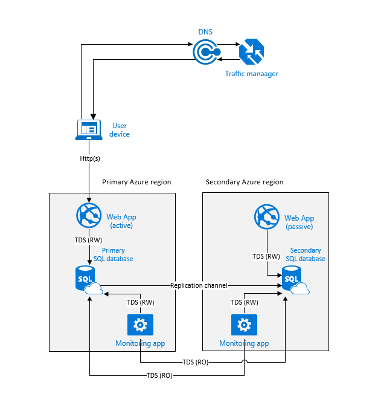
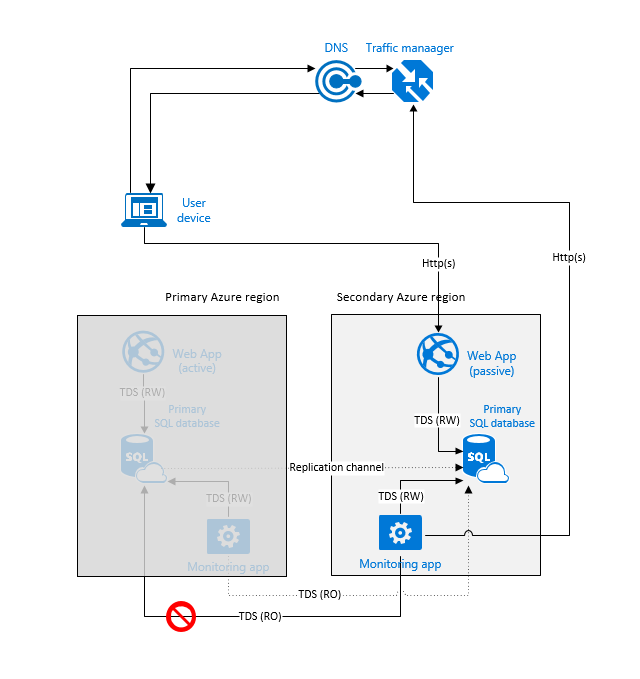
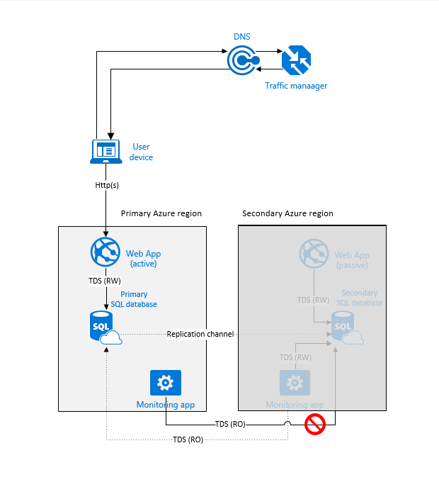
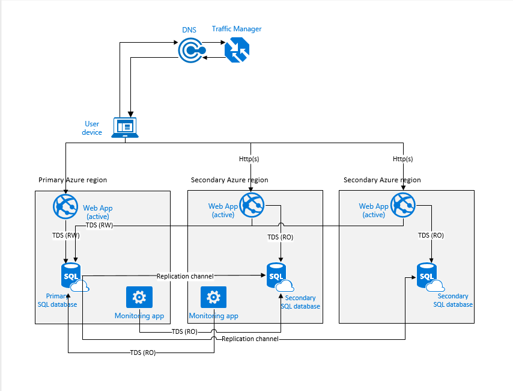
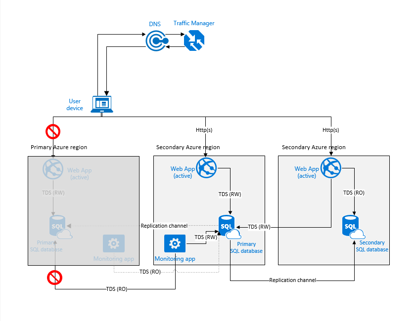
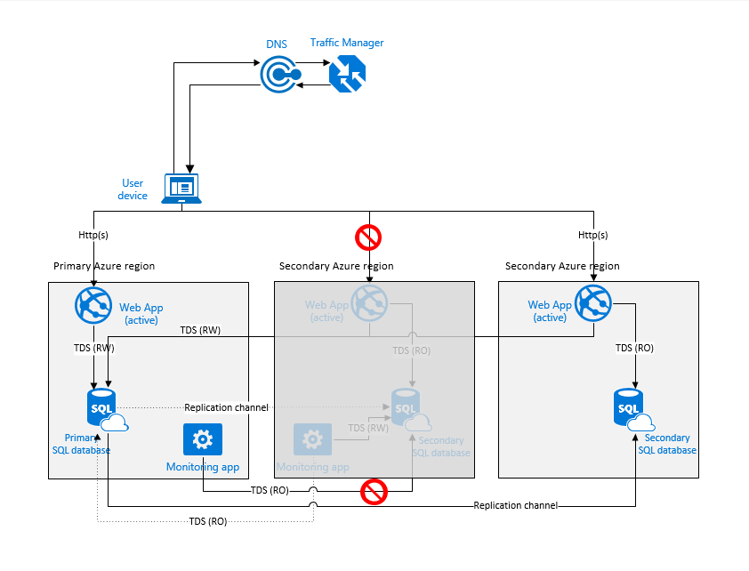
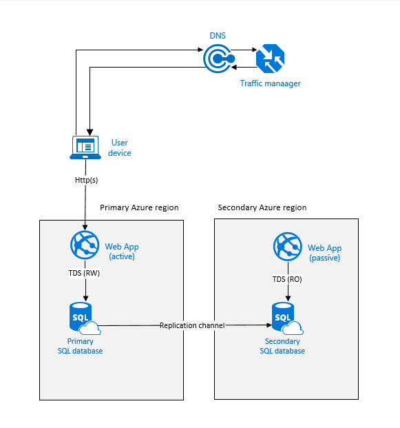
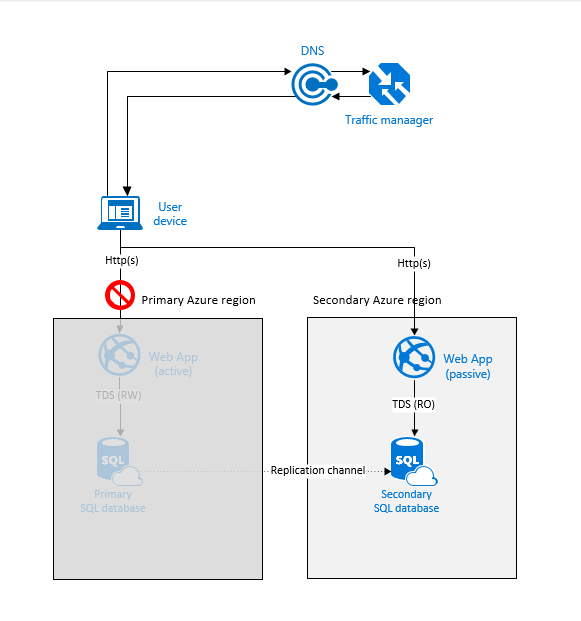
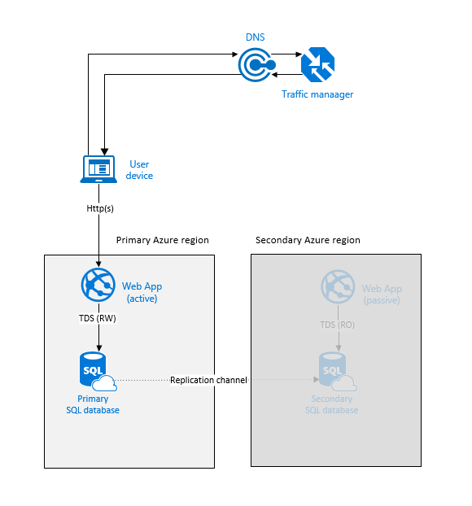

<properties
   pageTitle="Cloud Disaster Wiederherstellung Solutions - SQL-aktive Geo Datenbankreplikation | Microsoft Azure"
   description="Informationen Sie zum Entwerfen der Cloud Disaster Wiederherstellung Lösungen für Business Continuity-Planung Geo-Replikation für die app Daten Sicherung mit Azure SQL-Datenbank verwenden."
   keywords="Cloud Wiederherstellung, Disaster Wiederherstellung Lösungen, app Daten Sicherung Geo-Replikation, Business Continuity-Planung"
   services="sql-database"
   documentationCenter=""
   authors="anosov1960"
   manager="jhubbard"
   editor="monicar"/>

<tags
   ms.service="sql-database"
   ms.devlang="NA"
   ms.topic="article"
   ms.tgt_pltfrm="NA"
   ms.workload="data-management"
   ms.date="07/20/2016"
   ms.author="sashan"/>

# Entwerfen einer Anwendungs für die Cloud Wiederherstellung mit aktiven Geo-Replikation in SQL-Datenbank

> [AZURE.NOTE] [Aktive Geo-Replikation](sql-database-geo-replication-overview.md) ist nun für alle Datenbanken auf allen Ebenen verfügbar.

Informationen Sie zum Entwurf datenbankanwendungen robuste regionalen Fehlern und schwerwiegenden Ausfall [Aktiven Geo-Replikation](sql-database-geo-replication-overview.md) in SQL-Datenbank verwenden. Business Continuity-Planung, sollten Sie die Anwendung Bereitstellung Suchtopologie, Sie abgesehen haben, Servicelevel Datenverkehr Wartezeit und Kosten. In diesem Artikel wir schauen Sie sich die allgemeine Anwendung Muster und diskutieren, die vor- und Nachteile der einzelnen Optionen. Informationen zu aktiven Geo-Replikation mit flexible Pools finden Sie unter [Strategien für flexible Ressourcenpool zur Wiederherstellung](sql-database-disaster-recovery-strategies-for-applications-with-elastic-pool.md).

## Entwurfsmuster 1: Aktiv / Passiv-Bereitstellung für die Cloud Wiederherstellung mit einer Datenbank am selben Standort

Diese Option ist am besten geeignet für Applikationen die folgende Merkmale aufweist:

+ Aktive Instanz in einem einzigen Azure-Bereich
+ Signifikante Abhängigkeit Lese-und Schreibzugriff (RW) Zugriff auf Daten
+ Cross-Region Konnektivität zwischen die Logik der und die Datenbank ist nicht zulässig aufgrund von Wartezeit und den Datenverkehr Kosten    

In diesem Fall ist der Anwendung Bereitstellung Suchtopologie optimiert, für den Umgang mit regionalen Datenverluste, wenn alle Komponenten der Anwendung betroffen sind und Failover als Einheit müssen. Geografische Redundanzgründen die Logik der und die Datenbank in eine andere Region repliziert werden, aber sie werden nicht für die Anwendung Arbeitsbelastung Maßgabe normal verwendet. Die Anwendung in der Region sekundäre sollte konfiguriert sein, um eine SQL-Verbindungszeichenfolge für die sekundäre Datenbank verwenden. Datenverkehr Manager ist mit [Failover routing Methode](../traffic-manager/traffic-manager-configure-failover-routing-method.md)einrichten.  

> [AZURE.NOTE] [Azure Datenverkehr Manager](../traffic-manager/traffic-manager-overview.md) ist nur für Abbildung in diesem Artikel verwendet. Sie können eine Lösung für Lastenausgleich verwenden, die Routing Methode Failover zu unterstützen.    

Zusätzlich das Hauptfenster der Anwendung auftreten sollten Sie eine kleine [Worker Rolle Anwendung](cloud-services-choose-me.md#tellmecs) , die die primäre Datenbank überwacht werden, indem Sie periodische T-SQL schreibgeschützt (RO) Befehle bereitstellen. Sie können Sie automatisch ein Failover, generieren eine Benachrichtigung für Ihrer Anwendung-Verwaltungskonsole oder beide führen ausgelöst. Um sicherzustellen, dass die Überwachung nicht durch Region organisationsweite Ausfall beeinflusst wird, die Überwachung Anwendungsinstanzen jeder Region bereitzustellen und jede Instanz der primären Datenbank in der Region primären und sekundären Datenbank in die jeweilige Region verbunden haben. 

> [AZURE.NOTE] Sowohl aktiv sein und Untersuchen von primären und sekundären Datenbanken sollte die Überwachung von Applications. Letztere kann verwendet werden, einen Fehler in der sekundäre Region und Benachrichtigung zu erkennen, wenn die Anwendung nicht geschützt ist.     

Das folgende Diagramm veranschaulicht diese Konfiguration vor einem Ausfall.

Nach einem Ausfall benötigen in der primären Region erkennt die Überwachung Anwendung an, dass die primäre Datenbank nicht zugegriffen werden kann und eine Benachrichtigung registriert. Je nach Ihrer Anwendung Vereinbarung zum SERVICELEVEL können Sie entscheiden, wie viele aufeinander folgende Überwachung Stichproben fehlschlagen sollte, bevor sie eine Datenbank einem Dienstausfall deklariert. Um koordinierte Failover der Anwendung Endpunkt und die Datenbank zu erreichen, benötigen Sie die Überwachung Anwendung die folgenden Schritte ausführen:

1. [Aktualisieren Sie den Status der primären Endpunkt](https://msdn.microsoft.com/library/hh758250.aspx) , um ein Endpunkt Failover ausgelöst.
2. Rufen Sie die sekundäre Datenbank [Datenbank Failover](sql-database-geo-replication-portal.md)einleiten.

Nach einem Failover die Anwendung die Anfragen in der Region sekundäre verarbeitet jedoch bleibt, da die primäre Datenbank jetzt in der Region sekundäre gehört gemeinsame befindet, mit der Datenbank. Dieses Szenario wird durch das folgende Diagramm veranschaulicht. In allen Diagrammen durchgezogene Linien anzuzeigen aktive Verbindungen, gepunktete Linie kennzeichnet angehaltene Verbindungen zu und beenden Vorzeichen anzugeben Aktion Trigger.

Wenn ein Ausfall in der Region sekundäre geschieht, die Replikation Verknüpfung zwischen der primären und sekundären Datenbank unterbrochen ist und die Überwachung Anwendung registriert eine Benachrichtigung, dass die primäre Datenbank verfügbar gemacht wird. Die Leistung der Anwendung wird nicht beeinträchtigt, aber die Anwendung arbeitet zugänglicher und daher höhere Risiko im Fall beide Regionen ein Fehler auftreten, nacheinander.

> [AZURE.NOTE] Es empfiehlt sich nur auf Bereitstellungskonfigurationen mit einem einzelnen DR-Bereich. Dies ist, da die meisten der Azure Regionen beiden Regionen haben. Diese Konfigurationen werden Ihrer Anwendung aus einem Ausfall des beide Regionen nicht geschützt werden. In einem wahrscheinlich nicht Ereignis dieser Fehlfunktion können Sie Ihre Datenbanken in einen dritten Bereich mit [Geo - Wiederherstellungsvorgangs](sql-database-disaster-recovery.md#recovery-using-geo-restore)wiederherstellen.

Nachdem der Ausfall reduziert ist, wird die sekundäre Datenbank automatisch mit dem primären synchronisiert. Während der Synchronisierung konnte die Leistung der primären etwas abhängig von der Datenmenge beeinträchtigt werden, die synchronisiert werden soll. Das folgende Diagramm veranschaulicht, einen Ausfall in der sekundäre Region.

Die wichtigsten **Vorteile** dieses Musters Entwurf sind:

+ Die SQL-Verbindungszeichenfolge während der Bereitstellung der Anwendung in jeder Region festgelegt ist und nicht nach einem Failover ändern.
+ Die Leistung der Anwendung wird nicht durch Failover wie die Anwendung beeinträchtigt, und die Datenbank sind immer gemeinsame befindet.

Das Hauptfenster **Kompromiss** ist, dass die Anwendungsinstanz redundante in der Region sekundäre nur für die Wiederherstellung verwendet wird.

## Entwurfsmuster 2: aktive Bereitstellung für Anwendung den Lastenausgleich
Diese Cloud Disaster Wiederherstellungsoption eignet sich am besten, für Applikationen die folgende Merkmale aufweist:

+ Hohes Verhältnis zwischen der Datenbank liest, bis schreibt
+ Datenbank Schreibwartezeit wirkt sich nicht auf die durch den Endbenutzer  
+ Schreibgeschützte Logik kann von Lese-und Schreibzugriff Logik getrennt werden müssen, mithilfe einer anderen Verbindungszeichenfolge
+ Schreibgeschützte Logik ist nicht vollständig mit den neuesten Updates synchronisiert werden Daten abhängig  

Ihre Applications Merkmale verfügen, kann die Endbenutzer-Verbindungen den Lastenausgleich über mehrere Anwendungsinstanzen in unterschiedlichen Regionen Leistung und durch den Endbenutzer verbessern. Um den Lastenausgleich implementieren, sollte jeder Region eine aktive Instanz der Anwendung mit der Lese-und Schreibzugriff (RW) Logik mit der primären Datenbank in der primären Region verbunden haben. Die schreibgeschützte (RO) Logik sollte in eine sekundäre Datenbank im selben Bereich als Instanz der Anwendung verbunden sein. [Round-Robert routing](../traffic-manager/traffic-manager-configure-round-robin-routing-method.md) oder [Leistung routing](../traffic-manager/traffic-manager-configure-performance-routing-method.md) mit [Endpunkt Überwachung](../traffic-manager/traffic-manager-monitoring.md) für jede Anwendungsinstanz aktiviert verwenden sollten Datenverkehr Manager eingerichtet werden.

Wie Muster #1 sollten Sie eine ähnliche Überwachung Anwendung bereitstellen. Im Gegensatz zu Muster #1, die Überwachung Anwendung werden jedoch nicht für das Auslösen des Endpunkt Failovers zuständig.

> [AZURE.NOTE] Während dieses Muster mehrere sekundäre Datenbank verwendet, würde für die oben aufgeführten Gründe für Failover nur von einem sekundären Instanzen verwendet werden. Da dieses Muster schreibgeschützten Zugriff auf die sekundären erforderlich ist, muss Active Geo-Replikation.

Datenverkehr Manager sollte für routing, um die Benutzer-Verbindungen, um die geografische Position des Benutzers am nächsten Instanz der Anwendung direkte Leistung konfiguriert werden. Das folgende Diagramm veranschaulicht diese Konfiguration vor einem Ausfall.

Wenn ein Ausfall der Datenbank in der primären Region erkannt wird, rufen Sie Failover der primären Datenbank auf einen der sekundären Regionen, Ändern des Speicherorts der primären Datenbank. Der Datenverkehr-Manager automatisch offline Endpunkt aus der Tabelle routing ausschließt, aber weiterhin, den Endbenutzer Datenverkehr für die verbleibenden online Instanzen routing. Da die primäre Datenbank jetzt in einem anderen Bereich ist, müssen alle online Vorkommen deren Lese-und Schreibzugriff SQL-Verbindungszeichenfolge für die Verbindung mit dem neuen primären ändern. Es ist wichtig, dass Sie diese Änderung vor dem Initiieren des Datenbank Failovers vornehmen. Die schreibgeschützte SQL-Verbindungszeichenfolgen sollte unverändert bleiben, wie er immer in der Datenbank in der gleichen Region zeigen. Die Schritte Failover sind:  

1. Ändern Sie Lese-und Schreibzugriff SQL-Verbindungszeichenfolgen mit dem neuen primären verweisen.
2. Rufen Sie nacheinander [initiieren Datenbank](sql-database-geo-replication-portal.md)Failover vorgesehene sekundäre Datenbank ein.

Das folgende Diagramm veranschaulicht die neue Konfiguration nach dem Failover.

Bei einem Ausfall in einem der sekundären Regionen entfernt der Datenverkehr-Manager offline Endpunkt automatisch in diesem Bereich aus der routing-Tabelle. Der Replikation Kanal auf die sekundäre Datenbank in diesem Bereich wird die App angehalten. Da die übrigen Bereiche zusätzliche den Benutzerdatenverkehr in diesem Szenario erhalten, wird die Leistung der Anwendung während der Ausfall beeinflusst. Nachdem der Ausfall reduziert ist, wird die sekundäre Datenbank in der betroffenen Region sofort mit der primären synchronisiert. Während der Synchronisierung konnte die Leistung der primären etwas abhängig von der Datenmenge beeinträchtigt werden, die synchronisiert werden soll. Das folgende Diagramm veranschaulicht, einen Ausfall in einem der sekundären Regionen.

Der größte **Vorteil** der dieses Entwurfsmuster ist, dass Sie die Arbeitsbelastung Anwendung über mehrere sekundäre der Endbenutzer optimale Leistung erzielen skaliert werden können. Die **Nachteile** dieser Option werden:

+ Lese-und Schreibzugriff Verbindungen zwischen den Anwendungsinstanzen und die Datenbank haben, mit wechselnder Wartezeit und Kosten
+ Während der Ausfall ist die Leistung der Anwendung beeinflusst.
+ Anwendungsinstanzen sind so ändern Sie die SQL-Verbindungszeichenfolge dynamisch nach Datenbank Failover erforderlich.  

> [AZURE.NOTE] Ein ähnlichen Ansatz kann spezielle Auslastung wie das Melden von Aufträgen, Business Intelligence-Tools oder Sicherungen Auslagern verwendet werden. In der Regel diese Auslastung signifikante Datenbankressourcen beanspruchen daher wird empfohlen, dass Sie eine der sekundären Datenbanken für diese mit der Leistungsstufe abgeglichen mit der erwarteten Arbeitsbelastung gekennzeichnet.

## Entwurfsmuster 3: Aktiv / Passiv-Bereitstellung für Beibehaltung der Daten  
Diese Option ist am besten geeignet für Applikationen die folgende Merkmale aufweist:

+ Jeder Datenverlust ist hohe geschäftliche Risiken. Das Datenbank Failover kann nur als letzte Möglichkeit verwendet werden, wenn der Ausfall dauerhaft ist.
+ Die Anwendung kann in "schreibgeschützten Modus" für einen Zeitraum ausgeführt werden.

In diesem Muster wechselt die Anwendung in den schreibgeschützten Modus, wenn Sie mit der sekundären Datenbank verbunden. Die Logik der in der primären Region gemeinsame befindet, mit der primären Datenbank und arbeitet im Lese-und Schreibzugriff-Modus (RW). Die Anwendungslogik in der Region sekundäre befindet gemeinsame mit der sekundären Datenbank und bereit sind, die im schreibgeschützten Modus (RO) ausgeführt werden.  Datenverkehr Manager sollte von [Failover routing](../traffic-manager/traffic-manager-configure-failover-routing-method.md) mit [Endpunkt Überwachung](../traffic-manager/traffic-manager-monitoring.md) aktiviert für beide Anwendungsinstanzen eingerichtet werden.

Das folgende Diagramm veranschaulicht diese Konfiguration vor einem Ausfall.

Wenn der Datenverkehr-Manager einen Connectivity Fehler bei der primären Region erkennt, werden automatisch Datenverkehr von Benutzern zur Anwendungsinstanz in der Region sekundäre wechselt. Mit diesem Muster ist es wichtig, die Sie **keine** Datenbank Failover einleiten, nachdem der Ausfall erkannt wird. Die Anwendung in der Region sekundäre aktiviert ist und arbeitet im schreibgeschützten Modus mithilfe der sekundären Datenbank. Dies wird durch das folgende Diagramm veranschaulicht.

Nachdem der Ausfall in der primären Region verringert wird, wird Datenverkehr Manager erkennt die Wiederherstellung der Verbindung in der primären Region und wechselt Benutzerdatenverkehr wieder in die Instanz der Anwendung in der primären Region. Die Anwendungsinstanz von Lebensläufen und arbeitet im Lese-und Schreibzugriff-Modus mithilfe der primären Datenbank.

> [AZURE.NOTE] Da dieses Muster schreibgeschützten Zugriff auf die sekundären erfordert muss aktiven Geo-Replikation.

Bei einem Ausfall in der sekundäre Region der Datenverkehr-Manager kennzeichnet den Anwendung Endpunkt in der primären Region als heruntergestuft und der Replikation Kanal unterbrochen ist. In einem Dienstausfall wirkt sich jedoch nicht auf die Leistung der Anwendung während der Ausfall aus. Nachdem der Ausfall reduziert ist, wird die sekundäre Datenbank sofort mit der primären synchronisiert. Während der Synchronisierung konnte die Leistung der primären etwas abhängig von der Datenmenge beeinträchtigt werden, die synchronisiert werden soll.

Dieses Entwurfsmuster hat mehrere **Vorteile**:

+ Es können Datenverluste während der temporäre Ausfall vermieden.
+ Es ist nicht erforderlich eine Überwachung Anwendung bereitgestellt werden, während die Wiederherstellung durch den Datenverkehr Manager ausgelöst wird.
+ Ausfallzeiten hängt nur wie schnell Datenverkehr-Manager des Fehlers Connectivity erkennt, welche konfiguriert werden kann.

Die **Nachteile** sind:

+ Anwendung muss im schreibgeschützten Modus ausgeführt werden können.
+ Es ist erforderlich, um dynamisch zu wechseln, wenn sie mit einer schreibgeschützten Datenbank verbunden ist.
+ Wiederaufnahme des Betriebs Lese-und Schreibzugriff erfordert Wiederherstellung des primären Region, was, dass der vollständige Daten-Access bedeutet für Stunden oder sogar Tage möglicherweise deaktiviert ist.

> [AZURE.NOTE] Bei einer permanent Dienstausfall in der Region müssen Sie manuell Failover Datenbank aktivieren und akzeptieren der Datenverlust. Die Anwendung wird in der sekundäre Region mit schreibgeschützten Zugriff auf die Datenbank funktionsfähig sein.

## Business Continuity-Planung: Wählen Sie eine Anwendungsdesign für die Cloud Wiederherstellung

Wiederherstellungsstrategie bestimmte Cloud kann kombinieren oder diese entwurfmustern am besten Anforderungen Ihrer Anwendung erweitern.  Wie zuvor schon erwähnt, basiert die von Ihnen gewählte Strategie auf der Vereinbarung zum SERVICELEVEL, die Sie an Ihre Kunden und die Anwendung Bereitstellung Suchtopologie anbieten möchten. Um Ihre Entscheidung Leitfaden, in der folgenden Tabelle vergleicht die Auswahlmöglichkeiten basierend auf der geschätzten Datenverlust oder Wiederherstellung RPO-Ziele zeigen und geschätzte Dauer der Wiederherstellung (Einfügen).

| Muster | RPO | EINFÜGEN
| :--- |:--- | :---
| Aktiv / Passiv-Bereitstellung für die Wiederherstellung mit am selben Standort Datenbankzugriff | Lese-und Schreibzugriff < 5 s | Fehler bei der Erkennungszeit + Failover-API anrufen + Anwendung Überprüfung testen
| Aktive Bereitstellung für Anwendung den Lastenausgleich | Lese-und Schreibzugriff < 5 s | Fehler bei der Erkennungszeit + Failover API Anruf + Anwendung Überprüfung testen SQL-Verbindungszeichenfolge ändern
| Aktiv / Passiv-Bereitstellung für Beibehaltung der Daten | Schreibgeschützten Zugriff < 5 sec Lese-und Schreibzugriff = 0 (null) | Schreibgeschützten Zugriff = Connectivity Fehler Erkennungszeit + Anwendung Überprüfung testen  Lese-und Schreibzugriff = Zeit, die einem Dienstausfall zu verringern.

## Nächste Schritte

- Weitere Informationen zu Azure SQL-Datenbank automatische Sicherungskopien finden Sie unter [SQL-Datenbank automatische Sicherungskopien](sql-database-automated-backups.md)
- Eine Übersicht über Business-Continuity und Szenarien finden Sie unter [Übersicht über die Business continuity](sql-database-business-continuity.md)
- Weitere Informationen zum automatische Sicherungskopien für Wiederherstellung verwenden, finden Sie unter [Wiederherstellen einer Datenbank aus den Dienst initiiert Sicherungskopien](sql-database-recovery-using-backups.md)
- Weitere Informationen zu schneller Wiederherstellungsoptionen finden Sie unter [Aktiv-Geo-Replikation](sql-database-geo-replication-overview.md)  
- Weitere Informationen zum Verwenden automatische Sicherungskopien für Archivierung, finden Sie unter [Datenbank kopieren](sql-database-copy.md)
- Informationen zu aktiven Geo-Replikation mit flexible Pools finden Sie unter [Strategien für flexible Ressourcenpool zur Wiederherstellung](sql-database-disaster-recovery-strategies-for-applications-with-elastic-pool.md).
