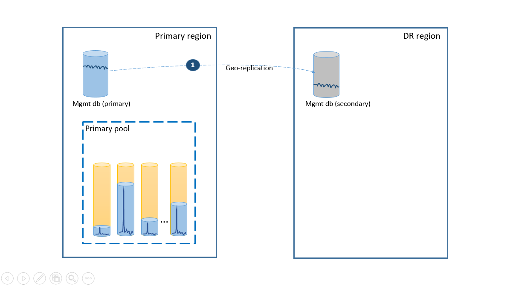
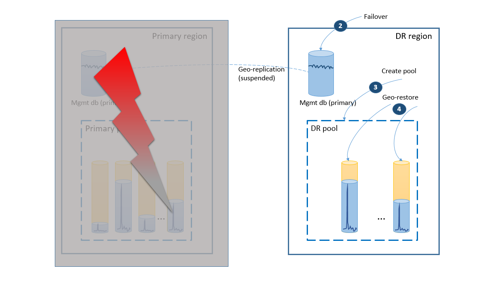
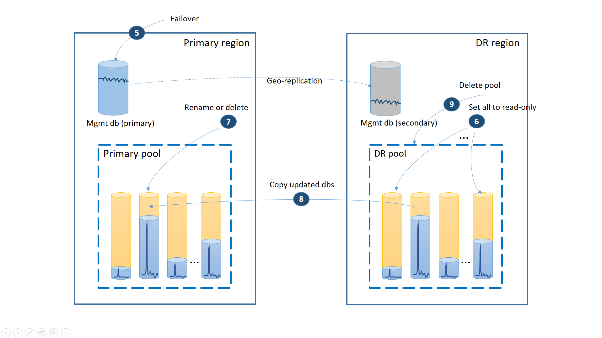
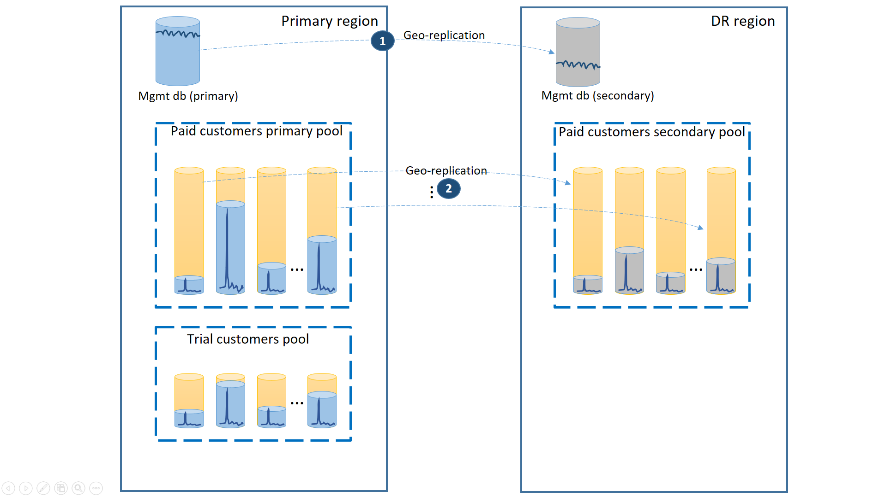
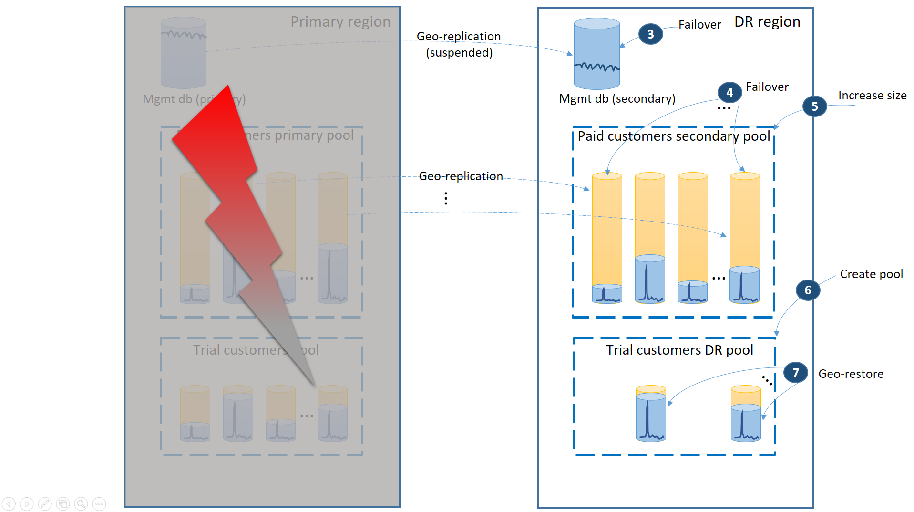
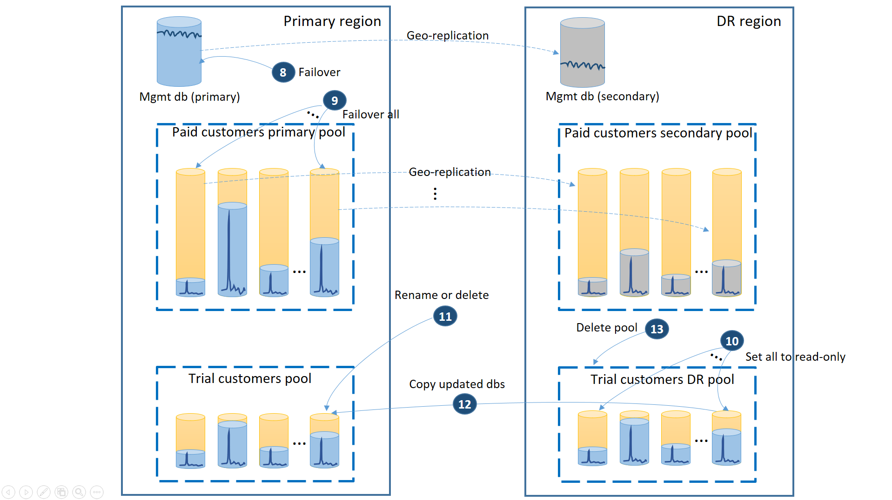
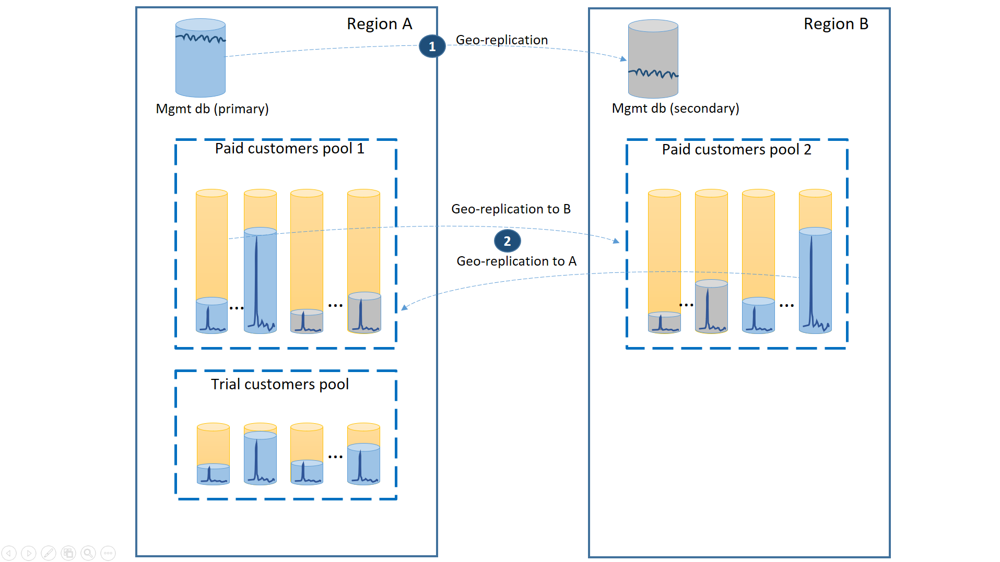
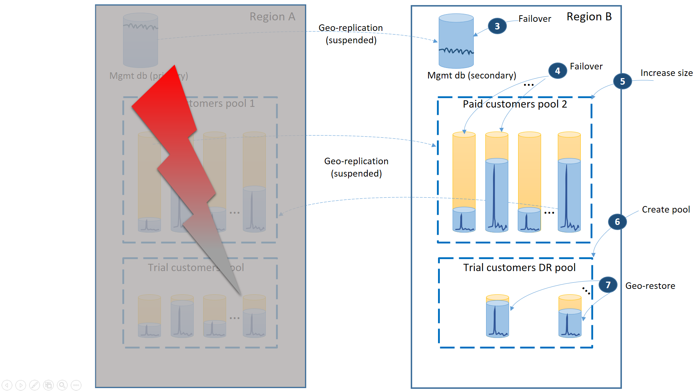
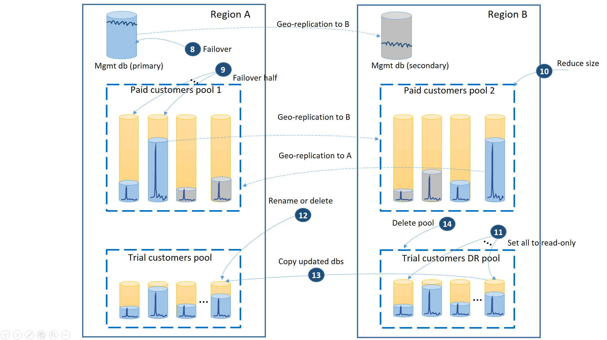

<properties 
   pageTitle="Entwerfen von Cloudlösungen für die Wiederherstellung mit SQL-Geo-Datenbankreplikation | Microsoft Azure"
   description="Erfahren Sie, wie Sie Ihre Cloudlösung für die Wiederherstellung auswählen des richtigen Failover Musters entwerfen."
   services="sql-database"
   documentationCenter="" 
   authors="anosov1960" 
   manager="jhubbard" 
   editor="monicar"/>

<tags
   ms.service="sql-database"
   ms.devlang="NA"
   ms.topic="article"
   ms.tgt_pltfrm="NA"
   ms.workload="NA" 
   ms.date="07/16/2016"
   ms.author="sashan"/>

# Strategien für zur Wiederherstellung für Applikationen mit SQL-Datenbank flexible Ressourcenpool 

In den Jahren, die wir gelernt haben, dass die Cloud Services nicht absolute Sicherheit und schwerwiegenden Ereignisse sind tritt und können. SQL-Datenbank bietet eine Reihe von Funktionen für die Geschäftskontinuität Ihrer Anwendung bereitgestellt werden, wenn diese Fälle auftreten. [Flexible Pools](sql-database-elastic-pool.md) und eigenständigen Datenbanken unterstützen die gleiche Art von Disaster Wiederherstellungsfunktionen. In diesem Artikel werden verschiedene DR Strategien für elastisch, die zusammengefasst diese SQL-Datenbank Business Continuity-Funktionen nutzen.

Im Sinne dieses Artikels verwenden wir das kanonische SaaS ISV Anwendung Muster:

<i>Eine moderne cloudbasierte steht Web-Anwendung Vorschriften mit einer SQL-Datenbank für jeden Benutzer beenden. ISV hat eine große Anzahl von Kunden und daher bekannte als Mandanten Datenbanken viele andere Datenbanken verwendet. Da die Mandanten-Datenbanken in der Regel nicht vorhersehbar Aktivität Mustern haben, verwendet der ISV eine flexible Ressourcenpool, um der Datenbank, die Kosten über längere Zeit sehr vorhersehbar können. Flexible Pool vereinfacht auch die Verwaltung der Leistung, wenn die Aktivitäten von Benutzern, Spitzen. Zusätzlich zu den Mandanten Datenbanken verwendet die Anwendung auch mehrere Datenbanken verwalten von Benutzerprofilen, Sicherheit, Verwendungsmustern usw. sammeln. Verfügbarkeit der einzelnen Mandanten wirkt sich nicht auf Verfügbarkeit der Anwendung, als ganze aus. Jedoch die Verfügbarkeit und Leistung von Management Datenbanken ist entscheidend, für die Anwendung (Funktion) und die gesamte Anwendung ist offline, wenn die Verwaltungsdatenbanken offline sind.</i>  

In den Rest des Papiers werden die DR Strategien darüber liegendem einen Zellbereich Szenarios aus der Kosten vertrauliche Autostart-Programme auf diejenigen mit strengen Verfügbarkeit Anforderungen behandelt.  

## Szenario 1. Vertrauliche Start Kosten

<i>Ich bin eines Unternehmens am effektivsten Start und Versuche extrem vertrauliche Kosten.  Ich möchte Bereitstellung und Verwaltung der Anwendung zu vereinfachen, und ich möchte an eine begrenzte Vereinbarung zum SERVICELEVEL für einzelne Kunden haben. Aber ich möchte die Anwendung zu gewährleisten, wie ein ganzes nie offline ist.</i>

Um die Vereinfachung Anforderung zu erfüllen, alle Mandanten Datenbanken in eine flexible Ressourcenpool in der Region Azure Ihrer Wahl bereitzustellen und die Datenbanken Management als eigenständigen Geo repliziert Datenbanken bereitstellen. Verwenden Sie für die Wiederherstellung des Mandanten Geo-wiederherstellen, ohne zusätzliche Kosten stammt. Um die Verfügbarkeit der Datenbanken Management sicherzustellen, sollten sie in eine andere Region (Schritt 1) Geo repliziert sein. Die laufende Kosten der Wiederherstellung Disaster Konfiguration in diesem Szenario ist die Gesamtkosten der sekundären Datenbanken gleich. Diese Konfiguration wird im nächsten Diagramm veranschaulicht.

Die Schritte zur Wiederherstellung Ihrer Anwendung online schalten werden bei einem Ausfall in der primären Region indem Sie das folgende Diagramm veranschaulicht.

- Failover der Verwaltung Datenbanken sofort (2) in den Bereich DR an. 
- Ändern der Verbindungszeichenfolge der Anwendung, in der Region DR verweisen. Alle neuen Konten und Mandanten Datenbanken werden in der Region DR erstellt. Vorhandenen Kunden werden ihre Daten vorübergehend nicht verfügbar angezeigt.
- Erstellen Sie den flexible Pool mit der gleichen Konfiguration wie dem ursprünglichen Pool (3). 
- Verwenden Sie zum Erstellen von Kopien von den Mandanten Datenbanken (4) Geo-wiederherstellen. Können Sie erwägen Sie die einzelnen stellt durch den Endbenutzer-Verbindungen auslösen oder einige andere Anwendung bestimmte Prioritätsschema verwenden.

An diesem Punkt Ihrer Anwendung befindet sich in der Region DR wieder online, jedoch einige Kunden tritt Verzögerung aus, wenn Sie ihre Daten zugreifen.

Wenn der Ausfall temporäre wurde, ist es möglich, dass die primäre Region durch Azure wiederhergestellt werden, wird bevor alle stellt die in der Region DR abgeschlossen werden. In diesem Fall sollten Sie Koordinieren von der Anwendung wieder in die primäre Region verschieben. Der Vorgang dauert die Schritte im nächsten Diagramm dargestellt.
 
- Brechen Sie alle ausstehenden Geo-wiederherstellen Anfragen ab.   
- Failover die Management-Datenbanken, um die primäre Region (5). Hinweis: Nach der Wiederherstellung des Bereichs die alten Grundfarben automatisch sekundäre geworden. Jetzt werden diese Rollen erneut wechseln. 
- Ändern der Verbindungszeichenfolge für der Anwendung wieder in die primäre Region verweisen. Nun werden alle Konten und Mandanten Datenbanken in der primären Region erstellt werden. Einige vorhandenen Kunden werden ihre Daten vorübergehend nicht verfügbar angezeigt.   
- Legen Sie alle Datenbanken im Pool DR als schreibgeschützt, um sicherzustellen, dass sie in der Region DR (6) geändert werden können. 
- Umbenennen Sie für jede Datenbank im Pool DR, der seit der Wiederherstellung geändert hat oder löschen Sie die entsprechenden Datenbanken im primären Pool (7). 
- Kopieren Sie die aktualisierten Datenbanken aus dem Pool DR an den primären Pool (8). 
- Löschen Sie die DR Ressourcenpool (9)

Die Anwendung wird an diesem Punkt in der primären Region mit allen Mandanten Datenbanken verfügbar im primären Pool online sein.

Die wichtigsten **Vorteile** dieser Strategie ist niedrig laufenden Kosten für Ebene Datenredundanz. Sicherungskopien werden vom Dienst SQL-Datenbank mit keine erneute Anwendung schreiben und ohne zusätzliche Kosten automatisch übernommen.  Die Kosten fallen nur, wenn die flexible Datenbanken wiederhergestellt werden. Die **Wechselwirkung** ist die vollständige Wiederherstellung aller Mandanten Datenbanken viel Zeit in Anspruch nehmen. Es, hängt von der Summe der stellt, die Sie in der Region DR initiieren Zahl und Gesamtgröße der Datenbanken Mandanten. Auch wenn Sie einige Mandanten stellt über andere priorisieren, werden alle anderen stellt Anspruch, die in der gleichen Region initiiert werden, wie der Dienst vermitteln und einschränken, um die gesamte Auswirkung auf die bestehende Kunden Datenbanken zu minimieren. Darüber hinaus kann die Wiederherstellung der Datenbanken Mandanten erst anfangen, das neue flexible Pool in der Region DR erstellt wird.

## Szenario 2. Reifen Anwendung mit gestufte service 

<i>Ich bin einer Reifen SaaS-Anwendung mit gestufte Service-Angebote und anderen SLAs für Kunden zum Testen und Kunden bezahlen. Bei der Testversion muss ich die Kosten so weit wie möglich zu verringern. Zum Testen Kunden Ausfallzeiten optimieren können, aber ich möchte Sie deren Wahrscheinlichkeit verringern. Für zahlenden Kunden ist eine Ausfallzeit eines Risikos Flight. Damit ich möchte, um sicherzustellen, die Zahlen sind Kunden immer auf ihre Daten zugreifen.</i> 

Um dieses Szenario zu unterstützen, muss die Testversion Mandanten separaten flexible Pools Inbetriebnahme von kostenpflichtiges Mandanten eingehalten werden. Zum Testen Kunden müssten unteren eDTU pro Mandant und unteren Vereinbarung zum SERVICELEVEL mit mehr Wiederherstellungszeit. Zahlenden Kunden wäre in einem Ressourcenpool mit höheren eDTU pro Mandant und eine höhere Vereinbarung zum SERVICELEVEL. Damit die niedrigste Wiederherstellungszeit sichergestellt ist, sollte der zahlenden Kunden Mandanten Datenbanken Geo repliziert werden. Diese Konfiguration wird im nächsten Diagramm veranschaulicht. 

Wie in der ersten Szenario werden die Verwaltung Datenbanken ganz aktiv sein, sodass Sie dafür (1) eine eigenständigen Geo repliziert Datenbank verwenden. Dadurch wird die vorhersehbare Leistung für neue Kundenabonnements, Profil Updates und andere Vorgänge Management sichergestellt. Die Region, in der die Grundfarben für die Verwaltung Datenbanken befinden, werden die primäre Region und die Region, in der der sekundäre für die Verwaltung Datenbanken befinden, werden der DR Region.

Der zahlenden Kunden Mandanten Datenbanken, aktive Datenbanken im nach der Bereitstellung in der primären Region "kostenpflichtiges" Pool müssen. Sie sollten eine sekundäre Ressourcenpool mit demselben Namen in der Region DR bereitstellen. Jede Mandanten wäre Geo repliziert an den sekundären Pool (2). Dadurch wird eine schnelle Wiederherstellung aller Mandanten Datenbanken mit Failover aktiviert. 

Wenn ein Ausfall der primären Region auftritt, werden die Schritte zur Wiederherstellung Ihrer Anwendung online schalten im nächsten Diagramm veranschaulicht:

- Über die Management-Datenbanken, um die Region DR (3) unmittelbar fehl.
- Ändern der Anwendung Verbindungszeichenfolge in der Region DR verweisen. Nun werden alle Konten und Mandanten Datenbanken in der Region DR erstellt werden. Die vorhandenen Testversion Kunden werden ihre Daten vorübergehend nicht verfügbar angezeigt.
- Failover den kostenpflichtiges Mandanten Datenbanken mit dem Pool in der Region DR ihrer Verfügbarkeit (4) sofort wiederherstellen. Da das Failover eine schnelle Metadaten Ebene Änderung ist möglicherweise Sie eine Optimierung berücksichtigen, in dem die einzelnen Failovers bei Bedarf durch den Endbenutzer-Verbindungen ausgelöst werden. 
- Wenn der Größe Ihrer sekundäre Ressourcenpool eDTU kleiner als der primäre wurde, da die sekundären Datenbanken nur Kapazität, um die Änderungsprotokolle zu verarbeiten, während sie sekundäre waren erforderlich, sollten Sie sofort im Ressourcenpool Kapazität jetzt die vollständige Auslastung der alle Mandanten (5) erhöhen. 
- Erstellen Sie den neuen flexible Pool mit demselben Namen und die gleiche Konfiguration in der Region DR für die Testversion Kunden Datenbanken (6). 
- Nachdem der Testversion Kunden Ressourcenpool erstellt wurde, verwenden Sie Geo-wiederherstellen, um die einzelnen testmandanten Datenbanken in den neuen Pool (7) wiederherzustellen. Können Sie erwägen Sie die einzelnen stellt durch den Endbenutzer-Verbindungen auslösen oder einige andere Anwendung bestimmte Prioritätsschema verwenden.

Im Bereich DR ist eine Anwendung zu diesem Zeitpunkt wieder online. Alle zahlende Kunden haben Zugriff auf ihre Daten, während die Testversion Kunden beim Zugriff auf ihre Daten Verzögerung werden.

Wenn die primäre Region wiederhergestellt wurde können durch Azure *nachdem* Sie die Anwendung in der Ausführung der Anwendung in diesem Bereich fortzusetzen DR-Region wiederhergestellt haben oder Sie wieder in die primäre Region fehlschlägt. Ist die primäre Region wiederhergestellte *vor* ist des Failovervorgangs abgeschlossen Sie defekte Back sofort zu berücksichtigen sind. Das Failback dauert die Schritte in der nächsten Abbildung dargestellt: 
 

- Brechen Sie alle ausstehenden Geo-wiederherstellen Anfragen ab.   
- Failover der Verwaltung einer Datenbank (8). Nach der Wiederherstellung des Bereichs hatten die alte primär automatisch des sekundären werden. Jetzt wird es der primären wieder.  
- Failover den kostenpflichtiges Mandanten Datenbanken (9). Nach der Wiederherstellung des Bereichs werden die alten Grundfarben auf ähnliche Weise automatisch die sekundäre. Nun werden sie erneut die Grundfarben werden. 
- Legen Sie zum Testen wiederhergestellten Datenbanken, die in der Region DR auf schreibgeschützt (10) geändert wurden.
- Umbenennen Sie für jede Datenbank im Pool Testversion Kunden DR, die seit der Wiederherstellung geändert oder löschen Sie die entsprechende Datenbank im Testversion Kunden primären Pool (11). 
- Kopieren Sie die aktualisierten Datenbanken aus dem Pool DR an den primären Pool (12). 
- Löschen Sie die DR Ressourcenpool (13) 

> [AZURE.NOTE] Das Failover ist asynchrone. Um die Uhrzeit der Wiederherstellung minimieren ist es wichtig, dass Sie die Mandanten-Datenbanken Failover Befehl in Stapeln von mindestens 20 Datenbanken ausführen. 

Die wichtigsten **Vorteile** dieser Strategie ist, dass sie der höchsten Vereinbarung zum SERVICELEVEL für zahlenden Kunden bereitstellt. Darüber hinaus ist gewährleistet, dass die neuen Versuche freigegeben werden soll, sobald der Testversion DR Ressourcenpool erstellt wird. Die **Wechselwirkung** ist, dass dieses Setup die Gesamtkosten der Mandanten Datenbanken durch die Kosten der sekundäre DR Ressourcenpool für Kunden kostenpflichtiges vergrößert wird. Darüber hinaus weist die sekundäre Ressourcenpool auf einen anderen Schriftgrad, werden die zahlenden Kunden die Leistung unteren nach Failover erst nach Abschluss des Upgrades Ressourcenpool in der Region DR. 

## Szenario 3. Örtlich verteilte Anwendung mit gestufte service

<i>Ich habe eine ältere SaaS Anwendung mit gestufte Dienst angeboten. Ich möchte bieten eine sehr anspruchsvoll Vereinbarung zum SERVICELEVEL meinen kostenpflichtiges Kunden und das Risiko von Einfluss minimieren, wenn Ausfall ausgeführt werden, da auch kurze Unterbrechung Kunden führen führen kann. Es ist entscheidend, dass die zahlenden Kunden immer auf ihre Daten zugreifen können. Die Versuche sind kostenlos, und eine Vereinbarung zum SERVICELEVEL wird nicht während des Testzeitraums angeboten.</i> 

Um dieses Szenario zu unterstützen, sollten Sie drei separate flexible Pools verfügen. Zwei gleicher Größe Pools mit hoher eDTUs pro Datenbank sollten in zwei verschiedener Regionen der kostenpflichtiges Kunden Mandanten Datenbanken enthalten bereitgestellt werden. Der dritte Ressourcenpool mit der Testversion Mandanten müssten einer unteren eDTUs pro Datenbank und in einem der beiden Region bereitgestellt werden.

Damit der niedrigsten Wiederherstellungszeit während Ausfall der zahlenden Kunden Mandanten sichergestellt ist sollten Datenbanken mit 50 % der primären Datenbanken in den beiden Regionen Geo repliziert. Auf ähnliche Weise wird jeder Bereich mit 50 % der sekundären Datenbanken angezeigt. Auf diese Weise ist eine Region offline nur 50 % der Datenbanken der kostenpflichtiges Kunden beeinträchtigt werden würde und Failover müssten. Die anderen Datenbanken würde intakt. Diese Konfiguration wird in der folgenden Abbildung dargestellt:

Wie in den vorherigen Szenarien werden die Verwaltung Datenbanken ganz aktiv sein, damit Sie sie als eigenständigen Geo repliziert Datenbanken (1) konfigurieren sollte. Dadurch wird die vorhersehbare Leistung der neuen Kundenabonnements, Profil Updates und andere Vorgänge Management sichergestellt. Region A wäre der primären Region für die Verwaltung Datenbanken und die Region B für die Verwaltung Datenbanken verwendet werden.

Der zahlenden Kunden Mandanten Datenbanken werden Geo repliziert jedoch mit Primärfarben auch und sekundäre zwischen Region A und B (2)-Region teilen. Auf diese Weise die primäre Mandanten-Datenbanken von der Ausfall betroffen können Failover auf den anderen Region und erst verfügbar. Die andere Hälfte der Datenbanken Mandanten ist gar nicht betroffen. 

Das folgende Diagramm veranschaulicht die Schritte zur Wiederherstellung werden müssen, wenn es sich bei einem Ausfall in der Region a

- Über die Management-Datenbanken Region B (3) unmittelbar fehl.
- Ändern der Anwendung Verbindungszeichenfolge zu zeigen Sie auf diese Management-Datenbanken in der Region b ändern die Verwaltung-Datenbanken, um sicherzustellen, dass die Konten und Datenbanken Mandanten erstellt werden in der Region B und die vorhandenen Mandanten Datenbanken gefunden es auch, an. Die vorhandenen Testversion Kunden werden ihre Daten vorübergehend nicht verfügbar angezeigt.
- Failover den kostenpflichtiges Mandanten Datenbanken Pool 2 im Bereich B zu ihrer Verfügbarkeit (4) sofort wiederherstellen. Da das Failover eine schnelle Metadaten Ebene Änderung ist möglicherweise Sie eine Optimierung berücksichtigen, in dem die einzelnen Failovers bei Bedarf durch den Endbenutzer-Verbindungen ausgelöst werden. 
- Da jetzt enthält Pool 2 nur primäre Datenbanken, die die gesamte Arbeitsbelastung im Pool vergrößert wird, damit Sie sofort eDTU (5) vergrößern sollte. 
- Erstellen Sie den neuen flexible Pool mit demselben Namen und die gleiche Konfiguration in der Region "B" für die Testversion Kunden Datenbanken (6). 
- Nachdem der Ressourcenpool erstellt wurde Formular mit Geo-wiederherstellen die einzelnen testmandanten Datenbank wiederherstellen, in dem Pool (7). Können Sie erwägen Sie die einzelnen stellt durch den Endbenutzer-Verbindungen auslösen oder einige andere Anwendung bestimmte Prioritätsschema verwenden.

> [AZURE.NOTE] Das Failover ist asynchrone. Um die Uhrzeit der Wiederherstellung minimieren ist es wichtig, dass Sie die Mandanten-Datenbanken Failover Befehl in Stapeln von mindestens 20 Datenbanken ausführen. 

An diesem Punkt ist Ihrer Anwendung wieder online im Bereich B. Alle zahlende Kunden haben Zugriff auf ihre Daten, während die Testversion Kunden beim Zugriff auf ihre Daten Verzögerung werden.

Wenn Region A wiederhergestellt wird, müssen Sie entscheiden, ob Region B für Testversion Kunden oder Failback mit dem Pool Testversion Kunden in der Region a verwendet werden soll Ein Kriterium könnte die % des testmandanten Datenbanken nach der Wiederherstellung geändert. Unabhängig von dieser Entscheidung müssen Sie erneut die kostenpflichtigen Mandanten zwischen zwei Pools abzuwägen. Das folgende Diagramm veranschaulicht den Prozess, wenn die Datenbanken testmandanten wieder in der Region a fehl  
 

- Brechen Sie alle ausstehenden Geo-wiederherstellen Anfragen zu testen DR Ressourcenpool ab.   
- Failover der Datenbank Management (8). Nach der Wiederherstellung des Bereichs hatten die alte primäre automatisch Anzeige des sekundären. Jetzt wird es der primären wieder.  
- Wählen Sie welche kostenpflichtiges Mandanten Datenbanken wieder in Ressourcenpool 1 und initiieren Failover zu deren sekundäre (9) fehl. Nach der Wiederherstellung des Bereichs ist für alle Datenbanken in Ressourcenpool 1 automatisch sekundäre seit. 50 % der wird jetzt wieder Primärfarben werden. 
- Verringern der Größe Pool 2 zu den ursprünglichen eDTU (10).
- Festlegen aller wiederhergestellt zum Testen von Datenbanken in der Region B auf schreibgeschützt (11).
- Umbenennen Sie oder löschen Sie die entsprechende Datenbank im Testversion primären Pool (12), für jede Datenbank im Testversion DR Pool, der seit der Wiederherstellung geändert hat. 
- Kopieren Sie die aktualisierten Datenbanken aus dem Pool DR an den primären Pool (13). 
- Löschen Sie die DR Ressourcenpool (14) 

Die wichtigsten **Vorteile** dieser Strategie sind:

- Es unterstützt der am häufigsten anspruchsvollen Vereinbarung zum SERVICELEVEL für zahlenden Kunden, da es stellt sicher, dass es sich bei ein Ausfall nicht mehr als 50 % der Datenbanken Mandanten beeinträchtigen kann. 
- Es wird sichergestellt, dass die neuen Versuche freigegeben werden soll, sobald der Spur DR Ressourcenpool bei der Wiederherstellung erstellt wurde. 
- Es ermöglicht effizientere Nutzung der Ressourcenpool Kapazität, wie 50 % des sekundären Datenbanken in Ressourcenpool 1 und 2-Pool garantiert sind weniger aktiv und dann die primären Datenbanken.

Die wichtigsten **vor-und Nachteile** sind:

- Die Vorgänge für die Verwaltung einer Datenbank können unteren Wartezeit für den Endbenutzer Region A als Region B verbunden sind, wie sie anhand der primären von der Verwaltung einer Datenbank ausgeführt werden, werden der Endbenutzer verbunden sind.
- Es ist eine komplexeren Entwurf der Datenbank Management erforderlich. Jeden Datensatz Mandanten müssten beispielsweise eine Kategorie Speicherort befinden, die während Failover und Failback geändert werden muss.  
- Zahlenden Kunden auftreten geringere Leistung als Deutsch erst nach Abschluss des Upgrades Ressourcenpool in der Region B. 

## Zusammenfassung

Dieser Artikel befasst sich der Strategien zur Wiederherstellung, für die Datenbank-Leiste von einer SaaS ISV mit mehreren Mandanten Anwendung verwendet. Die von Ihnen gewählte Strategie sollte auf den Anforderungen der Anwendung, wie z. B. Business-Modell, der Vereinbarung zum SERVICELEVEL basieren, die Sie an Ihre Kunden anbieten, budget Einschränkung usw. möchten... Jeder Strategie beschrieben werden die Vorteile als auch Wechselwirkung, damit Sie eine fundierte Entscheidung treffen können. Darüber hinaus wird eine bestimmte Anwendung wahrscheinlich andere Azure Komponenten enthalten. So überprüfen ihre Business Continuity Anleitungen, und die Wiederherstellung der Datenbank Stufe mit ihnen koordinieren. Weitere Informationen zum Verwalten der Wiederherstellung in Azure Datenbank-Anwendung finden Sie unter [Erstellen eines Konzepts Cloud-Lösungen für die Wiederherstellung](./sql-database-designing-cloud-solutions-for-disaster-recovery.md) .  

## Nächste Schritte

- Weitere Informationen zu Azure SQL-Datenbank automatische Sicherungskopien finden Sie unter [SQL-Datenbank automatische Sicherungskopien](sql-database-automated-backups.md)
- Eine Übersicht über Business-Continuity und Szenarien finden Sie unter [Übersicht über die Business continuity](sql-database-business-continuity.md)
- Weitere Informationen zum automatische Sicherungskopien für Wiederherstellung verwenden, finden Sie unter [Wiederherstellen einer Datenbank aus den Dienst initiiert Sicherungskopien](sql-database-recovery-using-backups.md)
- Weitere Informationen zu schneller Wiederherstellungsoptionen finden Sie unter [Aktiv-Geo-Replikation](sql-database-geo-replication-overview.md)  
- Weitere Informationen zum Verwenden automatische Sicherungskopien für Archivierung, finden Sie unter [Datenbank kopieren](sql-database-copy.md)
