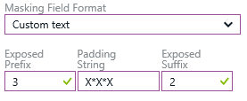
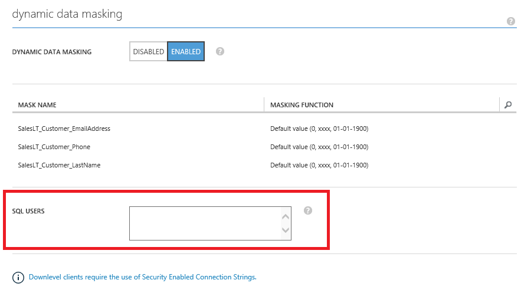
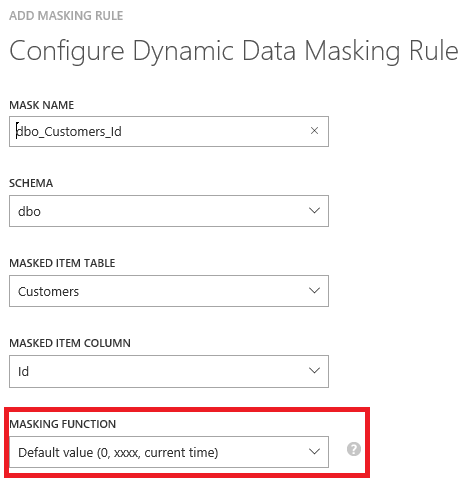

<properties
   pageTitle="Erste Schritte mit SQL-Datenbank dynamische Daten Masking (klassische Azure-Portal)"
   description="Gewusst wie: Erste Schritte mit SQL-Datenbank dynamische Daten Masking im klassischen Azure-Portal"
   services="sql-database"
   documentationCenter=""
   authors="ronitr"
   manager="jhubbard"
   editor=""/>

<tags
   ms.service="sql-database"
   ms.devlang="NA"
   ms.topic="article"
   ms.tgt_pltfrm="NA"
   ms.workload="data-services"
   ms.date="07/10/2016"
   ms.author="ronitr; ronmat; v-romcal; sstein"/>

# Erste Schritte mit SQL-Datenbank dynamische Daten Masking (klassische Azure-Portal)

> [AZURE.SELECTOR]
- [Dynamic Data Masking - Azure-Portal](sql-database-dynamic-data-masking-get-started.md)

## (Übersicht)

SQL-Datenbank dynamische Daten Masking beschränkt vertrauliche Daten anzeigen, indem sie für Benutzer ohne Berechtigungen masking ist. Dynamische Daten Masking wird die V12-Version von SQL Azure-Datenbank unterstützt.

Dynamische Daten Masking hilft unbefugten Zugriff auf wichtige Daten zu verhindern, da die Kunden bestimmen, wie viel der sensiblen Daten mit minimaler Auswirkung auf die Anwendungsebene bereitzustellen. Es ist eine Policy-basierte Sicherheitsfunktion, die die sensiblen Daten im Resultset einer Abfrage über vorgesehenen Datenbankfelder, ausgeblendet, während die Daten in der Datenbank nicht geändert werden.

Beispielsweise einen Kundendienstmitarbeiter in einem Callcenter möglicherweise Anrufer identifizieren, indem Sie mehrere Ziffern ihrer Sozialversicherungsnummer oder Kreditkartennummer, aber diese Datenelemente nicht vollständig verfügbar gemacht werden mit der Mitarbeiter. Eine Regel Masking kann definiert werden, dass alle Masken, aber die letzten vier Ziffern von Sozialversicherungsnummer oder Kreditkartennummer im Ergebnis einer Abfrage festlegen. Ein weiteres Beispiel kann ein Eingabeformat entsprechenden Daten zum Schützen von Daten personenbezogene Informationen (PII) definiert werden, damit ein Entwickler Herstellung Umgebungen für die Problembehandlung ohne gegen Compliance-Vorschriften zu Abfragen kann.

## SQL-Datenbank dynamische Daten Masking-Grundlagen

Sie richten dynamische Daten masking Richtlinie im klassischen Azure-Portal unter der Registerkarte Überwachung und Sicherheit für Ihre Datenbank ein.

> [AZURE.NOTE] Um dynamische Daten im Portal Azure masking eingerichtet haben, finden Sie unter [Erste Schritte mit SQL Datenbank dynamische Daten Masking (Azure-Portal)](sql-database-dynamic-data-masking-get-started.md).

### Dynamische Daten Masking Berechtigungen

Dynamische Daten Masking kann nach der Azure-Datenbank-Administrator, Serveradministrator oder Security Officer Rollen konfiguriert werden.

### Dynamische Daten Masking Richtlinie

* **SQL-Benutzer von Masking ausgeschlossen** - eine Reihe von SQL-Benutzer oder AAD Identitäten, die nicht maskierte Daten in den Abfrageergebnissen SQL erhält. Beachten Sie, dass Benutzer mit Administratorberechtigungen von Masking immer ausgeschlossen werden werden, und die ursprünglichen Daten ohne Maske werden angezeigt.

* **Regeln masking** - eine Reihe von Regeln, die definieren die vorgesehenen Felder, die maskierte werden und die Masking-Funktion, die verwendet werden soll. Die vorgesehenen Felder können mit einem Schema Datenbankname, Tabellennamen und Spaltennamen definiert werden.

* **Funktionen masking** - eine Reihe von Methoden, die das Anzeigen von Daten für unterschiedliche Szenarien steuern.

| Masking (Funktion) | Masking Logik |
|----------|---------------|
| **Standard**  |**Vollständige Masking entsprechend die Datentypen der vorgesehenen Felder**  • Verwenden XXXX oder weniger x ist die Größe des Felds weniger als 4 Zeichen für Zeichenfolgen-Datentypen (Nchar, Ntext Nvarchar). • Verwenden Sie einen Nullwert für numerische Datentypen (Bigint, Bit, Dezimalstellen, Int, Geld, numerischen, Smallint, Smallmoney, Tinyint, Pufferzeiten, Real). • Verwenden 01-01-1900 für Datum/Uhrzeit-Datentypen (Datum, datetime2, Datetime, Datetimeoffset, Smalldatetime, Zeit). • Bei SQL Variante des Standardwerts für den aktuellen Typ wird verwendet. • Für XML-Dokument <masked/> verwendet wird. • Verwenden Sie einen leeren Wert für spezielle Datentypen (Zeitstempel Tabelle, Hierarchyid, GUID, Binary, Image, Varbinary räumliche Datentypen).
| **Kreditkarte** |**Methode, die die letzten vier Ziffern der vorgesehenen Felder macht, Masking** und fügt eine Konstante Zeichenfolge als ein Präfix in Form einer Kreditkarte hinzu.  XXXX-XXXX-XXXX-1234|
| **Sozialversicherungsnummer** |**Methode, die die letzten vier Ziffern der vorgesehenen Felder macht, Masking** und fügt eine Konstante Zeichenfolge als ein Präfix in Form von einer American Sozialversicherungsnummer hinzu.  FUNKTIONEN LÄNGE UND LÄNGEB-XX-1234 |
| **E-Mail** | Verwenden einer Konstanten Zeichenfolge Präfixes in Form von einer e-Mail-Adresse **masking Methode die macht des ersten Buchstabens und die Domäne mit XXX.com ersetzt** .  aXX@XXXX.com |
| **Zufallszahl** | **Methode, die eine Zufallszahl generiert, masking** , gemäß der ausgewählten Begrenzung und die ist-Datentypen. Wenn die vorgesehenen Grenzen gleich sind, wird die Funktion Masking eine Konstante sein.   |
| **Benutzerdefiniertem text** | **Methode, die die ersten und letzten Zeichen macht, Masking** und fügt eine Folge von benutzerdefinierten Füllzeichen in der Mitte. Wenn die ursprüngliche Zeichenfolge kürzer als zugänglicher Präfix und Suffix ist, wird nur die Folge von Füllzeichen verwendet werden. Präfix [Abstand] suffix   |

## Einrichten von dynamischen Daten Masking für die Datenbank, die über das klassische Azure-Portal

1. Starten Sie das Azure klassische-Portal unter [https://manage.windowsazure.com](https://manage.windowsazure.com).

2. Klicken Sie auf die Datenbank, die Sie verdecken möchten, und klicken Sie dann auf die Registerkarte **Überwachung und Sicherheit** .

3. Klicken Sie unter **dynamische Daten masking**klicken Sie auf **aktiviert** , um die dynamischen Daten masking Feature zu aktivieren.  

4. Geben Sie die SQL-Benutzer oder AAD Identitäten, die von Masking ausgeschlossen werden sollten, und haben Zugriff auf die nicht maskierten sensiblen Daten. Dies sollte eine durch Semikolons getrennte Liste der Benutzer sein. Beachten Sie, dass Benutzer mit Administratorberechtigungen immer Zugriff auf die Originaldaten nicht maskierten haben.

    >[AZURE.TIP] Wenn Sie dafür sorgen, dass es sich bei der Anwendung Layer vertrauliche Daten für Benutzer mit Berechtigungen Anwendung anzeigen kann, fügen Sie den SQL-Benutzer oder AAD Identität der Anwendung wird verwendet, um die Datenbank Abfragen. Es wird dringend empfohlen, dass diese Liste eine minimale Anzahl Benutzer die entsprechenden Berechtigungen zum Anzeigen der sensiblen Daten minimieren enthält.

    

5. Klicken Sie am unteren Rand der Seite in der Menüleiste, **EINGABEFORMAT hinzufügen** , um das Masking öffnen auf Fenster für die Regel.

6. Wählen Sie das **Schema**, **Tabellen-** und **Spaltennamen** aus der Dropdown-Listen die vorgesehenen Felder zu definieren, die maskierte werden sollen.

7. Wählen Sie eine **Funktion MASKING** aus der Liste der vertrauliche Daten masking Kategorien aus.

    

8. Klicken Sie auf **OK** , in den Daten masking Fenster Regel, um den Satz von masking Regeln in der Richtlinie masking dynamischen Daten zu aktualisieren.

9. Klicken Sie auf **Speichern** , um die neue oder aktualisierte Masking Richtlinie zu speichern.

## Dynamische Daten für die Datenbank mithilfe von Transact-SQL-Anweisungen masking einrichten

Finden Sie unter [Dynamic Data Masking](https://msdn.microsoft.com/library/mt130841.aspx).

## Dynamische Daten für die Datenbank mithilfe der Powershell-Cmdlets masking einrichten

Finden Sie unter [SQL Azure-Datenbank-Cmdlets](https://msdn.microsoft.com/library/azure/mt574084.aspx).

## Einrichten von dynamischen Daten Masking für die Datenbank mithilfe von REST-API

Finden Sie unter [Operations für SQL Azure-Datenbanken](https://msdn.microsoft.com/library/dn505719.aspx).
