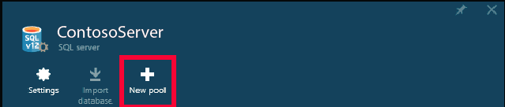
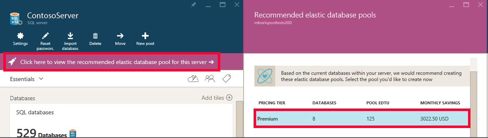
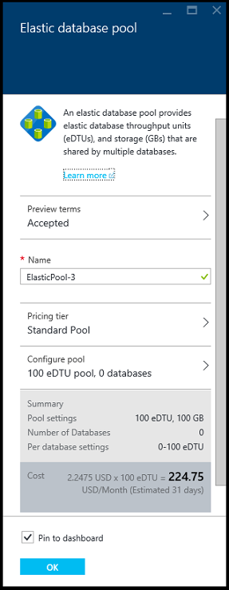
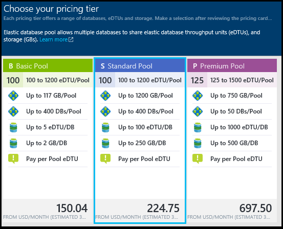
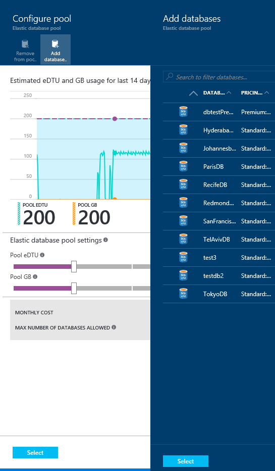
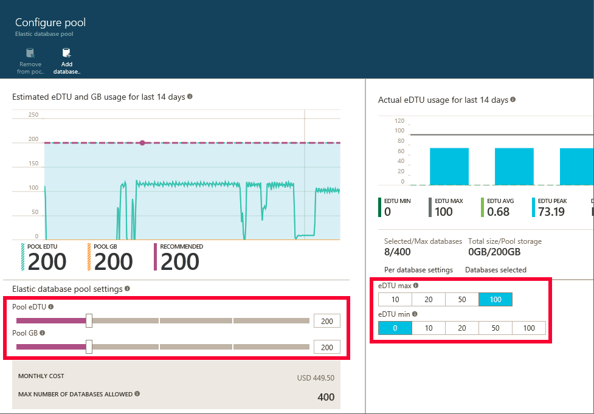

<properties
    pageTitle="Erstellen Sie einen neuen flexible Pool mit dem Portal Azure | Microsoft Azure"
    description="Wie Sie einem Ressourcenpool skalierbare flexible Datenbank der SQL-Datenbank-Konfiguration für einfacher Verwaltung und Freigabe über Datenbanken viele Ressourcen hinzufügen."
    keywords="skalierbare Datenbank, Konfiguration der Datenbank"
    services="sql-database"
    documentationCenter=""
    authors="ninarn"
    manager="jhubbard"
    editor=""/>

<tags
    ms.service="sql-database"
    ms.devlang="NA"
    ms.date="07/20/2016"
    ms.author="ninarn"
    ms.workload="data-management"
    ms.topic="get-started-article"
    ms.tgt_pltfrm="NA"/>

# Erstellen eines neuen Datenbank flexible Pools mit Azure-portal

> [AZURE.SELECTOR]
- [Azure-portal](sql-database-elastic-pool-create-portal.md)
- [PowerShell](sql-database-elastic-pool-create-powershell.md)
- [C#](sql-database-elastic-pool-create-csharp.md)

In diesem Artikel wird gezeigt, wie ein skalierbare [Ressourcenpool flexible Datenbank](sql-database-elastic-pool.md) mit dem [Azure-Portal](https://portal.azure.com/)zu erstellen. Es gibt zwei Möglichkeiten, die Sie einem Ressourcenpool erstellen können. Sie können es von Grund auf Ausführen, wenn Sie die Einrichtung Ressourcenpool wissen, die Sie wünschen, die oder beginnen Sie mit einer Empfehlungen aus dem Dienst. SQL-Datenbank weist integrierte Logik, die ein Ressourcenpool Setup empfiehlt es effizienter für Sie basierend auf der letzten Verwendung werden einer Datenbank ist.

Sie können mehrere Pools auf einem Server hinzufügen, aber Sie können keine Datenbanken von verschiedenen Servern in der gleichen Pool hinzufügen. Zum Erstellen von einem Ressourcenpool benötigen Sie mindestens eine Datenbank in einem V12-Server. Wenn Sie eine besitzen, finden Sie unter [Erstellen Ihrer ersten Azure SQL-Datenbank](sql-database-get-started.md). Sie können einem Ressourcenpool mit nur eine Datenbank erstellen, jedoch Pools sind nur mit mehreren Datenbanken Kosten effiziente. Finden Sie unter [Preis und Leistung Aspekte für eine Datenbank flexible Ressourcenpool](sql-database-elastic-pool-guidance.md).

> [AZURE.NOTE] Flexible Pools sind in der Regel verfügbar (GA) in allen Azure Regionen außer Westen Indien, wo es zurzeit in der Vorschau ist.  GA flexible Pools in diesem Bereich treten so früh wie möglich. 

## Schritt 1: Erstellen einer neuen Ressourcenpool

In diesem Artikel veranschaulicht, wie ein neues Pool aus einer vorhandenen **Server** -vorher in im Portal beträchtlich erhöhen, die einfachste Möglichkeit zum vorhandene Datenbanken in einem Ressourcenpool zu verschieben ist. 

> [AZURE.NOTE] Ob auf einen Server oder nicht bereits, können Sie auch einen neuen Pool aus dem Blade **SQL flexible Pools** erstellen (klicken Sie auf **Durchsuchen** , unterhalb der Liste auf der linken Seite des Portals **>** **SQL flexible Pools**). Klicken Sie auf **+ Add** auf das Blade **flexible Pools SQL** enthält eine schrittweise Anleitung zum Erstellen eines neuen Servers während der Ressourcenpool Workflow bereitgestellt.

1. Klicken Sie im [Portal Azure](http://portal.azure.com/) unterhalb der Liste auf der linken Seite auf **Durchsuchen** **>** **SQL Server**, und klicken Sie dann auf dem Server mit den Datenbanken in einen Pool hinzufügen möchten.
2. Klicken Sie auf **neuen Ressourcenpool**.

    

    **– ODER –**

    Möglicherweise gibt es eine Meldung flexible Datenbank Pools für den Server (nur V12) empfohlen werden angezeigt. Klicken Sie auf die Nachricht an die empfohlenen Pools basierend auf zurückliegenden Datenbank Verwendung werden angezeigt, und klicken Sie dann auf die Ebenen, um die finden Sie unter Weitere Details und den Pool anpassen. Finden Sie unter [arbeiten Ressourcenpool Empfehlungen](#understand-pool-recommendations) weiter unten in diesem Thema wie empfohlen hergestellt wird.

    

    Das **flexible Datenbank Ressourcenpool** Blade erscheint, die Stelle, an der Sie Ihre Ressourcenpool eingerichtet werden. Wenn Sie im vorherigen Schritt **neuen Ressourcenpool** geklickt haben, wählt im Portal an einem **Standard-Pool** unter **Preise Stufe**, einen eindeutigen **Namen** für den Ressourcenpool und eine Standardkonfiguration für den Ressourcenpool. Wenn Sie eine empfohlene Ressourcenpool ausgewählt haben, die empfohlenen Ebene und Konfiguration der Ressourcenpool bereits ausgewählt, aber Sie können weiterhin ändern.

    

3. Geben Sie einen Namen für die flexible Ressourcenpool, oder lassen Sie sie als Standard.

## Schritt 2: Auswählen einer Preisgestaltung Ebene

Preisgestaltung Ebene des Pool bestimmt die Features für die flexible Datenbanken im Pool, und die maximale Anzahl von eDTUs (eDTU MAX) und Speicher (GB) für jede Datenbank verfügbar. Details finden Sie unter Service Ebenen.

Zum Ändern der Preisgestaltung Ebene für den Ressourcenpool auf **Preise Ebene**, klicken Sie auf der Preisgestaltung Ebene der werden soll, und klicken Sie dann auf **auswählen**.

> [AZURE.IMPORTANT] Nachdem Sie die Preisgestaltung Ebene auswählen und die Änderungen abzuschließen, indem Sie auf **OK** , in der letzte Schritt darin, können Sie zum Ändern der Preisgestaltung Ebene der Ressourcenpool nicht. So ändern Sie die Preisgestaltung Ebene für eine vorhandene elastisch Ressourcenpool erstellen einen neuen flexible Pool in der gewünschten Preisgestaltung Ebene und zum Migrieren der flexible Datenbanken zu diesem neuen Pool.

## Schritt 3: Konfigurieren der Ressourcenpool

Klicken Sie auf Ressourcenpool konfigurieren, nach dem Einrichten der Preisgestaltung Ebene an, wo Sie Datenbanken, festlegen Ressourcenpool eDTUs und Speicher (Ressourcenpool GB) hinzufügen, und Sie die min und Max eDTUs für die flexible Datenbanken im Pool festlegen.

1. Klicken Sie auf **Ressourcenpool konfigurieren**
2. Wählen Sie die Datenbanken, die Sie dem Pool hinzufügen möchten. Dieser Schritt ist optional, während der Ressourcenpool zu erstellen. Datenbanken können hinzugefügt werden, nachdem die Ressourcenpool erstellt wurde.
    Um Datenbanken hinzuzufügen, klicken Sie auf **Datenbank hinzufügen**, klicken Sie auf die Datenbanken, die Sie hinzufügen möchten, und klicken Sie dann auf die Schaltfläche **auswählen** .

    

    Wenn die Datenbanken, die, denen Sie beim Arbeiten mit, genügend zurückliegenden Verwendung werden haben, aktualisieren Sie das Diagramm **geschätzt eDTU und die Verwendung von GB** und im Balkendiagramm **Basis: Taggenau eDTU Verwendung** um hilft Ihnen Konfiguration Entscheidungen treffen können ein. Möglicherweise auch der Dienst eine Meldung helfen Sie rechts-Größe der Ressourcenpool zurück. Finden Sie unter [dynamische Empfehlungen](#dynamic-recommendations).

3. Verwenden Sie die Steuerelemente auf der Seite **Konfigurieren Ressourcenpool** Einstellungen durchsuchen und Ihrer Ressourcenpool konfigurieren. Finden Sie unter [flexible Pools Grenzwerte](sql-database-elastic-pool.md#edtu-and-storage-limits-for-elastic-pools-and-elastic-databases) für weitere Details zu den Grenzwerten für jede Dienstebene, und finden Sie unter [Preis und Leistung Aspekte für flexible Datenbank Pools](sql-database-elastic-pool-guidance.md) eine umfassende Unterstützung für auf rechts-Ziehpunkt einem Ressourcenpool. Weitere Details Ressourcenpool Einstellungen finden Sie unter [flexible Ressourcenpool Datenbankeigenschaften](sql-database-elastic-pool.md#elastic-database-pool-properties).

    

4. Klicken Sie auf **Wählen Sie aus** dem **Pool konfigurieren** Blade nach dem Ändern der Einstellungen.
5. Klicken Sie auf **OK** , um den Ressourcenpool zu erstellen.

## Grundlegendes zu Pool Empfehlungen

Der SQL-Datenbank-Dienst wertet Verlauf der Nutzung und mindestens eine weitere Pool vorschlägt, wenn es als einzelne Datenbanken mit kostengünstiger ist. Jede Empfehlungen ist mit einer eindeutigen Teilmenge der Datenbanken des Servers konfiguriert, die den Pool am besten passt.

  

Ressourcenpool empfohlen besteht aus:

- Eine Preisgestaltung Stufe für den Ressourcenpool (Basic, Standard oder Premium)
- Entsprechende **RESSOURCENPOOL eDTUs** (auch Max eDTUs pro Pool genannt)
- Die **eDTU MAX** und **eDTU Min** pro Datenbank
- Die Liste der empfohlenen Datenbanken für den Ressourcenpool

Der Dienst berücksichtigt der letzten 30 Tage werden beim Pools empfehlen. Für eine Datenbank als Kandidaten für eine Datenbank flexible Ressourcenpool gelten muss mindestens 7 Tage lang vorhanden sein. Datenbanken, die sich bereits in einer Datenbank flexible Ressourcenpool, werden als Kandidaten für eine Datenbank flexible Ressourcenpool Empfehlungen nicht berücksichtigt.

Der Dienst wertet Ressource Anforderungen und Kosten Effektivität die einzelnen Datenbanken pro Ebene Dienst in der gleichen Ebene Speicherpools zu verschieben. Beispielsweise werden alle Standard-Datenbanken auf einem Server für ihre anpassen in einem Standard flexible Ressourcenpool bewertet. Dies bedeutet, dass der Dienst keine Empfehlungen im Zusammenhang mit mehreren Schichten z. B. zum Verschieben einer Standard-Datenbank in einem Ressourcenpool Premium vornimmt.

### Dynamische Empfehlungen

Nach dem Pool Datenbanken hinzugefügt haben, werden Empfehlungen dynamisch generiert anhand Ihrer zurückliegenden Verwendung der Datenbanken, die Sie ausgewählt haben. Diese Empfehlungen werden in der eDTU und GB Verwendung Diagramm auch wie ein Empfehlungen-Banner am oberen Rand der **Konfigurieren Ressourcenpool** Blade angezeigt. Diese Empfehlungen sollen Sie bei der Erstellung von einem Ressourcenpool für bestimmten Datenbanken optimiert.

## Zusätzliche Ressourcen

- [Verwalten einer SQL-Datenbank flexible Ressourcenpool mit dem portal](sql-database-elastic-pool-manage-portal.md)
- [Verwalten einer SQL-Datenbank flexible Ressourcenpool mit PowerShell](sql-database-elastic-pool-manage-powershell.md)
- [Verwalten einer SQL-Datenbank flexible Ressourcenpool mit c#](sql-database-elastic-pool-manage-csharp.md)
- [Skalierung mit Azure SQL-Datenbank](sql-database-elastic-scale-introduction.md) 

