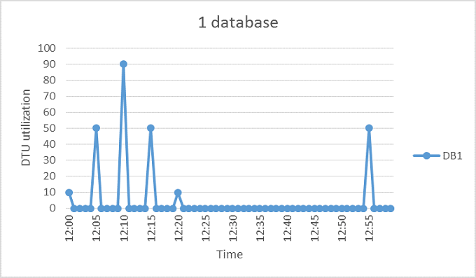
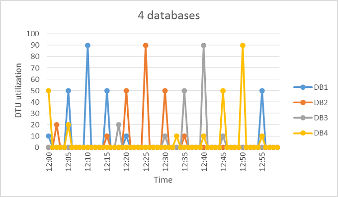
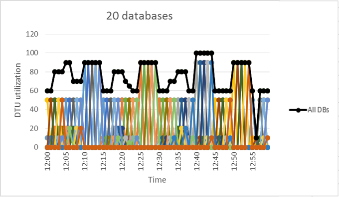

<properties
    pageTitle="Wann sollte eine Datenbank flexible Ressourcenpool werden verwendet?"
    description="Ein Ressourcenpool flexible Datenbank ist eine Auflistung von verfügbaren Ressourcen, die von einer Gruppe von flexible Datenbanken freigegeben wurden. Dieses Dokument enthält dabei helfen, ob der mit einem Ressourcenpool flexible Datenbank für eine Gruppe von Datenbanken geeignet bewerten."
    services="sql-database"
    documentationCenter=""
    authors="stevestein"
    manager="jhubbard"
    editor=""/>

<tags
    ms.service="sql-database"
    ms.devlang="NA"
    ms.date="08/08/2016"
    ms.author="sstein"
    ms.workload="data-management"
    ms.topic="article"
    ms.tgt_pltfrm="NA"/>

# Wann sollte eine Datenbank flexible Ressourcenpool werden verwendet?
Prüfen Sie, ob eine flexible Datenbank Ressourcenpool mit Kosten effiziente basierend auf Datenbank Verwendungsmustern und Preise Unterschiede zwischen einer Datenbank flexible Ressourcenpool und einzelnen Datenbanken. Zusätzliche Anleitungen ist ebenfalls verfügbar, um Ermitteln der aktuellen Ressourcenpool Größe für eine vorhandene Gruppe von SQL-Datenbanken erforderlich ist.  

- Übersicht über Pools finden Sie unter [SQL-Datenbank flexible Datenbank Pools](sql-database-elastic-pool.md).

> [AZURE.NOTE] Flexible Pools sind in der Regel verfügbar (GA) in allen Azure Regionen außer Westen Indien, wo es zurzeit in der Vorschau ist.  GA flexible Pools in diesem Bereich werden so früh wie möglich bereitgestellt werden.

## Flexible Datenbank pools

SaaS Entwickler Erstellen von Applications auf großen Maßstab Datenebenen mehrere Datenbanken aus. Anwendung auf ein gemeinsames Muster besteht darin, eine einzelne Datenbank für jeden Kunden bereitstellen. Aber andere Kunden häufig mit wechselnder und unvorhergesehene Verwendungsmuster haben, und es schwierig ist, die benötigten Ressourcen für jeden einzelnen Datenbankbenutzer Vorhersagen. Der Entwickler kann daher Ressourcen auf erheblichen Kosten zur Sicherstellung bestmögliche Durchsatz und Reaktionszeiten für alle Datenbanken overprovision. Oder der Entwickler kann aufwenden kleiner und Risiko eine schlechte Leistung Erfahrung für ihren Kunden. Weitere Informationen zum entwurfmustern für SaaS Applikationen flexible Pools verwenden, finden Sie unter [Entwurfmustern für mehrere Mandanten SaaS Applikationen mit Azure SQL-Datenbank](sql-database-design-patterns-multi-tenancy-saas-applications.md).

Flexible Pools in Azure SQL-Datenbank aktivieren SaaS Entwickler zur Optimierung der Leistung Preis für eine Gruppe von Datenbanken innerhalb eines vorgegebenen Budgets während der Vorführung Leistung Elastizität für jede Datenbank. Pools aktivieren den Entwickler erwerben flexible Datenbank Transaktion Einheiten (eDTUs) für einen Pool von mehreren Datenbanken gerecht werden kann nicht vorhersehbar Perioden der Verwendung von einzelne Datenbanken freigegeben. Die Anforderung eDTU an einem Ressourcenpool wird durch die aggregate Nutzung der Datenbanken bestimmt. Die Menge des eDTUs zur Verfügung, mit dem Pool wird durch das Budget Entwicklertools gesteuert. Pools erleichtern für Entwickler zum Grund über den Einfluss auf die Systemleistung Ausgaben und umgekehrt für den Ressourcenpool. Der Entwickler einfach Datenbanken mit dem Pool addiert, legt die Mindest- und Höchstwerte eDTUs für die Datenbanken und dann die eDTU im Ressourcenpool basierend auf deren Budget. Ein Entwickler kann Pools verwenden, um deren Dienst in einem schlanken Start zu einem Reifen Unternehmen nahtlos bei größerem wächst skalieren.  
## Wenn ein Ressourcenpool zu berücksichtigen

Pools eignen sich gut für eine große Anzahl von Datenbanken mit bestimmten Auslastung Mustern. Für eine bestimmte Datenbank ist diese Muster durch niedrigen durchschnittlichen Auslastung mit relativ seltene Auslastung Spitzen charakterisiert.

Mehr Datenbanken können Sie zu einem Ressourcenpool hinzufügen je höher Ihre Spareinlagen machen. Je nach Ihrer Anwendung Auslastung Muster ist es möglich, Spareinlagen mit möglichst wenige als zwei S3 Datenbanken finden Sie unter.  

In den folgenden Abschnitten helfen zu verstehen, wie, um festzustellen, ob Ihre bestimmten Sammlung von Datenbanken, nicht in einem Ressourcenpool Dienstleistung. In den Beispielen verwenden Standard-Pools, aber die gleichen Prinzipien gelten auch für Basic und Premium Pools.

### Beurteilung der Datenbank Auslastung Mustern

Die folgende Abbildung zeigt ein Beispiel für eine Datenbank, die benötigt viel Zeit im Leerlauf, aber auch regelmäßig mit Aktivität, Spitzen an. Dies ist ein Auslastung Muster, die für einen Pool gut geeignet ist:

   

Für die oben dargestellten Periode fünf Minuten DB1 verbindet bis zu 90 DTUs, aber gesamtmittelwert Sie weniger als fünf DTUs wird. Eine S3 Leistungsstufe ist erforderlich, um diese Arbeitsbelastung in einer einzigen Datenbank ausführen, aber dies bewirkt, dass die meisten Ressourcen nicht verwendete Zeiten mit geringer Aktivität.

Ein Ressourcenpool diese nicht verwendete DTUs in mehreren Datenbanken gemeinsam verwendet werden kann und daher DTUs erforderlich und den Gesamtkosten für die Gesamtmenge reduziert.

Gebäude auf dem vorherigen Beispiel, nehmen Sie an, dass zusätzliche Datenbanken mit ähnlichen Auslastung Mustern als DB1 vorhanden sind. In den beiden nächsten darunter Zahlen die Nutzung von vier Datenbanken und 20 Datenbanken sind aus mehreren Ebenen auf dem gleichen Diagramm an die übereinander Art von deren Nutzung über einen Zeitraum veranschaulichen:

   

   

Die aggregate DTU Auslastung in allen 20 Datenbanken wird durch die schwarze Linie in der Abbildung oben veranschaulicht. Zeigt an, dass die aggregate DTU Auslastung nie DTUs 100 überschreitet und zeigt an, dass die 20 Datenbanken 100 eDTUs innerhalb dieses Zeitraums gemeinsam nutzen können. Dies führt zu einer 20 x Reduzierung der DTUs und einer 13 x Kurs Reduzierung im Vergleich zum Platzieren jede der Datenbanken im S3 Leistung Berechtigungsstufen für einzelne Datenbanken.

In diesem Beispiel eignet sich aus den folgenden Gründen:

- Es gibt großen Unterschiede zwischen der Höchstwert Auslastung und durchschnittliche Auslastung pro Datenbank.  
- Die Nutzung der Höchstwert für jede Datenbank tritt an verschiedenen Punkten Zeitpunkt.
- eDTUs werden von einer großen Anzahl von Datenbanken gemeinsam verwendet.

Der Preis von einem Ressourcenpool ergibt sich aus dem Pool eDTUs. Während der eDTU Einzelpreis für einen Pool 1,5 x größer als der Einzelpreis DTU für eine einzelne Datenbank **können Pool eDTUs von vielen Datenbanken gemeinsam genutzt werden und daher in vielen Fällen weniger total eDTUs sind erforderlich**ist. Diese Unterschiede in Preise und Freigabe von eDTU werden die Basis des Potenzials Spareinlagen Preis, die Pools bereitstellen können.  

Die folgenden Regeln gilt im Zusammenhang mit der Datenbank zählen und Database Auslastung können sicherstellen, dass ein Ressourcenpool reduzierten Kosten im Vergleich zur Verwendung von Leistungsmerkmale für einzelne Datenbanken übermittelt wird.

### Minimale Anzahl von Datenbanken

Wenn die Summe der DTUs der Leistung Ebenen für die einzelnen Datenbanken mehr als 1,5 x die eDTUs für den Pool erforderlich ist, ist eine flexible Ressourcenpool kostengünstiger. Verfügbare Auswahl an Papiergrößen finden Sie unter [eDTU und Speicher für flexible Datenbank Pools und flexible Datenbanken beschränkt](sql-database-elastic-pool.md#edtu-and-storage-limits-for-elastic-pools-and-elastic-databases).

***Beispiel*** 
Mindestens zwei S3-Datenbanken oder mindestens 15 S0 Datenbanken sind für einen 100 eDTU Pool kostengünstiger als mit Leistung Ebenen für die einzelnen Datenbanken werden erforderlich.

### Maximale Anzahl von einem gleichzeitig Höchstwert von Datenbanken

Durch Freigeben eDTUs, können nicht alle Datenbanken in einem Ressourcenpool eDTUs bis zu den verfügbaren Grenzwert gleichzeitig verwenden, wenn Leistungsmerkmale für einzelne Datenbanken verwenden. Die weniger Datenbanken das gleichzeitig Spitzenzeiten, desto geringer die Ressourcenpool eDTU kann festgelegt werden, und die kostengünstiger wird der Pool. Im Allgemeinen sollten nicht mehr als 2/3 (oder 67 %) der Datenbanken im Pool gleichzeitig deren eDTU schränken maximale.

***Beispiel*** 
Klicken Sie zum Verringern der Kosten für drei S3 Datenbanken in einem 200 eDTU Pool können höchstens zwei dieser Datenbanken gleichzeitig in deren Nutzung maximale.  Andernfalls, wenn mehr als zwei der folgenden vier S3 Datenbanken gleichzeitig maximale, der Pool müssten maximal 200 eDTUs festgelegt werden.  Und wenn der Ressourcenpool zu maximal 200 eDTUs Größe geändert wird, weitere S3 Datenbanken im Ressourcenpool Kosten niedriger als Leistung Berechtigungsstufen für einzelne Datenbanken beibehalten hinzugefügt werden muss.  

Beachten Sie, dass in diesem Beispiel wird die Nutzung von anderen Datenbanken im Pool nicht berücksichtigt. Wenn alle Datenbanken einige Auslastung zu einem bestimmten Zeitpunkt Zeitpunkt verfügen, können Sie dann kleiner als 2/3 (oder 67 %) der Datenbanken gleichzeitig maximale.

### DTU Auslastung pro Datenbank

Ein großer Unterschied zwischen den Höchstwert und die durchschnittliche Auslastung einer Datenbank gibt an, über längere Zeiträume niedriger Auslastung und kurze Zeiträume mit hoher Auslastung. Dieses Muster Auslastung eignet sich für die gemeinsame Nutzung von Ressourcen über Datenbanken. Eine Datenbank sollte bei deren Höchstwert Auslastung etwa 1,5 Mal größer als die durchschnittliche Auslastung ist für einen Pool berücksichtigt werden.

***Beispiel*** 
Eine S3-Datenbank, die zu 100 DTUs und Durchschnitt verbindet verwendet 67 DTUs oder kleiner ist ein guter Kandidat für die gemeinsame Nutzung von eDTUs in einem Ressourcenpool.  Sie können auch eine S1-Datenbank, die 20 DTUs und Durchschnitt verbindet verwendet 13 DTUs oder kleiner ist ein guter Kandidat für einen Pool.

## Ändern der Größe einer flexible Ressourcenpool

Die optimale Größe für einen Pool hängt davon ab, das Aggregat eDTUs und Speicherressourcen für alle Datenbanken im Pool erforderlich. Dies umfasst Bestimmen der größere der folgenden Aktionen aus:

* Maximale DTUs von allen Datenbanken im Pool verwendet wird.
* Maximale Speicherbytes, die von allen Datenbanken im Pool verwendet wird.

Verfügbare Auswahl an Papiergrößen finden Sie unter [eDTU und Speicher für flexible Datenbank Pools und flexible Datenbanken beschränkt](sql-database-elastic-pool.md#edtu-and-storage-limits-for-elastic-pools-and-elastic-databases).

SQL-Datenbank automatisch wertet zurückliegenden Ressource: Einsatz von Datenbanken in einen vorhandenen SQL-Datenbankserver und die entsprechenden Poolkonfiguration der Azure-Portal empfiehlt. Zusätzlich zu der Empfehlungen schätzt eine integrierte Erfahrung die eDTU Verwendung für eine benutzerdefinierte Gruppe von Datenbanken auf dem Server. So können Sie eine "Was-wäre-wenn" Analyse von interaktiv Datenbanken mit dem Pool hinzufügen und entfernen Sie sie, um die erste Ressource: Einsatz Analyse und Ratschläge Ziehpunkt, bevor Sie Ihre Änderungen endgültig durchzuführen. Eine Anleitungen finden Sie unter [überwachen, verwalten und eine flexible Ressourcenpool Größe](sql-database-elastic-pool-manage-portal.md).

Flexibler Ressource: Einsatz Bewertung, die älter als V12 als auch für Datenbanken in verschiedenen Servern schätzt Ziehpunkt ad-hoc-Ziehpunkts schätzt Servern ermöglichen, finden Sie in der [Powershell-Skript zum Identifizieren von Datenbanken für eine Datenbank flexible Ressourcenpool geeignet](sql-database-elastic-pool-database-assessment-powershell.md).

| Funktion     | Portal-Benutzeroberfläche|   PowerShell-Skript|
|:---------------|:----------|:----------|
| Genauigkeit    | nach 15 Sekunden | nach 15 Sekunden
| Unterschiede zwischen einem Ressourcenpool und Leistung Berechtigungsstufen für einzelne Datenbanken Preise hält| Ja| Nein
| Anpassen der Liste der Datenbanken analysiert ermöglicht| Ja| Ja
| Anpassen des Zeitraums in die Analyse verwendet werden können| Nein| Ja
| Anpassen der Liste der Datenbanken auf verschiedene Server analysiert ermöglicht| Nein| Ja
| Anpassen der Liste der Datenbanken, die auf Servern v11 analysiert ermöglicht| Nein| Ja

In Fällen, wo Sie Werkzeuge verwendet werden kann, können die folgenden schrittweise Ihnen helfen schätzen, ob ein Pool kostengünstiger als einzelne Datenbanken ist:

1.  Schätzen der eDTUs für den Ressourcenpool erforderlich sind, wie folgt:

    MAX (<*Gesamtzahl der Datenbanken* X *Mittelwert DTU Auslastung pro DB*>, 
    <*Anzahl von einem gleichzeitig Höchstwert von Datenbanken* X *Höchstwert DTU Auslastung pro DB*)

2.  Schätzen des Speicherplatzes für den Ressourcenpool durch Hinzufügen von der Anzahl von Bytes, die für alle Datenbanken im Pool erforderlich erforderlich.  Bestimmen Sie dann die Größe der eDTU-Ressourcenpool, die diese Speichermenge bereitstellt.  Ressourcenpool von Speichergrenzwerten basierend auf eDTU Ressourcenpool Größe finden Sie unter [eDTU und Speicher für flexible Datenbank Pools und flexible Datenbanken beschränkt](sql-database-elastic-pool.md#edtu-and-storage-limits-for-elastic-pools-and-elastic-databases).
3.  Optimieren der größere Wert von der eDTU schätzt aus Schritt 1 und Schritt2.
4.  Finden Sie in der [SQL-Datenbank Preise Seite](https://azure.microsoft.com/pricing/details/sql-database/) , und suchen Sie die kleinste eDTU Ressourcenpool Größe, die über den geschätzten aus Schritt 3 liegt.
5.  Vergleichen Sie den Ressourcenpool Kurs aus Schritt 5 auf die entsprechende Leistungsstufe für einzelne Datenbanken mit den Preis an.

## Zusammenfassung

Nicht alle einzelne Datenbanken sind optimale Kandidaten für Pools. Datenbanken mit Verwendungsmustern, die durch charakterisiert sind niedriger durchschnittliche Auslastung und relativ seltene Auslastung Spitzen werden eignen sich. Anwendung Verwendungsmustern dynamische sind, verwenden Sie also die Informationen und Tools, die in diesem Artikel beschriebenen vornehmen eine erste Beurteilung zu einem Ressourcenpool ist eine gute Wahl für einige oder alle Ihrer Datenbanken angezeigt. In diesem Artikel wird nur als Ausgangspunkt um Hilfe bei der Entscheidung, unabhängig davon, ob eine flexible Ressourcenpool gut ist. Beachten Sie, dass Sie kontinuierliche Überwachung zurückliegenden Ressource: Einsatz hinzu, und ständig neu die Leistungsstufe des sämtliche Datenbanken beurteilen. Beachten Sie, dass Sie können ganz einfach Datenbanken ein-und flexible Pools verschieben, und wenn Sie eine sehr große Anzahl von Datenbanken haben können mehrere Speicherpools unterschiedlichen Größen, denen Sie Ihren Datenbanken in aufteilen können müssen beibehalten.

## Nächste Schritte

- [Erstellen einer Datenbank flexible Ressourcenpool](sql-database-elastic-pool-create-portal.md)
- [Überwachen, verwalten und Größe einer Datenbank flexible Ressourcenpool](sql-database-elastic-pool-manage-portal.md)
- [SQL-Datenbank-Optionen und Leistung: verstehen, was in jeder Kategorie Dienst verfügbar ist.](sql-database-service-tiers.md)
- [PowerShell-Skript zum Identifizieren von Datenbanken für eine Datenbank flexible Ressourcenpool geeignet](sql-database-elastic-pool-database-assessment-powershell.md)
