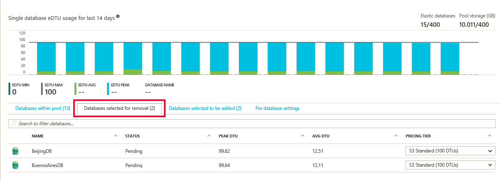

<properties
    pageTitle="Überwachen und Verwalten eines Ressourcenpool flexible Datenbank mit dem Portal Azure | Microsoft Azure"
    description="Erfahren Sie, wie Sie mithilfe der Azure-Portal und integrierte Intelligence SQL-Datenbank verwalten, überwachen und rechts-Größe einem Ressourcenpool skalierbare flexible Datenbank zum Optimieren der Leistung der Datenbank und Verwalten von Kosten."
    keywords=""
    services="sql-database"
    documentationCenter=""
    authors="ninarn"
    manager="jhubbard"
    editor="cgronlun"/>

<tags
    ms.service="sql-database"
    ms.devlang="NA"
    ms.date="09/22/2016"
    ms.author="ninarn"
    ms.workload="data-management"
    ms.topic="article"
    ms.tgt_pltfrm="NA"/>

# Überwachen Sie und verwalten Sie eines Ressourcenpool flexible Datenbank mit dem Azure-portal

> [AZURE.SELECTOR]
- [Azure-portal](sql-database-elastic-pool-manage-portal.md)
- [PowerShell](sql-database-elastic-pool-manage-powershell.md)
- [C#](sql-database-elastic-pool-manage-csharp.md)
- [T-SQL](sql-database-elastic-pool-manage-tsql.md)

Azure-Portal können Sie die Überwachung und Verwaltung einer Datenbank flexible Ressourcenpool und die Datenbanken im Pool. Im Portal können Sie die Nutzung von einer flexible Ressourcenpool und die Datenbanken in diesem Pool überwachen. Auch können Sie alle Änderungen gleichzeitig übermitteln und nehmen Sie eine Reihe von Änderungen an Ihrer flexible Ressourcenpool. Hierzu gehören auch hinzufügen oder Entfernen von Datenbanken, Ändern der Einstellungen für flexible Ressourcenpool oder eine Änderung der Datenbank.

Die folgende Grafik zeigt ein Beispiel für flexible Ressourcenpool an. Die Ansicht enthält:

*  Diagramme für die Überwachung Ressource: Einsatz von sowohl die flexible Ressourcenpool und die Datenbanken im Pool enthalten.
*  Die Schaltfläche Ressourcenpool die **Konfigurieren** , die flexible Ressourcenpool zu ändern.
*  Die **Datenbank erstellen** -Schaltfläche, die eine neue Datenbank erstellt und die aktuelle flexible Ressourcenpool hinzugefügt.
*  Flexible Aufträge, die Hilfe Sie verwalten großen Anzahl von Datenbanken durch Ausführen von Transact-SQL-Skripts für alle Datenbanken in einer Liste an.

![Ressourcenpool anzeigen][2]

Wenn Sie die Schritte in diesem Artikel arbeiten möchten, benötigen Sie einen SQLServer in Azure mit mindestens eine Datenbank und eine flexible Ressourcenpool. Wenn Sie nicht über eine flexible Ressourcenpool verfügen, finden Sie unter [Erstellen einer Ressourcenpool](sql-database-elastic-pool-create-portal.md); Wenn Sie eine Datenbank besitzen, finden Sie in der [SQL-Datenbank-Lernprogramm](sql-database-get-started.md).

## Flexible Ressourcenpool Überwachung

Sie können auf einen bestimmten Pool zu deren Nutzung für Ressourcen finden Sie unter wechseln. Standardmäßig wird der Pool zum Anzeigen der Verwendung von Speicher und eDTU für die letzte Stunde konfiguriert. Das Diagramm kann unterschiedliche Maße über verschiedene Zeitfenster anzeigen konfiguriert sein.

1. Wählen Sie einen Pool konzipiert.
2. Klicken Sie unter **Flexible Ressourcenpool Überwachung** ist ein Diagramm **Ressource Auslastung**beschriftet. Klicken Sie auf das Diagramm.

    ![Flexible Ressourcenpool Überwachung][3]

    Das Blade **Metrisch** wird eine Detailansicht der angegebenen Metrik, die über das angegebene Zeitfenster mit geöffnet.   

    ![Metrische blade][9]

### Zum Anpassen der Diagrammanzeige

Bearbeiten Sie das Diagramm und die metrischen Blade anderer Größen wie CPU-Prozentsatz, Daten EA Prozentsatz und Log EA Prozentsatz verwendet angezeigt werden.

2. Klicken Sie auf das metrischen Blade klicken Sie auf **Bearbeiten**.

    ![Klicken Sie auf Bearbeiten][6]

- Das **Diagramm bearbeiten** Blade wählen Sie einen neuen Zeitbereich (ältere Stunde, heute, oder letzte Woche) aus, oder klicken Sie auf **benutzerdefinierte** zum Auswählen eines Datumsbereichs in den letzten zwei Wochen. Wählen Sie den Diagrammtyp (Balken- oder) aus, und wählen Sie dann die Ressourcen überwachen.

> Hinweis: Nur Kennzahlen mit der gleichen Maßeinheit können im Diagramm gleichzeitig angezeigt werden. Beispielsweise bei Auswahl von "eDTU Prozentsatz" werden dann Sie nur anderer Größen mit Prozentsatz als Maßeinheit auswählen können.

    

- Klicken Sie dann auf **OK**.

## Flexible Datenbank für die Überwachung

Einzelne Datenbanken können auch für potenzieller Probleme überwacht werden.

1. Unter **Flexible Datenbank Überwachung**befindet sich ein Diagramm, die Kennzahlen für fünf Datenbanken angezeigt werden. Standardmäßig zeigt das Diagramm im oberen 5 Datenbanken im Pool durch Mittelwert eDTU Verwendung in der letzten Stunde. Klicken Sie auf das Diagramm.

    ![Flexible Ressourcenpool Überwachung][4]

2. Das Blade **Database Ressource Auslastung** wird angezeigt. Dadurch wird eine Detailansicht der Nutzung der Datenbank im Pool. Das Raster in den unteren Teil der Blade können Sie alle Datenbanken im Pool anzuzeigenden seine Verwendung im Diagramm (bis zu 5 Datenbanken) auswählen. Sie können auch im Fenster Kennzahlen und die Uhrzeit, die im Diagramm angezeigt werden, indem Sie auf **Diagramm bearbeiten**anpassen.

    ![Datenbank Ressource Auslastung blade][8]

### Zum Anpassen der Ansicht

1. Klicken Sie in der **Datenbank Ressource Auslastung** Blade auf **Diagramm bearbeiten**.

    

2. Das **Bearbeiten** Diagramm Blade wählen Sie einen neuen Zeitbereich (nach der vollen Stunde oder letzte 24 Stunden), oder klicken Sie auf **benutzerdefinierte** um Wählen Sie einen anderen Tag in den letzten 2 Wochen angezeigt werden.

    

3. Klicken Sie auf den Dropdownpfeil **Vergleichen Datenbanken, indem Sie** zum Auswählen einer anderen Metrik beim Vergleichen von Datenbanken verwendet.

    

### Auswählen von Datenbanken zu überwachen

Finden Sie in der Datenbankliste in das Blade **Database Ressource Auslastung** bestimmte Datenbanken ein, indem Sie durch die Seiten in der Liste Suchen klicken oder den Namen einer Datenbank ist. Verwenden Sie das Kontrollkästchen, um die Datenbank auszuwählen.

![Suchen nach Datenbanken zu überwachen][7]

## Hinzufügen einer Benachrichtigung für eine Ressource Ressourcenpool

Sie können Ressourcen Regeln hinzufügen, die Senden von e-Mail an Personen oder benachrichtigen Zeichenfolgen mit URL Endpunkten, wenn die Ressource einen Schwellenwert Auslastung Treffer, den Sie einrichten.

> [AZURE.IMPORTANT]Ressource Auslastung für flexible Pools Überwachung verfügt über eine Verzögerung von mindestens 20 Minuten. Festlegen von Benachrichtigungen von weniger als 30 Minuten für flexible Pools wird derzeit nicht unterstützt. Legen Sie alle Warnungen für flexible Pools mit einem Punkt (Parameter mit der Bezeichnung "-WindowSize" in PowerShell-API) von weniger als 30 Minuten kann nicht ausgelöst werden. Stellen Sie sicher, dass alle Benachrichtigungen, die Sie für flexible Pools definieren einen Zeitraum (WindowSize) 30 Minuten oder mehr verwenden.

**So fügen Sie eine Benachrichtigung an eine Ressource hinzu:**

1. Klicken Sie auf **Ressource Auslastung** Diagramm, um das Blade **Metrisch** öffnen, und klicken Sie auf die **Benachrichtigung hinzufügen**, und füllen Sie dann die Informationen in das **Hinzufügen einer Regel** Blade (**Ressource** automatisch eingerichtet ist der Ressourcenpool sein, die Sie beim Arbeiten mit).
2. Geben Sie einen **Namen** und eine **Beschreibung** , die Sie und die Empfänger die Benachrichtigung identifiziert.
3. Wählen Sie eine **Metrik** , die Sie aus der Liste benachrichtigen möchten.

    Das Diagramm zeigt dynamisch Nutzung der Ressource für diese Metrik helfen Ihnen, einen Schwellenwert auszuwählen.

4. Wählen Sie eine **Bedingung** (größer oder kleiner als usw.) und einen **Schwellenwert**.
5. Klicken Sie auf **OK**.

## Verschieben einer Datenbank in eine flexible Ressourcenpool

Sie können hinzufügen oder Entfernen von Datenbanken aus einem vorhandenen Pool. Die Datenbanken können in anderen Pools sein. Sie können jedoch nur Datenbanken hinzufügen, die auf dem gleichen logischen Server sind.

1. Klicken Sie in das Blade für den Pool unter **flexible Datenbanken** auf **Ressourcenpool konfigurieren**.

    ![Klicken Sie auf Ressourcenpool konfigurieren][1]

2. Klicken Sie in das Blade **Konfigurieren Ressourcenpool** auf **zu Pool hinzufügen**.

    

3. Wählen Sie in der Blade- **Datenbanken hinzufügen** die Datenbank oder Datenbanken mit dem Pool hinzufügen aus. Klicken Sie auf **auswählen**.

    

    Das **Konfigurieren Ressourcenpool** Blade enthält jetzt die Datenbank, die Sie ausgewählt haben, mit deren Status auf **Ausstehend**hinzugefügt werden soll.

    

3. Klicken Sie in das **Konfigurieren Ressourcenpool Blade**klicken Sie auf **Speichern**.

    

## Verschieben einer Datenbank aus einer flexible Ressourcenpool

1. Wählen Sie in das Blade **Ressourcenpool konfigurieren** die Datenbank oder Datenbanken zu entfernen.

    

2. Klicken Sie auf **Ressourcenpool entfernen**.

    

    Das **Konfigurieren Ressourcenpool** Blade enthält jetzt die Datenbank, die Sie ausgewählt haben, über deren Status auf **Ausstehend**entfernt werden soll.

    

3. Klicken Sie in das **Konfigurieren Ressourcenpool Blade**klicken Sie auf **Speichern**.

    

## Ändern der Einstellungen der Leistung von einem Ressourcenpool

Während Sie die Ressource Nutzung in einem Ressourcenpool überwachen, möglicherweise fest, dass einige Anpassungen erforderlich sind. Vielleicht benötigt Pool eine Änderung in der Leistung oder Speicher Grenzwerte. Möglicherweise möchten die Datenbank-Einstellungen im Pool ändern. Sie können die Einrichtung der Ressourcenpool zu einem beliebigen Zeitpunkt zu erhalten die beste Abstimmung von Leistung und Kosten ändern. Finden Sie unter [Wann sollte eine Datenbank flexible Ressourcenpool verwendet werden?](sql-database-elastic-pool-guidance.md) für Weitere Informationen.

**So ändern Sie die eDTUs oder Speicher Grenzwerte pro Pool und eDTUs pro Datenbank**

1. Öffnen Sie das Blade **Ressourcenpool konfigurieren** .

    Klicken Sie unter **flexible Datenbank Ressourcenpool Einstellungen**verwenden Sie entweder Schieberegler die Ressourcenpool Einstellungen ändern.

    

2. Sobald die Einstellung geändert hat, zeigt die Anzeige die geschätzte monatliche Kosten der Änderung.

    

## Flexible stellen erstellen und verwalten

Flexible Aufträge ermöglichen Ihnen die Transact-SQL-Skripts für eine beliebige Anzahl von Datenbanken in dem Pool ausgeführt werden. Sie können neue Aufträge erstellen, oder Sie können vorhandene Aufträge mit dem Portal verwalten.

![Flexible stellen erstellen und verwalten][5]

Bevor Sie Einzelvorgänge verwenden, installieren Sie flexible Aufträge Komponenten, und geben Sie Ihre Anmeldeinformationen. Weitere Informationen finden Sie unter [flexible Datenbank Aufträge (Übersicht)](sql-database-elastic-jobs-overview.md).

Finden Sie unter [Skalierung heraus mit Azure SQL-Datenbank](sql-database-elastic-scale-introduction.md): Verwenden Sie flexible Datenbanktools Skalierung, Verschieben von Daten, Abfrage, oder erstellen Sie Transaktionen.

## Zusätzliche Ressourcen

- [Flexible Ressourcenpool SQL-Datenbank](sql-database-elastic-pool.md)
- [Erstellen einer Datenbank flexible Ressourcenpool mit dem portal](sql-database-elastic-pool-create-csharp.md)
- [Erstellen einer Datenbank flexible Ressourcenpool mit PowerShell](sql-database-elastic-pool-create-powershell.md)
- [Erstellen einer Datenbank flexible Ressourcenpool mit c#](sql-database-elastic-pool-create-csharp.md)
- [Preis und Leistung Aspekte für flexible Datenbank pools](sql-database-elastic-pool-guidance.md)

<!--Image references-->
[1]: ./media/sql-database-elastic-pool-manage-portal/configure-pool.png
[2]: ./media/sql-database-elastic-pool-manage-portal/basic.png
[3]: ./media/sql-database-elastic-pool-manage-portal/basic-2.png
[4]: ./media/sql-database-elastic-pool-manage-portal/basic-3.png
[5]: ./media/sql-database-elastic-pool-manage-portal/elastic-jobs.png
[6]: ./media/sql-database-elastic-pool-manage-portal/edit-metric.png
[7]: ./media/sql-database-elastic-pool-manage-portal/select-dbs.png
[8]: ./media/sql-database-elastic-pool-manage-portal/db-utilization.png
[9]: ./media/sql-database-elastic-pool-manage-portal/metric.png
