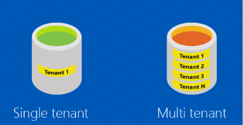
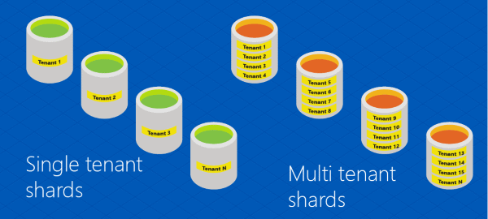

<properties 
    pageTitle="Flexible Datenbank Tools-Glossar | Microsoft Azure" 
    description="Erläuterung der Terminologie für flexible Datenbanktools" 
    services="sql-database" 
    documentationCenter="" 
    manager="jhubbard" 
    authors="ddove" 
    editor=""/>

<tags 
    ms.service="sql-database" 
    ms.workload="sql-database" 
    ms.tgt_pltfrm="na" 
    ms.devlang="na" 
    ms.topic="article" 
    ms.date="05/27/2016" 
    ms.author="ddove"/>

# Flexible Datenbank Tools-Glossar
Die folgenden Begriffe sind die [flexible Datenbanktools](sql-database-elastic-scale-introduction.md)ein Feature Azure SQL-Datenbank definiert. Die Tools dienen zum Verwalten [Shard maps](sql-database-elastic-scale-shard-map-management.md)und der [Clientbibliothek](sql-database-elastic-database-client-library.md), [Teilen und Zusammenführen Tool](sql-database-elastic-scale-overview-split-and-merge.md), [flexible Pools](sql-database-elastic-pool.md)und [Abfragen](sql-database-elastic-query-overview.md)enthalten. 

Diese Ausdrücke werden in [eine flexible Datenbanktools mit Shard hinzufügen](sql-database-elastic-scale-add-a-shard.md) und [Verwenden Sie die RecoveryManager-Klasse, um Shard Karte Probleme beheben](sql-database-elastic-database-recovery-manager.md)verwendet.

![Flexible skalieren Ausdrücke][1]

**Datenbank**: ein Azure SQL-Datenbank. 

**Daten abhängige routing**: die Funktionalität, die Anwendung in Verbindung mit einem Shard ausgehend von einem bestimmten Sharding Schlüssel ermöglicht. Finden Sie unter [Daten abhängige routing](sql-database-elastic-scale-data-dependent-routing.md). Abfrage **[mit mehreren Shard](sql-database-elastic-scale-multishard-querying.md)**vergleichen.

**Globale Shard Karte**: die Karte zwischen Sharding Schlüssel und ihre jeweiligen mehrere Shards hinweg innerhalb einer **Shard festlegen**. Die globale Shard Karte wird im **Shard Karte Manager**gespeichert. Vergleichen Sie mit **lokalen Shard Karte**.

**Liste Shard Karte**: einer Shard Karte in der Sharding Tasten einzeln zugeordnet sind. Vergleichen Sie mit **Bereich Shard Karte**.   

**Lokale Shard Karte**: auf einem Shard gespeichert, enthält die lokale Shard Karte Zuordnungen für die Shardlets, die sich auf den Shard befinden.

**Abfrage mit mehreren Shard**: die Möglichkeit, eine Abfrage mit mehreren mehrere Shards hinweg; ausgeben Ergebnismengen werden mithilfe von UNION ALL Semantik (auch bekannt als "Fan-out Abfrage") zurückgegeben. Vergleichen Sie mit **Daten abhängige routing**.

**Mehrere Mandanten** und **Single-Mandanten**: Fluglinien in ein einzelnes-Mandanten und einer Datenbank mit mehreren Mandanten:

Hier ist eine Darstellung der **sharded** einzelner und mehrerer Mandanten Datenbanken. 

**Bereich Shard Karte**: ein Shard Schema, in dem die Shard Verteilung Strategie auf mehrere Bereiche aufeinander folgender Werte basiert. 

**Verweis Tabellen**: Tabellen, die nicht sharded sind, aber über mehrere Shards hinweg repliziert werden. Beispielsweise können Postleitzahlen in einer Bezugstabelle gespeichert werden. 

**Shard**: ein Azure SQL-Datenbank, die Daten aus einer Datenmenge sharded gespeichert sind. 

**Shard Elastizität**: die Möglichkeit, die sowohl **Skalierung horizontale** und **vertikale Skalierung**ausführen.

**Sharded Tabellen**: Tabellen, sind sharded, d. h., deren Daten über mehrere Shards hinweg basierend auf ihre Sharding Schlüsselwerte verteilt ist. 

**Sharding Schlüssel**: Spaltenwert bestimmt, wie Daten über mehrere Shards hinweg verteilt ist. Der Werttyp kann eine der folgenden: **Int**, **Bigint**, **Varbinary**oder **Uniqueidentifier**. 

**Festlegen von Shard**: die Sammlung von mehrere Shards hinweg, die die gleichen Shard Karte im Shard Karte Manager zugeordnet sind.  

**Shardlet**: alle Daten, die ein einzelner Wert einer Sharding-Taste auf eine Shard zugeordnet. Eine Shardlet ist der kleinste mögliche Verschieben von Daten aus, wenn sharded Tabellen Verteilen von. 

**Shard Karte**: Festlegen von Zuordnungen Sharding Tasten und deren jeweiligen mehrere Shards hinweg.

**Shard Karte Manager**: eine Management Objekt und Daten-Speicher, die die Shard Map(s), Shard Speicherorte und Zuordnungen für einen oder mehrere Shard Sätze enthält.

![Zuordnungen][2]

##Verben

**Horizontales Skalieren**: der Vorgang der Skalierung ab (oder in) eine Zusammenstellung von mehrere Shards hinweg durch Hinzufügen oder entfernen mehrere Shards hinweg zu einer Karte Shard aus, wie unten dargestellt.

![Horizontale und vertikale Skalieren][3]

**Verbinden**: der Vorgang des Shardlets aus zwei mehrere Shards hinweg in eine Shard verschieben und aktualisieren die Karte Shard entsprechend.

**Shardlet verschieben**: der Vorgang, eine einzelne Shardlet in einer anderen Shard verschieben. 

**Shard**: der Act horizontal Aufteilung identisch strukturierte Daten in mehreren Datenbanken, die auf Grundlage eines Schlüssels Sharding.

**Teilen**: der Act mehrere Shardlets aus einem Shard zu einem anderen (normalerweise neue) Shard zu verschieben. Ein Schlüssel Sharding werden als geteilten Punkt vom Benutzer bereitgestellt.

**Vertikale Skalierung**: der Vorgang der Skalierung nach oben (oder unten) die Leistungsstufe, der eine einzelne Shard. Beispielsweise Ändern einer Shard von Standard in Premium (die weitere computing-Ressourcen ergibt). 

[AZURE.INCLUDE [elastic-scale-include](../../includes/elastic-scale-include.md)]  

<!--Image references-->
[1]: ./media/sql-database-elastic-scale-glossary/glossary.png
[2]: ./media/sql-database-elastic-scale-glossary/mappings.png
[3]: ./media/sql-database-elastic-scale-glossary/h_versus_vert.png
 