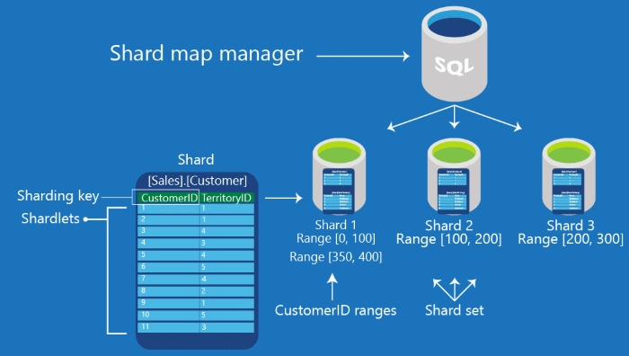

<properties 
    pageTitle="Shard Karte Management | Microsoft Azure" 
    description="So verwenden Sie die ShardMapManager, flexible Datenbank-Client-Bibliothek" 
    services="sql-database" 
    documentationCenter="" 
    manager="jhubbard" 
    authors="ddove" 
    editor=""/>

<tags 
    ms.service="sql-database" 
    ms.workload="sql-database" 
    ms.tgt_pltfrm="na" 
    ms.devlang="na" 
    ms.topic="article" 
    ms.date="05/25/2016" 
    ms.author="ddove"/>

# Datenbanken mit der Shard Karte-Manager zu skalieren

Um einfach out-Datenbanken auf SQL Azure zu skalieren, verwenden Sie einen Shard Karte-Manager. Der Shard-Karte-Manager ist eine spezielle Datenbank, die globale Zuordnungsinformationen über alle mehrere Shards hinweg (Datenbanken) in einem Satz Shard verwaltet. Die Metadaten ermöglichen die Anwendung in Verbindung mit der richtigen Datenbank basierend auf dem Wert des **Sharding-Taste**. Darüber hinaus enthält jeder Shard Festlegen von Karten, die die lokale Shard Daten (als **Shardlets**bezeichnet) zu verfolgen. 

Es ist wichtig, Shard Karte Management, verstehen, wie diese Karten erstellt werden. Dies wird über die [ShardMapManager Klasse](https://msdn.microsoft.com/library/azure/microsoft.azure.sqldatabase.elasticscale.shardmanagement.shardmapmanager.aspx), [flexible Datenbank-Client-Bibliothek](sql-database-elastic-database-client-library.md) auf Shard Karten verwalten gefunden.  

## Shard Karten und Shard Zuordnungen

Für jede Shard müssen Sie den Typ des Shard Karte erstellen auswählen. Die Auswahl hängt von der Datenbankarchitektur: 

1. Einzelne Mandanten pro Datenbank  
2. Mehrere Mandanten pro Datenbank (zwei Arten):
    3. Liste Zuordnung
    4. Bereich Zuordnung
 
Erstellen Sie für ein einzelnes-Mandanten Modell einer **Liste Zuordnung** Shard Karte aus. Das Modell Single-Mandanten weist eine Datenbank pro Mandant. Dies ist eine effektive Modell für Entwickler SaaS wie es Management vereinfacht.

![Liste Zuordnung][1]

Das Modell mit mehreren Mandanten weist mehrere Mandanten zu einer einzelnen Datenbank (und können Sie Gruppen von Mandanten auf mehrere Datenbanken verteilen). Verwenden Sie dieses Modell, wenn jede Mandanten kleine Daten Anforderungen haben erwartet. In diesem Modell weisen wir einen Zellbereich Mandanten zu einer Datenbank mit der **Bereich Zuordnung**an. 
 

![Bereich Zuordnung][2]

Oder Sie können einer mit mehreren Mandanten Datenbankmodell mithilfe einer *Zuordnung der Liste* Zuweisen von mehreren Mandanten auf eine einzelne Datenbank implementieren. Beispielsweise DB1 wird zum Speichern von Informationen über den Mandanten-Id 1 und 5 und DB2 speichert die Daten für den Mandanten 7 und 10-Mandanten. 

![Verschachteln Mandanten, für die einzelnen DB][3] 
 
### Unterstützte .net Datentypen für Sharding Schlüssel

Flexible Maßstab unterstützt die folgenden .net Dateitypen Framework als Sharding Schlüssel an:

* ganze Zahl
* lange
* GUID
* Byte]  
* "DateTime"
* TimeSpan
* DateTimeOffset

### Listen- und Bereich Shard Karten
Shard Karten mit **Listen der Schlüsselwerte für die einzelnen Sharding**erstellt werden können, oder mithilfe **der Schlüsselwerte Sharding Bereiche**erstellt werden können. 

###Liste Shard Karten
**Mehrere Shards hinweg** enthalten **Shardlets** und die Zuordnung von Shardlets auf mehrere Shards hinweg von einer Karte Shard verwaltet wird. Eine **Liste Shard Karte** ist die Beziehung zwischen der einzelnen Schlüsselwerte, die die Shardlets identifizieren und die Datenbanken, die als mehrere Shards hinweg dienen.  **Liste Zuordnungen** sind explizite und Schlüsselwerte für die verschiedenen mit derselben Datenbank zugeordnet werden können. Beispielsweise Schlüssel 1 ordnet Datenbank A und Schlüsselwerte 3 und 6 verweisen Datenbank B.

| Schlüssel | Shard Speicherort |
|-----|----------------|
| 1   | Database_A     |
| 3   | Database_B     |
| 4   | Database_C     |
| 6   | Database_B     |
| ... | ...            |
 

### Bereich Shard Karten 
In einem **Bereich Shard Karte**Key Bereich wird durch ein Paar beschrieben **[Low Value, hoher Wert)** , wo die *Low Value* ist der minimalen Schlüssel im Bereich, und der *Hohen Wert* ist der erste Wert größer als der Bereich. 

Beispielsweise **[0, 100)** umfasst alle Zahlen größer oder gleich 0 und kleiner als 100. Notiz, die mehreren Bereichen können zeigen Sie auf derselben Datenbank und nicht zusammenhängende Bereiche werden unterstützt (z. B. [100,200) und [400,600) beide zeigen Sie auf Datenbank C im folgenden Beispiel.)

| Schlüssel       | Shard Speicherort |
|-----------|----------------|
| [1,50)    | Database_A     |
| [Punkt 50,100)  | Database_B     |
| [100,200) | Database_C     |
| [400,600) | Database_C     |
| ...       | ...            

Jede Tabelle abgebildet ist ein Beispiel für ein Objekt **ShardMap** konzeptionelle. Jede Zeile ist ein vereinfachtes Beispiel für eine einzelne **PointMapping** (für die Liste Shard Karte) oder **RangeMapping** (für den Bereich Shard Karte) Objekt.

## Shard Karte-manager 

In der Clientbibliothek ist Shard Karte Manager eine Zusammenstellung von Shard Karten. Die Daten von einer Instanz **ShardMapManager** verwaltet werden an drei Stellen gespeichert: 

1. **Globale Shard Karte (g/m2)**: Geben Sie eine Datenbank als Repository für alle Zuordnungen und Shard Karten. Spezielle Tabellen und gespeicherten Prozeduren werden automatisch erstellt, die Informationen zum Verwalten von. Dies ist in der Regel eine kleine Datenbank und leicht zugegriffen werden, und sollte nicht für andere Anforderungen der Anwendung verwendet werden. Die Tabellen befinden sich in einem gesonderten Schema namens **__ShardManagement**. 

2. **Lokale Shard Karte (LSM)**: jeder Datenbank, die Sie eines Shard werden geändert angeben, um verschiedene kleine Tabellen und Inhalte gespeicherte Prozeduren, enthalten und verwalten Shard Karte spezifische Informationen für die shard, enthalten. Diese Informationen sind mit den Informationen in den g/m2 redundante, und es kann die Anwendung zwischengespeicherten Shard Karteninformationen zu überprüfen, ohne eine Laden in der g/m2; die Anwendung verwendet die LSM, um festzustellen, ob eine zwischengespeicherte Zuordnung noch gültig ist. Die Tabellen, die LSM auf jede Shard entspricht, sind auch in das Schema **__ShardManagement**.

3. **Cache Anwendung**: jede Instanz der Anwendung den Zugriff auf ein Objekt **ShardMapManager** verwaltet einen lokalen in-Memory-Cache von deren Zuordnungen. Es speichert routing-Informationen, die zuletzt abgerufen wurde. 

## Erstellen einer ShardMapManager

Ein Objekt **ShardMapManager** wird unter Verwendung eines Musters [Factory](https://msdn.microsoft.com/library/azure/microsoft.azure.sqldatabase.elasticscale.shardmanagement.shardmapmanagerfactory.aspx) erstellt. Die Methode **[ShardMapManagerFactory.GetSqlShardMapManager](https://msdn.microsoft.com/library/azure/microsoft.azure.sqldatabase.elasticscale.shardmanagement.shardmapmanagerfactory.getsqlshardmapmanager.aspx)** übernimmt Anmeldeinformationen (einschließlich den Servernamen und den Datenbanknamen, halten die g/m2) in Form von **ConnectionString** und gibt eine Instanz von einer **ShardMapManager**.  

**Bitte beachten Sie:** Die **ShardMapManager** sollte nur einmal pro Domäne app innerhalb der Initialisierungscode für eine Anwendung Instanz erstellt werden. Erstellung von zusätzlichen Instanzen von ShardMapManager in derselben Appdomain, führt zu Fehlern im höhere Arbeitsspeicher und CPU-Auslastung der Anwendung. Eine **ShardMapManager** kann beliebig viele Shard Karten enthalten. Während der Karte eines einzelnen Shard für viele Clientanwendungen ausreichend sein kann, gibt es Zeiten, wenn unterschiedliche Optionssätze Datenbanken für verschiedene Schema oder für eigene Zwecke verwendet werden; in diesen Fällen möglicherweise mehrere Shard Karten besser. 

In diesem Code wird eine Anwendung einer vorhandenen **ShardMapManager** mit der [TryGetSqlShardMapManager-Methode](https://msdn.microsoft.com/library/azure/microsoft.azure.sqldatabase.elasticscale.shardmanagement.shardmapmanagerfactory.trygetsqlshardmapmanager.aspx)geöffnet.  Wenn Sie Objekte, die eine globale **ShardMapManager** (g/m2) darstellen noch nicht in der Datenbank vorhanden sind, erstellt die Clientbibliothek sie es mithilfe der [Methode CreateSqlShardMapManager](https://msdn.microsoft.com/library/azure/microsoft.azure.sqldatabase.elasticscale.shardmanagement.shardmapmanagerfactory.createsqlshardmapmanager.aspx).

    // Try to get a reference to the Shard Map Manager 
    // via the Shard Map Manager database.  
    // If it doesn't already exist, then create it. 
    ShardMapManager shardMapManager; 
    bool shardMapManagerExists = ShardMapManagerFactory.TryGetSqlShardMapManager(
                                        connectionString, 
                                        ShardMapManagerLoadPolicy.Lazy, 
                                        out shardMapManager); 

    if (shardMapManagerExists) 
     { 
        Console.WriteLine("Shard Map Manager already exists");
    } 
    else
    {
        // Create the Shard Map Manager. 
        ShardMapManagerFactory.CreateSqlShardMapManager(connectionString);
        Console.WriteLine("Created SqlShardMapManager"); 

        shardMapManager = ShardMapManagerFactory.GetSqlShardMapManager(
            connectionString, 
            ShardMapManagerLoadPolicy.Lazy);

        // The connectionString contains server name, database name, and admin credentials 
        // for privileges on both the GSM and the shards themselves.
    } 
 
Alternativ können Sie Powershell So erstellen einen neuen Shard Karte-Manager. Beispiel für steht [hier](https://gallery.technet.microsoft.com/scriptcenter/Azure-SQL-DB-Elastic-731883db).

## Erhalten von RangeShardMap ListShardMap

Nachdem der Shard Karte Manager erstellt, können Sie die [RangeShardMap](https://msdn.microsoft.com/library/azure/dn807318.aspx) oder [ListShardMap](https://msdn.microsoft.com/library/azure/dn807370.aspx) mithilfe der [TryGetRangeShardMap](https://msdn.microsoft.com/library/azure/microsoft.azure.sqldatabase.elasticscale.shardmanagement.shardmapmanager.trygetrangeshardmap.aspx), der [TryGetListShardMap](https://msdn.microsoft.com/library/azure/microsoft.azure.sqldatabase.elasticscale.shardmanagement.shardmapmanager.trygetlistshardmap.aspx)oder die Methode [GetShardMap](https://msdn.microsoft.com/library/azure/microsoft.azure.sqldatabase.elasticscale.shardmanagement.shardmapmanager.getshardmap.aspx) erhalten.

    /// 

    /// Creates a new Range Shard Map with the specified name, or gets the Range Shard Map if it already exists.
    /// 

    public static RangeShardMap<T> CreateOrGetRangeShardMap<T>(ShardMapManager shardMapManager, string shardMapName)
    {
        // Try to get a reference to the Shard Map.
        RangeShardMap<T> shardMap;
        bool shardMapExists = shardMapManager.TryGetRangeShardMap(shardMapName, out shardMap);

        if (shardMapExists)
        {
            ConsoleUtils.WriteInfo("Shard Map {0} already exists", shardMap.Name);
        }
        else
        {
            // The Shard Map does not exist, so create it
            shardMap = shardMapManager.CreateRangeShardMap<T>(shardMapName);
            ConsoleUtils.WriteInfo("Created Shard Map {0}", shardMap.Name);
        }

        return shardMap;
    } 

### Shard Karte-Anmeldeinformationen

Programmen, die verwalten und Bearbeiten von Karten shard, unterscheiden sich von denen, die die Shard Karten Routing-Verbindungen verwenden. 

Verwalten von Shard Karten (hinzufügen oder Ändern von mehrere Shards hinweg, Shard Karten, Shard Zuordnungen, usw.), müssen Sie die **ShardMapManager** mithilfe von **Anmeldeinformationen, die verfügen schreibgeschützt Berechtigungen für die g/m2-Datenbank und klicken Sie auf jede Datenbank, die als ein Shard fungiert,**instanziieren. Die Anmeldeinformationen müssen schreibt für die Tabellen in der g/m2 und die LSM ermöglichen Shard Karteninformationen eingegeben oder auch denen für das Erstellen von Tabellen LSM auf neue mehrere Shards hinweg geändert wird.  

Finden Sie unter [Anmeldeinformationen verwendet, um die flexible Datenbank-Client-Bibliothek zugreifen](sql-database-elastic-scale-manage-credentials.md).

### Nur die Metadaten betroffen 

Methoden zum Auffüllen von oder ändern die Daten **ShardMapManager** verwendet werden die Benutzerdaten in der mehrere Shards hinweg selbst gespeichert nicht geändert werden. Methoden, z. B. **CreateShard**, **DeleteShard**, **UpdateMapping**usw. beeinflussen beispielsweise nur die Shard Karte Metadaten. Nicht entfernen Sie, fügen Sie hinzu oder ändern Sie Benutzerdaten enthalten, in dem mehrere Shards hinweg. Stattdessen diese Methoden werden zur Verwendung in Verbindung mit getrennten Vorgängen vorgesehen, die Sie ausführen, um zu erstellen, oder Verschieben ist-Datenbanken entfernen oder die Zeilen aus einer Shard zu einem anderen neu zu eine sharded Umgebung verteilen.  (Das **Teilen und Zusammenführen** Tool enthaltenen flexible Datenbanktools nutzt diese APIs zusammen mit der tatsächlichen Daten Bewegung zwischen mehrere Shards hinweg orchestriert.) Finden Sie unter [Skalierung mithilfe des Tools für die Datenbank flexible Teilen und Zusammenführen](sql-database-elastic-scale-overview-split-and-merge.md).

## Ein Beispiel für die Karte Shard Auffüllen
 
Nachfolgend finden Sie ein Beispiel Abfolge von JOIN-Operationen eine bestimmten Shard Karte gefüllt wird. Der Code führt die folgenden Schritte aus: 

1. Ein neues Shard Schema wird innerhalb eines Shard Karte Manager erstellt. 
2. Die Metadaten für zwei verschiedenen mehrere Shards hinweg wird die Karte Shard hinzugefügt. 
3. Eine Vielzahl von Key Bereich Zuordnungen hinzugefügt werden, und den gesamten Inhalt der Karte Shard werden angezeigt. 

Der Code wird geschrieben, damit die Methode erneut ausgeführt werden kann, wenn ein Fehler auftritt. Jede Anforderung überprüft, ob eine Shard oder Zuordnung bereits vorhanden ist, bevor Sie versuchen, um sie zu erstellen. Der Code wird davon ausgegangen, dass Datenbanken, die mit dem Namen **sample_shard_0**, **sample_shard_1** und **sample_shard_2** bereits in der Zeichenfolge **ShardServer**optimiert Server erstellt wurden. 

    public void CreatePopulatedRangeMap(ShardMapManager smm, string mapName) 
        {            
            RangeShardMap<long> sm = null; 

            // check if shardmap exists and if not, create it 
            if (!smm.TryGetRangeShardMap(mapName, out sm)) 
            { 
                sm = smm.CreateRangeShardMap<long>(mapName); 
            } 

            Shard shard0 = null, shard1=null; 
            // Check if shard exists and if not, 
            // create it (Idempotent / tolerant of re-execute) 
            if (!sm.TryGetShard(new ShardLocation(
                                     shardServer, 
                                     "sample_shard_0"), 
                                     out shard0)) 
            { 
                Shard0 = sm.CreateShard(new ShardLocation(
                                            shardServer, 
                                            "sample_shard_0")); 
            } 

            if (!sm.TryGetShard(new ShardLocation(
                                    shardServer, 
                                    "sample_shard_1"), 
                                    out shard1)) 
            { 
                Shard1 = sm.CreateShard(new ShardLocation(
                                             shardServer, 
                                            "sample_shard_1"));  
            } 

            RangeMapping<long> rmpg=null; 

            // Check if mapping exists and if not,
            // create it (Idempotent / tolerant of re-execute) 
            if (!sm.TryGetMappingForKey(0, out rmpg)) 
            { 
                sm.CreateRangeMapping(
                          new RangeMappingCreationInfo<long>
                          (new Range<long>(0, 50), 
                          shard0, 
                          MappingStatus.Online)); 
            } 

            if (!sm.TryGetMappingForKey(50, out rmpg)) 
            { 
                sm.CreateRangeMapping(
                         new RangeMappingCreationInfo<long> 
                         (new Range<long>(50, 100), 
                         shard1, 
                         MappingStatus.Online)); 
            } 

            if (!sm.TryGetMappingForKey(100, out rmpg)) 
            { 
                sm.CreateRangeMapping(
                         new RangeMappingCreationInfo<long>
                         (new Range<long>(100, 150), 
                         shard0, 
                         MappingStatus.Online)); 
            } 

            if (!sm.TryGetMappingForKey(150, out rmpg)) 
            { 
                sm.CreateRangeMapping(
                         new RangeMappingCreationInfo<long> 
                         (new Range<long>(150, 200), 
                         shard1, 
                         MappingStatus.Online)); 
            } 

            if (!sm.TryGetMappingForKey(200, out rmpg)) 
            { 
               sm.CreateRangeMapping(
                         new RangeMappingCreationInfo<long> 
                         (new Range<long>(200, 300), 
                         shard0, 
                         MappingStatus.Online)); 
            } 

            // List the shards and mappings 
            foreach (Shard s in sm.GetShards()
                         .OrderBy(s => s.Location.DataSource)
                         .ThenBy(s => s.Location.Database))
            { 
               Console.WriteLine("shard: "+ s.Location); 
            } 

            foreach (RangeMapping<long> rm in sm.GetMappings()) 
            { 
                Console.WriteLine("range: [" + rm.Value.Low.ToString() + ":" 
                        + rm.Value.High.ToString()+ ")  ==>" +rm.Shard.Location); 
            } 
        } 
 
PowerShell-Skripts können Sie als Alternative um das gleiche Ergebnis zu erzielen. Einige Beispiele PowerShell Stichprobe stehen [hier](https://gallery.technet.microsoft.com/scriptcenter/Azure-SQL-DB-Elastic-731883db).     

Nachdem Shard Karten aufgefüllt wurden, können Daten-Access-Applikationen erstellt oder angepasst, um die Arbeit mit den Karten. Auffüllen von oder Bearbeiten von der Karten muss nicht erneut auftreten, bis muss **Karte Layout** ändern.  

## Daten abhängige routing 

Der Shard Karte-Manager wird am häufigsten in Clientanwendungen verwendet werden, die Datenbankverbindungen die app-spezifische Datenvorgänge ausführt erforderlich sind. Diese Verbindungen müssen die richtige Datenbank zugeordnet werden. Dies wird als **Daten abhängige Routing**bezeichnet. In diesem Bereich instanziieren Sie ein Shard Map-Manager-Objekt aus der Factory mit Anmeldeinformationen, die schreibgeschützten Zugriff auf die Datenbank g/m2 haben. Einzelne Besprechungsanfragen für spätere Verbindungen Geben Sie die Anmeldeinformationen für das Herstellen einer Verbindung mit der entsprechenden Shard Datenbank erforderlich.

Beachten Sie, dass diese Applikationen (mit **ShardMapManager** geöffnete mit Schreibschutz versehen Anmeldeinformationen) die Karten oder Zuordnungen ändern können. Erstellen Sie für diese Anforderungen administrative-spezifischen Programme oder PowerShell-Skripts, die mit höheren Berechtigungen Anmeldeinformationen angeben, wie bereits zuvor erwähnt aus. Finden Sie unter [Anmeldeinformationen verwendet, um die flexible Datenbank-Client-Bibliothek zugreifen](sql-database-elastic-scale-manage-credentials.md).

Weitere Informationen hierzu finden Sie unter [Daten abhängige routing](sql-database-elastic-scale-data-dependent-routing.md). 

## Ändern einer Shard Karte 

Ein Schema Shard kann auf verschiedene Arten geändert werden. Alle der folgenden Methoden ändern die Metadaten, beschreiben, die mehrere Shards hinweg sowie deren Zuordnung, aber sie innerhalb der mehrere Shards hinweg Daten nicht physisch ändern, noch können diese erstellen oder löschen die eigentlichen Datenbanken.  Möglicherweise müssen einige Vorgänge auf die nachfolgend beschriebenen Shard Karte mit administrativen Aktionen koordiniert werden, physisch verschieben, die Daten oder die hinzufügen und Entfernen von Datenbanken und dient als mehrere Shards hinweg.

Diese Methoden Zusammenarbeit als die Bausteine für die gesamte Verteilung der Daten in Ihrer Umgebung sharded Datenbank ändern.  

* Hinzufügen oder entfernen mehrere Shards hinweg: **[CreateShard](https://msdn.microsoft.com/library/azure/microsoft.azure.sqldatabase.elasticscale.shardmanagement.shardmap.createshard.aspx)** und **[DeleteShard](https://msdn.microsoft.com/library/azure/microsoft.azure.sqldatabase.elasticscale.shardmanagement.shardmap.deleteshard.aspx)** der [Klasse Shardmap](https://msdn.microsoft.com/library/azure/microsoft.azure.sqldatabase.elasticscale.shardmanagement.shardmap.aspx)verwenden. 
    
    Der Server und die Datenbank, die das Ziel Shard darstellt müssen für diese Vorgänge ausgeführt bereits vorhanden sein. Diese Methoden haben keine Einfluss auf Datenbanken selbst, nur auf Metadaten in der Karte Shard.

* Erstellen oder Entfernen von Punkten oder Bereichen, die die mehrere Shards hinweg zugeordnet werden: **[CreateRangeMapping](https://msdn.microsoft.com/library/azure/dn841993.aspx)**, **[DeleteMapping](https://msdn.microsoft.com/library/azure/dn824200.aspx)** der [Klasse RangeShardMapping](https://msdn.microsoft.com/library/azure/dn807318.aspx)und **[CreatePointMapping](https://msdn.microsoft.com/library/azure/dn807218.aspx)** von der [ListShardMap](https://msdn.microsoft.com/library/azure/dn842123.aspx) verwenden
    
    Vielen verschiedenen Punkten oder Bereichen können die gleichen Shard zugeordnet werden. Diese Methoden wirken sich nur auf Metadaten – haben keinen Einfluss auf alle Daten, die möglicherweise bereits in mehrere Shards hinweg befinden. Wenn Sie Daten aus der Datenbank entfernt werden, um mit **DeleteMapping** Vorgänge konsistent sein müssen, müssen Sie diese Vorgänge separat aber in Verbindung mit mithilfe der folgenden Methoden ausführen.  

* Vorhandene Bereiche in zwei Teilen oder angrenzende Bereiche zusammenführen: **[SplitMapping](https://msdn.microsoft.com/library/azure/dn824205.aspx)** und **[MergeMappings](https://msdn.microsoft.com/library/azure/dn824201.aspx)**verwenden.  

    Notiz, die zum Teilen und zusammenführen, Vorgänge, **Ändern Sie nicht die Shard, die Schlüsselwerte zugeordnet sind**. Eine Teilung ein vorhandenes Bereichs in zwei Teile Umbrüche, aber beide belässt, wie die gleichen Shard zugeordnet. Eine Zusammenführung wirkt sich auf zwei benachbarte Bereiche, die die gleichen Shard, sie zu einer einzigen Bereich zusammenfügenden bereits zugeordnet sind.  Die Bewegung von Punkten oder Bereichen selbst zwischen mehrere Shards hinweg muss mithilfe von **UpdateMapping** in Verbindung mit der tatsächlichen Daten Bewegung koordiniert werden.  Den Dienst **Geteilten/Zusammenführen** können, die Teil des flexible Datenbanktools Shard Karte Änderungen mit Verschieben von Daten, koordinieren, wenn Bewegung erforderlich ist. 

* Neu zuordnen (oder verschieben) Sie einzelne Punkte oder anderen mehrere Shards hinweg Bereiche: **[UpdateMapping](https://msdn.microsoft.com/library/azure/dn824207.aspx)**verwenden.  

    Da möglicherweise Daten aus einem Shard in einen anderen verschoben werden soll, um mit **UpdateMapping** Vorgänge konsistent sein müssen, müssen Sie die Bewegung separat aber in Verbindung mit mithilfe der folgenden Methoden ausführen.

* Ausführen von Zuordnungen online und offline: Verwenden von **[MarkMappingOffline](https://msdn.microsoft.com/library/azure/dn824202.aspx)** und **[MarkMappingOnline](https://msdn.microsoft.com/library/azure/dn807225.aspx)** um zu steuern, den Onlinestatus einer Zuordnung. 

    Bestimmte Vorgänge auf Shard Zuordnungen dürfen nur, wenn eine Zuordnung in einem "offline" Status, einschließlich **UpdateMapping** und **DeleteMapping**ist. Wenn eine Zuordnung offline ist, wird die Anforderung eine abhängigen Daten auf Grundlage eines Schlüssels in die Zuordnung enthalten, einen Fehler zurück. Darüber hinaus bei ein Bereich zuerst offline geöffnet ist, werden alle Verbindungen mit den betroffenen Shard automatisch abgebrochen müssen, um zu verhindern, dass nicht konsistent oder unvollständig Ergebnisse für Abfragen gegen Bereiche geändert wird. 

Zuordnungen sind unveränderliche Objekte in .net.  Alle der oben genannten Methoden, die Zuordnungen ändern ungültig auch alle Verweise auf diese im Code. Zurückgeben alle Methoden, die eine Zuordnung geändert vereinfachen von Operationen ausführen, die eine Zuordnung Status ändern, eine neue Zuordnung Referenz aus, damit Vorgänge verkettet werden können. Zum Löschen einer vorhandenen Zuordnung in Shardmap Sm, die die Taste 25 enthält, können Sie beispielsweise Folgendes ausführen: 

        sm.DeleteMapping(sm.MarkMappingOffline(sm.GetMappingForKey(25)));

## Hinzufügen eines shard 

Applikationen müssen häufig einfach Hinzufügen neuer mehrere Shards hinweg, um Daten zu verarbeiten, die möglicherweise von neuen Schlüsseln oder Key Bereiche, für ein Shard Schema, die bereits vorhanden ist. Beispielsweise eine Anwendung sharded nach Mandanten ID möglicherweise müssen Sie eine neue Shard für einen neuen Mandanten bereitstellen oder Daten sharded monatlich benötigen möglicherweise eine neue Shard nach der Bereitstellung vor Beginn eines jeden neuen Monat. 

Wenn Sie der neue Bereich der Schlüsselwerte noch nicht Teil einer vorhandenen Zuordnung und kein Verschieben von Daten ist erforderlich, ist es sehr einfach, fügen Sie der neuen Shard, und ordnen Sie die neuen Product Key oder einen Bereich aus, um die Shard. Details zum Hinzufügen von neuen mehrere Shards hinweg finden Sie unter [Hinzufügen einer neuen Shard](sql-database-elastic-scale-add-a-shard.md).

Für Szenarien, die das Verschieben von Daten erfordern, ist jedoch das Tool Teilen und Zusammenführen benötigt, um die Verlagerung von Daten zwischen mehrere Shards hinweg in Kombination mit den notwendigen Shard Karte Updates zu koordinieren. Details zur Verwendung der Yool Teilen und Zusammenführen finden Sie unter [Übersicht über Teilen und Zusammenführen](sql-database-elastic-scale-overview-split-and-merge.md) 

[AZURE.INCLUDE [elastic-scale-include](../../includes/elastic-scale-include.md)]
 
<!--Image references-->
[1]: ./media/sql-database-elastic-scale-shard-map-management/listmapping.png
[2]: ./media/sql-database-elastic-scale-shard-map-management/rangemapping.png
[3]: ./media/sql-database-elastic-scale-shard-map-management/multipleonsingledb.png