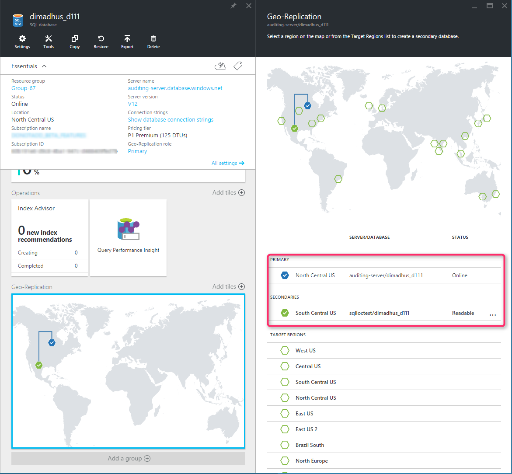

<properties
    pageTitle="Aktive Geo-Replikation für SQL Azure-Datenbank"
    description="Aktive Geo-Replikation können Sie für die Einrichtung von 4 Replikate Ihrer Datenbank dazu den Azure Datencentern."
    services="sql-database"
    documentationCenter="na"
    authors="stevestein"
    manager="jhubbard"
    editor="monicar" />

<tags
    ms.service="sql-database"
    ms.devlang="na"
    ms.topic="article"
    ms.tgt_pltfrm="na"
    ms.workload="NA"
    ms.date="09/26/2016"
    ms.author="sstein" />

# Übersicht: SQL aktiven Geo-Datenbankreplikation

Aktive Geo-Replikation können Sie bis zu vier lesbare sekundäre Datenbanken an derselben oder einer anderen Data Center Speicherorten (Regionen) konfigurieren. Sekundäre Datenbanken stehen für Abfragen und Failover bei einem Data Center Ausfall oder eine Verbindung mit der primären Datenbank nicht möglich.

>[AZURE.NOTE] Aktive Geo-Replikation (lesbaren sekundäre) steht für alle Datenbanken auf allen Ebenen der Dienst zur Verfügung. April 2017 nicht lesbaren sekundären Typs wird gelöscht werden, und vorhandene nicht lesbaren Datenbanken, um lesbare sekundäre automatisch aktualisiert werden.

 Sie können die aktive Geo-Replikation mit [Azure-Portal](sql-database-geo-replication-portal.md), [PowerShell](sql-database-geo-replication-powershell.md), [Transact-SQL](sql-database-geo-replication-transact-sql.md), konfigurieren oder die [REST-API - erstellen oder Aktualisierungsdatenbank](https://msdn.microsoft.com/library/azure/mt163685.aspx).

> [AZURE.SELECTOR]
- [Zu konfigurieren: Azure-portal](sql-database-geo-replication-portal.md)
- [Konfigurieren von: PowerShell](sql-database-geo-replication-powershell.md)
- [Konfigurieren: T-SQL](sql-database-geo-replication-transact-sql.md)

If für eine Grund Ihre primäre Datenbank fehlschlägt oder einfach offline verfügbar gemacht werden muss, können Sie *Failover* mit einer der sekundären Datenbanken. Bei einem sekundären Datenbanken Failover aktiviert ist, werden alle anderen sekundäre automatisch mit dem neuen primären verknüpft.

Sie können Failover zu einem sekundären mithilfe der [Azure-Portal](sql-database-geo-replication-failover-portal.md), [PowerShell](sql-database-geo-replication-failover-powershell.md), [Transact-SQL](sql-database-geo-replication-failover-transact-sql.md), die [REST-API - Failover geplant](https://msdn.microsoft.com/ibrary/azure/mt575007.aspx)oder [REST-API - ungeplanten Failover](https://msdn.microsoft.com/library/azure/mt582027.aspx).

> [AZURE.SELECTOR]
- [Failover: Azure-portal](sql-database-geo-replication-failover-portal.md)
- [Failover: PowerShell](sql-database-geo-replication-failover-powershell.md)
- [Failover: T-SQL](sql-database-geo-replication-failover-transact-sql.md)

Nach einem Failover stellen Sie sicher, dass die authentifizierungsanforderungen für Ihre Server und die Datenbank auf dem neuen primären konfiguriert sind. Details finden Sie unter [Sicherheit der SQL-Datenbank nach der Wiederherstellung](sql-database-geo-replication-security-config.md).

Das Feature aktiv Geo-Replikation implementiert ein Verfahren, um die Datenbank redundante innerhalb der gleichen Microsoft Azure Region oder in anderen Bereichen (Geo-Redundanz) verwendet werden. Aktive Geo-Replikation repliziert asynchrone zugesicherte Transaktionen aus einer Datenbank auf bis zu vier Kopien der Datenbank auf verschiedenen Servern mit zugesicherte Snapshot-Isolation (RCSI) für die Isolation lesen. Wenn der aktiven Geo-Replikation konfiguriert ist, wird eine sekundäre Datenbank auf dem angegebenen Server erstellt. Die ursprüngliche Datenbank wird die primäre Datenbank. Die primäre Datenbank repliziert asynchrone zugesicherte Transaktionen für jede der sekundären Datenbanken. Es werden nur vollständige Transaktionen repliziert. Klicken Sie bei einem bestimmten Zeitpunkt, die sekundäre Datenbank möglicherweise etwas hinter der primären Datenbank, werden sichergestellt, dass der sekundären Daten nie teilweise Transaktionen besitzt. Die speziellen RPO Daten finden Sie unter [Übersicht über die Geschäftskontinuität](sql-database-business-continuity.md).

Einer der Hauptvorteile von aktiven Geo-Replikation ist, dass eine Datenbank Ebene Disaster Wiederherstellung-Lösung mit niedriger Wiederherstellungszeit bereitgestellt. Wenn Sie die sekundäre Datenbank auf einem Server in einem anderen Bereich setzen, fügen Sie die maximale Stabilität an Ihrer Anwendung. Cross-Region Redundanz ermöglicht Applikationen Wiederherstellen eines aus permanent Verlust von einer gesamten Datacenter oder Teile eines Datencenters durch Naturkatastrophen, schwerwiegenden personenbezogenen Fehler oder bösartige Handlungen verursacht. Die folgende Abbildung zeigt ein Beispiel der aktiven Geo-Replikation mit einer Primär in der Region US North Central und des sekundären in der Region Süden zentralen uns konfiguriert.

Eine andere Vorteil besteht darin, dass die sekundären Datenbanken gelesen können und auslagern schreibgeschützt Auslastung wie das Melden von Aufträgen verwendet werden können. Wenn Sie nur die sekundäre Datenbank für den Lastenausgleich verwenden möchten, können Sie es in der gleichen Region als primärer erstellen. Erstellen eine sekundäre in derselben Region, erhöht nicht die Verfügbarkeit der Anwendung schwerwiegende Fehler auftreten.  

Andere Szenarios aktiven Geo-Replikation verwendet werden kann umfassen:

- **Datenbank-Migration**: können aktive Geo-Replikation zum Migrieren einer Datenbank von einem Server zu einem anderen online mit minimalen Ausfallzeiten.
- **Upgrades der Anwendung**: Sie können eine zusätzliche sekundären während des Upgrades der Anwendung als Fail zurück Kopie erstellen.

Um real Geschäftskontinuität zu erreichen, ist das Hinzufügen von Datenbank Redundanz zwischen Rechenzentren nur einen Teil der Lösung aus. Wiederherstellen einer Anwendung (Service) zu umfassende, nach einem Ausfall erfordert Wiederherstellung für alle Komponenten, die den Dienst bilden und abhängige Dienste. Beispiele für diese Komponenten gehören die Clientsoftware (beispielsweise einen Browser mit einer benutzerdefinierten JavaScript), Web-front-End, Speicher und DNS-Einträge. Es ist entscheidend, dass alle Komponenten flexibel in Bezug auf die gleichen Fehlern und innerhalb der Wiederherstellung Zeit Ziel (RTO) der Anwendung verfügbar werden. Daher müssen Sie alle abhängigen Dienste identifizieren und verstehen die Garantien und Funktionen, die sie bieten. Dann müssen Sie ausreichend Schritte aus, um sicherzustellen, dass Ihre Webdienstfunktionen während des Failovers der Dienste dem er abhängt ausführen. Weitere Informationen zum Erstellen eines Konzepts Lösungen für die Wiederherstellung finden Sie unter [Entwerfen Cloud-Lösungen für Disaster Wiederherstellung mithilfe von aktiven Geo-Replikation](sql-database-designing-cloud-solutions-for-disaster-recovery.md).

## Aktive Geo-Replikation-Funktionen
Das Feature aktiv Geo-Replikation bietet die folgenden wichtigen Funktionen:

- **Automatische asynchrone Replikation**: Sie können nur eine sekundäre Datenbank erstellen, indem Sie eine vorhandene Datenbank hinzufügen. Die sekundäre kann nur in einem anderen Azure SQL-Datenbankserver erstellt werden. Nachdem Sie erstellt haben, wird die sekundäre Datenbank mit den Daten aus der primären Datenbank kopiert aufgefüllt. Dieses Verfahren wird als sendet bezeichnet. Nachdem sekundäre Datenbank erstellt und gefüllt wurden, werden die primäre Datenbank aktualisiert asynchrone automatisch auf die sekundäre Datenbank repliziert. Asynchroner Replikation bedeutet, dass Transaktionen in der primären Datenbank übernommen werden, bevor sie auf die sekundäre Datenbank repliziert werden. 

- **Mehrere sekundäre Datenbanken**: zwei oder mehr sekundäre Datenbanken Redundanz und Schutzebene für die primäre Datenbank und die Anwendung zu vergrößern. Wenn mehrere sekundäre Datenbanken vorhanden sind, bleibt die Anwendung geschützt, auch wenn eine der sekundären Datenbanken fehlschlägt. Wenn nur eine sekundäre Datenbank vorhanden ist, und es fehlschlägt, wird die Anwendung höheren ausgesetzt, bis eine neue sekundäre Datenbank erstellt wird.

- **Lesbare sekundären Datenbanken**: eine Anwendung für schreibgeschützte Vorgänge, die denselben oder unterschiedlichen Sicherheit Hauptbenutzer verwendet für den Zugriff auf die primäre Datenbank mithilfe eine sekundäre Datenbank zugreifen kann. Die sekundären Datenbanken arbeiten in Momentaufnahme Isolationsmodus, um sicherzustellen, dass die Replikation die Aktualisierungen der primären (Wiedergabe) nicht durch Abfragen ausgeführt werden, des sekundären verzögert wird.

>[AZURE.NOTE] Wenn Schemaupdates vorhanden sind, die ihn vom primären empfängt, die eine Schemasperre der sekundäre Datenbank erforderlich ist, wird der sekundäre Datenbank Wiedergeben der verzögert.

- **Aktive Geo-Replikation flexible Ressourcenpool Datenbanken**: aktive Geo-Replikation für eine Datenbank in einem beliebigen flexible Datenbank Pool konfiguriert werden kann. Sekundäre Datenbank kann in einer anderen Datenbank flexible Ressourcenpool sein. Für reguläre Datenbanken kann des sekundären eine flexible Datenbank Ressourcenpool und umgekehrt umgekehrt werden, solange die Ebenen Dienst identisch sind. 

- **Konfigurierbare Leistungsstufe der sekundären Datenbank**: eine sekundäre Datenbank mit unteren Leistungsstufe als die primäre erstellt werden kann. Primäre und sekundäre Datenbanken sind, dass der gleichen Dienst Schicht erforderlich. Diese Option ist nicht für Applikationen mit hoher Datenbank Schreibaktivität empfohlen, da die erhöhte Replikation positiven das Risiko von Datenverlusten wesentlichen nach einem Failover erhöht ist. Darüber hinaus wird die Leistung der Anwendung nach Failover beeinträchtigt, bis das neue primäre auf einer höheren Ebene der Leistung aktualisiert wird. Das Protokoll EA Prozentsatz Diagramm Azure-Portal bietet eine gute Möglichkeit, die minimalen Leistungsstufe der sekundären schätzen verwendet, die für die Replikation Auslastung bewältigen erforderlich ist. Beispielsweise ist die primäre Datenbank P6 (1000 DTU) und deren Log EA Prozent ist 50 % des sekundären mindestens werden muss P4 (500 DTU). Sie können auch die Log EA-Daten mithilfe von [sys.resource_stats](https://msdn.microsoft.com/library/dn269979.aspx) oder [sys.dm_db_resource_stats]( https://msdn.microsoft.com/library/dn800981.aspx) Datenbankansichten abrufen.  Weitere Informationen über die Leistungsstufe SQL-Datenbank finden Sie unter [Optionen für SQL-Datenbank und Leistung](sql-database-service-tiers.md). 

- **Benutzergesteuerte Failover und Failback**: eine sekundäre Datenbank kann explizit umgestellt werden, die der primären Rolle zu einem beliebigen Zeitpunkt durch die Anwendung oder den Benutzer. Während ein real Ausfall sollte die Option "nicht geplante" verwendet werden die höher gestuft sofort einer sekundäre des primären sein. Wenn der Fehler beim primären wiederhergestellt und wieder verfügbar ist, wird das System automatisch kennzeichnet die wiederhergestellte primär als sekundärer und schalten sie auf dem neuesten Stand mit dem neuen primären. Aufgrund der asynchrone Replikation kann eine kleine Datenmenge während des verloren nicht geplanten Failover ist eine primäre schlägt fehl, bevor er die jüngsten Änderungen an den sekundären repliziert. Über ein primären mit mehreren sekundäre schlägt fehl, wird das System automatisch konfiguriert die Replikation Beziehungen und die verbleibende sekundäre mit dem neu heraufgestufte primären ohne Eingriff links. Nachdem der Ausfall, das das Failover verursacht verringert wird, kann es wünschenswert sein, um die Anwendung zu der primären Region zurückzugeben sein. Hierzu sollte der Failover-Befehl mit der Option "geplanten" aufgerufen werden. 

- **Anmeldeinformationen und Firewall-Regeln synchron gehalten**: Es wird empfohlen, mit der [Datenbank Firewall-Regeln](sql-database-firewall-configure.md) für Geo repliziert also diese Regeln Datenbanken mit der Datenbank, um sicherzustellen, dass alle sekundäre Datenbanken denselben Firewallregeln wie die primäre repliziert werden kann. Dieser Ansatz entfallen für Kunden manuell konfigurieren und Firewallregeln auf Servern gehostet wird sowohl die primären und sekundären Datenbanken verwalten. Auf ähnliche Weise dies bei einem Failover Anmeldeinformationen für Zugriff auf Daten stellt sicher, dass der primäre und sekundäre Datenbanken immer denselben Benutzer haben mit [Datenbankbenutzer enthalten](sql-database-manage-logins.md) , ohne Unterbrechung aufgrund von Konflikten mit Benutzernamen und Kennwörter vorhanden ist. Durch das Hinzufügen von [Azure Active Directory](../active-directory/active-directory-whatis.md)können Kunden zur Verwaltung des Benutzerzugriffs primären und sekundären Datenbanken und die für die Verwaltung von Anmeldeinformationen in Datenbanken vollständig überflüssig.

## Aktualisieren oder Herabstufen einer primären Datenbank
Sie können aktualisieren oder downgrade eine primäre Datenbank zu einer anderen Leistungsstufe (innerhalb der gleichen Dienstebene) nicht zu einem beliebigen sekundären Datenbanken trennen. Beim Upgrade, empfehlen wir, dass Sie die sekundäre Datenbank zuerst, und klicken Sie dann des primären aktualisieren. Wenn das Herabstufen, Umkehren der Reihenfolge: die primäre zuerst downgrade und dann downgrade des sekundären. 

Sekundäre Datenbank muss in der gleichen Dienstebene als primärer, damit die primäre Datenbank migrieren, zu einem anderen Dienstebene erfordert, Sie den Link Geo-Replikation zu beenden dass und benennen Sie die sekundäre Datenbank, oder legen Sie sie. Klicken Sie dann die primäre an die neue Dienst Schicht migrieren und Geo-Replikation neu zu konfigurieren. Ihre neue sekundären wird standardmäßig automatisch mit der gleichen Leistungsstufe als primärer erstellt.

## Verhindern des Verlust wichtiger Daten
Aufgrund der langen Wartezeiten WAN-Netzwerke verwendet fortlaufender Kopie einen asynchrone Replikation bereit. Asynchroner Replikation macht Datenverlust unvermeidbare, wenn ein Fehler auftritt. Einige Programme erfordern möglicherweise keine Daten verloren. Wenn folgenden wichtigen Updates schützen möchten, kann eine Anwendung Entwicklertools im [Sp_wait_for_database_copy_sync](https://msdn.microsoft.com/library/dn467644.aspx) System Verfahren rufen Sie unmittelbar nach der Übermittlung der Transaktion. Aufrufen von der einen Thread **Sp_wait_for_database_copy_sync** Blöcke, bis auf die sekundäre Datenbank zuletzt übergebenen Transaktion repliziert wurde. Das Verfahren wird warten, bis alle in der Warteschlange Transaktionen durch die sekundäre Datenbank bestätigt haben. **Sp_wait_for_database_copy_sync** ist auf einen Link fortlaufender Kopien beschränkt. Jeder Benutzer mit der rechten Verbindung mit der primären Datenbank kann diese Prozedur aufrufen.

>[AZURE.NOTE] Die Verzögerung durch eine **Sp_wait_for_database_copy_sync** remote Procedure Call kann beträchtlich sein. Die Verzögerung hängt von der Größe der Länge Log Transaktion, zu dem Zeitpunkt und dieser Anruf kehrt erst das gesamte Protokoll repliziert wird. Vermeiden Sie aufzurufen dieses Verfahren, sofern nicht unbedingt erforderlich.

## Verwalten von programmgesteuert aktiven Geo-Replikation

Wie bereits zuvor erwähnt, kann aktive Geo-Replikation auch programmgesteuert mit Azure PowerShell und die REST-API verwaltet werden. Die folgenden Tabellen beschreiben den Satz von Befehlen zur Verfügung.

- **Azure Ressourcenmanager API und rollenbasierte Sicherheit**: aktive Geo-Replikation umfasst eine Reihe von [Azure Ressourcenmanager APIs]( https://msdn.microsoft.com/library/azure/mt163571.aspx) für Management, einschließlich [Ressourcenmanager Azure-basierten PowerShell-Cmdlets](sql-database-geo-replication-powershell.md). Diese APIs erfordert die Verwendung der Ressourcengruppen und rollenbasierte Sicherheit (RBAC) unterstützen. Weitere Informationen zum Implementieren von Access finden Sie unter Rollen [Azure Role-Based Access steuern](../active-directory/role-based-access-control-configure.md).

>[AZURE.NOTE] Viele neue Funktionen der aktiven Geo-Replikation werden nur unterstützt mit [Azure Ressourcenmanager](../azure-resource-manager/resource-group-overview.md) Grundlage [Azure SQL-REST-API](https://msdn.microsoft.com/library/azure/mt163571.aspx) und [Azure SQL-Datenbank-PowerShell-Cmdlets](https://msdn.microsoft.com/library/azure/mt574084.aspx). (Klassische) REST-API] (https://msdn.microsoft.com/library/azure/dn505719.aspx) und [Azure SQL-Datenbank (klassische) Cmdlets](https://msdn.microsoft.com/library/azure/dn546723.aspx) werden für Abwärtskompatibilität unterstützt, sodass Sie mithilfe der Ressourcenmanager Azure-basierten APIs werden empfohlen. 

### Transact-SQL

|Befehl|Beschreibung|
|-------|-----------|
|[Ändern Sie die Datenbank (Azure SQL-Datenbank)](https://msdn.microsoft.com/library/mt574871.aspx)|Verwenden Sie zum Erstellen einer sekundären Datenbank für eine vorhandene Datenbank und Starts Datenreplikation Argument sekundäre auf SERVER hinzufügen|
|[Ändern Sie die Datenbank (Azure SQL-Datenbank)](https://msdn.microsoft.com/library/mt574871.aspx)|Verwenden Sie FAILOVER oder FORCE_FAILOVER_ALLOW_DATA_LOSS benutzerspezifisch primären Failover einleiten eine sekundäre Datenbank wechseln
|[Ändern Sie die Datenbank (Azure SQL-Datenbank)](https://msdn.microsoft.com/library/mt574871.aspx)|Verwenden Sie sekundäre auf SERVER entfernen, um eine Datenreplikation zwischen einer SQL-Datenbank und die angegebene sekundäre Datenbank zu beenden.|
|[Sys.geo_replication_links (Azure SQL-Datenbank)](https://msdn.microsoft.com/library/mt575501.aspx)|Gibt Informationen zu allen vorhandenen Replikation Links für jede Datenbank auf die logischen Azure SQL-Datenbankserver an.|
|[Sys.dm_geo_replication_link_status (Azure SQL-Datenbank)](https://msdn.microsoft.com/library/mt575504.aspx)|Ruft den Zeitpunkt der letzten Replikation, letzten Replikation positiven und andere Informationen zu den Link Replikation für eine bestimmte SQL-Datenbank.|
|[Sys.dm_operation_status (Azure SQL-Datenbank)](https://msdn.microsoft.com/library/dn270022.aspx)|Zeigt den Status für alle Datenbankvorgänge, einschließlich des Status der Replikation Links.|
|[Sp_wait_for_database_copy_sync (Azure SQL-Datenbank)](https://msdn.microsoft.com/library/dn467644.aspx)|bewirkt, dass die Anwendung warten, bis alle Transaktionen repliziert sind und von der aktiven sekundäre Datenbank bestätigt.|
||||

### PowerShell

|Cmdlet|Beschreibung|
|------|-----------|
|[Get-AzureRmSqlDatabase](https://msdn.microsoft.com/en-us/library/azure/mt603648.aspx)|Ruft eine oder mehrere Datenbanken ab.|
|[Neue AzureRmSqlDatabaseSecondary](https://msdn.microsoft.com/library/mt603689.aspx)|Erstellt eine sekundäre Datenbank für eine vorhandene Datenbank und Datenreplikation beginnt.|
|[Set-AzureRmSqlDatabaseSecondary](https://msdn.microsoft.com/en-us/library/mt619393.aspx)|Wechselt eine sekundäre Datenbank benutzerspezifisch primären Failover einleiten.|
|[Entfernen-AzureRmSqlDatabaseSecondary](https://msdn.microsoft.com/en-us/library/mt603457.aspx)|Beendet die Datenreplikation zwischen einer SQL-Datenbank und der angegebenen sekundären Datenbank.|
|[Get-AzureRmSqlDatabaseReplicationLink](https://msdn.microsoft.com/library/mt619330.aspx)|Ruft die Geo-Replikation Links zwischen einer SQL Azure-Datenbank und einer Ressourcengruppe oder SQL Server ab.|
||||

### REST-API

|API|Beschreibung|
|---|-----------|
|[Erstellen oder Update-Datenbank (CreateMode = wiederherstellen)](https://msdn.microsoft.com/library/azure/mt163685.aspx)|Erstellt, aktualisiert oder stellt eine primäre oder eine sekundäre Datenbank.|
|[Get erstellen oder Aktualisieren der Status der Datenbank](https://msdn.microsoft.com/library/azure/mt643934.aspx)|Gibt den Status während eines Vorgangs erstellen.|
|[Festlegen der sekundäre Datenbank als primärem (geplanten Failover)](https://msdn.microsoft.com/ibrary/azure/mt575007.aspx)|Heraufstufen einer sekundären Datenbank in eine Zusammenarbeit Geo-Replikation neuen primären Datenbank vorgesehen ist.|
|[Festlegen der sekundäre Datenbank als primärem (ungeplanten Failover)](https://msdn.microsoft.com/library/azure/mt582027.aspx)|Erzwingen Sie ein Failover auf die sekundäre Datenbank und des sekundären als primärer festlegen.|
|[Erste Replikation Links](https://msdn.microsoft.com/library/azure/mt600929.aspx)|Ruft alle Replikation Links für eine bestimmte SQL-Datenbank in eine Zusammenarbeit Geo-Replikation an. Die Informationen in der Katalogansicht sys.geo_replication_links sichtbar abgerufen.|
|[Replikation Link abrufen](https://msdn.microsoft.com/library/azure/mt600778.aspx)|Ruft einen spezielle Replikations-Link für eine bestimmte SQL-Datenbank in einer Geo-Replikation Zusammenarbeit. Die Informationen in der Katalogansicht sys.geo_replication_links sichtbar abgerufen.|
||||

## Nächste Schritte

- Eine Übersicht über Business-Continuity und Szenarien finden Sie unter [Übersicht über die Business continuity](sql-database-business-continuity.md)
- Weitere Informationen zu Azure SQL-Datenbank automatische Sicherungskopien finden Sie in der [SQL-Datenbank automatische Sicherungskopien](sql-database-automated-backups.md).
- Weitere Informationen zum automatische Sicherungskopien für Wiederherstellung verwenden, finden Sie unter [Wiederherstellen einer Datenbank aus den Dienst initiiert Sicherungskopien](sql-database-recovery-using-backups.md).
- Weitere Informationen zum Verwenden automatische Sicherungskopien für Archivierung, finden Sie unter [Datenbank kopieren](sql-database-copy.md).
- Weitere Informationen zu der authentifizierungsanforderungen für einen neuen primären Server und die Datenbank finden Sie unter [Sicherheit der SQL-Datenbank nach der Wiederherstellung](sql-database-geo-replication-security-config.md).
