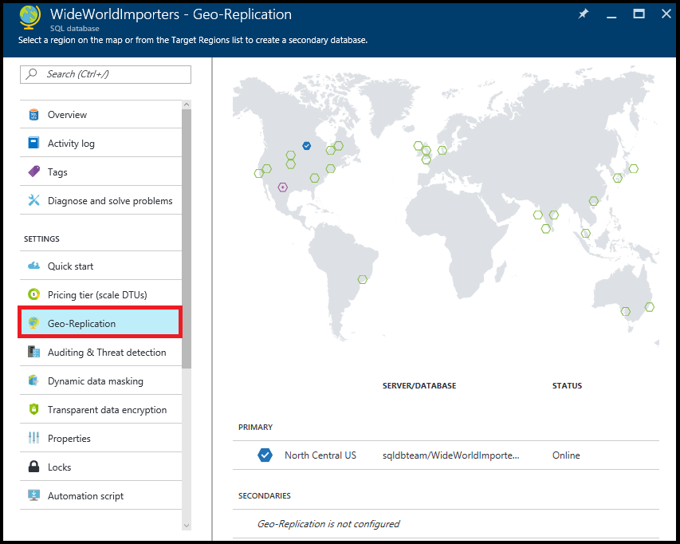
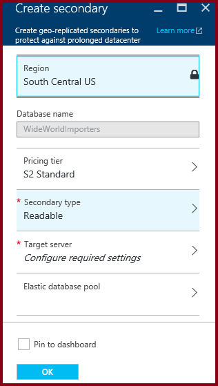
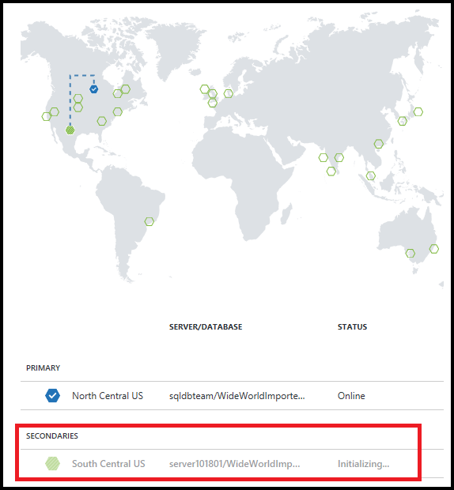
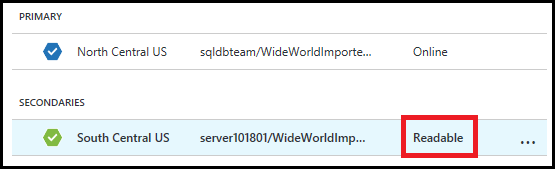

<properties 
    pageTitle="Konfigurieren von Geo-Replikation für SQL Azure-Datenbank mit dem Portal Azure | Microsoft Azure" 
    description="Konfigurieren von Geo-Replikation für Azure SQL-Datenbank mit dem Azure-portal" 
    services="sql-database" 
    documentationCenter="" 
    authors="stevestein" 
    manager="jhubbard" 
    editor=""/>

<tags
    ms.service="sql-database"
    ms.devlang="NA"
    ms.topic="article"
    ms.tgt_pltfrm="NA"
    ms.workload="NA"
    ms.date="10/18/2016"
    ms.author="sstein"/>

# Konfigurieren der Geo-Replikation für SQL Azure-Datenbank mit dem Azure-portal

> [AZURE.SELECTOR]
- [(Übersicht)](sql-database-geo-replication-overview.md)
- [Azure-portal](sql-database-geo-replication-portal.md)
- [PowerShell](sql-database-geo-replication-powershell.md)
- [T-SQL](sql-database-geo-replication-transact-sql.md)

In diesem Artikel wird das Konfigurieren der aktiven Geo-Replikation für SQL-Datenbank mit dem [Azure-Portal](http://portal.azure.com)veranschaulicht.

Um Failover mit Azure-Portal zu starten, finden Sie unter [Einleiten einer geplanten oder ungeplanten Failover für SQL Azure-Datenbank mit dem Portal Azure](sql-database-geo-replication-failover-portal.md).

>[AZURE.NOTE] Aktive Geo-Replikation (lesbaren sekundäre) steht für alle Datenbanken auf allen Ebenen der Dienst zur Verfügung. April 2017 nicht lesbaren sekundären Typs wird gelöscht werden, und vorhandene nicht lesbaren Datenbanken, um lesbare sekundäre automatisch aktualisiert werden.

Um Geo-Replikation mithilfe des Azure-Portals zu konfigurieren, benötigen Sie den folgenden Ressourcen:

- Ein Azure SQL-Datenbank - die primäre Datenbank, die in ein anderes geografische Region repliziert werden soll.

## Sekundäre Datenbank hinzufügen

Die folgenden Schritte erstellen eine neue sekundäre Datenbank in eine Zusammenarbeit Geo-Replikation.  

Wenn Sie eine sekundäre hinzufügen möchten, müssen Sie den Abonnementbesitzer oder gemeinsame Besitzer sein. 

Sekundäre Datenbank haben denselben Namen wie die primäre Datenbank und, standardmäßig müssen dieselbe Service-Version. Sekundäre Datenbank kann eine einzelne Datenbank oder eine flexible Datenbank. Weitere Informationen finden Sie unter [Service Ebenen](sql-database-service-tiers.md).
Nach der sekundären erstellt haben und die sich befinden, werden Daten aus der primären Datenbank auf die neue sekundäre Datenbank repliziert beginnen. 

> [AZURE.NOTE] Wenn Partner-Datenbank (beispielsweise - als Ergebnis Beenden einer vorherigen Geo-Replikation Beziehung) bereits vorhanden ist, schlägt der Befehl fehl.

### Hinzufügen von sekundären

1. Navigieren Sie zu der Datenbank, die Sie für die Geo-Replikation einrichten möchten, im [Azure-Portal](http://portal.azure.com).
2. Klicken Sie auf der Seite SQL-Datenbank **Geo-Replikation**wählen Sie aus, und wählen Sie dann auf den Bereich zum Erstellen der sekundären Datenbank. Sie können alle Region als der primäre Datenbank Hostinganbieter Region auswählen, der [für Region](../best-practices-availability-paired-regions.md) wird jedoch empfohlen.

    

4. Wählen Sie aus, oder konfigurieren Sie die Server und Preisgestaltung Ebene für die sekundäre Datenbank.

    

5. Optional können Sie eine sekundäre Datenbank ein Ressourcenpool flexible Datenbank hinzufügen:

 Um die sekundäre Datenbank in einem Ressourcenpool zu erstellen, klicken Sie auf **Ressourcenpool flexible Datenbank** , und wählen Sie einen Pool auf dem Server. Ein Ressourcenpool muss auf dem Zielserver bereits vorhanden sein, wie dieser Workflow einem Ressourcenpool kein entsteht.

6. Klicken Sie auf **Erstellen** , um die sekundäre hinzufügen.
 
6. Die sekundäre Datenbank wird erstellt, und der Seedprozess beginnt. 
 
    

7. Klicken Sie nach Abschluss der Seedprozess zeigt die sekundäre Datenbank ihren Status aus.

    

## Sekundäre Datenbank entfernen

Der Vorgang beendet die Replikation auf die sekundäre Datenbank dauerhaft und ändert sich die Rolle des sekundären in einer normalen Lese-und Schreibzugriff-Datenbank. Wenn die Verbindung zu der sekundären Datenbank fehlerhaft ist, wird der Befehl war erfolgreich, aber die sekundäre wird erst, Lese-und Schreibzugriff erst nach Connectivity wird wiederhergestellt.  

1. Navigieren Sie im [Azure-Portal](http://portal.azure.com)mit der primären Datenbank in das Geo-Replikation Zusammenarbeit.
2. Wählen Sie auf der Seite SQL-Datenbank **Geo-Replikation**aus.
3. Wählen Sie die Datenbank, die Sie aus der Zusammenarbeit Geo-Replikation entfernen möchten, klicken Sie in der Liste **sekundäre** .
4. Klicken Sie auf **Beenden Sie die Replikation**.

    

5. Durch Klicken auf **Beenden Replikation** wird ein Bestätigungsfenster also klicken Sie auf **Ja** So entfernen Sie die Datenbank aus der Zusammenarbeit Geo-Replikation (festgelegt in eine Datenbank Lese-und Schreibzugriff nicht Teil einer beliebigen Replikation).

## Nächste Schritte

- Weitere Informationen zu aktiven Geo-Replikation finden Sie unter - [Active Geo-Replikation](sql-database-geo-replication-overview.md)
- Eine Übersicht über Business-Continuity und Szenarien finden Sie unter [Übersicht über die Business continuity](sql-database-business-continuity.md)

