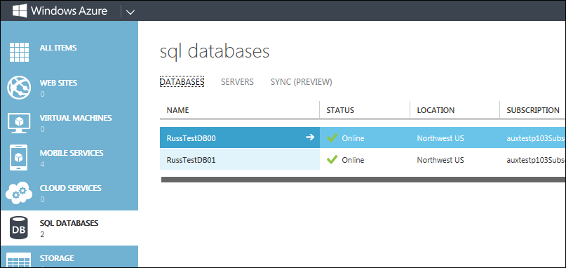
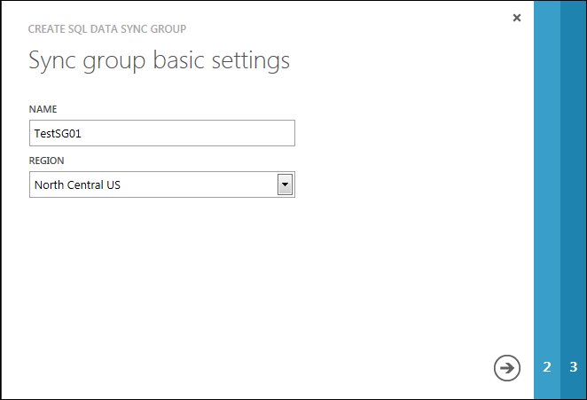
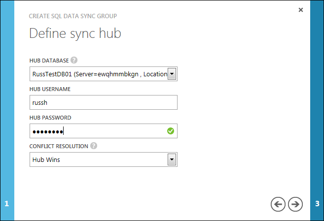
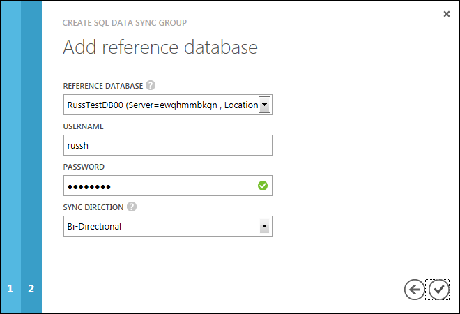
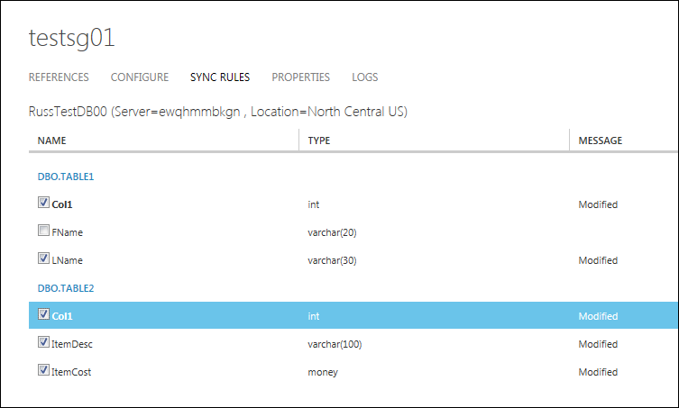
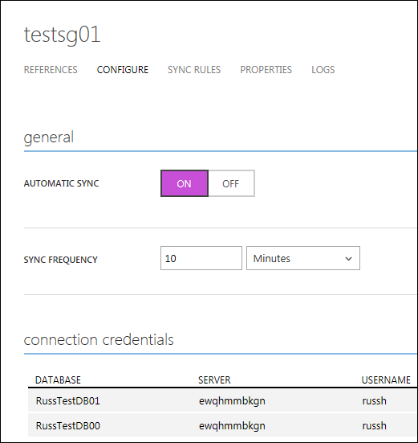

<properties
    pageTitle="Erste Schritte mit SQL-Datenbanken Daten synchronisieren"
    description="In diesem Lernprogramm hilft Ihnen die ersten Schritte mit Azure SQL-Daten synchronisieren (Preview)."
    services="sql-database"
    documentationCenter=""
    authors="jennieHubbard"
    manager="jhubbard"
    editor=""/>

<tags
    ms.service="sql-database"
    ms.workload="data-management"
    ms.tgt_pltfrm="na"
    ms.devlang="na"
    ms.topic="article"
    ms.date="07/11/2016"
    ms.author="jhubbard"/>

#Erste Schritte mit SQL Azure-Daten synchronisieren (Preview)
In diesem Lernprogramm erfahren Sie die Grundlagen der Verwenden des klassischen Azure-Portals Daten synchronisieren mit SQL Azure.

In diesem Lernprogramm wird davon ausgegangen minimalen vorherige Erfahrung mit SQL Server und Azure SQL-Datenbank aus. In diesem Lernprogramm erstellen Sie eine Hybrid (SQL Server und Instanzen der SQL-Datenbank) synchronisieren Gruppe vollständig konfiguriert und auf die von Ihnen festgelegten Zeitplans synchronisiert.

> [AZURE.NOTE] Die vollständige technische Dokumentation für Azure SQL-Daten synchronisieren, früher auf der MSDN-ansässig ist als PDF-Dateien zur Verfügung. Laden sie [hier](http://download.microsoft.com/download/4/E/3/4E394315-A4CB-4C59-9696-B25215A19CEF/SQL_Data_Sync_Preview.pdf).

## Schritt 1: Herstellen einer Verbindung der SQL Azure-Datenbank mit

1. Melden Sie sich bei der [klassischen Portal](http://manage.windowsazure.com).

2. Klicken Sie im linken Bereich auf **SQL-Datenbanken** .

3. Klicken Sie auf **SYNCHRONISIEREN** am unteren Rand der Seite. Wenn Sie SYNCHRONISIEREN klicken, wird eine Liste mit Elementen, die Sie hinzufügen können - **Gruppe neu synchronisieren** und **Neue Sync-Agent**.

4. Um den neuen SQL Daten synchronisieren Agent-Assistenten zu starten, klicken Sie auf **Neue Sync-Agent**.

5. Wenn Sie einen Agent vor, **Klicken Sie auf Herunterladen hier**hinzugefügt haben.

    

## Schritt 2: Hinzufügen eines Client-Agents
Dieser Schritt ist erforderlich, nur, wenn Sie beabsichtigen, eine lokalen SQL Server-Datenbank in der Gruppe synchronisieren enthalten sein. Fahren Sie mit Schritt 4, wenn die Gruppe synchronisieren nur SQL-Datenbank Instanzen aufweist.

### Schritt 2a: Installieren Sie die erforderliche Software
Achten Sie darauf, dass Sie Folgendes auf dem Computer, auf dem der Client-Agent installiert, installiert haben.

- **.NET Framework 4.0**

 Installieren Sie .NET Framework 4.0 von [hier](http://go.microsoft.com/fwlink/?linkid=205836)aus.

- **Microsoft SQL Server 2008 R2 SP1 System CLR-Typen (x86)**

 Installieren Sie die Microsoft SQL Server 2008 R2 SP1 System CLR-Typen (x86) [hier](http://www.microsoft.com/download/en/details.aspx?id=26728)

- **Microsoft SQL Server 2008 R2 SP1 gemeinsame Management Objekte (x86)**

 Installieren Sie die Microsoft SQL Server 2008 R2 SP1 freigegebene Management Objects (x86) [hier](http://www.microsoft.com/download/en/details.aspx?id=26728)

### Schritt 2 b: Installieren Sie einen neuen Client-Agent

Führen Sie die Anweisungen unter [Installieren eines Client-Agents (SQL Daten synchronisieren)](http://download.microsoft.com/download/4/E/3/4E394315-A4CB-4C59-9696-B25215A19CEF/SQL_Data_Sync_Preview.pdf) zum Installieren des Agents aus.

### Schritt 2c: Beenden Sie den neuen SQL Daten synchronisieren Agent-Assistenten

1.  Zum neuen Sync-Agent SQL Daten Assistenten zurückzukehren.
2.  Geben Sie dem Agent einen aussagekräftigen Namen zu.
3.  Wählen Sie aus der Dropdownliste aus der **REGION** (Data Center) dieser Agent hosten.
4.  Wählen Sie aus der Dropdownliste aus das **Abonnement** dieser Agent hosten.
5.  Klicken Sie auf den Pfeil nach rechts.

## Schritt 3: Registrieren einer SQL Server-Datenbank mit dem Client-Agent

Registrieren Sie nach der Installation des Client-Agents jeder lokalen SQL Server-Datenbank, die in einer Gruppe synchronisieren mit dem Agent enthalten sein sollen.
Um einer Datenbank mit dem Agent registrieren, Anweisungen Sie die in [einer SQL Server-Datenbank mit einem Client-Agent registrieren](http://download.microsoft.com/download/4/E/3/4E394315-A4CB-4C59-9696-B25215A19CEF/SQL_Data_Sync_Preview.pdf).

## Schritt 4: Erstellen einer Gruppe synchronisieren

### Schritt 4a: Starten des neuen synchronisieren Gruppe-Assistenten

1.  [Klassische-Portal](http://manage.windowsazure.com)zurück.
2.  Klicken Sie auf **SQL-Datenbanken**.
3.  Klicken Sie auf **SYNCHRONISIEREN hinzufügen** am unteren Rand der Seite und wählen Sie dann neue synchronisieren Gruppe aus dem Drucker.

    

### Schritt 4 b: Geben Sie die grundlegenden Einstellungen

1.  Geben Sie einen aussagekräftigen Namen für die Gruppe synchronisieren.
2.  Wählen Sie aus der Dropdownliste aus der **REGION** (Data Center) hosten dieser Gruppe synchronisieren.
3. Klicken Sie auf den Pfeil nach rechts.

    

### Schritt 4c: definieren den Hub synchronisieren

1. Wählen Sie aus der Dropdownliste aus die SQL-Datenbank-Instanz, dienen als Hub Gruppe synchronisieren aus.
2. Geben Sie die Anmeldeinformationen für diese SQL-Datenbank-Instanz - **HUB Benutzernamen** und Ihr **Kennwort HUB**an.
3. Warten Sie SQL Daten synchronisieren, Benutzername und Kennwort bestätigen ein. Es wird ein grünes Häkchen rechts des Kennworts angezeigt wird, wenn die Anmeldeinformationen bestätigt werden angezeigt.
4. Wählen Sie aus der Dropdownliste aus die **Mit einer Auflösung von Konflikt** Richtlinie ein.

 **Hub Wins** - Änderungen in der Datenbank Hub Schreibzugriff auf die Verweis-Datenbanken geschrieben, verwiesen werden überschreiben Änderungen in derselben Datenbank-Datensatz. Funktional, bedeutet dies, dass die erste Änderung an den Hub geschrieben an die anderen Datenbanken verteilt wird.

 **Client Wins** - Änderungen an den Hub geschrieben werden von Änderungen in Bezug Datenbanken überschrieben. Funktional, bedeutet dies, dass die letzte Änderung an den Hub geschrieben ist eine gehalten und zu anderen Datenbanken verteilt.

5.  Klicken Sie auf den Pfeil nach rechts.

    

### Schritt 4d: Hinzufügen einer Datenbank Bezug

Wiederholen Sie diesen Schritt für jede weitere-Datenbank, die Sie zur Gruppe "Synchronisieren" hinzufügen möchten.

1. Wählen Sie aus der Dropdownliste die Datenbank hinzufügen aus.

    Datenbanken in der Dropdownliste enthalten beide SQL Server-Datenbanken, die mit dem Agent und Instanzen der SQL-Datenbank erfasst wurden.
2.  Geben Sie die Anmeldeinformationen für diese Datenbank - **Benutzernamen** und Ihr **Kennwort**ein.
3.  Wählen Sie aus der Dropdownliste die **SYNCHRONISIEREN Richtung** für diese Datenbank ein.

    **Bidirektionale** - Änderungen in der Datenbank Bezug werden in der Datenbank Hub, und Änderungen an der Datenbank Hub auf die Datenbank geschrieben werden.

    **Synchronisieren von diesem Hub** - Datenbank empfängt Updates vom Hub an. Es wird keine Änderungen an den Hub gesendet.

    **Synchronisieren mit dem Hub** - Datenbank sendet Updates an den Hub an. Änderungen im Hub werden nicht in dieser Datenbank geschrieben werden.

4.  Zum Erstellen der Gruppe synchronisieren fertig sind, klicken Sie auf das Häkchen in der unteren rechten Ecke des Assistenten. Warten Sie mit die Anmeldeinformationen bestätigen SQL Daten synchronisieren aus. Ein grünes Häkchen zeigt an, dass die Anmeldeinformationen bestätigt werden.

5.  Klicken Sie auf das Häkchen ein zweites Mal. Daraufhin kehren Sie zu der Seite **SYNCHRONISIEREN** , klicken Sie unter SQL-Datenbanken zurück. Dieser Gruppe synchronisieren wird jetzt mit den anderen Gruppen synchronisieren und die Agents aufgeführt.

    

## Schritt 5: Definieren Sie die Daten synchronisieren

Azure SQL-Daten synchronisieren können Sie Tabellen und Spalten für die Synchronisierung auswählen. Wenn Sie auch eine Spalte filtern, sodass, die nur mit bestimmten Werten Zeilen möchten (z. B. Alter > = 65) synchronisieren, verwenden Sie die Daten synchronisieren SQL-Portal am Azure und die Dokumentation unter Wählen Sie die Tabellen, Spalten und Zeilen zu synchronisierende zum Definieren von Daten zu synchronisieren.

1.  [Klassische-Portal](http://manage.windowsazure.com)zurück.
2.  Klicken Sie auf **SQL-Datenbanken**.
3.  Klicken Sie auf die Registerkarte **SYNCHRONISIEREN** .
4.  Klicken Sie auf den Namen dieser Gruppe synchronisieren.
5.  Klicken Sie auf der Registerkarte **Regeln SYNCHRONISIEREN** .
6.  Wählen Sie die Datenbank, die Sie das Schema der synchronisieren Gruppe angeben möchten.
7.  Klicken Sie auf den Pfeil nach rechts.
8.  Klicken Sie auf **SCHEMA zu aktualisieren**.
9.  Wählen Sie für jede Tabelle in der Datenbank die Spalten in die Synchronisierung einbezogen werden sollen.
    - Spalten mit nicht unterstützten Datentypen können nicht ausgewählt werden.
    - Wenn keine Spalten in einer Tabelle ausgewählt sind, ist die Tabelle in der Gruppe "Synchronisieren" nicht enthalten.
    - Klicken Sie zum Aktivieren/deaktivieren alle Tabellen wählen Sie am unteren Rand des Bildschirms auf.
10. Klicken Sie auf **Speichern**, und klicken Sie dann warten Sie, bis der Gruppe synchronisieren, um provisioning fertig zu stellen.
11. Um zur Startseite Daten synchronisieren zurückzukehren, klicken Sie auf den zurück-Pfeil in der oberen linken Ecke des Bildschirms (über den Namen der Gruppe synchronisieren).

    

## Schritt 6: Konfigurieren der Gruppe "Synchronisieren"

Sie können eine Gruppe synchronisieren immer synchronisieren, indem Sie auf SYNCHRONISIEREN, am unteren Rand der Startseite Daten synchronisieren.
Um einen Zeitplan zu synchronisieren, konfigurieren Sie die Gruppe synchronisieren.

1.  [Klassische-Portal](http://manage.windowsazure.com)zurück.
2.  Klicken Sie auf **SQL-Datenbanken**.
3.  Klicken Sie auf die Registerkarte **SYNCHRONISIEREN** .
4.  Klicken Sie auf den Namen dieser Gruppe synchronisieren.
5.  Klicken Sie auf die Registerkarte **Konfigurieren** .
6.  **AUTOMATISCHE SYNCHRONISIERUNG**
    - Klicken Sie **auf**auf die Gruppe "Synchronisieren" in regelmäßigen Abständen synchronisieren um zu konfigurieren. Sie können weiterhin bei Bedarf synchronisieren, indem Sie auf SYNCHRONISIEREN.
    - Klicken Sie auf **aus** , um der Gruppe synchronisieren nur, wenn Sie SYNCHRONISIEREN klicken Sie auf synchronisieren zu konfigurieren.
7.  **SYNCHRONISIEREN HÄUFIGKEIT**
    - Wenn Sie automatische SYNCHRONISIEREN aktiviert ist, legen Sie die Synchronisierung Häufigkeit ein. Die Häufigkeit muss zwischen 5 Minuten und 1 Monat.
8.  Klicken Sie auf **Speichern**.

Herzlichen Glückwunsch! Sie haben eine Gruppe synchronisieren erstellt, die eine Instanz der SQL-Datenbank und einer SQL Server-Datenbank umfasst.

## Nächste Schritte
Weitere Informationen finden Sie unter SQL-Datenbank und SQL-Daten synchronisieren:

* [Laden Sie die vollständige SQL Daten synchronisieren technische Dokumentation](http://download.microsoft.com/download/4/E/3/4E394315-A4CB-4C59-9696-B25215A19CEF/SQL_Data_Sync_Preview.pdf)
* [SQL-Datenbank (Übersicht)](sql-database-technical-overview.md)
* [Datenbank Lifecycle Management](https://msdn.microsoft.com/library/jj907294.aspx)
 

 
