<properties
    pageTitle="SQL-Datenbank-Lernprogramm: erstellen eine SQL-Datenbank | Microsoft Azure"
    description="Informationen Sie zum Einrichten einer logischen SQL-Datenbankserver, Server Firewall-Regel, SQL-Datenbank und Beispieldaten. Darüber hinaus Informationen Sie zum Verbinden mit Clienttools, Konfigurieren von Benutzern und Einrichten einer Datenbank Firewall-Regel."
    keywords="SQL-Datenbank Lernprogramm erstellen Sie eine SQL­Datenbank"
    services="sql-database"
    documentationCenter=""
    authors="CarlRabeler"
    manager="jhubbard"
    editor=""/>

<tags
    ms.service="sql-database"
    ms.workload="data-management"
    ms.tgt_pltfrm="na"
    ms.devlang="na"
    ms.topic="hero-article"
    ms.date="09/07/2016"
    ms.author="carlrab"/>

# SQL-Datenbank-Lernprogramm: erstellen eine SQL-Datenbank in wenigen Minuten mithilfe des Azure-Portals

> [AZURE.SELECTOR]
- [Azure-portal](sql-database-get-started.md)
- [C#](sql-database-get-started-csharp.md)
- [PowerShell](sql-database-get-started-powershell.md)

In diesem Lernprogramm erfahren Sie, wie das Azure-Portal zu verwenden:

- Erstellen einer SQL Azure-Datenbank mit Beispieldaten.
- Erstellen Sie eine Ebene Server-Firewall-Regel für eine einzelne IP-Adresse oder einen Bereich von IP-Adressen ein.

Sie können mithilfe von [c#](sql-database-get-started-csharp.md) oder [PowerShell](sql-database-get-started-powershell.md)dieser Aufgaben ausführen.

[AZURE.INCLUDE [Login](../../includes/azure-getting-started-portal-login.md)]

## Erstellen Sie Ihrer ersten Azure SQL-Datenbank 

1. Wenn Sie derzeit nicht verbunden sind, schließen Sie an der [Azure-Portal](http://portal.azure.com).
2. Klicken Sie auf **neu**, klicken Sie auf **Daten + Speicher**, und suchen Sie dann auf **SQL-Datenbank**.

    

3. Klicken Sie auf **SQL-Datenbank** , um das Blade SQL-Datenbank zu öffnen. Der Inhalt dieser Blade abhängig von der Anzahl von Ihrer Abonnements und Ihre vorhandene Objekte (beispielsweise vorhandener Server).

    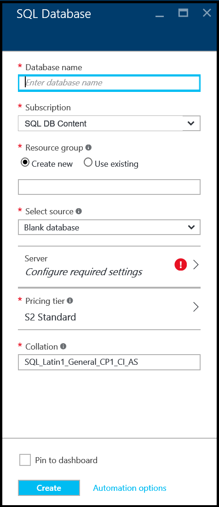

4. Geben Sie in das Textfeld **Name der Datenbank** einen Namen für die ersten Datenbank – wie etwa "Meine Datenbank" ein. Ein grünes Häkchen zeigt an, dass Sie einen gültigen Namen angegeben haben.

    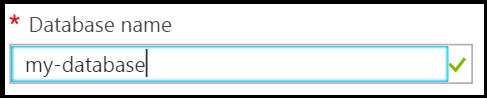

5. Wenn Sie mehrere Abonnements verfügen, wählen Sie ein Abonnement.
6. Klicken Sie unter **Ressourcengruppe**klicken Sie auf **neu erstellen** , und geben Sie einen Namen für Ihre erste Ressourcengruppe – wie etwa "Meine Ressource-Gruppe". Ein grünes Häkchen zeigt an, dass Sie einen gültigen Namen angegeben haben.

    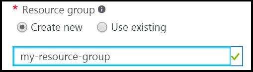

7. Klicken Sie unter **Wählen Sie Quelle aus**klicken Sie auf **Beispiel** , und klicken Sie dann unter **Wählen Sie die Stichprobe** auf **AdventureWorksLT [V12]**.

    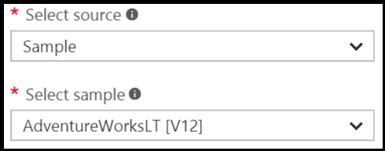

8. Klicken Sie unter **Server**auf **konfigurieren: Einstellungen erforderlich**.

    

9. Klicken Sie auf das Server-Blade **Erstellen Sie einen neuen Server**aus. Eine SQL Azure-Datenbank wird innerhalb eines Objekts Server erstellt, die einen neuen Server oder einem vorhandenen Server werden können.

    

10. Überprüfen Sie das **neue Server** -Blade, um die Informationen zu verstehen, die Sie für den neuen Server bereitstellen müssen.

    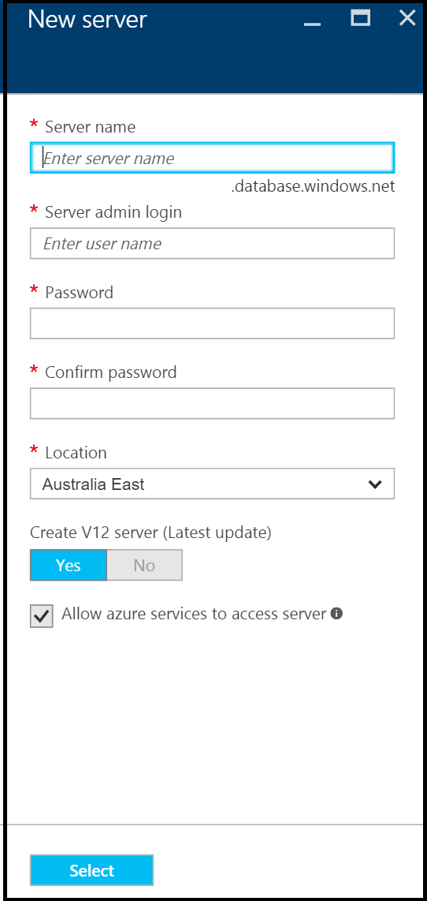

11. Geben Sie einen Namen für den ersten Server – beispielsweise "Meine neuen-Server-Objekte", in das Textfeld **Name Server** . Ein grünes Häkchen zeigt an, dass Sie einen gültigen Namen angegeben haben.

    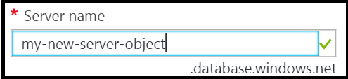
 
12. Geben Sie unter **Server Administrator anmelden**einen Benutzernamen für die Anmeldung Administrator für diesen Server – beispielsweise "Mein Admin-Konto". Die wichtigsten Server-Anmeldung wird dieser Anmeldung genannt. Ein grünes Häkchen zeigt an, dass Sie einen gültigen Namen angegeben haben.

    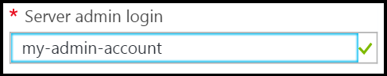

13. Wählen Sie unter **Kennwort** und **Kennwort bestätigen**, geben Sie ein Kennwort für den Server Hauptbenutzer Login Konto - wie "p@ssw0rd1". Ein grünes Häkchen zeigt an, dass Sie ein gültiges Kennwort angegeben haben.

    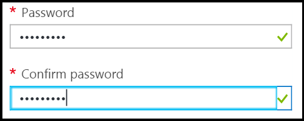
 
14. Wählen Sie unter **Ort**einem Data Center entsprechenden zu Ihren Standort – wie etwa "Australien Ost" ein.

    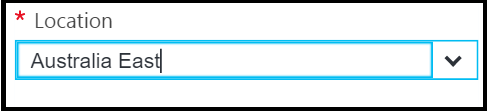

15. Klicken Sie unter ** Erstellen V12 Server (neueste Update), beachten Sie, dass nur die Möglichkeit, eine aktuelle Version von SQL Azure-Server zu erstellen.

    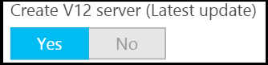

16. Beachten Sie, dass standardmäßig **Zulassen Azure Services Server Zugriff auf** das Kontrollkästchen aktiviert ist, und hier nicht geändert werden. Dies ist eine erweiterte Option. Sie können diese Einstellung in der Firewall servereinstellungen für dieses Serverobjekt ändern, auch in den meisten Fällen dies nicht erforderlich ist.

    

17. Klicken Sie auf das neue Server-Blade überprüfen Sie Ihre Auswahl, und klicken Sie dann auf **Wählen Sie aus** , um diese neuen Server für die neue Datenbank auszuwählen.

    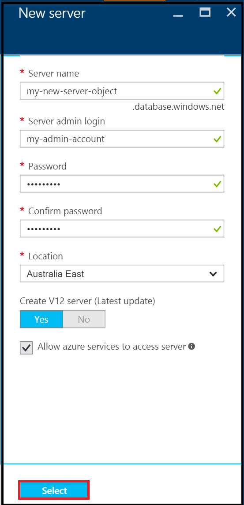

18. Klicken Sie in der SQL-Datenbank Blade, wählen Sie unter **Preise Ebene** **S2 Standard** und anschließend auf **grundlegende** zum Auswählen der mindestens teuren Preisgestaltung Ebene für die ersten Datenbank. Sie können die Preisgestaltung Ebene später jederzeit ändern.

    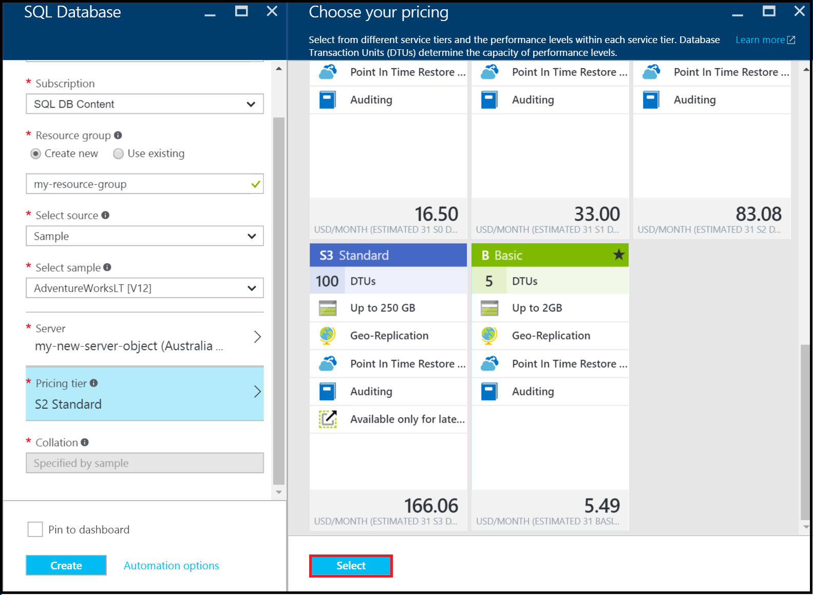

19. Überprüfen Sie in der SQL-Datenbank Blade Ihre Auswahl, und klicken Sie dann auf **Erstellen** , um Erstellen Ihres ersten Servers und einer Datenbank. Die von Ihnen angegebenen Werte werden überprüft und Bereitstellung wird gestartet.

    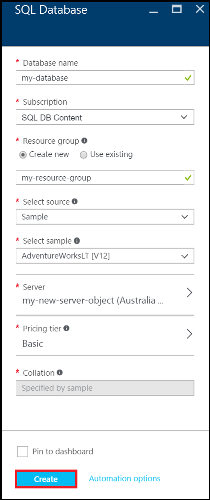

20. Klicken Sie auf der Symbolleiste Portalseite auf **Benachrichtigungen** Elemente zum Überprüfen des Status der Bereitstellung.

    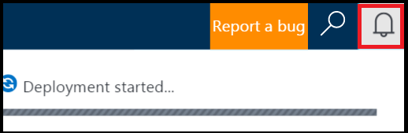

>[AZURE.IMPORTANT]Bereitstellung abgeschlossen ist, werden die neuen SQL Azure-Servers sowie die Datenbank in Azure erstellt. Sie werden keine Verbindung zu Ihrem neuen Server oder mithilfe der SQL Server-Tools erst nach dem Erstellen einer Server-Firewall-Regel zum Öffnen der SQL-Datenbank-Firewalls Verbindungen aus außerhalb Azure-Datenbank herstellen.

[AZURE.INCLUDE [Create server firewall rule](../../includes/sql-database-create-new-server-firewall-portal.md)]

## Nächste Schritte
Jetzt, da Sie schon erledigt haben dieses Lernprogramms SQL-Datenbank und erstellt eine Datenbank einige Beispieldaten, Sie können nun mithilfe Ihrer bevorzugten Tools auswerten.

- Wenn Sie mit Transact-SQL und SQL Server Management Studio (SSMS) vertraut sind, erfahren Sie, wie [Verbinden und Abfrage mit SSMS einer SQL-Datenbank](sql-database-connect-query-ssms.md).

- Wenn Sie Excel kennen, erfahren Sie, wie Sie [mit einer SQL-Datenbank in Azure mit Excel](sql-database-connect-excel.md).

- Wenn Sie bereit sind, Programmieren beginnen, wählen Sie Ihre Programmiersprache am [Datenverbindungsbibliotheken für SQL-Datenbank und SQL Server](sql-database-libraries.md).

- Wenn Sie Ihrem lokalen SQL Server-Datenbanken in Azure verschieben möchten, finden Sie unter [Migrieren einer Datenbank mit SQL-Datenbank](sql-database-cloud-migrate.md) , um mehr zu erfahren.

- Wenn Sie einige Daten in eine neue Tabelle aus einer CSV-Datei zu laden, indem Sie mithilfe des Tools für die Befehlszeile BCP möchten, finden Sie unter [Laden von Daten in einer SQL-Datenbank aus einer CSV-Datei mit BCP](sql-database-load-from-csv-with-bcp.md).

- Wenn Sie untersuchen Azure SQL-Datenbank Sicherheit beginnen möchten, finden Sie unter [Erste Schritte bei der Sicherheit](sql-database-get-started-security.md)

## Zusätzliche Ressourcen

[Was ist die SQL-Datenbank?](sql-database-technical-overview.md)
