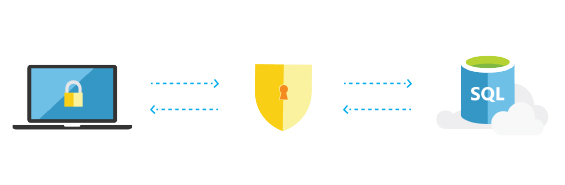

<properties
   pageTitle="SQL Azure-Datenbank sichert und geschützt"
   description="Erfahren Sie, wie SQL-Datenbank sichere und schützen"
   keywords=""
   services="sql-database"
   documentationCenter=""
   authors="CarlRabeler"
   manager="jhubbard"
   editor=""/>

<tags
   ms.service="sql-database"
   ms.devlang="NA"
   ms.topic="article"
   ms.tgt_pltfrm="NA"
   ms.workload="data-management"
   ms.date="09/13/2016"
   ms.author="carlrab"/>
   
# SQL Azure-Datenbank sichert und geschützt

## Behalten Sie die app Daten, sichere

Azure SQL-Datenbank unterstützt Millionen von wichtigen Datenbanken in der Cloud&mdash;, in dem alle Vorteile von hohen Verfügbarkeit, Sicherheit, Compliance und hohe Leistung. Der kleinste beim Start Konzern Daten Sicherheit zunehmend Anfang des Meinung für alle Unternehmen ist und SQL-Datenbank unterstützt alle.

## Wir haben Ihre zurück

Sie können nur hoffen müssen Sie nicht das gestrige Sicherungskopien zuzugreifen oder Sie nach einem Datenverlust wiederherstellen. Wenn Sie sich in diesem Fall finden, SQL-Datenbank ist jedoch vorhanden helfen. Verfügbarkeit von 99,99 %, der automatischen Sicherung, Point-in-Time wiederherstellen, integrierten Geo-Replikation und Failoveroptionen, Sie werden ruhen lassen sich darauf verlassen, dass Ihre app sichere und sound ist.

[Lesen Sie die Dokumentation](sql-database-business-continuity.md)

## Der größte Compliance-portfolio

SQL-Datenbank verfügt über das größte Compliance Portfolio der Branche. In diesem Fall ist der benötigten HIPAA Compliance oder FERPA oder sogar Singapur MTCS Stufe 3 keine Sorge&mdash;haben wir Sie verdeckt.  

[Lesen Sie die Dokumentation](https://www.microsoft.com/TrustCenter/Compliance/default.aspx)

## Ebenen des Schutzes

SQL-Datenbank bietet mehrere Ebenen des Datenschutzes. Ihre Daten durch Verschlüsselung Daten während ruhen – in Bewegung geschützt ist oder verwendet wird, für die Datenbank oder der Anwendung nur autorisierte Benutzer authentifiziert und Einschränken des Benutzerzugriffs auf die entsprechende Teilmenge der Daten. Darüber hinaus bietet SQL-Datenbank fortlaufender Überwachung und Aktivitäten zu erkennen potenzielle Risiken und ermöglichen eine Aufzeichnung der kritische Ereignisse bei einem Verstoß gegen Überwachung. Diese Features sind verteilt, indem Sie die Möglichkeit, schnell implementieren Features und Risiken ohne Kompromisse Developer Productivity oder ein Programm zur Sicherheit.

[Lesen Sie die Dokumentation](http://go.microsoft.com/fwlink/?LinkID=787593)

Wechseln Sie zur Homepage finden Sie unter Was sonst SQL-Datenbank zu bieten hat.
[Schauen sie sich diese](https://azure.microsoft.com/services/sql-database/) 

## Nächste Schritte

Erhalten einer [kostenlosen Azure-Abonnement](https://azure.microsoft.com/get-started/) und [Erstellen Ihrer ersten Azure SQL-Datenbank](sql-database-get-started.md).

## Zusätzliche Ressourcen

Untersuchen Sie die [Funktionen von SQL-Datenbank](https://azure.microsoft.com/services/sql-database/).
 
Lesen Sie die [Technische Übersicht der SQL-Datenbank](sql-database-technical-overview.md).  

