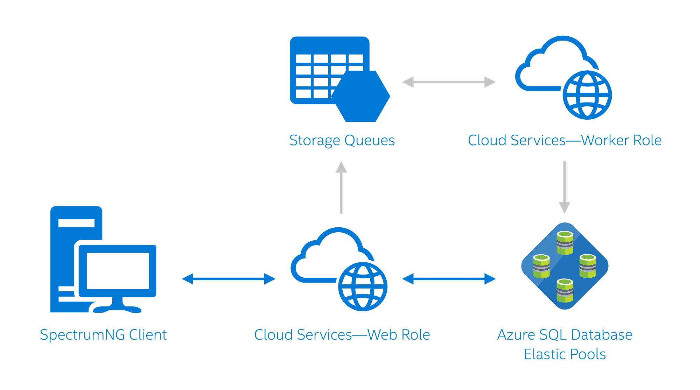

<properties
   pageTitle="SQL Azure-Datenbank Fallstudie Azure - Daxko/CSI | Microsoft Azure"
   description="Informationen Sie darüber, wie Daxko/CSI SQL-Datenbank verwendet, deren Entwicklungszyklus beschleunigen und seiner Kundenservices und die Leistung zu verbessern"
   services="sql-database"
   documentationCenter=""
   authors="CarlRabeler"
   manager="jhubbard"
   editor=""/>

<tags
   ms.service="sql-database"
   ms.devlang="NA"
   ms.topic="article"
   ms.tgt_pltfrm="NA"
   ms.workload="NA"
   ms.date="09/08/2016"
   ms.author="carlrab"/>
   
# Daxko/CSI verwendet Azure, um seine Entwicklungszyklus beschleunigen und seiner Kundenservices und die Leistung zu verbessern

Daxko/CSI Software konfrontiert zur Herausforderung: seiner Kundenbasis der Fitness und Freizeitanlagen Center wurde schnelles, Dank des Erfolgs seine Lösungen umfassende Enterprise-Software Wachstum aber Regelmäßiges Informieren über den Anforderungen IT-Infrastruktur für die wachsende Kunden Basis des Unternehmens testen wurde IT-Personal. Das Unternehmen wurde durch steigenden Verwaltungsaufwand Vorgänge, besonders für die Verwaltung von deren wachsenden Datenbanken zunehmend eingeschränkt. Schlechter, wurde dieser Vorgänge Verwaltungsaufwand in Entwicklungsressourcen für neue Initiativen, wie die neuen Mobilitätsfeatures für Software des Unternehmens Ausschneiden.

Nach David Molina, Leiter der Produktentwicklung am Daxko/CSI, bereitgestellt Azure CSI-Software mit dem Plattform-als-Service (PaaS) Modell, das es benötigt, um die Datenbank-Management vereinfachen, Skalierbarkeit vergrößern und Freigeben von Ressourcen auf Software statt Ops vereinfacht. "Azure SQL-Datenbank wurde eine gute Option für uns. Zum Verwalten von einem SQL Server, einem Failovercluster und alle anderen-Infrastruktur muss stellt sicher, dass wurde ideal für uns."

Seit Migrieren zu Azure, benötigt CSI Software keine Vorgänge Mitarbeiter zweier nur über 600 Kundendatenbanken verwalten. Das Unternehmen verwendet flexible Pools Azure SQL-Datenbank Verschieben von Kundendatenbanken basierend auf Größe und muss.

Molina immer noch auftritt, "unsere Kunden die Änderung sofort Ansicht. Vor flexible Pools wurde sie gelegentlich Zeitlimit und weitere Probleme Burst Zeiträumen. Mit Azure flexible Pools können sie Spitzen-Bedarf und Verwenden der Software problemloses."

Zusätzlich zum Verbessern der Leistung von Kunden, elastisch Azure-Datenbank Pools CSI Software Ressourcen auf neue Dienste und Features, statt Umgang mit Vorgänge und Verwaltung Entwicklung konzentrieren freigegeben wurde. Diese IT-Ressourcen beigetragen CSI Software verbessern Geschenk, SpectrumNG, um zu populärer Fitnesscenter Mitglieder, Personal-Effizienz, deren Enterprise-Software, und geben Sie Personal und die Mitglieder mobilen Zugriff für interaktive Aufgaben und in Echtzeit Benachrichtigungen.

Azure hat auch CSI Software beschleunigen und verbessern die Entwicklung und die Qualität Zusicherung (f & a) Kreis durch Aktivieren von Automatisierungsoptionen für die beigetragen. Build-Manager können mit Azure Implementierung des Unternehmens von Komponenten durch Klicken auf eine Schaltfläche verpacken. Wie in Molina beschrieben, die "als Teil der Releasezyklus, kann f & a jetzt Bereitstellen einer testumgebung in Azure, die eng unsere Herstellung Stapel ähnelt. Wir können Builds sofort zu Änderungen überprüfen unsere Entwickler-Umgebung bereitzustellen. Das ist ein großer Gewinn für uns, da wir Unstimmigkeit zum Testen, bevor Sie installiert hatten."

## Verschiebung in der cloud

Vor dem Verschieben in der Cloud, hatten CSI Software von einem eigenen mandantenfähigen Infrastruktur in einem lokalen Datencenter in Berlin erfolgreich erstellt. Wie das Unternehmen erweitert, konfrontiert es zunehmenden Anfangsschwierigkeiten aus erwerben, bereitgestellt und warten alle Hard- und Software zur Unterstützung seiner Kunden erforderlich sind. IT Operationen zu Personal geworden ist ein anderes Engpass, die eine langsamer in neue Ressourcen bereitgestellt und anschließend einführen neue Dienste für Kunden geführt hat.

CSI Software vergeblich in der Cloud-Optionen für die Verwaltungsaufwand, sodass, damit er auf den Code, statt dessen Vorgänge konzentrieren konnte. Das Unternehmen festgestellt, dass viele der obersten Cloud-Anbieter nur Infrastruktur als Service (IaaS) Lösungen anbieten, die immer noch eine große IT-Personal zum Verwalten von des Stapels IaaS erfordern. Am Ende bestimmt CSI-Software an, dass die Lösung Azure PaaS die optimale Breite für seine Bedürfnisse wurde. Molina erläutert, "Azure aus dem Weg, die Hardware und Software Ruft ab, damit wir auf unserer Softwareangebote konzentrieren können, während Sie unseren IT-Verwaltungsaufwand."

## Der Wechsel zur Azure

Nach Auswahl der Azure für seine PaaS-Lösung, CSI Software Migrieren der Back-End-Infrastruktur und Datenbanken in der Cloud begonnen hat. Vor Azure SpectrumNG Kunden, die zum Installieren einer Clientanwendung, die kommuniziert mit einem Windows Communication Foundation (WCF)-Dienst, auf die Back-End erforderlich sind. Nach Molina integriert"zwar einige Kunden alles in ihren eigenen Rechenzentren gehostet wir das Produkt mandantenfähigen sein. Wir gehostet alles in einem Datencenter in Berlin, mithilfe von SQL Server als Datenspeicher.

"Unser Produkt auch Geschenk enthalten, ein Mitglied zugänglichen Web-Portal (in ASP.net geschrieben) entwickelt wurde, entsprechend der vom Kunden Web Anwesenheitsinformationen und SOAP-API zur Unterstützung von online Seiten und eine Drittanbieter-Integration weiß beschrifteten werden."

Die Migration in der Cloud nicht in Anspruch nehmen lange für die Architektur. Nach Molina, "Die meisten der Arbeit mit ändern die Möglichkeit, dass wir Informationen zu Datendateien, eine Änderung zentralisierte Verbindungszeichenfolge und die Verpackung automatisieren, hochladen und Bereitstellung von unserem Versionen beantwortet."

Bei der Entwicklung die Buildautomatisierung verwendet CSI Softwareentwickler Azure PowerShell und REST-APIs Pakete erstellen und auf einer staging-Umgebung für Release jede Nacht hochladen.
Der gesamte Übergang mit einer Azure-Cloud-basierte Bereitstellung Problems schnell und problemlos für das Team CSI Software IT an. Molina erläutert "In allen, wir eine Beta-Umgebung, in der Cloud innerhalb von drei bis vier Wochen im Projekt Aufzeichnen von hatten. Das war ein überraschende Gewinn für uns."

Nach dem Konfigurieren und Testen der Umgebung CSI Software begonnen migrieren Kunden. Für Kunden, die bereits CSI Software hosten war der Übergang nahezu nahtlose. Für Kunden aus einer lokalen Bereitstellung migrieren, die Migration in der Cloud einige zusätzliche gedauert, aber weiterhin hauptsächlich wurde für Kunden und CSI Software einfach.

Für neuer Kunden CSI Software des IT-Personal gehen Sie folgendermaßen vor, integrierte diese in Azure:

1.  Azure PowerShell-Skripts werden verwendet, um eine neue Datenbank für den Kunden dreht. alle Kunden anfangs auf einer Ebene Premium, um sicherzustellen, dass genügend initial Durchsatz für den Übergang.
2.  Wenn möglich, verwendet CSI Software den Azure SQL-Migrations-Assistenten zum Verschieben von vorhandener Daten in eine Instanz von SQL Azure-Datenbank.
3.  Microsoft SQL Server Integration Services (SSIS) verwendeten schließlich abstimmen, eventuelle Differenzen in den Daten oder alle Daten zum Aufräumen nach Bedarf ausführen.

Heute, werden Info 99 Prozent CSI Software Kunden in Azure, über vier regionalen Datenzentren (North Central, Süd Mittel-, Osten und Westen) gehostet. Wenn Rechenzentren in geografische Region des Kunden, ist die Wartezeit auf ein Minimum beschränkt.

## Flexible Azure-Datenbank Pools für freie IT-Ressourcen

Einige Features von Azure haben CSI Software beigetragen UMSCHALT, nicht mehr für Infrastruktur und Vorgänge konzentrieren, um das Feature "und" Entwicklung konzentrieren können. Vielleicht wurde der größte Vorteil von Pools flexible Datenbank.

CSI Software bietet aktuell Info 550 Datenbanken für Kunden. Bevor Sie flexible Pools war es schwierig zu verwalten, dass viele Datenbanken innerhalb einer Ebenen-Struktur. OPS Manager hatten zuweisen Performance-Stufen basierend auf den Anforderungen Burst Kunden, die wesentlichen IT-Ressourcen Aufwand erforderlich. Mit flexible Datenbank Pools können Manager Mandanten zuweisen, eine Premium- oder standard Ressourcenpool, je nach Bedarf, und klicken Sie dann verschieben Kunden basierend auf Größe und müssen. Die Auswirkungen der flexible Datenbank Pools Meinung von Kunden beinahe sofort waren; Flexible Pools, bevor Sie Kunden hatten Zeitlimit und weitere Probleme Burst-Verwendung Zeiträumen, jedoch mit flexible Pools, Kunden Aktivität Bursts Bedarf auftreten können, und sie können weiterhin SpectrumNG problemloses verwenden.

## Azure Active Geo Replikation Beschleunigung reporting

Mehrere CSI Software Kunden abzubrechen auch Vorteil der Azure Active Geo-Replikation. Mit aktiven Geo-Replikation kann bis zu vier lesbare sekundäre Datenbanken in derselben oder einer anderen Datacenter Regionen konfiguriert werden. CSI Software macht der aktiven Geo-Replikation auf zwei Arten verwenden: zuerst sekundären Datenbanken stehen zur Verfügung, wenn ein Ausfall Datacenter oder die Unfähigkeit zum Herstellen der primären Datenbank; und zum anderen sekundären Datenbanken können gelesen und auslagern schreibgeschützt Auslastung wie das Melden von Aufträgen verwendet werden können. Einige Kunden CSI Software verwenden diese Vorteile reporting Workflows zu beschleunigen.

## Die Anwendungslogik CSI-Software und Architektur

SpectrumNG werden Webrollen verwendet. Da die Anwendung mit mehreren Mandanten ist, wird ein WCF-Dienst verarbeitet die ursprüngliche Verbindung Anforderung von Kunden verwendet. Wie Molina besagt, identifiziert"die Anforderung einzelnen Kunden, Erstellen einer Verbindungszeichenfolge, zu ihrer Datenbanken ausführen, welchen Beginn müssen wir führen Sie dann mit der."

Für die Web-Leiste der entsprechenden Dienst nutzt CSI Software Azure automatische Skalierung, basierend auf den Tag und die Uhrzeit. Verfügbare Ressourcen werden automatisch angepasst höhere Verwendung üblichen Geschäftszeiten, nach die Zeitzone des jede regionale Datenzentrum erhöht. Ressourcen sind auch auf der Wochenenden, verkleinern, wenn Kunden Anforderungen niedriger sind festgelegt.

     

Abbildung 1. Eine Cloud Services Worker-Rolle zeichnet strukturierte Daten aus Azure SQL-Datenbank und teilweise strukturierte Daten aus Tabellenspeicher. SpectrumNG Benutzer interagieren mit, dass die Daten über eine Cloud Webrolle services.

## Verwenden von Web apps und eine Stufe Web-Plan für mobile-apps

Verwenden Azure SQL-Datenbank freigegeben wurde Ressourcen für CSI Software zum neuen bieten eine vollständige mobile Plattform einschließlich basierend auf einer benutzerdefinierten API in Azure Web apps gehostet wird. Die Plattform ermöglicht Fitnesscenter Mitglieder und Mitarbeiter an, Terminpläne überprüfen, die Bücher Klassen und Empfangen von Nachrichten mit mobilen Geräten.

Die Plattform Service-orientierte Architektur (SOA) verwendet, um eine einzelne Komponente zu nutzen – wie ein Kassenterminalsystem (POS) oder ein sales System – es in einen anderen Web-Plan im laufenden Betrieb verschieben und drehen Sie von einem Dienst zur Unterstützung von Komponente, hinterlassen Sie allen weiteren Aufgaben auf den ursprünglichen Plan mit Web. Die Möglichkeit, gibt CSI Software viel Flexibilität, und es sorgt Kosten nach unten.

## Azure ermöglicht CSI Software Entwickler Fokus auf apps und Dienste

Azure SQL-Datenbank ist nicht nur eine gesteigert werden SpectrumNG Kunden mit schnellen und zuverlässigen Dienst nutzen zu können, ist es auch einen großen Gewinn für CSI-Software IT-Personal und Entwickler. Durch Verschiebung so das Azure in der Cloud, CSI Software reduziert den Verwaltungsaufwand für Ressourcen und Infrastruktur, schnellere erheblich seine Entwicklungszyklen, und nicht mehr Anforderungen an Micromanage Datenbanken zur Optimierung der Performance für den Mandanten.

## Weitere Informationen

- Weitere Informationen zum flexible Azure-Datenbank Pools finden Sie unter [flexible Datenbank Pools](sql-database-elastic-pool.md).

- Weitere Informationen zum Datenbanktools und flexible Skalierung finden Sie unter [flexible Datenbanktools und flexible skalieren](sql-database-elastic-scale-get-started.md).

- Weitere Informationen zum Migrieren einer SQL Server-Datenbank finden Sie unter [Azure SQL-Assistent für die Migration](sql-database-cloud-migrate-compatible-using-ssms-migration-wizard.md).

- Finden Sie weitere Informationen zu aktiven Geo-Replikation finden Sie unter [Aktive Geo-Replikation](sql-database-geo-replication-overview.md).

- Weitere Informationen zu Rollen der Web und Worker finden Sie unter [Worker-Rollen](../fundamentals-introduction-to-azure.md#compute). 

- Wenn Sie weitere Informationen zur Azure-Dienstbus finden Sie unter [Azure Service Bus](https://azure.microsoft.com/services/service-bus/).

- Weitere Informationen zum automatische Skalierung finden Sie unter [Skalieren Cloud-Dienste](../cloud-services/cloud-services-how-to-scale.md).
