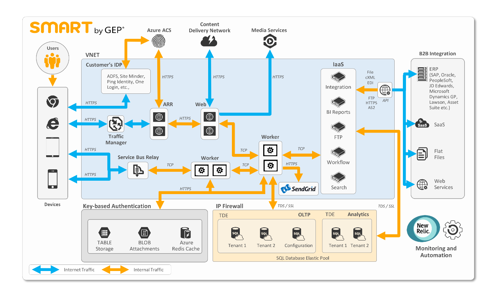

<properties
   pageTitle="SQL Azure-Datenbank Fallstudie Azure - GEP | Microsoft Azure"
   description="Erfahren Sie mehr über die wie GEP SQL-Datenbank verwendet, um weitere globale Kunden zu erreichen und effizienter zu erzielen"
   services="sql-database"
   documentationCenter=""
   authors="CarlRabeler"
   manager="jhubbard"
   editor=""/>

<tags
   ms.service="sql-database"
   ms.devlang="NA"
   ms.topic="article"
   ms.tgt_pltfrm="NA"
   ms.workload="NA"
   ms.date="09/08/2016"
   ms.author="carlrab"/>

# Azure ermöglicht, globale Reichweite GEP und effizienter zu arbeiten

GEP bietet Software und Dienste, mit die Aufträge Füllzeichen auf der ganzen Welt zu deren Einfluss auf deren Unternehmens Vorgänge, Strategien und finanzielle aufführungen maximieren können. Zusätzlich zu Beratung und verwalteten Diensten bietet das Unternehmen SMART durch GEP®, eine cloudbasierte, umfassende Aufträge-Software-Plattform. GEP jedoch Hintergrundinstallation Einschränkungen versuchen wie SMART durch GEP mit einem eigenen Rechenzentren lokalen Lösungen zu unterstützen: die Investitionen erforderlich waren steilen und gesetzliche Vorschriften in anderen Ländern gewesen wäre den notwendigen Investitionen Weitere weiterhin beeindruckend. In der Cloud verschieben, hat GEP IT-Ressourcen freigegeben ermöglicht diesem kleiner zu IT-Vorgänge und Weitere Informationen zum Entwickeln von neuer Datenquellen des Werts für seiner Kunden weltweit Fokus zu sorgen.

## Erweitern mithilfe von Azure Services und Variation

SMART durch GEP Kunden gerne Features und Center für erleichterte Bedienung Ihrer Plattform; Kunden können ihre Prozesse von überall und verwalten, zu einem beliebigen Zeitpunkt und auf jedem Gerät – Laptop, einem Tablet-PC oder einem Telefon. In Microsoft Azure verschieben, wurde GEP Tabellenbereich an einem raschen Wachstum und deren potenzieller in neuen Märkten erweitern können. Nach GEPs VP of Technology Dhananjay Nagalkar, weist "Microsoft Azure wiedergegeben eine wichtige Rolle GEPs Erfolg und ermöglicht uns die Dienste schnell mit Flexibilität skalieren und durch die Bereitstellung der regionaler Datenzentren, die uns den gesetzlichen Anforderungen unsere Kunden weltweit helfen."

## Die Einschränkungen eines Datencenters http://www.Office.com/redir/xt103221361

Klicken Sie in 2013 erkannt GEP Füllzeichen die Notwendigkeit, einer Möglichkeit zum Skalierbarkeit und Leistung zu gewährleisten, wie sie ihre Kunden-Basis vergrößert wurde. Erläuterung, Nagalkar "um diesen Bedarf mit unseren vorhandenen Rechenzentren entsprechen, wir hätte unserer Infrastruktur und IT-Ressourcen erheblich zu erweitern. Die Investition und Zeitrahmen für das hätten großes." Lokale, dass physischen und virtuellen Computern erfordern umfassende Konfiguration, Verwaltung, Skalierung, Sicherung und Patch mit einer Geschwindigkeit, die Kosten für GEP hoch gewesen wäre. Cloudlösungen anbieten andererseits, Vereinfachung und Komfort, die GEP weitere auf Entwicklung statt Verwalten großer vereinfacht aktiviert – und wächst – IT-Vorgänge. Nagalkar Gewusst hat, dass GEP seine Infrastruktur erwerben, Konfiguration und Management Verwaltungsaufwand verringern konnte, indem Sie in der Cloud migrieren.

GEP erforderlich auch eine Möglichkeit, behördliche Hindernisse zu beseitigen, die sie aus einigen globalen Märkten gehalten. Für viele der Europäischen GEPs Interessenten müssten Einhaltung Probleme in ihrer lokalen geographischen Regionen gespeicherte Daten. Aber es hätten praktische für GEP, um mehrere Rechenzentren zu erstellen. "Weit verbreitet Infrastrukturinvestitionen und Arbeitszeit IT Kosten würde einen erheblichen Einfluss auf Seitenränder, bringen" gemäß Nagalkar. "Daher wurden wir tatsächlich wird abwesend potenzielle Kunden aktivieren, die lokal gespeicherte Daten erforderlich."

Nagalkar Gewusst hat, dass eine Cloudlösung die Antwort auf dieses Problem möglicherweise. Wenn GEP einen Cloudanbieter für eine globale Präsenz verschoben werden kann, kann es besser seiner Kunden entsprechen behördliche und Leistung durch das Speichern von Daten näher an den Kunden physischen Speicherorte benötigt.

## Suchen in der Cloud interpolierten Umgebungseffekten

Nagalkar und seinem Team untersucht mehrere Optionen für die Cloud, aber die meisten waren Infrastructure-as-a-Service (IaaS) – basierte Lösungen, die erfordert hätten GEP große Summen in IT-Ressourcen zum Konfigurieren und Verwalten des Diensts investieren. Passen die Azure Plattform als Service (PaaS) Lösung ergebende viel besser sein.

"Mit Azure GEP muss keine Datenbank-Management, Konfiguration des virtuellen Computers, Patch oder andere Infrastruktur Verwaltungsaufgaben behandelt" erwähnt Nagalkar. "Stattdessen können wir möchten unsere Ressourcen am besten können: unsere Know-how in Aufträge zum Schreiben von Software, die wirklich Ergebnisse für unsere Kunden übermittelt." 

Tatsächlich hat im wechseln zu Azure GEP, deren IT-Mitarbeiter zu verkleinern, während gleichzeitig größeren Funktionsumfang für Kunden aktiviert aktiviert.

Durch die Nutzung der Azure Rechenzentren weltweit, kann GEP problemlos seine Reichweite auf Europa und Asien ausdehnen. Diese globalen Rechenzentren aktivieren GEP mit Flexibilität skalieren und Kunden Anforderungen für lokal gespeicherte Daten zu Wartezeit reduziert und gesetzlich entspricht.

## INTELLIGENTES von GEP Architektur

GEP angelegt SMART durch GEP von Grund auf Azure. Eine kritische Motivation für GEP wurde die breiter skalierbar, weniger Ausfallzeiten, und reduzierte Wartungskosten, die mit Azure SQL-Datenbank im Vergleich zu welche GEP GEP auftreten können lokale erzielen. Jedoch gefunden werden, wenn in der Cloud verschoben, GEP neue Entwicklung Verkaufschancen in der Cloud, wie schnell Prototypen und schlanken Technik, um besser auf die Kundenbedürfnisse reagieren. Lassen Sie in Azure Entwickeln GEP Ihre ersten Schritte mit der Software Lizenzierung sorgen, die zugehörigen Entwickler lokalen auftreten können. Das Herzstück SMART durch GEP ist SQL Azure-Datenbank, obwohl GEP viele andere Azure Dienste verwendet, schnell und einfach weiterhin SMART durch GEP zu verbessern.

 Abbildung 1. INTELLIGENTES von GEP Architektur

## Strukturierte Daten

Im Wesentlichen die SMART von GEP Anwendung sind die Instanzen Azure SQL-Datenbank die Power Beschaffungsmanagement-Enterprise-Lösung. GEP SMART durch GEP Engineering, gesehen Azure SQL-Datenbank haben, als eines perfekten anpassen für die Architektur, die das Unternehmen, um den höchsten Grad an Datenschutz zu erzielen und deren Vorschriften zu erfüllen aktivieren möchten. GEP macht mehrere Ebenen des Datenschutzes verwenden diese Azure SQL-Datenbank Angebote, einschließlich:

- Verschlüsseln von Daten bei Rest durch Verschlüsselung transparent Daten aus.
- Sichern der Authentifizierung durch die Integration von Azure SQL-Datenbank mit Azure Active Directory.
- Einschränken des Zugriffs auf eine geeignete Teilmenge von Daten mit Sicherheit auf Benutzerebene Zeile aus.
- Masking Daten in Echtzeit über Richtlinien.
- Nachverfolgen von Datenbankereignisse, über die Überwachung zu Azure SQL-Datenbank.

> "Wir alle der folgenden Optionen ohne Bereiche Code vornehmen und mit minimaler Auswirkung auf die Leistung verwenden können" als Nagalkar bezeichnet.

Mithilfe von Azure SQL-Datenbank weist GEP automatisch größere Wiederherstellung-Funktionen, die als wirtschaftlich lokal aufgrund der Fehlertoleranz-Features in SQL Azure-Datenbank integriert Engineering haben könnten. GEP verwendet die Funktion aktiven Geo-Replikation in Azure SQL-Datenbank, in Verbindung mit mehreren aktiven, lesbare und online sekundäre Replikaten (immer auf Verfügbarkeit Gruppen) in verschiedenen Ländern / Regionen, hoher Verfügbarkeit Paare bilden. SMART durch GEP repliziert bedeutet Daten über Bereiche, dass bei einem Ausfall Region organisationsweite GEP Kundendaten mit einem minimalen Wiederherstellung Punkt Ziel (RPO) und die Ziel-Wiederherstellung-Zeit (RTO) einfach wiederherstellen kann.

Jede SMART nach Kunde GEP weist zwei Instanzen der SQL Azure-Datenbank: eine für die Verarbeitung von online Transaktionen (OLTP) und eine für die Analyse (z. B. Kunden verbringen und Berichten Analysis). Azure SQL-Datenbank flexible Datenbank Pools aktivieren GEP problemlos Tausende von Global zu behandeln unvorhergesehene Datenbank-Ressourcen erfordert Datenbanken verwalten. Flexible Pools bieten eine Möglichkeit für GEP, um sicherzustellen, dass Kundendatenbanken nach Bedarf, ohne zu viel bereitgestellt oder unter Bereitstellung skalieren können, wobei auch GEP um Kosten zu kontrollieren. Da es sich um eine PaaS-Diensts handelt, ruft GEP darüber hinaus alle neuen Azure SQL-Datenbank-Features ohne automatische Aktualisierung ab.

## Unstrukturierte und teilweise strukturierter Daten

Einige SMART durch GEP Kundendaten benötigt jedoch kleiner fest strukturierten Speicher. Für diese Art von Daten setzt die GEP Azure BLOB-Speicher, Azure Table Storage und Azure Redis Cache. Azure Blob-Speicher-Website beinhaltet sämtliche Anlagen, die durch GEP Benutzer Upload in die Anwendung SMARTTAGS. Es wird auch auf, wobei SMART durch GEP Stores statischen Inhalt, z. B. cascading Stylesheets (CSS) und JavaScript-Dateien.

GEP speichert Kunden-Facing Daten wie SMART GEP Log-Daten, indem Sie in Azure Table Storage, die den GEP verleiht effektiv unbegrenzte Kosten effiziente Speicherung und schnellen Abrufzeiten ohne darum kümmern ein Schema für die Daten einrichten. GEP verwendet Azure Redis Cache für einen master Cache.

## Anmelde- und routing

Azure Access Control Service (ACS) bietet SMART von GEP Benutzern mit einer Vielzahl von Optionen für die Anmeldung der Software. Azure ACS kann mit einem beliebigen Identitätsanbieter zusammenarbeitet, das Authentifizierungsdaten mithilfe von Security Assertion Markup Language (SAML), z. B. Active Directory-Domänendiensten, Ping Identität, OneLogin oder SiteMinder austauscht. Auf diese Weise GEP implementieren einmaliges Anmelden (SSO) für Kunden ohne Benutzeranmeldeinformationen speichern und Verwalten von Kunden-Kennwortrichtlinien kümmern zu können.

Sobald angemeldet, haben Kunden Zugriff auf die richtigen Business Ressourcen in SMART durch GEP. GEP werden Azure Datenverkehr Manager umleiten und Lastenausgleich-Anfragen von Kunden mobile Geräte und Browsersitzungen verwendet.

## Andere Azure-Dienste

GEP setzt eine Anzahl von anderen Azure Service auf SMART, um bis zu GEP auf Kunden reagieren muss. GEP verwendet Azure Cloud Services (Web- und Worker Rollen) Host Anwendung-Präsentation und gesicherte Geschäftslogik Dienste. Cloud Services ermöglichen es Entwickler für die Verwaltung von Infrastruktur als Code (IAC) und Bereitstellen von neuen SMART von GEP-Anwendungen in einem Bruch der Zeit, die mit lokalen Rechenzentren erforderlich macht – alle ohne alle Einbeziehung von IT. GEP Entwickler können die Cloud-Dienste staging-Umgebung für die neue Versionen testen, ohne die aktuelle Herstellung Bereitstellung beeinträchtigen. Nachdem getestet, verwendet GEP VIP austauschen Features von Azure Cloud Services, um den staging Code in der Herstellung Slot in eine Minute um verschieben wodurch Bereitstellung Ausfallzeiten.

Um Anwendung Wartezeit zu senken verwendet GEP Azure Content Delivery Network (CDN), um statischen Inhalt Azure Blob-Speicher (z. B. CSS- und JavaScript-Dateien) auf den Rand-Server in der Nähe Benutzer gehörende Kehrmatrix setzen. GEP verwendet Azure-Dienstbus zur Unterstützung von Architektur Anwendung Mustern von bis hin zu teilweise Befehl Abfrage reagiert Trennung (CQRS) veröffentlichen-abonnieren, sowie auf überlappende Architektur mit Kopplung und asynchrone Kommunikation. GEP verwendet Azure Media Services zur Verbesserung der entsprechenden Kundensupport Diensts an. GEP festgestellt, dass es einfach Benutzer-Support-Videos auf Azure Media Services veröffentlichen kann. Diese Videos an, beantworten allgemeine Fragen von Benutzern, welche SMART durch GEP Benutzer zufrieden beim Aufzeichnen einen Teil der Support vom GEPs Kunden-Supportmitarbeiter verbessert.

Um die Tausende von Transaktionen von SMART durch GEP täglich generiert e-Mails senden, verwendet die Firma die SendGrid .NET-API mit Azure integriert werden soll. Für Entwickler GEP, ist dies zu tun ist einfach – das Add-on SendGrid für Azure ist verfügbar rechts in der Azure Marketplace. Konfigurieren von GEP SMART konnte GEP Entwickler mit SendGrid NuGet-Paket rechts in Microsoft Visual Studio; GEP IT kann der Software SendGrid e-Mail-Verkehr direkt aus Azure zu überwachen.

Zuletzt verwendet durch GEP SMART Azure-virtuellen Computern – Dienst Azure IaaS – Host-Anwendungen und Dienste, die nicht sinnvoll, zum Zeitpunkt der Technik, um mit der Software-as-a-Service (SaaS) oder PaaS Lösungen zu ersetzen,. Beispielsweise hostet GEP Services-API Integration in virtuellen Computern für Business-to-Business (B2B) Integration mit Kunden lokalen Enterprise Resource planning ERP-Systeme wie SAP, Oracle, PeopleSoft, JD Edwards, Microsoft Dynamics GP und Lawson und Kunden SaaS Lösungen Aufträge Dokumente, wie z. B. Rechnungen effizienten Austausch.

> "Gebäude SMART durch GEP in der Cloud Microsoft Azure wurde vollständig entfernt die Notwendigkeit der lokalen IT, nicht nur für GEP, sondern auch für unsere Kunden Aufträge Vorgänge." 

> – Dhananjay Nagalkar, VP für Technology Solutions

## Erweitern Sie Kunden zufrieden ohne erweitern IT

Seit Migrieren von lokalen Rechenzentren zu Azure und SMART durch GEP von Grund auf der Azure-Plattform erstellen, weist GEP Skalierbarkeit und Flexibilität wurde erhöht, ohne deren Infrastruktur oder die IT-Personal zu erweitern. Das Unternehmen wurde nicht wirklich, IT-Ressourcen in mehr als vier Jahren hinzugefügt. Das geeignete PaaS Modell von Azure aktiviert hat GEP, deren Ausgaben für den Hersteller Support und Betrieb Verwaltung zu verringern. Daher wurde GEP können Fokus Ressourcen auf Software-Entwicklung; und in der Cloud entwickeln ermöglicht Entwicklern das GEP neue Ideen schnell zu testen, ohne Zeit mit koordinieren aufwenden IT oder kümmern lokalen lizenzanforderungen. Azure SQL-Datenbank hilft GEP besser stellen Sie sicher, dass ihre Kunden stets außergewöhnlichen Service und Leistung verfügen.
 
## Weitere Informationen

- Homepage GEP: [GEP](http://www.gep.com)
- Intelligentes durch GEP: [durch GEP Smart](http://www.smartbygep.com)

##GEP Mitwirkenden

- Ordnen Sie Huzaifa Matawala, Leiter – Architect, GEP
- Sathyan Narasingh, technisch Manager GEP
- Deepa Velukutty, Datenbankarchitekten, GEP
