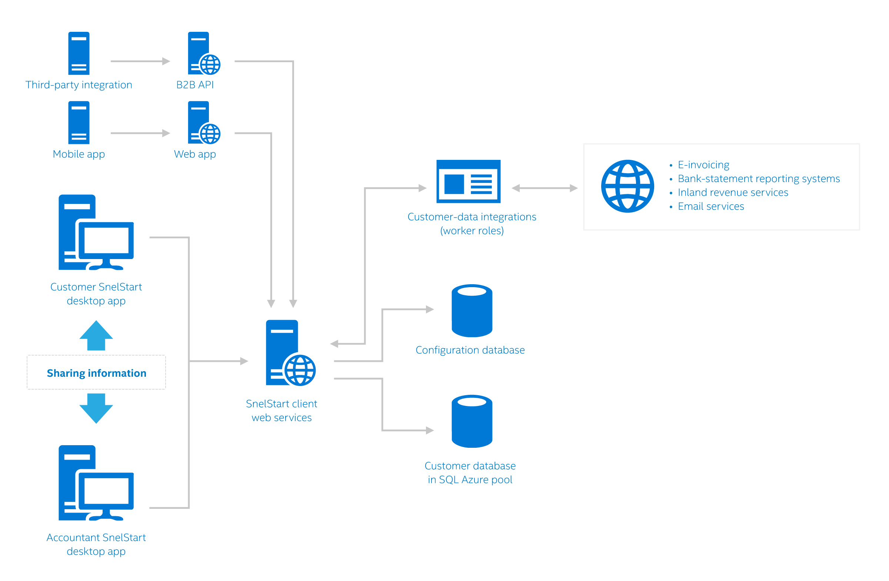

<properties
   pageTitle="SQL Azure-Datenbank Fallstudie Azure - Snelstart | Microsoft Azure"
   description="Erfahren Sie mehr über die wie SnelStart SQL-Datenbank wird verwendet, um schnell erweitert seine Services Business mit einer Geschwindigkeit von 1.000 neue Azure SQL-Datenbanken pro Monat"
   services="sql-database"
   documentationCenter=""
   authors="CarlRabeler"
   manager="jhubbard"
   editor=""/>

<tags
   ms.service="sql-database"
   ms.devlang="NA"
   ms.topic="article"
   ms.tgt_pltfrm="NA"
   ms.workload="NA"
   ms.date="09/08/2016"
   ms.author="carlrab"/>

# Mit Azure hat SnelStart schnell seine Services Business mit einer Geschwindigkeit von 1.000 neue Azure SQL-Datenbanken pro Monat erweitert

SnelStart macht beliebte financial und Business-Management-Software für kleine und mittlere Unternehmen (kleine und mittlere Unternehmen) in der Niederlande. Seiner Kunden 55.000 werden von 110 Mitarbeiter, einschließlich IT-Personal von 35 Mitarbeitern muss. Durch Verschieben von desktop-Software eine Software-as-a-Service (SaaS) Geschenk Azure erstellt, versucht SnelStart die am häufigsten integrierte Dienste automatisieren Verwaltung mithilfe von vertrauten Umgebung in c# und Optimieren der Leistung und Skalierbarkeit weder über oder unter-Bereitstellung Unternehmen flexible Datenbank Pools verwenden. Die Verwendung von Azure bietet SnelStart die flexible Verwendung von verschieben Kunden zwischen lokal und in der Cloud.

> [AZURE.VIDEO azure-sql-database-case-study-snelstart]

##Warum erweiterten SnelStart Services vom Desktop in die cloud

> "Arbeiten mit Azure bedeutet, dass wir können Software schneller vorführen, schnell auf Kunden reagieren und Lösungen skalieren, wenn erhöht."

> – Henry wurde, Softwarearchitekt

SnelStart ist eine erfolgreiche Software Business beigetragen mithilfe eines Modells herkömmlichen Entwicklung: Fehlercode, Verpacken, versenden und wiederholen. Im Laufe der Zeit wurde das Tempo der Änderung schneller und schneller. Verbraucher zu verstoßen häufig geändert und Kunden benötigt einfachere Methoden zum Verarbeiten von Finanzdaten und gemeinsam mit ihren Buchhaltung und Government mit diesen Änderungen aufrechterhalten.

"Versand Software für Kunden war Kosten- und einschränkenden," laut Henry wurde, Softwarearchitekt. "Herstellung, Verpackung und Versandkosten eingeschränkt wie oft wir Software freigeben können. Wir hatten zu Paket-Updates für periodische Lieferungen, aber wurde er ist schwer zu seine Bedürfnisse seiner Kunden. Wir konnten nie sicher sein, die unsere Kunden auf die neueste Version des Produkts aktualisiert. Daher gab es zur Unterstützung von mehreren Versionen, wodurch den Auftrag Support sehr schwer auch."

Wurde hinzufügt, "Es sollte eine Möglichkeit zum Programm und Release-Updates in eine schnellere strukturiert vorzugehen, damit wir schneller Innovationen und erstellen neue Dienste für unsere Kunden. Es sollte auch eine Möglichkeit, um weitere Prozesse zu automatisieren, um den Bedürfnissen unsere Kunden Business-Verwaltung zu vereinfachen."

Für SnelStart wurde die Lösung zu seiner Dienste zu erweitern, indem Sie immer einen cloudbasierten SaaS-Anbieter. Die Azure SQL-Datenbank-Plattform beigetragen SnelStart, ohne dass den wichtigsten IT-Aufwand, den eine Lösung Infrastructure-as-a-Service (IaaS) erfordert hätten dorthin zu gelangen.

Das Cloud-Modell ermöglicht auch SnelStart Beheben von Fehlern und neuen Features schnell, ohne Kunden herunterladen und aktualisieren Sie Software benötigen. Entsprechend wurde, "Azure-Cloud-Dienste verwenden können wir schnell nach dem Ändern der Anforderungen von Drittanbietern handeln. Anstatt eine neue Version an Tausende von Kunden geliefert, können wir von unserem desktop-Anwendung zu neuen Formate von Drittanbietern erforderlich gesendeten Informationen anpassen."

##Ein modernes Unternehmen mit herkömmlichen Wurzeln

SnelStart gilt für Unternehmen moderne, agiles, technischen mit humble Wurzeln bis zu 1964, wann die Unternehmensgründer das Unternehmen als Teil der musikalische Urkunde Hersteller gestartet. Das Herzstück des Unternehmens Software SnelStart Schritte wirklich in den 1980ern zu übertreffen, während die zu viele des Computers persönlich. Das Unternehmen benötigt für eine bessere Alternative zum der Buchhaltungssoftware zur Verfügung, die jeweils Fragen, die in einem eigenen Hände gedauert hat. Das Unternehmen 1982 erstellt die Grundlage für was später SnelStart Buchhaltungssoftware machen würden. Vom Anfang, wurde die Software für die Vereinfachung und die Geschwindigkeit Fertig – so sehr, dass das Unternehmen schließlich Fokus geändert und selbst in einem Softwareunternehmen neu.

1995 veröffentlicht SnelStart seine erste Buchhaltung Anwendung für Windows. Die Anwendung erstellt in Microsoft Visual Basic 1.0 und Microsoft Access-Datenbanken beigetragen den Kunden auf mehr als 5.000 Benutzer Basis vergrößert werden.

Heute ist SnelStart ein Haupt-Identitätsanbieter Linie-von-branchenspezifische-Business-Administration Anwendung an Niederländisch kleine und mittlere Unternehmen und Selbständige Unternehmer gerichtet sind. Carlo Kuip, IT-Architekt besagt, ist"Unser Ziel zu 100 Prozent Automatisierung Business-Dienste für unsere Kunden bereitgestellt werden kann."

##Optimieren der Performance und Kosten mit flexible pools

SnelStart wurde eine umfangreiche frühe Implementierung von Pools flexible Datenbank. Flexible Pools Hilfe das Unternehmen beschränken Sie die Kosten und Leistung Anforderungen effizienter verwalten. Entsprechend wurde, "mithilfe von flexible Datenbank Pools können wir basierend auf den Anforderungen der seiner Kunden, ohne zu viel provisioning Leistung optimieren. Wenn wir Bereitstellung basierend auf Höchstwert laden, wäre es ganz teure. In diesem Fall die Option zum Freigeben von Ressourcen zwischen mehreren, geringer Auslastung Datenbanken können wir eine Lösung erstellen, die eine gute und kostengünstiger ist. "

##Azure SQL-Datenbanken Hilfe containerize Daten für den Grad der Isolation und Sicherheit 

Azure SQL-Datenbank ermöglicht SnelStart einfach und transparent verschieben Kunden Azure Business-Administration Daten lokal an. SQL Azure-Datenbank ist, einen geeigneten Container, der Isolation, eine Begrenzungslinie für die Authentifizierung, Autorisierung und einfache Sicherung und Wiederherstellung Funktionen bereitstellt. Datenbanken bieten ein gut geeignet konzeptionelles Modell für Business Administration an. Entsprechend Carlo Kuip, IT-Architekt "Elemente innerhalb dieser Begrenzungslinie Container enthalten vertrauliche Daten, die für ein Unternehmen entscheidend, und speichern diese Elemente in einer Datenbank isoliert behält diese gut geschützt. Wir können verwalten Autorisierung Ebene der Datenbank, und auch die Verwaltung und Skalierung dieser Datenbanken ohne Datenbank-Administratoren (DBAs) auf Personal automatisieren."

Azure SQL-Data Warehouse spielt eine Rolle auch im Textabschnitt SnelStart Sicherheits- und dazu beiträgt das Unternehmen werden Daten wie einen unbefugten Benutzer Aktivität Protokollierung und Konnektivität zu sammeln.

##Azure entfernt Aufwand, damit Entwickler mehr Zeit nutzen investieren können 

Das Modell Azure-Plattform entfernt Infrastruktur Verwaltungsaufwand und SnelStart automatisieren Bereitstellungen mit C#-Verwaltungsbibliotheken aktiviert. Wie Kuip besagt, konnten"wir unsere aktuellen Vorgänge mit einem geringen Personal wächst, während gleichzeitig zunehmender Skalierbarkeit, Geschwindigkeit und Disaster Wiederherstellungsoptionen für unsere Kunden. Die UMSCHALTTASTE gedrückt, um Services Development Ressourcen auf neue Dienste und Features, statt nur aktualisieren vorhandenen Code von mit neuen Vorschriften beibehalten oder Steuercodes konzentrieren freigegeben wurde." Er fügt "durch Automatisierung Management und Verwenden der SaaS-Lösung, die wir für unsere Kunden mehr Nutzen bieten, ohne große Investitionen in Betrieb Personal vornehmen können." Beispielsweise konnte mithilfe von Azure und flexible Datenbank Pools SnelStart eine Vielzahl von neuen Features, einschließlich Banken, weitere robuste Kundendaten Integration hinzufügen neu Abrechnung Services, Kleinunternehmen Hintergrund überprüft und e-Mail-Diensten.

> "In nur die ersten Monate der 2016, wir unsere Azure SQL-Datenbank-Bereitstellungen von Info 5.500 Betrug auf mehr als 12.000 erweitert, und wir sind derzeit ungefähr 1.000 Datenbanken pro Monat hinzufügen".

> – Henry wurde, Softwarearchitekt

Datenbank-Management erfolgt weiteren automatisch mit dem Feature flexible Aufträge. Wie Kuip besagt, kurz"hochgradig die automatische Erkennung von Datenbanken in einer [Server] Instanz der SQL-Datenbank." Dadurch wird die SnelStart auszuführende Vorgänge Management über ihre dynamisch wachsende Kunden ohne zusätzlichen Aufwand.

SnelStart wird auch eine API entwickeln, der als gerichtet Kundendaten und apps von Drittanbietern Software Partner erstellt fungiert. Als Kuip Staaten wird "Diese API anderer Anbieter unserer Software, wie etwa die Dateneingabe für Rechnungen und anderen Dokumenten beseitigen Funktionen hinzu aktivieren." Kunden ist nicht mehr Rechnungen manuell in ihre Kleinunternehmen Buchhaltungssoftware einzugeben. die Software SnelStart wird die erforderlichen Informationen direkt austauschen. Dadurch wird die Kunden, deren Business Verwaltungsaufgaben mit dem Netz von Informationen zu verknüpfen, der aus der Branche digitale Transformation somit ergibt.  

##Wie Azure Services SaaS für SnelStart aktivieren

Mithilfe von Azure kann SnelStart seiner Kunden und deren Buchhaltung mehr nahtlos in der Cloud dienen. Beispielsweise können sowohl "Kunden" und "Buchhaltung zur Freigabe von Informationen direkt auf SnelStarts-Client-API, auf Azure gehostet. Kuip besagt "diese wieder verwendbaren Dienste stehen für unsere Kunden zugänglichen Web apps, und sie bieten eine allgemeine Infrastruktur und Funktionen an, damit Zugriff auf Business Administration für Kunden und Drittanbieter-Software durch unsere Kunden verwendet. Beispiele für sind Produkt-Konfiguration Funktionen bereitstellt, Firewall-Regeln verwalten und Verwalten von Prozessen wie Sicherungskopien."

> Unser Ziel ist zu 100 Prozent Automatisierung Business-Dienste für unsere Kunden bereitgestellt werden kann." 

> – Carlo Kuip, IT-Architekt

Darüber hinaus ermöglichen SnelStart-Webdiensten Kunden und Buchhaltung Daten in SQL Azure-Datenbank flexible Pools problemlos zugreifen. SaaS-Modell, in Verbindung mit Datenbank Elastizität und Azure Ressourcenmanager, bietet SnelStart mit Skalierbarkeitsfeatures, die jeder Azure-Bereitstellung ergänzen. Die Implementierung ist vollständig automatisierte C#-Verwaltungsbibliotheken verwenden.

Abbildung 1. Ab Juni 2016 hat SnelStart mehr als 11.000 Datenbanken und mehr als 50 flexible Datenbank pools
 
##Vereinfachung aus der cloud

Seit verschieben in eine Azure-Cloud-basierte Lösung, wurde SnelStart können Kunden schnelle Wachstum und bietet innovative Features und Dienste zu unterstützen. Entsprechend wurde "mit Azure, wir können bieten in der Nähe fortlaufender Updates für unsere Kunden ohne unsere Mitarbeiter Vorgänge zu erweitern. Und wir erhalten die anderen tollen Azure Funktionen – wie Skalierbarkeit und Disaster Wiederherstellung – gebündelten. "

> "Wenn wir tatsächlich über in Redmond wurden... Ich habe erhalten ein Anrufs von einem Entwickler wieder in die Niederlande mich zu einem bestimmten Problem anzurufen. Wir konnten Microsoft eine Änderung in ihrer Umgebung Herstellung innerhalb von 48 Stunden, unsere Problem zu lösen vorführen abrufen."

> – Henry wurde, Softwarearchitekt

SnelStart schätzt außerdem die signifikante Zusammenarbeit, die sie mit dem Microsoft Azure SQL-DB Team entwickelt haben. Als Kuip Staaten "Wir haben Diskussionen Features und so Technologie, verwenden Sie, was in Autoren beidseitiges".
Sofortige Ziel für SnelStart ist die seiner Kunden zufrieden Basis Steigerung beibehalten. Wie wurde besagt "Ohne die technischen und Ressourcen Einschränkungen, die wir als ISV aufwiesen, es ist kein Grenzwert wie weit wir wachsen können."

## Weitere Informationen

- Weitere Informationen zum flexible Azure-Datenbank Pools finden Sie unter [flexible Datenbank Pools](sql-database-elastic-pool.md).

- Weitere Informationen zu Rollen der Web und Worker finden Sie unter [Worker-Rollen](../fundamentals-introduction-to-azure.md#compute). 

- Wenn Sie weitere Informationen zur Azure SQL-Data Warehouse finden Sie unter [SQL Data Warehouse](https://azure.microsoft.com/documentation/services/sql-data-warehouse/)

- Weitere Informationen zum SnelStart finden Sie unter [SnelStart](http://www.snelstart.nl).

