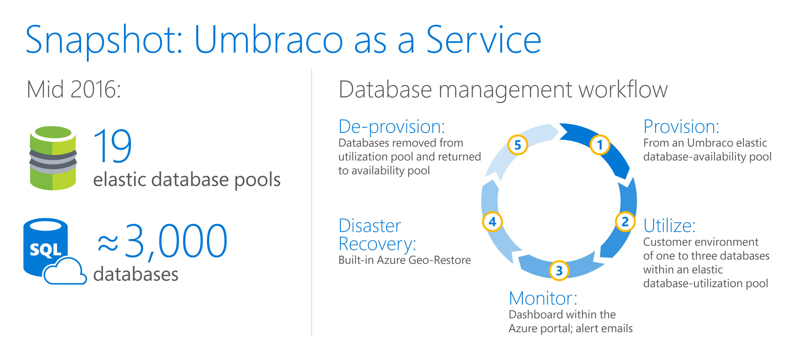
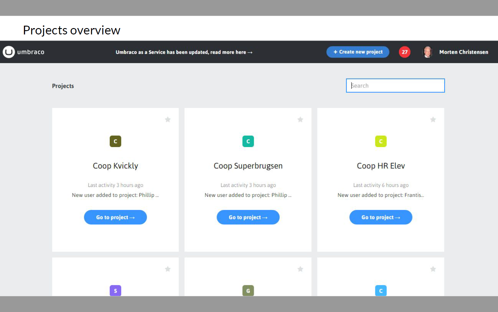
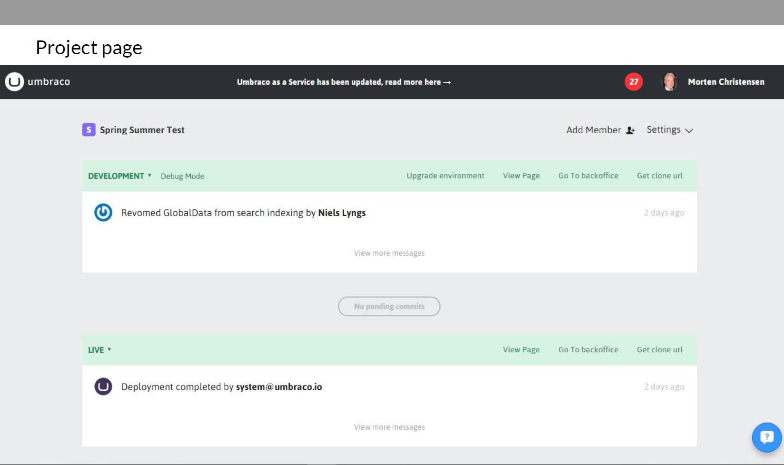
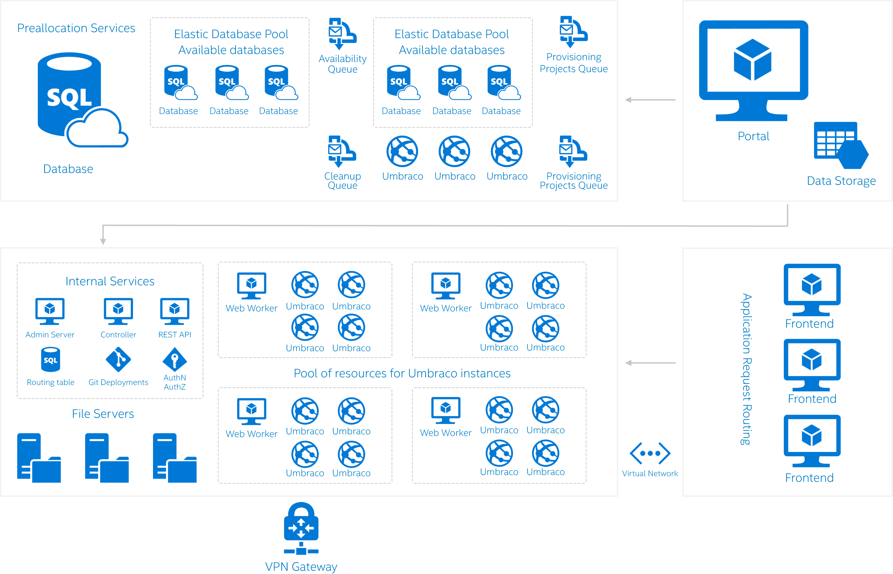

<properties
   pageTitle="SQL Azure-Datenbank Fallstudie Azure - Umbraco | Microsoft Azure"
   description="Informationen Sie zu wie Umbraco SQL-Datenbank wird verwendet, um schnell bereitzustellen und Maßstab Dienste für Tausende von Mandanten in der cloud"
   services="sql-database"
   documentationCenter=""
   authors="CarlRabeler"
   manager="jhubbard"
   editor=""/>

<tags
   ms.service="sql-database"
   ms.devlang="NA"
   ms.topic="article"
   ms.tgt_pltfrm="NA"
   ms.workload="NA"
   ms.date="09/22/2016"
   ms.author="carlrab"/>

# Umbraco verwendet Azure SQL-Datenbank, um schnell bereitstellen und die Dezimalstellen Dienste für Tausende von Mandanten in der cloud

Umbraco ist ein beliebte Source-öffnen Content Management System (CMS), die nichts von kleinen für eine Marketingkampagne oder Broschüre mit Websites auf komplexe Anwendungen für Fortune 500-Unternehmen und globale Medien Websites ausgeführt werden kann. 

> "Wir haben ganz eine große Community von Entwickler, die verwenden das System mit mehr als 100.000 Entwickler in unseren Foren und mehr als 350.000 Websites, die live, sind Umbraco ausgeführt."

> – Morten Christensen, Technische Leiter Umbraco

> [AZURE.VIDEO azure-sql-database-case-study-umbraco]

Zur Vereinfachung der Kunden Bereitstellungen hinzugefügt Umbraco Umbraco-as-a-Service (UaaS): ein Software-as-a-Service (SaaS) Angebot, die lokale Bereitstellungen überflüssig bietet integrierten Skalierung und Management Aufwand Entwickler auf Product Innovationen statt Lösung Management vereinfacht entfernt. Umbraco kann all diese Vorteile bereitstellen, indem Sie sich auf die flexible Plattform als Service (PaaS) Modell von Microsoft Azure Angeboten zu verlassen.

UaaS kann SaaS Kunden Umbraco CMS-Funktionen verwenden, die zuvor von deren Reichweite wurden. Mit einer arbeiten CMS-Umgebung, die eine Datenbank Herstellung enthält, werden diese Kunden bereitgestellt. Kunden können bis zu zwei zusätzliche Datenbanken für die Entwicklung und staging-Umgebungen, je nach ihren Anforderungen hinzufügen. Wenn eine neue Umgebung angefordert wird, weist ein automatisierter Prozess dieser Kunde eine Datenbank automatisch. Die neue Datenbank kann in Sekunden, da die Datenbank bereits durch Umbraco aus einer Azure flexible Pool der verfügbaren Datenbanken vorab bereitgestellt wurde (siehe Abbildung 1).

Abbildung 1. Lebenszyklus für Umbraco bereitgestellt, als Service (UaaS)
 
##Azure flexible Pools und Automatisierung vereinfachen Bereitstellungen

Mit Azure SQL-Datenbank und andere Dienste Azure Umbraco Kunden können ihre Umgebung selbst verschaffen und Umbraco einfach überwachen und Verwalten von Datenbanken als Teil eines intuitive Workflows:

1.  Bereitstellen von

    Umbraco unterhält eine Kapazität von 200 verfügbaren vorab bereitgestellte Datenbanken aus flexible Pools. Wenn Sie ein neuer Kunden für UaaS anmeldet, bietet Umbraco den Kunden mit einer neuen CMS-Umgebung nahezu in Echtzeit durch das Zuordnen einer Datenbank aus dem Pool Verfügbarkeit aus.

    Wenn ein Ressourcenpool Verfügbarkeit den Schwellenwert erreicht, ein neuer flexible Pool wird erstellt, und neue Datenbanken sind vorab bereitgestellte Kunden Bedarf zugewiesen werden soll.

    Implementierung ist vollständig automatisierte C#-Verwaltungsbibliotheken und Azure Servicebuswarteschlangen verwenden.

2.  Nutzen

    Kunden verwenden ein bis drei Umgebungen (für die Herstellung, Staging und/oder Entwicklung), jede mit einer eigenen Datenbank an. Kundendatenbanken weisen flexible Datenbank Pools, womit Umbraco effiziente Skalierung ohne Bereitstellen bereitstellen können.

    

    

    Abbildung 2. Umbraco-as-a-Service (UaaS) Kunden-Website mit Projektübersicht und details

    Azure SQL-Datenbank verwendet Transaktion Einheiten für die Datenbank (DTUs), um die relative Potenz für praktisches Datenbanktransaktionen erforderlich darzustellen. Bei UaaS Datenbanken funktionieren in der Regel am Info 10 DTUs, aber jedes der Elastizität zum nach Bedarf zu skalieren hat. Das heißt, UaaS sichergestellt wird, dass Kunden erforderlichen Ressourcen immer noch Zeiten Höchstwert haben. Im letzten Sonntag Abend Sports-Ereignis verbindet eine UaaS Kunden erfahrene Datenbank beispielsweise bis zu 100 DTUs für die Dauer der das Spiel. Azure flexible Pools Computerherstellern Umbraco zur Unterstützung von diesen hoher Bedarf ohne Leistungsabfall.

3.  Monitor

    Umbraco Monitore Datenbank Aktivität Dashboards innerhalb der Azure-Portal zusammen mit benutzerdefinierten e-Mail-Benachrichtigungen zu verwenden.

4.  Wiederherstellung

    Azure bietet zwei Optionen der Wiederherstellung (DR): aktive Geo-Replikation und Geo-wiederherstellen. Die DR-Option, die eine Firma auswählen sollten, hängt von seiner [Geschäftskontinuität Ziele](sql-database-business-continuity.md)ab.

    Aktive Geo-Replikation bietet die schnellste Antwort im Falle Ausfallzeiten. Verwenden der aktiven Geo-Replikation, Sie können bis zu vier lesbare sekundäre auf Servern in unterschiedlichen Regionen erstellen, und Sie können eine sekundären Instanzen Failover klicken Sie dann im Fall eines Fehlers initiieren.

    Umbraco nicht Geo-repliziert werden müssen, aber es dauert Vorteil der Azure Geo-wiederherstellen, minimale Ausfallzeiten bei einem Ausfall sicherzustellen. Geo-wiederherstellen beruht auf Datenbanksicherungskopien in Geo redundante Azure-Speicher. Die ermöglicht Benutzern aus einer Sicherungskopie wiederherstellen, wenn in der primären Region ein Ausfall vorliegt.

5.  Bereitstellen von Freigabe

    Wenn eine projektumgebung gelöscht wird, werden alle zugeordneten Datenbanken (Entwicklung, staging oder live) während Azure-Dienstbus Warteschlange Aufräumen entfernt. Diesem automatisierte Prozess setzt die nicht verwendeten Datenbanken Umbracos flexible Datenbank Verfügbarkeit Pool für zukünftiges provisioning Beibehaltung maximale Auslastung verfügbar zu machen.

##Flexible Pools zulassen UaaS mit steigern skalieren

Durch die Nutzung von Pools flexible Azure-Datenbank, kann Umbraco Leistung für seiner Kunden optimieren, ohne zu über- oder unzureichende bereitstellen. Umbraco umfasst derzeit fast 3.000 Datenbanken über 19 flexible Datenbank Pools, die Möglichkeit, einfach skalieren Bedarf Tabellenbereich an eine ihrer vorhandenen 325.000 Kunden oder neue Kunden, die eine CMS in der Cloud bereitgestellt werden kann.

Tatsächlich ist "nach Morten Christensen, Technical Lead am Umbraco, UaaS jetzt Wertzuwachs ungefähr 30 neue Kunden pro Tag aufgetreten. Unsere Kunden sind sehr zufrieden mit den Komfort können die neue Projekte in Sekunden bereitstellen, veröffentlichen sofort Updates zu ihren live Websites aus einer Umgebung mithilfe von "ein-Klick-Verteilung", und nehmen Sie Änderungen genauso wie schnell, wenn Fehler zu finden."

Wenn ein Kunde eine zweite und/oder dritte Umgebung nicht mehr benötigen, können sie einfach diese Umgebungen entfernen. Die frei Ressourcen, die für andere Kunden als Teil der Umbraco flexible Datenbank Verfügbarkeit Ressourcenpool verwendet werden können.

Abbildung 3. UaaS Bereitstellungsarchitektur auf Microsoft Azure

##Der Pfad von Datacenter in die cloud

Wenn die Umbraco Entwickler zunächst die wechseln zu einem Datenmodell in SaaS entschieden, Wussten sie klar, dass es eine Möglichkeit kostengünstigere und skalierbare, um den Dienst zu erstellen möchten.

> "Flexible Datenbank Pools sind für unsere SaaS Geschenk, da wir Kapazität nach oben oder unten Bedarf einwählen können eines perfekten anpassen. Bereitstellung ist einfach und mit unseren einrichten, können wir Auslastung maximal zulässige beibehalten."

> – Morten Christensen, Technische Leiter Umbraco

"Wir wollten unsere Zeit für aufwenden Beheben von Problemen mit seiner Kunden, nicht Infrastruktur verwalten. Niels Hartvig, Gründer von Umbraco wir unsere Kunden den nutzen, erleichtern wollten"angezeigt wird. "Wir Anfangs betrachtet, die uns Server hosten, aber Kapazität Planung hätte ein Albtraum." Umbraco zufällig keine Datenbank-Administratoren einsetzen, die eine Hauptargumente für die Verwendung von UaaS unterstreicht.

Ein wichtiges Ziel für die Entwickler Umbraco wurde für Kunden UaaS Umgebungen schnell und ohne Einschränkungen Kapazität bereitstellen zu ermöglichen. Aber einen dedizierten gehosteten Dienst in Umbraco Rechenzentren bereitstellen möchten viele übermäßige Kapazität Bursts in Verarbeitung verarbeitet erforderlich haben. Die würde an Sie gerichtet regelmäßig Lastausgleichfunktion wurde würde dazu berechnen-Infrastruktur hinzufügen.

Darüber hinaus sollte das Entwicklungsteam Umbraco eine Lösung, die sie so viele ihren vorhandenen Code wie möglich wiederverwenden zulassen möchten. Als Umbraco Entwicklertools besagt Mikkel Madsen "Wir zufrieden mit den Microsoft Development Tools, die wir bereits vertraut, wie Microsoft SQL Server, Microsoft Azure SQL-Datenbank, ASP.net und Internet Information Services (IIS) wurden wurden. Cloud-Lösung, bevor in einer IaaS oder einer PaaS investieren wir wollten, um sicherzustellen, dass es unsere Microsoft-Tools und -Plattformen unterstützen würden, damit wir nicht erreicht hätten großer unserem Code Basis ändern möchten,. "

Um alle zugehörigen Kriterien erfüllen, vergeblich Umbraco einen Cloud-Partner mit den folgenden Merkmalen:

-   Ausreichend Kapazität und Zuverlässigkeit
-   Unterstützung für Microsoft Development Tools, sodass Umbraco Engineers würde nicht vollständig neu zu deren Entwicklungsumgebung erfinden erzwungen werden
-   Anwesenheitsinformationen in allen den geografischen Märkten in denen konkurriert UaaS (Unternehmen benötigt wird, stellen Sie sicher, dass sie schnell auf ihre Daten zugreifen können und ihre Daten an einem Speicherort gespeichert ist, die ihre regionalen gesetzlichen Vorschriften entspricht)

##Warum dorthin Umbraco Azure für UaaS

Gemäß Morten Christensen ", nachdem Sie alle unsere Optionen wird geprüft, wir ausgewählt Azure, da sie alle unsere Kriterien aus Verwaltbarkeit und Skalierbarkeit Vertrautheit und kostengünstiger erfüllt. Wir die Umgebungen auf Azure-virtuellen Computern einrichten und jeder Umgebung gibt es eine eigene Instanz Azure SQL-Datenbank mit allen Instanzen in Pools flexible Datenbank. Durch das Trennen von Datenbanken zwischen Entwicklung, Staging und live-Umgebungen, können wir unsere Kunden robuste Performance Isolation, mit dem Maßstab übereinstimmen bieten – ein großer Gewinn. "

Morten immer noch auftritt, "Bevor wir Servern für Webdatenbanken manuell bereitstellen hatten. Nun müssen wir nicht darüber nachdenken. Alles, was man unter automatisierter – von der Bereitstellung zum Aufräumen. "

Morten ist auch mit der Skalierung Funktionen von Azure zufrieden. "Flexible Datenbank Pools sind für unsere SaaS Geschenk, da wir Kapazität nach oben oder unten Bedarf einwählen können eines perfekten anpassen. Bereitstellung ist einfach und mit unseren einrichten, können wir Auslastung maximal zulässige beibehalten." Morten Staaten "einfach zu verwendenden flexible Pools, sowie die Sicherstellung der Service-Ebene-basierte DTUs bietet uns die Möglichkeit, neue Ressourcenpools on Demand bereitstellen. Zuletzt, Spitzen eine unserer größeren Kunden zu 100 DTUs in live-Umgebung. Verwenden Azure, bereitgestellten unser flexible Pools der vom Kunden Datenbanken mit den Ressourcen, die sie in Echtzeit benötigt, ohne DTU Anforderungen Vorhersagen. Einfach gesagt, unsere Kunden erhalten die aktivieren um Zeit, die sie erwarten, und wir können unsere Performance Service Level Agreements erfüllen."

Mikkel Madsen Wert addiert es: "Wir haben IT. leistungsfähigen Azure-Algorithmus, die ein gängiges SaaS-Szenario (neue Kunden in Echtzeit bei Onboarding) verbindet unsere Anwendung Muster (vorab Bereitstellen von Datenbanken, beide Entwicklung und live) auf die zugrunde liegende Technologie (mit Azure Servicebuswarteschlangen in Verbindung mit Azure SQL-Datenbank)"

##Mit Azure wird UaaS Kunden erwarten überschritten.

Seit auswählen Azure als deren Cloud-Partner, wurde Umbraco können UaaS Kunden optimierte Content Management Performance, ohne die IT-Ressourcen Investition erforderlich aus einer lokal gehosteten Lösung bieten. Morten besagt, "Wir schätzen der Entwicklertools Bedienkomfort und Skalierbarkeit, die Azure uns ermöglicht, und unsere Kunden Danke, dass mit den Funktionen und Zuverlässigkeit sind. Insgesamt wurde es ein großer Gewinn für uns!"
 
## Weitere Informationen

- Weitere Informationen zum flexible Azure-Datenbank Pools finden Sie unter [flexible Datenbank Pools](sql-database-elastic-pool.md).

- Wenn Sie weitere Informationen zur Azure-Dienstbus finden Sie unter [Azure Service Bus](https://azure.microsoft.com/services/service-bus/).

- Weitere Informationen zu Rollen der Web und Worker finden Sie unter [Worker-Rollen](../fundamentals-introduction-to-azure.md#compute). 

- Weitere Informationen zum virtuellen Netzwerke finden Sie unter [virtuelle Netzwerke](https://azure.microsoft.com/documentation/services/virtual-network/).    

- Wenn Sie weitere Informationen zur Sicherung und Wiederherstellung finden Sie unter [Geschäftskontinuität](sql-database-business-continuity.md).  

- Weitere Informationen zum Überwachen der Ppols finden Sie unter [Pools überwachen](sql-database-elastic-pool-manage-portal.md). 

- Finden Sie weitere Informationen zum Umbraco als Dienst [Umbraco](https://umbraco.com/cloud)aus.

