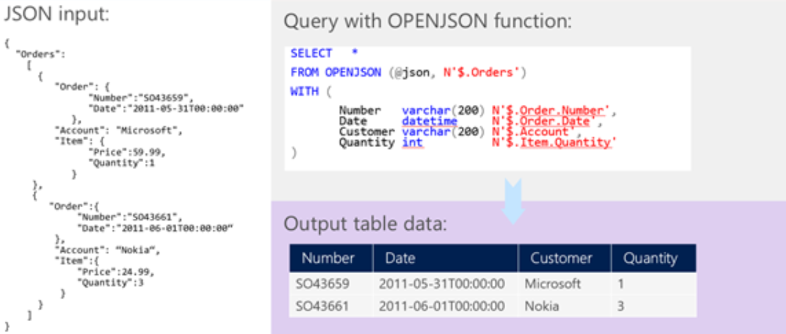

<properties
    pageTitle="Azure SQL-Datenbank JSON-Features | Microsoft Azure"
    description="Azure SQL-Datenbank ermöglicht es Ihnen zu analysieren, Abfrage- und Formatieren von Daten in JavaScript Object Notation (JSON)-Notation."
    services="sql-database"
    documentationCenter=""
    authors="jovanpop-msft"
    manager="jhubbard"
    editor=""/>

<tags
    ms.service="sql-database"
    ms.devlang="NA"
    ms.date="08/17/2016"
    ms.author="jovanpop"
   ms.workload="NA"
    ms.topic="article"
    ms.tgt_pltfrm="NA"/>


# <a name="getting-started-with-json-features-in-azure-sql-database"></a>Erste Schritte mit JSON-Features in Azure SQL-Datenbank

Azure SQL-Datenbank können Sie analysieren und Abfragen von Daten im Format JavaScript Object Notation [(JSON)](http://www.json.org/) dargestellt, und Exportieren von Ihren relationalen Daten als JSON-Text.

JSON ist ein beliebter Datenformat für den Austausch von Daten in modernem Web und Windows-Dienste verwendet. JSON dient auch zum Speichern von teilweise strukturierte Daten in Protokolldateien oder NoSQL-Datenbanken wie [Azure DocumentDB](https://azure.microsoft.com/services/documentdb/). Viele REST-Webdiensten zurückgegebene Ergebnisse als JSON-Text formatiert, oder akzeptieren die Daten als JSON formatiert ist. Am häufigsten Azure Diensten wie [Azure suchen](https://azure.microsoft.com/services/search/), [Azure-Speicher](https://azure.microsoft.com/services/storage/)und [Azure DocumentDB](https://azure.microsoft.com/services/documentdb/) haben REST-Endpunkte zurückzugeben oder JSON nutzen.

Azure SQL-Datenbank können Sie problemlos mit JSON-Daten arbeiten und moderne Ihrer Datenbank integrieren.

## <a name="overview"></a>(Übersicht)

Azure SQL-Datenbank bietet die folgenden Funktionen für die Arbeit mit JSON-Daten:


Wenn Sie den JSON-Text haben, können Sie Daten aus JSON extrahieren oder stellen Sie sicher, dass JSON mithilfe der integrierten Funktionen [JSON_VALUE](https://msdn.microsoft.com/library/dn921898.aspx), [JSON_QUERY](https://msdn.microsoft.com/library/dn921884.aspx)und [ISJSON](https://msdn.microsoft.com/library/dn921896.aspx)ordnungsgemäß formatiert ist. [JSON_MODIFY](https://msdn.microsoft.com/library/dn921892.aspx) -Funktion können Sie den Wert innerhalb JSON-Text zu aktualisieren. Für Weitere Erweiterte Abfragen und Analyse kann [OPENJSON](https://msdn.microsoft.com/library/dn921885.aspx) Funktion ein Array von JSON-Objekte in eine Reihe von Zeilen umwandeln. Klicken Sie auf das zurückgegebene Resultset kann eine SQL-Abfrage ausgeführt werden. Schließlich besteht eine [Für JSON](https://msdn.microsoft.com/library/dn921882.aspx) -Klausel hinzu, die Sie können Daten aus relationalen Tabellen als JSON-Text formatieren.

## <a name="formatting-relational-data-in-json-format"></a>Formatieren von relationalen Daten im JSON-format
Wenn Sie einen Webdienst, dass hat Daten aus der Datenbank layer und stellt eine Antwort in JSON formatieren oder clientseitige JavaScript-Framework oder Bibliotheken, die Daten akzeptieren als JSON formatiert haben, können Sie direkt in einer SQL-Abfrage erforderlichen Datenbankinhalt als JSON formatieren. Sie nicht mehr zum Schreiben von Anwendungscode, die Ergebnisse aus Azure SQL-Datenbank als JSON formatiert haben oder zum Einschließen der Bibliothek einige JSON-Serialisierung zum Konvertieren von tabellarischen Abfrageergebnisse und anschließend serialisieren Objekte JSON-Format. Stattdessen können Sie die für JSON-Klausel formatieren SQL-Abfrageergebnisse als JSON in Azure SQL-Datenbank, und diese direkt in Ihrer Anwendung verwenden.

Im folgenden Beispiel werden Zeilen aus der Tabelle Sales.Customer als JSON formatiert, mit der für JSON-Klausel:

```
select CustomerName, PhoneNumber, FaxNumber
from Sales.Customers
FOR JSON PATH
```

Die für JSON PATH-Klausel formatiert die Ergebnisse der Abfrage als JSON-Text. Spaltennamen werden als Schlüssel, verwendet, während die Zellwerte als JSON-Werte generiert werden:

```
[
{"CustomerName":"Eric Torres","PhoneNumber":"(307) 555-0100","FaxNumber":"(307) 555-0101"},
{"CustomerName":"Cosmina Vlad","PhoneNumber":"(505) 555-0100","FaxNumber":"(505) 555-0101"},
{"CustomerName":"Bala Dixit","PhoneNumber":"(209) 555-0100","FaxNumber":"(209) 555-0101"}
]
```

Das Resultset wird als JSON-Array formatiert, in dem jede Zeile als ein separates JSON-Objekt formatiert ist.

Pfad zeigt an, das Ausgabeformat der JSON-Ergebnis mithilfe der Punktnotation in der Spalte Aliases anpassen können. Die folgende Abfrage ändert den Namen des Schlüssels "Kundenname" in das JSON-Ausgabeformat und zusammengeführt werden Telefon-und Faxnummer im untergeordnete Objekt "Kontakt":

```
select CustomerName as Name, PhoneNumber as [Contact.Phone], FaxNumber as [Contact.Fax]
from Sales.Customers
where CustomerID = 931
FOR JSON PATH, WITHOUT_ARRAY_WRAPPER
```

Die Ausgabe der Abfrage sieht wie folgt aus:

```
{
    "Name":"Nada Jovanovic",
    "Contact":{
           "Phone":"(215) 555-0100",
           "Fax":"(215) 555-0101"
    }
}
```

In diesem Beispiel zurückgegeben wir ein einzelnes JSON-Objekt anstelle eines Arrays, durch die Option [WITHOUT_ARRAY_WRAPPER](https://msdn.microsoft.com/library/mt631354.aspx) angeben. Sie können diese Option verwenden, wenn Sie wissen, dass Sie ein einzelnes Objekt als Ergebnis Abfrage zurückgeben möchten.

Der Hauptfenster Wert der für JSON-Klausel ist, dass Sie komplexe hierarchische Daten in Ihrer Datenbank als geschachtelte JSON-Objekte oder Arrays formatiert zurückkehren können. Im folgenden Beispiel wird gezeigt, wie Bestellungen aufnehmen möchten, die an den Kunden als geschachtelte Array der Bestellungen gehören:

```
select CustomerName as Name, PhoneNumber as Phone, FaxNumber as Fax,
        Orders.OrderID, Orders.OrderDate, Orders.ExpectedDeliveryDate
from Sales.Customers Customer
    join Sales.Orders Orders
        on Customer.CustomerID = Orders.CustomerID
where Customer.CustomerID = 931
FOR JSON AUTO, WITHOUT_ARRAY_WRAPPER

```

Statt Sendens von – trennen Abfragen Kundendaten abgerufen und dann eine Liste der zugehörigen Bestellungen abgerufen werden sollen, Sie können alle notwendigen Daten mit einer einzigen Abfrage, wie in der folgenden Beispielausgabe dargestellt:

```
{
  "Name":"Nada Jovanovic",
  "Phone":"(215) 555-0100",
  "Fax":"(215) 555-0101",
  "Orders":[
    {"OrderID":382,"OrderDate":"2013-01-07","ExpectedDeliveryDate":"2013-01-08"},
    {"OrderID":395,"OrderDate":"2013-01-07","ExpectedDeliveryDate":"2013-01-08"},
    {"OrderID":1657,"OrderDate":"2013-01-31","ExpectedDeliveryDate":"2013-02-01"}
]
}
```

## <a name="working-with-json-data"></a>Arbeiten mit JSON-Daten

Wenn Sie nicht unbedingt strukturierte Daten haben, wenn Sie komplexe untergeordnete Objekte, Arrays oder hierarchische Daten haben oder Ihren Datenstrukturen über einen Zeitraum weiterentwickelt, kann das JSON-Format zu einem beliebigen Ressourcenstruktur komplexer Daten helfen.

JSON ist ein Textformat an, die wie andere String-Datentyp in SQL Azure-Datenbank verwendet werden kann. Senden oder JSON-Daten als ein standard NVARCHAR speichern können:

```
CREATE TABLE Products (
  Id int identity primary key,
  Title nvarchar(200),
  Data nvarchar(max)
)
go
CREATE PROCEDURE InsertProduct(@title nvarchar(200), @json nvarchar(max))
AS BEGIN
    insert into Products(Title, Data)
    values(@title, @json)
END
```

Die JSON-Daten verwendet, die in diesem Beispiel werden mithilfe des dem Typs NVARCHAR(MAX) dargestellt. JSON kann in dieser Tabelle eingefügt oder als Argument der gespeicherten Prozedur standard Transact-SQL-Syntax verwenden, wie im folgenden Beispiel gezeigt bereitgestellt werden:

```
EXEC InsertProduct 'Toy car', '{"Price":50,"Color":"White","tags":["toy","children","games"]}'
```

Alle clientseitige Sprache oder die Bibliothek, die mit Zeichenfolgendaten in Azure SQL-Datenbank funktioniert funktioniert auch mit JSON-Daten. JSON kann in einer beliebigen Tabelle gespeichert werden, die den Typ NVARCHAR, beispielsweise eine Speicher optimiert oder ein System Versionsnummern Tabelle unterstützt. JSON keine Einschränkung in den clientseitigen Code oder in der Datenbankebene vorstellen können.

## <a name="querying-json-data"></a>Abfragen von JSON-Daten

Wenn Sie Daten formatiert als JSON in SQL Azure-Tabellen gespeichert haben, mit der JSON-Funktionen verwenden diese Daten in einer SQL-Abfrage.

JSON-Funktionen, die in SQL Azure-Datenbank informieren sind, Sie als JSON wie andere SQL-Datentyp formatierte Daten behandeln. Sie können ganz einfach Extrahieren von Werten aus den JSON-Text und JSON-Daten in einer Abfrage verwenden:

```
select Id, Title, JSON_VALUE(Data, '$.Color'), JSON_QUERY(Data, '$.tags')
from Products
where JSON_VALUE(Data, '$.Color') = 'White'

update Products
set Data = JSON_MODIFY(Data, '$.Price', 60)
where Id = 1
```

Die Funktion JSON_VALUE gibt einen Wert aus JSON-Text in der Spalte Daten gespeichert. Diese Funktion wird in Bezug auf einen Wert in JSON-Text zum Extrahieren ein Pfads JavaScript-wie verwendet. Der extrahierte Wert kann in einem beliebigen Teil der SQL-Abfrage verwendet werden.

Die Funktion JSON_QUERY ähnelt JSON_VALUE. Im Gegensatz zu JSON_VALUE extrahiert diese Funktion komplexes untergeordnete Objekt, wie etwa Arrays oder Objekte, die in JSON-Text eingefügt werden.

Die JSON_MODIFY-Funktion können Sie geben Sie den Pfad des Werts in den JSON-Text, der aktualisiert werden soll, als auch einen neuen Wert, der das alte Konto überschrieben werden. Auf diese Weise, können Sie problemlos JSON-Text aktualisieren, ohne die gesamte Struktur Analyse.

Da JSON in einen Standardtext gespeichert ist, gibt es keine Garantie, dass die Werte in Textspalten gespeicherte ordnungsgemäß formatiert sind. Sie können überprüfen, ob in JSON-Spalte gespeicherte Text mithilfe von standard Azure SQL-Datenbank Kontrollkästchen Einschränkungen und die Funktion ISJSON ordnungsgemäß formatiert ist:

```
ALTER TABLE Products
    ADD CONSTRAINT [Data should be formatted as JSON]
        CHECK (ISJSON(Data) > 0)
```

Wenn der eingegebene Text ordnungsgemäß formatiert ist JSON, die ISJSON-Funktion gibt den Wert 1. Klicken Sie auf alle einfügen oder Aktualisieren von JSON-Spalte wird diese Einschränkung überprüfen, ob neue Textwert enthaltenen Textwert nicht fehlerhafte JSON ist.

## <a name="transforming-json-into-tabular-format"></a>JSON in tabellarischer umwandelt

Azure SQL-Datenbank ermöglicht Ihnen außerdem, JSON-Auflistungen zu formatieren und laden oder Abfrage JSON Tabellendaten transformieren.

OPENJSON ist eine Tabelle-Value-Funktion, die analysiert JSON-Text, ein Array von JSON-Objekten gesucht, durchläuft die Elemente des Arrays und gibt eine Zeile in der Ausgabe Ergebnis für jedes Element des Arrays.



Im oben genannten Beispiel können wir geben an, wo das JSON-Array zu suchen, das geöffnet werden soll (in der $. Pfad Bestellungen), sollten, welche Spalten zurückgegeben werden, als Ergebnis, und wo Sie die JSON-Werte zu finden, die als Zellen zurückgegeben wird.

Wir können ein JSON-Array in Transformieren der @orders Variable in eine Reihe von Zeilen, dieses Resultset analysieren oder Einfügen von Zeilen in eine Standardtabelle:

```
CREATE PROCEDURE InsertOrders(@orders nvarchar(max))
AS BEGIN

    insert into Orders(Number, Date, Customer, Quantity)
    select Number, Date, Customer, Quantity
    OPENJSON (@orders)
     WITH (
            Number varchar(200),
            Date datetime,
            Customer varchar(200),
            Quantity int
     )

END
```
Die Sammlung von Aufträgen als JSON-Array formatiert und bereitgestellt, wie Parameter der gespeicherten Prozedur analysiert und in der Tabelle Orders eingefügt werden kann.

## <a name="next-steps"></a>Nächste Schritte

Erfahren Sie, wie JSON in die Anwendung zu integrieren, schauen Sie sich diese Ressourcen:

- [TechNet-Blog](https://blogs.technet.microsoft.com/dataplatforminsider/2016/01/05/json-in-sql-server-2016-part-1-of-4/)
- [MSDN-Dokumentation](https://msdn.microsoft.com/library/dn921897.aspx)
- [Channel 9 video](https://channel9.msdn.com/Shows/Data-Exposed/SQL-Server-2016-and-JSON-Support)

Weitere Informationen zu den verschiedenen Szenarios für die Integration von JSON in Ihrer Anwendung finden Sie unter die Demos in dieser [Channel 9 video](https://channel9.msdn.com/Events/DataDriven/SQLServer2016/JSON-as-a-bridge-betwen-NoSQL-and-relational-worlds) oder Suchen nach einem Szenario, die Ihre Anwendungsfall-in [JSON-Blogbeiträge](http://blogs.msdn.com/b/sqlserverstorageengine/archive/tags/json/)entspricht.
