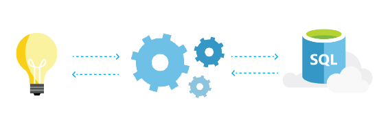

<properties
   pageTitle="SQL Azure-Datenbank lernfähig und passt sich"
   description="Erfahren Sie, wie lernfähig und passt sich SQL-Datenbank"
   keywords=""
   services="sql-database"
   documentationCenter=""
   authors="CarlRabeler"
   manager="jhubbard"
   editor=""/>

<tags
   ms.service="sql-database"
   ms.devlang="NA"
   ms.topic="article"
   ms.tgt_pltfrm="NA"
   ms.workload="data-management"
   ms.date="10/13/2016"
   ms.author="carlrab"/>

# SQL Azure-Datenbank lernfähig &amp; passt

## Wie SQL Azure-Datenbank lernfähig, passt und wächst mit Ihrer Anwendung

Azure SQL-Datenbank verwaltet Milliarden von Transaktionen und Millionen von Datenbanken pro Tag. Und einer Hauptfunktionen ist, dass die SQL-Datenbank immer erlernen und zur Anpassung der App. Auf diese Weise können Sie Daten, Zuverlässigkeit und Leistung Sicherheit dynamisch Maximieren&mdash;mit wenig Aufwand ihrerseits.

## Erkennung und Benachrichtigungen  
Mit Bedrohung und Anomalie Erkennung hat SQL-Datenbank integrierten Verhalten Analyse, in Echtzeit Benachrichtigungen, eine konfigurierbare Bedrohung Richtlinie, ein Überwachungsprotokoll und intelligente Methoden zum Erkennen und Beheben von ungewöhnliche Muster.

[Lesen Sie die Dokumentation](sql-database-threat-detection-get-started.md)

## Automatische Feinabstimmung
SQL-Datenbank ist in der Lage, Ihre app bei deren optimale Leistung ausgeführt werden soll. Kontinuierlich lernen Sie Ihre app Mustern, Adaptiv Self optimieren die Leistung und automatisch ohne Sie jegliche verfeinern&mdash;da wir wissen Sie nicht trotzdem möchten.

[Lesen Sie die Dokumentation](http://go.microsoft.com/fwlink/?LinkID=787566)

## Einsichten bei Bedarf
SQL-Datenbank kann jede Abfrage und deren Nutzung Dauer, Häufigkeit und Ressourcen zu verfolgen. Auf der Grundlage dieser werden, optimieren automatische Algorithmen optimal Ihrer Datenbanken genau auf Ihre Abfragen. Darüber hinaus stellt SQL-Datenbank Einblicken, um Zeit zu minimieren Optimieren von Abfragen und Problembehandlung der Leistung Probleme. Dies bedeutet, dass Sie direkte Ressource Ernährung oben Durchführung von Abfragen und die Möglichkeit, weitere Details Drilldowns Einblick in.

[Lesen Sie die Dokumentation](http://go.microsoft.com/fwlink/?LinkID=787567)

## Keine Verwaltung erforderlich
SQL-Datenbank dient Ihre app muss, damit Sie zurückkehren können, diese Vorgehensweise am besten können Sie die automatische Administration und Datenschutz&mdash;Codierung. Sie erhalten automatisch Sicherungskopien, Disaster Wiederherstellung Failover, Infrastruktur Wartung, Sicherheit und Softwarepatches und Updates Feature. Zeit und Geld wird nicht nur speichern, während der SQL-Datenbank im Hintergrund arbeitet, müssen Sie jedoch auch nie über die gefürchtete app Gedanken machen Ausfallzeiten.

[Lesen Sie die Dokumentation](http://go.microsoft.com/fwlink/?LinkID=787568)

Wechseln Sie zur Homepage finden Sie unter Was sonst SQL-Datenbank zu bieten hat.
[Schauen sie sich diese](https://azure.microsoft.com/services/sql-database/) 

## Nächste Schritte

Erhalten einer [kostenlosen Azure-Abonnement](https://azure.microsoft.com/get-started/) und [Erstellen Ihrer ersten Azure SQL-Datenbank](sql-database-get-started.md).

## Zusätzliche Ressourcen

Untersuchen Sie die [Funktionen von SQL-Datenbank](https://azure.microsoft.com/services/sql-database/).
 
Lesen Sie die [Technische Übersicht der SQL-Datenbank](sql-database-technical-overview.md).
