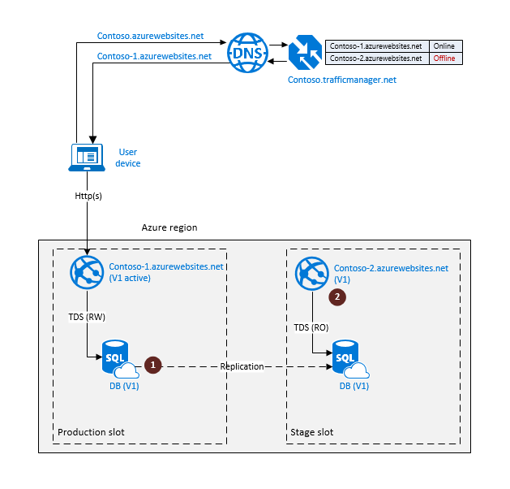
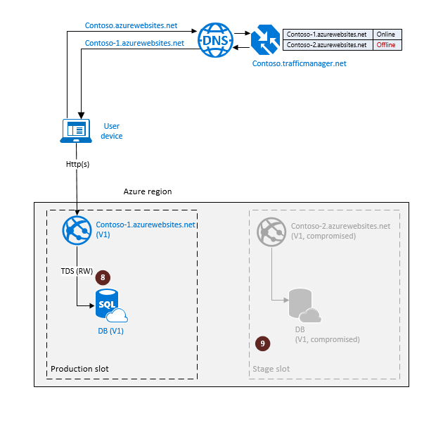

<properties
   pageTitle="Cloud Disaster Wiederherstellung Solutions - SQL-aktive Geo Datenbankreplikation | Microsoft Azure"
   description="Erfahren Sie, wie SQL Azure-Datenbank Geo-Replikation zur Unterstützung von online-Upgrades der Cloudanwendung verwenden."
   services="sql-database"
   documentationCenter=""
   authors="anosov1960"
   manager="jhubbard"
   editor="monicar"/>

<tags
   ms.service="sql-database"
   ms.devlang="NA"
   ms.topic="article"
   ms.tgt_pltfrm="NA"
   ms.workload="NA"
   ms.date="07/16/2016"
   ms.author="sashan"/>

# Parallele Updates mit der Cloudanwendungen mit SQL-aktive Geo Datenbankreplikation verwalten

> [AZURE.NOTE] [Aktive Geo-Replikation](sql-database-geo-replication-overview.md) ist nun für alle Datenbanken auf allen Ebenen verfügbar.

Informationen Sie zum [Geo-Replikation](sql-database-geo-replication-overview.md) in SQL-Datenbank zu verwenden, um parallele Updates mit der Cloudanwendung zu ermöglichen. Da Upgrade einer Unterbrechung Vorgang handelt, sollten sie Teil Ihrer Business Continuity-Planung und Design. In diesem Artikel wir betrachten Sie zwei verschiedene Methoden zur orchestriert des Upgradevorgang und diskutieren, die vor- und Nachteile der einzelnen Optionen. Im Sinne dieses Artikels verwenden wir eine einfache Anwendung, die von einer Website mit einer einzelnen Datenbank als deren Datenebene verbunden besteht aus. Unser Ziel ist Version 1 der Anwendung auf Version 2 ohne erheblichen Einfluss auf die Endbenutzer aktualisieren. 

Beim Auswerten von Upgrade-Optionen müssen Sie die folgenden Faktoren berücksichtigen:

+ Einfluss auf die Verfügbarkeit der Anwendung während des Upgrades. Wie lange die Anwendungsfunktion eingeschränkt oder heruntergestuft werden kann.
+ Die Möglichkeit, die bei einem Upgrade Fehler zurücksetzen.
+ Sicherheitsrisiko der Anwendung, wenn während des Upgrades ein nicht verknüpften Schwerwiegender Fehler auftritt.
+ Total DM Kosten.  Dies umfasst zusätzliche Redundanz und inkrementell Kosten temporäre Komponenten von den Upgradevorgang verwendet. 

## Aktualisieren einer Anwendung, die auf Datenbanksicherungskopien für die Wiederherstellung aufsetzen 

Wenn die Anwendung auf automatische Datenbanksicherungskopien beruht und Geo-wiederherstellen für die Wiederherstellung verwendet, wird in der Regel eine einzelne Azure Region bereitgestellt. In diesem Fall umfasst der Upgradevorgang eine Sicherung Bereitstellung aller Komponenten der Anwendung das Upgrade zu erstellen. Sie werden mit dem Profil Failover Azure Datenverkehr Manager (WATM) nutzen, um die Unterbrechung Endbenutzer zu minimieren.  Das folgende Diagramm veranschaulicht die Betrieb Umgebung vor den Upgradevorgang. Der Endpunkt <i>Contoso-1.azurewebsites.net</i> stellt ein Slot Herstellung der Anwendung, die aktualisiert werden muss. Wenn die Möglichkeit zum Zurücksetzen des Upgrades aktivieren möchten, müssen Sie einen Slot Phase mit einer vollständig synchronisierte Kopie der Anwendung erstellen. So bereiten Sie die Anwendung für das Upgrade vor, sind die folgenden Schritte erforderlich:

1.  Erstellen Sie einen Phase Slot für das Upgrade an. Zu erledigen, die eine sekundäre Datenbank (1) erstellen und Bereitstellen einer Website in der gleichen Azure Region identisch. Überwachen des sekundären, um festzustellen, ob der Seedprozess abgeschlossen ist.
3.  Erstellen eines Profils Failover in WATM mit <i>Contoso-1.azurewebsites.net</i> als Endpunkt online und offline als <i>Contoso-2.azurewebsites.net</i> an. 

> [AZURE.NOTE] Beachten Sie die vorbereitenden Schritte wirkt sich nicht auf die Anwendung in der Herstellung Slot und es kann im vollständigen Zugriffsmodus fungieren.

Nachdem Sie die Vorbereitungsschritte zur abgeschlossen werden ist die Anwendung für das eigentliche Upgrade bereit. Das folgende Diagramm veranschaulicht die einzelnen Schritte in den Upgradevorgang. 

1. Festlegen der primären Datenbank in der Herstellung Slot in den schreibgeschützten Modus (3). Dadurch wird sichergestellt, dass die Herstellung Instanz der Anwendung (Version 1) schreibgeschützt während des Upgrades somit verhindern, dass die Daten Abweichung zwischen den Instanzen der Datenbank Version 1 und 2 bleiben.  
2. Trennen Sie die sekundäre Datenbank mit dem geplanten Beendigung-Modus (4). Es wird eine unabhängige vollständig synchronisierte Kopie der primären Datenbank erstellt. Diese Datenbank wird aktualisiert werden.
3. Aktivieren Sie die primäre Datenbank in den schreibgeschützten Modus, und führen Sie das Upgrade-Skript in der Phase Slot (5).     

Wenn die Aktualisierung erfolgreich abgeschlossen können Sie jetzt die Endbenutzer die bereitgestellte Kopie der Anwendung zurückwechseln möchten. Es wird nun der Herstellung Slot der Anwendung geworden.  Dies umfasst einige weitere Schritte wie auf das folgende Diagramm veranschaulicht.

1. Wechseln Sie den Endpunkt online im Profil WATM zur <i>Contoso-2.azurewebsites.net</i>, die auf die Version 2-Version der Website (6) verweist. Es wird nun der Herstellung Slot mit der Version 2-Anwendung und der Endbenutzer Datenverkehr an sie geleitet.  
2. Entfernen Sie diese (7), wenn Sie die Komponenten der Version 1, sodass Sie problemlos können nicht mehr benötigen.   

Wenn Sie der Upgradevorgang nicht erfolgreich ist, beispielsweise aufgrund eines Fehlers in das Upgrade-Skript der Phase Slot einzustufen gefährdet. Zum Zurücksetzen der Anwendung in den Zustand vor dem upgrade wiederherstellen Sie einfach die Anwendung in der Herstellung Slot Vollzugriff. Die einzelnen Schritte werden im nächsten Diagramm angezeigt.    

1. Legen Sie die Datenbankkopie in den schreibgeschützten Modus (8). Dadurch wird die vollständige Version 1 in der Herstellung Slot funktional wiederhergestellt.
2. Datenanalysen Sie die Quadratwurzel Ursache und entfernen Sie die betroffenen Komponenten in der Phase Slot (9). 

An diesem Punkt die Anwendung voll funktionsfähig ist und die Upgrade Schritte wiederholt werden können.

> [AZURE.NOTE] Das Zurücksetzen erfordert keine Änderungen in WATM Profil, wie es bereits auf <i>Contoso-1.azurewebsites.net</i> als aktiven Endpunkt verweist.

Der größte **Vorteil** der diese Option ist, dass Sie eine Anwendung in einem einzigen Bereich mithilfe einer Reihe von einfachen Schritten aktualisieren können. Die Kosten des Upgrades ist relativ niedrig. Das Hauptfenster **Abwägung** heißt eintreten Schwerwiegender Fehler bei der Aktualisierung, dass die Wiederherstellung in den Zustand vor dem upgrade erneute Bereitstellung der Anwendung in einem anderen Bereich und Wiederherstellen der Datenbank aus einer Sicherung mit Geo-wiederherstellen umfassen. Dieses Verfahren führt längere Downtime.   

## Aktualisieren einer Anwendung, die auf die Datenbank Geo-Replikation für Wiederherstellung aufsetzen

Wenn eine Anwendung Geo-Replikation für Geschäftskontinuität nutzt, ist es in mindestens zwei verschiedener Regionen mit einer aktiven Bereitstellung in primäre Region und eine standby-Bereitstellung in Sicherung Region bereitgestellt. Zusätzlich zu den Faktoren, die zuvor erwähnt muss der Upgradevorgang garantiert, dass:

+ Die Anwendung bleibt jederzeit während des Upgrades von schwerwiegenden Fehlern geschützt
+ Die Geo redundante Komponenten der Anwendung werden parallel mit der aktiven Komponenten aktualisiert.

Nutzen Sie um diese Ziele zu erreichen Azure Datenverkehr Manager (WATM) das Profil Failover mit einem aktiv und drei zusätzliche Endpunkte verwendet werden.  Das folgende Diagramm veranschaulicht die Betrieb Umgebung vor den Upgradevorgang. Die Websites <i>Contoso-1.azurewebsites.net</i> und <i>Contoso-dr.azurewebsites.net</i> darstellen ein Slot Herstellung der Anwendung mit vollständige geografische Redundanz. Wenn die Möglichkeit zum Zurücksetzen des Upgrades aktivieren möchten, müssen Sie einen Slot Phase mit einer vollständig synchronisierte Kopie der Anwendung erstellen. Da Sie müssen Sie sicherstellen, dass die Anwendung schnell wiederherstellen kann, falls Schwerwiegender Fehler bei der Aktualisierung tritt auf, muss der Phase Slot ebenfalls Geo redundante sein. So bereiten Sie die Anwendung für das Upgrade vor, sind die folgenden Schritte erforderlich:

1.  Erstellen Sie einen Phase Slot für das Upgrade an. Zu erledigen, die eine sekundäre Datenbank (1) erstellen und Bereitstellen eine identische Kopie der Website in der gleichen Azure Region. Überwachen des sekundären, um festzustellen, ob der Seedprozess abgeschlossen ist.
2.  Erstellen Sie eine Geo redundante sekundäre Datenbank im Slot Phase durch Geo Replikation die sekundäre Datenbank an die Sicherung Region (Dies ist "Geo-Replikation verkettet" bezeichnet). Überwachen der sekundäre Sicherung, um festzustellen, ob der Seedprozess fertigen (3) wird.
3.  Erstellen Sie eine standby Kopie der Website in der Region Sicherung und verknüpfen Sie es mit den Geo redundante sekundären (4).  
4.  Fügen Sie zusätzliche Endpunkte <i>Contoso-2.azurewebsites.net</i> und <i>Contoso-3.azurewebsites.net</i> zum Failover Profil in WATM als offline Endpunkte (5). 

> [AZURE.NOTE] Beachten Sie die vorbereitenden Schritte wirkt sich nicht auf die Anwendung in der Herstellung Slot und es kann im vollständigen Zugriffsmodus fungieren.

Wenn die vorbereitenden Schritte abgeschlossen sind, ist der Phase Slot für das Upgrade bereit. Das folgende Diagramm veranschaulicht die Upgrade Schritten.

1. Festlegen der primären Datenbank in der Herstellung Slot in den schreibgeschützten Modus (6). Dadurch wird sichergestellt, dass die Herstellung Instanz der Anwendung (Version 1) schreibgeschützt während des Upgrades somit verhindern, dass die Daten Abweichung zwischen den Instanzen der Datenbank Version 1 und 2 bleiben.  
2. Trennen Sie die sekundäre Datenbank im selben Bereich mit den geplanten Beendigung-Modus (7). Es wird eine unabhängige vollständig synchronisierte Kopie der primären Datenbank erstellen, die automatisch einen primären nach Beendigung werden soll. Diese Datenbank wird aktualisiert werden.
3. Aktivieren Sie die primäre Datenbank im Slot Phase in den schreibgeschützten Modus, und führen Sie das Upgrade-Skript (8).    

Wenn die Aktualisierung erfolgreich abgeschlossen Sie jetzt die Endbenutzer auf die Version 2-Version der Anwendung zurückwechseln möchten. Das folgende Diagramm veranschaulicht die einzelnen Schritte.

1. Wechseln Sie in das Profil WATM zu <i>Contoso-2.azurewebsites.net</i>, der nun auf die Version 2-Version der Website (9) zeigt den aktiven Endpunkt. Es wird nun ein Slot Herstellung mit der Version 2-Anwendung und Endbenutzer-Datenverkehr darauf gerichtet ist. 
2. Wenn Sie die Version 1-Anwendung nicht mehr benötigen, damit Sie problemlos können entfernen sie die (10 und 11).  

Wenn Sie der Upgradevorgang nicht erfolgreich ist, beispielsweise aufgrund eines Fehlers in das Upgrade-Skript der Phase Slot einzustufen gefährdet. Zum Zurücksetzen der Anwendung in den Zustand vor dem upgrade wiederherstellen Sie einfach mit der Anwendung im Slot Herstellung mit Vollzugriff. Die einzelnen Schritte werden im nächsten Diagramm angezeigt.    

1. Festlegen der primären Datenbank kopieren in der Herstellung Slot in den schreibgeschützten Modus (12). Dadurch wird die vollständige Version 1 in der Herstellung Slot funktional wiederhergestellt.
2. Datenanalysen Sie die Quadratwurzel Ursache und entfernen Sie die betroffenen Komponenten in der Phase Slot (13 und 14). 

An diesem Punkt die Anwendung voll funktionsfähig ist und die Upgrade Schritte wiederholt werden können.

> [AZURE.NOTE] Das Zurücksetzen erfordert keine Änderungen in WATM Profil, wie es bereits auf <i>Contoso-1.azurewebsites.net</i> als aktiven Endpunkt verweist.

Der größte **Vorteil** der diese Option ist, dass Sie die Anwendung und seine Geo redundante Kopie parallel aktualisieren können, ohne Kompromisse bei der Geschäftskontinuität während des Upgrades. Das Hauptfenster **Kompromiss** ist, dass er doppelte Redundanz jeder Anwendung Komponente erfordert und daher höhere Kosten in Euro budgetgerecht. Darüber hinaus muss einen Workflow komplizierteren. 

## Zusammenfassung

In diesem Artikel beschriebenen Upgrade Methoden unterscheiden sich in Komplexität und die Kosten DM aber beide Fokussierung auf Minimieren der Zeit, wenn der Benutzer auf schreibgeschützte Vorgänge beschränkt ist. Dieses Zeitraums wird direkt von der Dauer des Upgrade Skripts definiert. Es ist nicht auf die Größe der Datenbank, die Service-Ebene, die Sie ausgewählt haben, Konfiguration der Website und andere Faktoren, die Sie nicht einfach steuern können abhängig. Dies ist, da alle vorbereitende Schritte von den Upgrade Schritten abgekoppelt sind und ohne Auswirkung auf die Herstellung Anwendung durchgeführt werden können. Die Effizienz des Upgrade Skripts ist die wichtigsten Faktoren, die durch den Endbenutzer bei Upgrades bestimmt. Somit ist die beste Methode verbessert werden kann durch Fokussierung Ihrer sind auf das Upgrade-Skript möglichst effizient bereitstellen.  

## Nächste Schritte

- Eine Übersicht über Business-Continuity und Szenarien finden Sie unter [Übersicht über die Business continuity](sql-database-business-continuity.md)
- Weitere Informationen zu Azure SQL-Datenbank automatische Sicherungskopien finden Sie unter [SQL-Datenbank automatische Sicherungskopien](sql-database-automated-backups.md)
- Weitere Informationen zum automatische Sicherungskopien für Wiederherstellung verwenden, finden Sie unter [Wiederherstellen einer Datenbank von automatisierte Sicherungskopien](sql-database-recovery-using-backups.md)
- Weitere Informationen zu schneller Wiederherstellungsoptionen finden Sie unter [Aktiv-Geo-Replikation](sql-database-geo-replication-overview.md)  
- Weitere Informationen zum Verwenden automatische Sicherungskopien für Archivierung, finden Sie unter [Datenbank kopieren](sql-database-copy.md)

## Additionale Ressourcen

Die folgenden Seiten helfen Ihnen die wissen möchten, die bestimmte Vorgänge erforderlich, um den Workflow Upgrade implementieren:

- [Sekundäre Datenbank hinzufügen](https://msdn.microsoft.com/library/azure/mt603689.aspx) 
- [Failoverdatenbank zu sekundären](https://msdn.microsoft.com/library/azure/mt619393.aspx)
- [Geo-Replikation sekundären trennen](https://msdn.microsoft.com/library/azure/mt603457.aspx)
- [Geo wiederherstellen Datenbank](https://msdn.microsoft.com/library/azure/mt693390.aspx) 
- [Legen Sie die Datenbank](https://msdn.microsoft.com/library/azure/mt619368.aspx)
- [Kopieren Sie die Datenbank](https://msdn.microsoft.com/library/azure/mt603644.aspx)
- [Legen Sie die Datenbank auf schreibgeschützt oder mit Lese-und Schreibzugriff-Modus](https://msdn.microsoft.com/library/bb522682.aspx)

