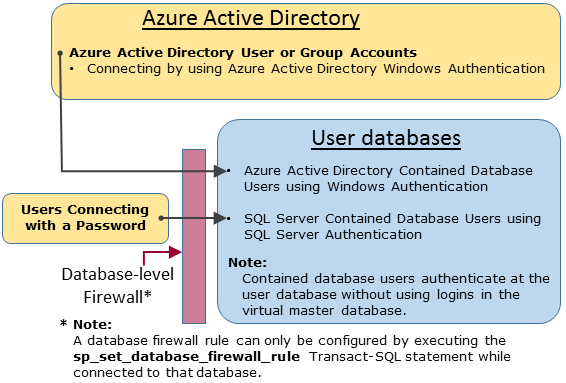

<properties
   pageTitle="SQL-Datenbank-Authentifizierung und Autorisierung: Erteilen von Zugriff auf | Microsoft Azure"
   description="Erfahren Sie mehr über die SQL-Datenbank Sicherheits-Management speziell zum Verwalten der Datenbank Zugriff und Login Sicherheit über die wichtigsten Server-Level-Kontos."
   keywords="SQL-Datenbank-Sicherheit, Verwaltung der Datenbank Sicherheit, Login, Sicherheit, Datenbank Sicherheit, Datenbankzugriff"
   services="sql-database"
   documentationCenter=""
   authors="BYHAM"
   manager="jhubbard"
   editor=""
   tags=""/>

<tags
   ms.service="sql-database"
   ms.devlang="na"
   ms.topic="article"
   ms.tgt_pltfrm="na"
   ms.workload="data-management"
   ms.date="09/14/2016"
   ms.author="rickbyh"/>

# <a name="sql-database-authentication-and-authorization-granting-access"></a>SQL-Datenbank-Authentifizierung und Autorisierung: Gewähren des Zugriffs 


> [AZURE.SELECTOR]
- [Erste Schritte-Lernprogramm](sql-database-get-started-security.md)
- [Gewähren des Zugriffs](sql-database-manage-logins.md)


Beginnen Sie hier eine Übersicht der SQL-Datenbank Zugriff Konzepte für Administratoren, nicht-Administratoren und Rollen.

## <a name="unrestricted-administrative-accounts"></a>Uneingeschränkte administrative Konten

Es gibt zwei möglichen administrativen Konten mit uneingeschränkte Berechtigungen für den Zugriff auf die virtuelle master-Datenbank und Benutzerdatenbanken für alle aus. Diese Konten werden die wichtigsten Konten Server Ebene bezeichnet.

### <a name="azure-sql-database-subscriber-account"></a>Azure SQL-Datenbank Abonnenten-Konto 

Beim Erstellen eine logische SQL Server-Instanz als SQL-Datenbank Abonnentenkonto bezeichnet, wird ein einzelnes Login-Konto erstellt. Dieses Konto eine Verbindung herstellt, die mit SQL Server-Authentifizierung (Benutzername und Kennwort). Dieses Konto ist ein Administrator die logischen Server-Instanz und alle Benutzer-Datenbanken, die die betreffende Instanz angefügt. Die Berechtigungen für das Konto ein Abonnenten können nicht eingeschränkt werden. Es kann nur von einem der folgenden Konten vorhanden.

### <a name="azure-active-directory-administrator"></a>Azure Active Directory-administrator
Ein Azure-Active Directory-Konto kann auch als Administrator konfiguriert werden. Dieses Konto kann es sich um eine einzelne Azure AD Benutzer oder können werden einer Azure AD-Gruppe, enthält mehrere Azure AD-Benutzer. Es ist optional so konfigurieren Sie einen Administrator Azure AD-, aber ein Azure AD-Administrator muss konfiguriert werden, wenn Sie die Windows-Authentifizierung für Azure AD-Konten für die Verbindung mit SQL-Datenbank verwenden möchten. Weitere Informationen zum Konfigurieren von Azure Active Directory Access finden Sie unter [Herstellen einer Verbindung mit SQL-Datenbank oder SQL Data Warehouse durch Verwenden von Azure Active Directory-Authentifizierung](sql-database-aad-authentication.md) und [SSMS für Azure AD MFA mit SQL-Datenbank und SQL Data Warehouse unterstützt](sql-database-ssms-mfa-authentication.md).

### <a name="configuring-the-firewall"></a>Konfigurieren der firewall
Wenn die Server Ebene Firewall so konfiguriert ist, können Azure SQL-Datenbank-Abonnent-Konto und Azure-Active Directory-Konto auf das Master-Shape-Datenbank und alle Benutzerdatenbanken verbinden. Die Server Ebene Firewall kann über das Portal konfiguriert werden. Nachdem Sie eine Verbindung hergestellt wurde, können zusätzliche Server Ebene Firewall-Regeln auch mithilfe der [Sp_set_firewall_rule](https://msdn.microsoft.com/library/dn270017.aspx) Transact-SQL-Anweisung konfiguriert sein. Weitere Informationen zum Konfigurieren der Firewalls finden Sie unter [wie: konfigurieren eine Azure SQL-Datenbank-Firewall mithilfe des Azure-Portals](sql-database-configure-firewall-settings.md).

### <a name="administrator-access-path"></a>Administrator Access-Pfad

Wenn die Server-Ebene Firewall ordnungsgemäß konfiguriert ist, können die SQL-Datenbank Abonnentenkonto und das Azure Active Directory SQL Server-Administratoren Verbinden mit Clienttools wie SQL Server Management Studio oder SQL Server Data Tools. Nur die neuesten Tools enthalten, die Features und Funktionen. Das folgende Diagramm zeigt eine gewöhnliche Konfiguration für die zwei Administratorkonten.
    

Wenn Sie einen offenen Port in der Firewall Server Ebene verwenden zu können, können Administratoren mit einem beliebigen SQL-Datenbank herstellen.

### <a name="connecting-to-a-database-by-using-sql-server-management-studio"></a>Herstellen einer Verbindung mit einer Datenbank mithilfe von SQL Server Management Studio
Für eine exemplarische Vorgehensweise der Herstellen einer Verbindung mithilfe von SQL Server Management Studio, finden Sie unter [Verbinden mit SQL-Datenbank mit SQL Server Management Studio und Ausführen einer Stichproben T-SQL-Abfrage](sql-database-connect-query-ssms.md).


> [AZURE.IMPORTANT] Es wird empfohlen, dass Sie die neueste Version von Management Studio immer verwenden, um mit Microsoft Azure und SQL-Datenbank-Updates synchronisiert werden. [Aktualisieren von SQL Server Management Studio](https://msdn.microsoft.com/library/mt238290.aspx).


## <a name="additional-special-accounts"></a>Weitere spezielle Konten
SQL-Datenbank enthalten zwei eingeschränkte administrative Rollen in der virtuelle master-Datenbank, die die Benutzerkonten hinzugefügt werden können.

### <a name="database-creators"></a>Datenbankersteller
Administrativen Konten können neue Datenbanken erstellen. Zum Erstellen eines weiteren Kontos, das Datenbanken erstellen können müssen Sie Erstellen eines Benutzers in das Master-Shape, und fügen Sie den Benutzer, die der Rolle der Inhalte **Dbmanager** -Datenbank. Der Benutzer kann einen eigenständigen Datenbankbenutzer oder eines Benutzers basierend auf einer SQL Server-Anmeldung in der virtuelle master Datenbank sein.

1.  Mit einem Administratorkonto an, Herstellen einer Verbindung mit der virtuellen master-Datenbank.
2.  Optional Schritt: erstellen eine SQL Server-Authentifizierung-Anmeldung mit der Anweisung [CREATE LOGIN](https://msdn.microsoft.com/library/ms189751.aspx) . Beispiel-Anweisung:

     ```
     CREATE LOGIN Mary WITH PASSWORD = '<strong_password>';
     ```

     > [AZURE.NOTE] Verwenden Sie ein sicheres Kennwort beim Erstellen einer Anmeldung oder eigenständigen Datenbankbenutzer. Weitere Informationen finden Sie unter [Komplexe Kennwörter](https://msdn.microsoft.com/library/ms161962.aspx).

    Um die Leistung zu verbessern, zwischengespeichert Benutzernamen (Server Ebene Hauptbenutzer) werden vorübergehend Ebene der Datenbank. Um den Authentifizierungscache zu aktualisieren, finden Sie unter [DBCC FLUSHAUTHCACHE](https://msdn.microsoft.com/library/mt627793.aspx).

3.  Erstellen Sie einen Benutzer in der virtuelle master-Datenbank mithilfe der Anweisung [CREATE USER](https://msdn.microsoft.com/library/ms173463.aspx) . Der Benutzer kann es sich um einen Datenbankbenutzer Azure Active Directory-Authentifizierung enthalten sind, (Wenn Sie Ihre Umgebung für Azure AD-Authentifizierung konfiguriert haben), oder einen SQL Server-Authentifizierung enthaltenen Datenbankbenutzer oder einer SQL Server-Authentifizierung Benutzer basierend auf einer SQL Server-Authentifizierung Benutzernamen (im vorherigen Schritt erstellt.) Beispiel für Anweisungen:

     ```
     CREATE USER [mike@contoso.com] FROM EXTERNAL PROVIDER;
     CREATE USER Tran WITH PASSWORD = '<strong_password>';
     CREATE USER Mary FROM LOGIN Mary; 
     ```

4.  Fügen Sie neuen Benutzer **Dbmanager** Datenbankrolle mithilfe der Anweisung [ALTER Rolle hinzu](https://msdn.microsoft.com/library/ms189775.aspx) . Beispiel für Anweisungen:

     ```
     ALTER ROLE dbmanager ADD MEMBER Mary; 
     ALTER ROLE dbmanager ADD MEMBER [mike@contoso.com];
     ```

     > [AZURE.NOTE] Die Dbmanager ist eine Datenbankrolle in virtuelle master-Datenbank, damit Sie die Rolle Dbmanager nur einen Benutzer hinzufügen können. Rolle der Datenbank Ebene können keine Anmeldung Server Ebene hinzugefügt werden.

5.  Konfigurieren Sie bei Bedarf die Firewall Server Ebene, damit den neuen Benutzer eine Verbindung herstellen können.

Jetzt wird der Benutzer kann eine Verbindung mit der virtuellen master-Datenbank und neue Datenbanken erstellen kann. Das Konto, die Datenbank zu erstellen, wird der Besitzer der Datenbank.

### <a name="login-managers"></a>Anmeldung-Manager

Falls gewünscht, können Sie die gleichen Schritte ausführen (einen Benutzernamen und Benutzer erstellen und Hinzufügen eines Benutzers zur Rolle **Loginmanager** ) zum Aktivieren eines Benutzers neue Benutzernamen im virtuelle Master-Shape zu erstellen. Normalerweise ist dies nicht erforderlich, wie Microsoft mithilfe der enthaltenen Datenbankbenutzer, der authentifiziert Ebene der Datenbank empfiehlt anstelle von Benutzern auf Benutzernamen basiert. Weitere Informationen finden Sie unter [Enthaltenen Datenbankbenutzer - ausführenden Ihrer Datenbank tragbaren](https://msdn.microsoft.com/library/ff929188.aspx).

## <a name="non-administrator-users"></a>Benutzer ohne Administratorrechte

Im Allgemeinen nicht-Administrator-Konten Zugriff auf die virtuelle master Datenbank ist erforderlich. Erstellen Sie Datenbankbenutzer enthaltenen Ebene der Datenbank mit der Anweisung [CREATE USER (Transact-SQL)](https://msdn.microsoft.com/library/ms173463.aspx) . Der Benutzer kann es sich um einen Datenbankbenutzer Azure Active Directory-Authentifizierung enthalten sind, (Wenn Sie Ihre Umgebung für Azure AD-Authentifizierung konfiguriert haben), oder einer SQL Server-Authentifizierung enthaltenen Datenbankbenutzer oder einer SQL Server-Authentifizierung Benutzer basierend auf einer SQL Server-Authentifizierung Benutzernamen (im vorherigen Schritt erstellt.) Weitere Informationen finden Sie unter [Enthaltenen Datenbankbenutzer - ausführenden Ihrer Datenbank tragbaren](https://msdn.microsoft.com/library/ff929188.aspx). 

Zum Erstellen von Benutzern Verbinden mit der Datenbank, und führen Sie die Anweisungen ähnlich wie in den folgenden Beispielen:

```
CREATE USER Mary FROM LOGIN Mary; 
CREATE USER [mike@contoso.com] FROM EXTERNAL PROVIDER;
```

Zunächst, kann die Administratoren oder der Besitzer der Datenbank nur von einem Benutzer erstellen. Um zusätzliche Benutzer zum Erstellen neuer Benutzer zu autorisieren, die ausgewählte Benutzer erteilen der `ALTER ANY USER` Berechtigung mithilfe einer Anweisung wie:

```
GRANT ALTER ANY USER TO Mary;
```

Vollständige Steuerung weiterer Benutzer der Datenbank, ein Mitglied der **Db_owner** machen feste Datenbank Rolle mithilfe der `ALTER ROLE` Anweisung.

> [AZURE.NOTE] Der wichtigsten Grund, basierend auf den Benutzernamen, Datenbankbenutzer erstellen wird, wenn SQL Server-Authentifizierung Benutzer, die Zugriff auf mehrere Datenbanken benötigen. Benutzer basierend auf Benutzernamen sind verknüpft, den Benutzernamen, und nur ein Kennwort ein, die für diesen Benutzer verwaltet wird. Enthaltenen Datenbankbenutzer in einzelne Datenbanken werden jedes einzelne Elemente und jeweils ein eigenes Kennwort unterhält. Dies kann enthaltenen Datenbankbenutzer Begriff, wenn sie nicht über ihre Kennwörter als identisch verfügen.

### <a name="configuring-the-database-level-firewall"></a>Konfigurieren der Firewall Datenbank Ebene

Als bewährte Methode sollte nicht-Administratoren nur über die Firewall auf die Datenbanken zugreifen können, die sie verwenden. Verwenden Sie statt ihre IP-Adressen durch die Firewall Server Ebene autorisieren, und gewähren von Zugriff auf alle Datenbanken, die [Sp_set_database_firewall_rule](https://msdn.microsoft.com/library/dn270010.aspx) -Anweisung zum Konfigurieren der Firewall Datenbank Ebene. Die Datenbank Ebene Firewall kann nicht mithilfe des Portals konfiguriert werden.

### <a name="non-administrator-access-path"></a>Nicht-Administratorzugriff Pfad

Wenn die Datenbank Ebene Firewall ordnungsgemäß konfiguriert ist, können die Datenbankbenutzer Verbinden mit Clienttools wie SQL Server Management Studio oder SQL Server Data Tools. Nur die neuesten Tools enthalten, die Features und Funktionen. Das folgende Diagramm veranschaulicht einen typische nicht Administratorzugriff Pfad.

 
## <a name="groups-and-roles"></a>Gruppen und Rollen
Optimierung des Zugriffsmanagement verwendet Berechtigungen, Gruppen und Rollen statt einzelnen Benutzern zugewiesen sind. Angenommen, wenn Azure-Active Directory-Authentifizierung verwenden:

- Setzen Sie Azure-Active Directory-Benutzer in einer Azure Active Directory-Gruppe ein. Erstellen Sie einen eigenständigen Datenbankbenutzer für die Gruppe ein. Platzieren Sie einen oder mehrere Datenbankbenutzer in einer Datenbankrolle aus. Ein, und klicken Sie dann die Rolle des Berechtigungen zuweisen.

Wenn SQL Server-Authentifizierung verwenden zu können:

- Erstellen Sie in der Datenbank enthaltenen Datenbankbenutzer. Platzieren Sie einen oder mehrere Datenbankbenutzer in einer Datenbankrolle aus. Ein, und klicken Sie dann die Rolle des Berechtigungen zuweisen.

Die Rollen können die integrierten Funktionen wie **Db_owner**, **Db_ddladmin**, **Db_datawriter**, **Db_datareader**, **Db_denydatawriter**und **Db_denydatareader**vorhanden sein. **Db_owner** wird meist nur wenigen Benutzern vollständigen erteilt. Die anderen festen Datenbankrollen sind, wie Sie schnell eine einfache Datenbank in der Entwicklung nutzen, jedoch sind für die meisten Herstellung Datenbanken nicht empfohlen. Beispielsweise Rolle **Db_datareader** feste Datenbank gewährt Lesezugriff zu jeder Tabelle in der Datenbank, die wird in der Regel mehr als unbedingt erforderlich. Es ist besser, verwenden Sie die [Rolle erstellen](https://msdn.microsoft.com/library/ms187936.aspx) -Anweisung zum Erstellen Ihrer eigenen benutzerdefinierten Datenbankrollen und sorgfältig jede Rolle die minimalen für die geschäftliche Notwendigkeit erforderlichen Berechtigungen erteilen. Wenn ein Benutzer ein Mitglied von mehreren Rollen ist, aggregieren sie die Berechtigungen der alle aus.

## <a name="permissions"></a>Berechtigungen

Es gibt mehr als 100 Berechtigungen, die einzeln erteilt oder in SQL-Datenbank verweigert werden können. Viele dieser Berechtigungen geschachtelt sind. Angenommen, die `UPDATE` Berechtigungen für ein Schema enthält die `UPDATE` Berechtigung für jede Tabelle innerhalb dieses Schemas. Wie in den meisten Berechtigung Systemen überschreibt die Ablehnung einer Berechtigung eines erteilen. Da die geschachtelte Art und die Anzahl der Berechtigungen kann dies sorgfältige Fallstudie Entwurf eine entsprechende Berechtigung-System, um Ihre Datenbank zu sichern dauern. Beginnen Sie mit der Liste der Berechtigungen auf [Berechtigungen (Datenbankmodul)](https://msdn.microsoft.com/library/ms191291.aspx) , und überprüfen Sie das [Poster Größe Grafik](http://go.microsoft.com/fwlink/?LinkId=229142) über die Berechtigungen.


## <a name="next-steps"></a>Nächste Schritte

[Sichern Ihrer SQL­Datenbank](sql-database-security.md)

[Erstellen einer Tabelle \(Lernprogramm\)](https://msdn.microsoft.com/library/ms365315.aspx)

[Einfügen und Aktualisieren von Daten in einer Tabelle \(Lernprogramm\)](https://msdn.microsoft.com/library/ms365309.aspx)

[Lesen die Daten in einer Tabelle \(Lernprogramm\)](https://msdn.microsoft.com/library/ms365310.aspx)

[Erstellen von Ansichten und gespeicherten Prozeduren](https://msdn.microsoft.com/library/ms365311.aspx)

[Gewähren des Zugriffs für ein Datenbankobjekt](https://msdn.microsoft.com/library/ms365327.aspx)


## <a name="additional-resources"></a>Zusätzliche Ressourcen

[Sichern Ihrer SQL­Datenbank](sql-database-security.md)

[Sicherheitscenter für SQL Server-Datenbank-Engine und SQL Azure-Datenbank](https://msdn.microsoft.com/library/bb510589.aspx) 

