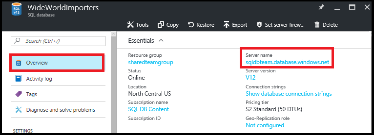

<properties
    pageTitle="Verwalten von Azure SQL-Datenbank mit dem Portal Azure | Microsoft Azure"
    description="Informationen Sie zum Azure-Portal zu verwenden, um einer relationalen Datenbank in der Cloud mithilfe der Azure-Portal zu verwalten."
    services="sql-database"
    documentationCenter=""
    authors="stevestein"
    manager="jhubbard"
    editor=""/>

<tags
    ms.service="sql-database"
    ms.devlang="NA"
    ms.workload="data-management"
    ms.topic="article"
    ms.tgt_pltfrm="NA"
    ms.date="09/19/2016"
    ms.author="sstein"/>

# Verwalten von Azure SQL-Datenbanken, die über das Azure-portal

> [AZURE.SELECTOR]
- [Azure-portal](sql-database-manage-portal.md)
- [SSMS](sql-database-manage-azure-ssms.md)
- [PowerShell](sql-database-manage-powershell.md)

Im [Portal Azure](https://portal.azure.com/) ermöglicht das Erstellen, überwachen und Verwalten von SQL Azure-Datenbanken und -Servern. Dieser Artikel enthält eine schnelle Beschreibung und Links zu den Details der häufigeren Aufgaben.

## Zeigen Sie Ihrer SQL Azure-Datenbanken, Servern und Pools an

Klicken Sie auf **Weitere Dienste**zum Anzeigen der verfügbaren Dienste SQL-Datenbank, und geben Sie in das Suchfeld ein **SQL** :

## Wie kann ich erstellen oder anzeigen SQL Azure-Datenbanken?

Um das Blade **SQL-Datenbanken** zu öffnen, klicken Sie auf **SQL-Datenbanken**, und klicken Sie dann klicken Sie auf die Datenbank, die, der Sie mit arbeiten möchten, oder klicken Sie auf **+ Add** zum Erstellen einer SQL-Datenbank. Weitere Informationen finden Sie unter [Erstellen einer SQL-Datenbank in Minuten mithilfe des Azure-Portals](sql-database-get-started.md).

## Wie kann ich erstellen oder anzeigen SQL Azure-Server?

Zum Öffnen des **SQL Server** -Blades klicken Sie auf **SQL Server**, und klicken Sie dann klicken Sie auf dem Server, die, dem Sie mit arbeiten möchten, oder klicken Sie auf **+ Add** zum Erstellen eines SqlServer. Weitere Informationen finden Sie unter [Erstellen einer SQL-Datenbank in Minuten mithilfe des Azure-Portals](sql-database-get-started.md).

## Wie kann ich erstellen oder anzeigen SQL flexible Pools?

Zum Öffnen des **SQL-flexible Pools** Blades **SQL flexible Pools**, klicken Sie auf und dann klicken Sie auf die gewünschte für die Arbeit mit Ressourcenpool, oder klicken Sie auf **+ Add** um einem Ressourcenpool zu erstellen. Details finden Sie unter [Erstellen einer Datenbank flexible Ressourcenpool mit Azure-Portal](sql-database-elastic-pool-create-portal.md).

## Wie ich anzeigen SQL-Datenbank-Einstellungen oder aktualisieren?

Zum Anzeigen oder aktualisieren Ihre Datenbank-Einstellungen, klicken Sie auf die gewünschte Einstellung aus, auf dem SQL-Datenbank-Blade:

## Wie finde ich SQL-Datenbanken vollqualifizierte Servernamen?

Um den Servernamen Datenbanken anzuzeigen, klicken Sie auf dem **SQL-Datenbank** -Blade auf **Übersicht** , und notieren Sie den Servernamen:

## Wie verwalte ich Firewall-Regeln zum Steuern des Zugriffs auf Meine SQLServer und die Datenbank?

Zum Anzeigen, erstellen oder aktualisieren die Firewall-Regeln, klicken Sie auf das Blade **SQL-Datenbank** auf **Serverfirewall festlegen** . Weitere Informationen finden Sie unter [Konfigurieren einer Azure SQL-Datenbank-Server Ebene-Firewall-Regel mithilfe des Azure-Portals](sql-database-configure-firewall-settings.md).

## Wie ändere ich mein SQL-Datenbank Stufe oder Leistung Dienstalter?

Um das Dienstalter Stufe oder Leistung einer SQL-Datenbank zu aktualisieren, klicken Sie auf **Preise Ebene (Maßstab DTUs)** auf das Blade **SQL-Datenbank** . Weitere Informationen finden Sie unter [Ändern der Ebene und Leistung Dienstalter (Preisgestaltung Ebene) einer SQL-Datenbank](sql-database-scale-up.md).

## Wie kann ich Überwachung konfigurieren und Verfahren zum Erstellen von Erkennung für eine SQL­Datenbank?

Klicken Sie auf **Überwachung und Gefahrenprofilen Erkennung** auf dem **SQL-Datenbank** -Blade, Überwachung und Gefahrenprofilen Erkennung für eine SQL­Datenbank um zu konfigurieren. Details finden Sie unter [Erste Schritte mit SQL-Datenbank Überwachung](sql-database-auditing-get-started.md)und [Erste Schritte mit SQL Datenbank Erkennung](sql-database-threat-detection-get-started.md).

## Wie konfigurieren kann ich dynamische Daten für eine SQL­Datenbank masking?

Um dynamische Daten für eine SQL­Datenbank masking konfigurieren möchten, klicken Sie auf **Dynamic Data masking** auf das Blade **SQL-Datenbank** . Weitere Informationen finden Sie unter [Erste Schritte mit SQL Datenbank dynamische Daten Masking](sql-database-dynamic-data-masking-get-started.md).

## Wie konfigurieren kann ich als transparent-Verschlüsselung (TDE) für eine SQL­Datenbank?

Um transparenten Daten-Verschlüsselung einer SQL-Datenbank zu konfigurieren, klicken Sie auf **Transparent Data-Verschlüsselung** auf dem **SQL-Datenbank** -Blade. Weitere Informationen finden Sie unter [Aktivieren TDE auf einer Datenbank mit dem Portal](https://msdn.microsoft.com/library/dn948096#Anchor_1).

## Wie ich anzeigen oder ändern die maximale Größe von einer SQL-Datenbank?

Klicken Sie zum Anzeigen oder Ändern der Größe einer SQL-Datenbank, die **SQL-Datenbank** Blade **Datenbankgröße** auf. Aktualisieren Sie die maximale Größe einer Datenbank, indem Sie das Dienstalter Stufe oder Leistung ändern. Weitere Informationen finden Sie unter [Ändern der Ebene und Leistung Dienstalter (Preisgestaltung Ebene) einer SQL-Datenbank](sql-database-scale-up.md).

## Wie kann ich überwachen und verbessern die Leistung von einer SQL-Datenbank?

Klicken Sie zum Überwachen und verbessern Leistungsmerkmale einer SQL-Datenbank, **Performance Overview** auf das Blade **SQL-Datenbank** ein. Weitere Informationen finden Sie unter [SQL-Datenbank Leistung Einblick](sql-database-performance.md).

## Wie konfigurieren kann ich Geo-Replikation?

Klicken Sie zum Einrichten von Geo-Replikation für eine SQL­Datenbank auf dem **SQL-Datenbank** -Blade auf **Geo-Replikation** . Weitere Informationen finden Sie unter [Geo-Replikation für SQL Azure-Datenbank mit dem Portal Azure konfigurieren](sql-database-geo-replication-portal.md).

## Wie kann ich mit einer SQL-Datenbank Geo repliziert Failover?

Klicken Sie Failover auf einem sekundären Geo repliziert klicken Sie auf dem **SQL-Datenbank** -Blade **Geo-Replikation** auf und dann auf **Failover**. Weitere Informationen finden Sie unter [Einleiten einer geplanten oder ungeplanten Failover für SQL Azure-Datenbank mit dem Portal Azure](sql-database-geo-replication-failover-portal.md).

## Wie kopiere ich eine SQL-Datenbank?

Klicken Sie zum Kopieren einer SQL-Datenbank auf dem **SQL-Datenbank** -Blade auf **Kopieren** . Weitere Informationen finden Sie unter [kopieren eine Azure SQL-Datenbank mit dem Azure-Portal](sql-database-copy-portal.md).

## Wie werden eine Azure SQL-Datenbank in eine Datei BACPAC archiviert?

Um eine BACPAC einer SQL-Datenbank zu erstellen, klicken Sie auf das Blade **SQL-Datenbank** **Exportieren** . Weitere Informationen finden Sie unter [Archiv einer Azure SQL-Datenbank in eine BACPAC-Datei mit der Azure-Portal](sql-database-export.md).

## Wie kann ich wiederherstellen eine SQL-Datenbank zu einem vorherigen Punkt Zeitpunkt?

Klicken Sie zum Wiederherstellen einer SQL-Datenbank auf das Blade **SQL-Datenbank** **Wiederherstellen** . Weitere Informationen finden Sie unter [Wiederherstellen einer Azure SQL-Datenbank bis zu einem vorherigen Zeitpunkt mit dem Portal Azure](sql-database-point-in-time-restore-portal.md).

## Wie erstelle ich eine SQL Azure-Datenbank aus einer Datei BACPAC?

Klicken Sie zum Erstellen einer SQL-Datenbank aus einer Datei BACPAC auf dem **SQLServer** -Blade auf **Datenbank importieren** . Weitere Informationen finden Sie unter [BACPAC Datei zum Erstellen einer SQL Azure-Datenbank importieren](sql-database-import.md).

## Wie wiederherstellen kann ich eine gelöschte SQL­Datenbank?

Klicken Sie zum Wiederherstellen einer gelöschten SQL-Datenbank auf dem **SQLServer** -Blade (der SQLServer, die die Datenbank enthalten, die nicht gelöscht wurde) auf **Datenbanken gelöscht** . Weitere Informationen finden Sie unter [Wiederherstellen einer gelöschte SQL Azure-Datenbank, die mit dem Azure-Portal](sql-database-restore-deleted-database-portal.md).

## Wie kann ich eine SQL-Datenbank löschen?

Klicken Sie zum Löschen einer SQL-Datenbank auf dem **SQL-Datenbank** -Blade auf **Löschen** . 

## Zusätzliche Ressourcen

- [SQL-Datenbank](sql-database-technical-overview.md)
- [Überwachen Sie und verwalten Sie eines Ressourcenpool flexible Datenbank mit dem Azure-portal](sql-database-elastic-pool-manage-portal.md)
