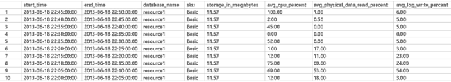
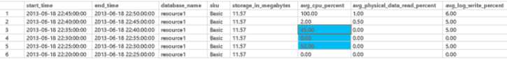

<properties
    pageTitle="Azure SQL-Datenbank und Leistung für einzelne Datenbanken | Microsoft Azure"
    description="In diesem Artikel helfen festzustellen, welche Dienstebene für eine Anwendung auswählen. Außerdem wird empfohlen, Methoden zum Optimieren Ihrer Anwendungs zu Azure SQL-Datenbank optimal zu nutzen."
    services="sql-database"
    documentationCenter="na"
    authors="CarlRabeler"
    manager="jhubbard"
    editor="" />

<tags
    ms.service="sql-database"
    ms.devlang="na"
    ms.topic="article"
    ms.tgt_pltfrm="na"
    ms.workload="data-management"
    ms.date="09/13/2016"
    ms.author="carlrab" />

# Azure SQL-Datenbank und Leistung für einzelne Datenbanken

Azure SQL-Datenbank bietet drei [Service Ebenen](sql-database-service-tiers.md): Basic, Standard und Premium. Pro Dienstebene isoliert unbedingt die Ressourcen, die SQL-Datenbank verwenden kann, und vorhersehbar Leistung für diesen Dienstebene garantiert. In diesem Artikel bieten wir Anleitungen, mit denen Sie die Dienstebene für eine Anwendung auswählen kann. Außerdem besprochen Methoden, mit denen der Anwendung nutzen aus Azure SQL-Datenbank zu verbessern können.

>[AZURE.NOTE] Dieser Artikel befasst sich Leitfaden zur Leistung für einzelne Datenbanken in Azure SQL-Datenbank. Leitfaden zur Leistung im Zusammenhang mit flexible Datenbank Pools finden Sie unter [Preis und Leistung Aspekte für flexible Datenbank Pools](sql-database-elastic-pool-guidance.md). Beachten Sie jedoch, dass viele Videogeräten empfohlenen in diesem Artikel auf Datenbanken in einem Pool flexible Datenbank anwenden, und ähnliche Leistungsvorteile erhalten.

Hierbei handelt es sich um drei Azure SQL-Datenbank-Dienst leisten, die Sie auswählen können (Leistung wird in der Datenbank Durchsatz Einheiten oder [DTUs](sql-database-what-is-a-dtu.md)gemessen:

- **Grundlegende**. Die grundlegende Dienst Ebene Angebote gute Leistung Vorhersagbarkeit für jede Datenbank, die Stunde, um die Stunde. In einer Datenbank grundlegende Supportressourcen ausreichend gute Leistung in eine kleine Datenbank, die mehrere gleichzeitige Anforderungen aufweist.
- **Standard**. Die Standard-Service-Ebene bietet verbesserte Leistung Vorhersagbarkeit und löst aus den Balken für Datenbanken, die mehrere gleichzeitige Anforderungen, wie Arbeitsgruppe und Web Applications aufweisen. Wenn Sie eine Datenbank der Schicht Standard-Dienst auswählen, können Sie die Größe Ihrer Datenbank Anwendungs basierend auf der Leistung vorhersehbar, über die Minute Minute.
- **Premium**. Die Ebene der Premium-Dienst bietet vorhersehbar Leistung, zweiten über einen zweiten, für jeden Premium-Datenbank. Wenn Sie die Ebene der Premium-Dienst auswählen, können Sie eine Datenbank-Anwendung basierend auf den Höchstwert Laden für diese Datenbank Größe. Der Plan entfernt Fälle, in welche, die Leistung Varianz kleine Abfragen mehr Zeit als erwartet in Wartezeit sensible Vorgänge ausführen führen kann. Dieses Modell kann erheblich die Entwicklung und Product Überprüfung durchläuft für Applikationen vereinfachen, die signifikante Aussagen über Höchstwert Ressource Anforderungen, die Varianz auf der Leistung oder Abfragewartezeit vornehmen müssen.

Legen Sie für jede Schicht Dienst die Leistungsstufe, damit Sie haben die Flexibilität nur für die Kapazität Zahlen, die Sie benötigen. Sie können [Anpassen Kapazität](sql-database-scale-up.md), nach oben oder unten als Arbeitsbelastung Änderungen. Wenn Ihre Datenbank Arbeitsbelastung während der Back-zu-Schule Einkaufswagen Jahreszeit hoch ist, können Sie beispielsweise die Leistungsstufe für die Datenbank für einen festgelegten Zeitraum, Juli bis September erhöhen. Sie können es reduzieren, wenn der Höchstwert Season endet. Sie können die Zahlen durch Optimierung Ihrer Cloud-Umgebung auf die Saisonabhängigkeit Ihres Unternehmens minimieren. Dieses Modell eignet sich auch für Software Produktfreigabezyklen. Ein Testteam möglicherweise Kapazität zugewiesen werden, während dieser test ausgeführt, und lassen Sie die Kapazität, wann er testen fertig. In einem Modell Kapazität Anforderung bezahlen Sie für Kapazität, während Sie benötigt, und vermeiden Sie die Ausgaben für dedizierte Ressourcen, die Sie möglicherweise kaum verwendet.

## Warum service Ebenen aus?

Obwohl jede Datenbank Arbeitsbelastung unterschiedlich sein kann, stellen der Zweck der Dienst leisten Leistung Vorhersagbarkeit auf verschiedenen Ebenen der Leistung bereit. In einer Umgebung weiterer dedizierter können Kunden mit umfangreichen Datenbank Ressource Anforderungen arbeiten.

### Allgemeine Dienstebene Verwenden von Fällen

#### Grundlegende

- **Sie sind nur erste Schritte mit Azure SQL-Datenbank**. Anwendungen, die bei der Entwicklung häufig sind erforderlich nicht, dass hohe Leistung. Grundlegende Datenbanken sind eine ideale Umgebung für die an einem Punkt Tiefstkurs Datenbankentwicklung.
- **Sie haben eine Datenbank mit einem einzelnen Benutzer**. Programme, die einer Datenbank einen einzelnen Benutzer in der Regel zuordnen keine hohe Parallelität und Leistung Anforderungen an. Diese Programme sind Kandidaten für die grundlegenden Service-Leiste.

#### Standard

- **Die Datenbank weist mehrere gleichzeitige Anforderungen**. Anwendungen, die mehr als ein Benutzer in der Regel jeweils service benötigen höhere Performance. Websites, die erste moderieren Datenverkehr oder Abteilung Applications, die erfordern weitere Ressourcen sind beispielsweise gute Kandidaten für die Standard-Service-Leiste.

#### Premium

Die meisten Premium Ebene verwenden Serviceanfragen haben eine oder mehrere der folgenden Merkmale auf:

- **Hohe Höchstwert zu laden**. Eine Anwendung, die viele CPU, Arbeitsspeicher oder ein-/Ausgabe (e/a) zum Abschließen der Vorgänge erfordert erfordert eine dedizierte, leistungsfähige Ebene an. Ein Datenbankvorgang bekannt, dass mehrere CPUs längere Zeit nutzen beträgt beispielsweise ein Kandidat für die Premium-Service-Leiste.
- **Viele gleichzeitige Anforderungen**. Einige datenbankanwendungen Serviceanfragen viele gleichzeitige, beispielsweise beim Erstellen einer Websites, die ein hoher Auslastung besitzt. Standard- und Standard Dienst Ebenen Einschränken der Anzahl von gleichzeitige Anforderungen pro Datenbank. Anwendungen, die mehrere Verbindungen erfordern müssten wählen Sie eine geeignete Reservierungsgröße, die maximale Anzahl der benötigten Anfragen zu behandeln.
- **Geringe Wartezeit**. Einige Applikationen müssen eine Antwort von der Datenbank in Formularlayouts sichergestellt ist. Wenn eine bestimmte gespeicherte Prozedur als Teil eines breiteren Kunden Vorgangs aufgerufen wird, müssen Sie möglicherweise eine Anforderung eine Rückgabe von dieser Anruf in Millisekunden 99 Prozent der Zeit nicht mehr als 20 haben. Diese Art der Vorteile der Ebene der Premium-Dienst, um sicherzustellen, dass die erforderlichen leistungsstarken verfügbar ist.

Das Dienstalter, das Sie für die SQL-Datenbank müssen, hängt von den Höchstwert laden Anforderungen für jede Ressource Dimension ab. Einige Programme verwenden eines eine einzelne Ressource, aber signifikante Anforderungen für andere Ressourcen haben.

## Service-Funktionen, die Ebene und Grenzwerte
Jede Ebene und Leistung Dienstalter, die unterschiedliche Grenzwerte und Leistungsmerkmale zugeordnet ist. Diese Tabelle beschreibt die folgenden Merkmale für eine einzelne Datenbank.

[AZURE.INCLUDE [SQL DB service tiers table](../../includes/sql-database-service-tiers-table.md)]

In den nächsten Abschnitten haben Weitere Informationen zum verwenden, die im Zusammenhang mit dieser Grenzen anzeigen.

### Maximale OLTP von In-Memory-Speicher

Die Ansicht **sys.dm_db_resource_stats** können zum Überwachen der Azure In-Memory-Speicher verwenden. Weitere Informationen zum Überwachen finden Sie unter [Monitor In-Memory OLTP-Speicher](sql-database-in-memory-oltp-monitoring.md).

>[AZURE.NOTE] Online Azure In-Memory-Transaktion processing (OLTP) Vorschau wird derzeit nur für einzelne Datenbanken unterstützt. Sie können nicht in Datenbanken in flexible Datenbank Pools verwendet werden.

### Maximale gleichzeitige Anforderungen

Um die Anzahl der gleichzeitige Anforderungen sehen zu können, führen Sie diese Transact-SQL-Abfrage auf die SQL-Datenbank:

    SELECT COUNT(*) AS [Concurrent_Requests]
    FROM sys.dm_exec_requests R

Um die Arbeitsbelastung einer lokalen SQL Server-Datenbank zu analysieren, ändern Sie diese Abfrage zum Filtern der bestimmten Datenbank, die Sie analysieren möchten. Wenn Sie eine lokale Datenbank mit dem Namen Meine Datenbank haben, gibt diese Transact-SQL-Abfrage beispielsweise die Anzahl der gleichzeitige Anforderungen in dieser Datenbank:

    SELECT COUNT(*) AS [Concurrent_Requests]
    FROM sys.dm_exec_requests R
    INNER JOIN sys.databases D ON D.database_id = R.database_id
    AND D.name = 'MyDatabase'

Dies ist nur eine Momentaufnahme zu einem bestimmten Zeitpunkt. Um ein besseres Verständnis Ihrer Arbeitsbelastung und gleichzeitiger Anfrage Anforderungen zu gelangen, müssen Sie über einen Zeitraum viele Beispiele zu sammeln.

### Maximale gleichzeitige Benutzernamen

Sie können Ihre Benutzer und Anwendung Mustern um eine Vorstellung davon der Häufigkeit von Benutzernamen erhalten analysieren. Sie können auch praktisches lädt ausführen, in einer testumgebung, um sicherzustellen, dass Sie nicht diese oder andere Grenzwerte, die in diesem Artikel besprochen handelt. Es ist keine einzelne Abfrage oder dynamic Management View (DMV), die Sie gleichzeitig anzeigen kann, dass Login zählt oder Verlauf.

Wenn mehrere Clients dieselbe Verbindungszeichenfolge verwenden, authentifiziert der Dienst jede Anmeldung. 10 Benutzer gleichzeitig mit einer Datenbank verbinden mit den gleichen Benutzernamen und das Kennwort, wäre 10 gleichzeitige Benutzernamen. Diese Einschränkung gilt nur für die Dauer der Anmeldung und Authentifizierung. Wenn die gleichen 10 Benutzer sequenziell zu der Datenbank herstellen, wäre die Anzahl der gleichzeitigen Benutzernamen nie größer als 1.

>[AZURE.NOTE] Diese Beschränkung gilt derzeit nicht für Datenbanken im Pools flexible Datenbank.

### Maximale Sitzungen

Um die Anzahl der aktuellen aktive Sitzungen sehen zu können, führen Sie diese Transact-SQL-Abfrage auf die SQL-Datenbank:

    SELECT COUNT(*) AS [Sessions]
    FROM sys.dm_exec_connections

Wenn Sie die Arbeitsbelastung einer lokalen SQL Server analysieren möchten, ändern Sie die Abfrage in einer bestimmten Datenbank vereinfacht. Diese Abfrage hilft Ihnen die möglichen Sitzung Anforderungen für die Datenbank zu ermitteln, wenn Sie beabsichtigen, es in SQL Azure-Datenbank verschieben.

    SELECT COUNT(*)  AS [Sessions]
    FROM sys.dm_exec_connections C
    INNER JOIN sys.dm_exec_sessions S ON (S.session_id = C.session_id)
    INNER JOIN sys.databases D ON (D.database_id = S.database_id)
    WHERE D.name = 'MyDatabase'

Erneut zurückgegeben Anzahl, die diese Abfragen Point-in-Time. Wenn Sie mehrere Beispiele über einen Zeitraum erfassen, müssen Sie das beste Verständnis der Sitzung verwenden.

Analyse der SQL-Datenbank können Sie Sitzungen zurückliegende Statistiken können. **Sys.resource_stats**Abfrage, und verwenden Sie die Spalte **Active_session_count** . Finden Sie im nächsten Abschnitt für Weitere Informationen zur Verwendung dieser Ansicht aus.

## Überwachen der Verwendung von Ressourcen
Zwei Ansichten helfen Ihnen die Verwendung von Ressourcen für eine SQL­Datenbank im Verhältnis zur zugehörigen Dienstebene überwachen:

- [Sys.dm_db_resource_stats](https://msdn.microsoft.com/library/dn800981.aspx)
- [Sys.resource_stats](https://msdn.microsoft.com/library/dn269979.aspx)

### Sys.dm_db_resource_stats
Sie können die Ansicht [sys.dm_db_resource_stats](https://msdn.microsoft.com/library/dn800981.aspx) in jeder SQL-Datenbank. Die **sys.dm_db_resource_stats** -Ansicht zeigt aktuelle verwenden Ressourcendaten relativ zu der Dienstebene. Durchschnittliche Prozentsätze für CPU, Daten i/o, Log schreibt und Arbeitsspeicher werden alle 15 Sekunden aufgezeichnet und für 1 Stunde verwaltet werden.

Da diese Ansicht eine detailliertere Übersicht über die Verwendung von Ressourcen bereitgestellt wird, verwenden Sie **sys.dm_db_resource_stats** für alle aktuellen Status Analyse vor- oder zur Problembehandlung aus. Diese Abfrage zeigt beispielsweise das Mittelwert und maximum Ressource verwenden für die aktuelle Datenbank über die letzten Stunde:

    SELECT  
        AVG(avg_cpu_percent) AS 'Average CPU use in percent',
        MAX(avg_cpu_percent) AS 'Maximum CPU use in percent',
        AVG(avg_data_io_percent) AS 'Average data I/O in percent',
        MAX(avg_data_io_percent) AS 'Maximum data I/O in percent',
        AVG(avg_log_write_percent) AS 'Average log write use in percent',
        MAX(avg_log_write_percent) AS 'Maximum log write use in percent',
        AVG(avg_memory_usage_percent) AS 'Average memory use in percent',
        MAX(avg_memory_usage_percent) AS 'Maximum memory use in percent'
    FROM sys.dm_db_resource_stats;  

Andere Abfragen finden Sie in den Beispielen in [sys.dm_db_resource_stats](https://msdn.microsoft.com/library/dn800981.aspx).

### Sys.resource_stats

Die Ansicht [sys.resource_stats](https://msdn.microsoft.com/library/dn269979.aspx) in der **master** -Datenbank weist zusätzliche Informationen, mit denen Sie die Leistung von Ihrer SQL-Datenbank auf deren Ebene und Leistung Ebene von bestimmten Dienst überwachen kann. Die Daten ist für etwa 35 Tage zusammengestellten 5 Minuten beibehalten und. Diese Ansicht eignet sich für eine längerfristige zurückliegenden Analyse wie der SQL-Datenbank Ressourcen verwendet werden.

Das folgende Diagramm veranschaulicht die CPU-Ressourcenverwendung für eine Datenbank Premium mit der P2 Leistungsstufe für jede Stunde in eine Woche. In diesem Diagramm beginnt an einem Montag, zeigt 5 Arbeitstage und zeigt klicken Sie dann auf ein Wochenende, geschieht viel kleiner über die Anwendung.

Aus den Daten, diese Datenbank aktuell hat eine Höchstwert CPU-Auslastung nur über 50 % CPU-Verwendung im Verhältnis zur die Leistungsstufe P2 (Mittag am Dienstag). Wenn CPU der bestimmende Faktor in der Anwendung Ressource Profil ist, können Sie festlegen, dass P2 die richtigen Leistungsstufe ist, um sicherzustellen, dass die Arbeitsbelastung immer passt. Wenn Sie eine Anwendung mit der Zeit wachsen erwarten, ist es eine gute Idee, einen zusätzlichen Ressourcen Puffer verfügen, sodass die Anwendung jemals erreicht haben die Leistungsstufe Beschränkung nicht aus. Wenn Sie die Leistungsstufe erhöhen, kann Ihnen helfen, Kunden sichtbar Fehler zu vermeiden, die auftreten können, wenn Sie eine Datenbank genügend Power Anfragen effektiv, insbesondere nicht im Wartezeit dringende Umgebungen Verarbeitungszeit aufweist. Ein Beispiel ist eine Datenbank, die eine Anwendung unterstützt, die Webseiten basierend auf den Ergebnissen der Datenbank Anrufe zeichnet.

Beachten Sie, dass andere Arten der Anwendung im gleiche Diagramm anders interpretieren möglicherweise. Wenn eine Anwendung versucht, Lohndaten jeden Tag verarbeiten und im selben Diagramm enthält, möglicherweise diese Art von "Stapelverarbeitung" Modell beispielsweise fein bei einer P1 Leistungsstufe führen. Die Leistungsstufe P1 hat 100 DTUs im Vergleich zu 200 DTUs Ebene Leistung P2. Die Leistungsstufe P1 bietet Hälfte die Leistung von die Leistungsstufe P2. Ja, gleich 50 % der CPU-Verwendung in P2 100 Prozent CPU-Verwendung in P1. Wenn die Anwendung keinen Zeitlimit, möglicherweise es keine Rolle, wenn ein Projekt 2 Stunden oder 2,5 Stunden abgeschlossen haben, dauert, wenn die Aufgabe heute erledigt werden. Eine Anwendung in dieser Kategorie kann wahrscheinlich eine P1 Leistungsstufe verwenden. Sie können die Fakultät nutzen, dass Zeiträume während des Tages, wenn Ressourcen verwenden unteren, besteht, damit alle "Groß"Höchstwert in eines der Täler weiter unten in den Tag möglicherweise über Effekts, vorhanden sind. Die Leistungsstufe P1 möglicherweise gut für die Art der Anwendung (zu sparen), solange die Einzelvorgänge auf jeden Tag Uhrzeit abschließen zu können.

Azure SQL-Datenbank macht verbraucht Ressourceninformationen für jede aktive Datenbank in der Ansicht **sys.resource_stats** **master** -Datenbank in jedem Server an. Die Daten in der Tabelle werden für alle 5 Minuten aggregiert. Mit den Ebenen Basic, Standard und Premium Service können die Daten in der Tabelle angezeigt, sodass diese Daten für zurückliegende Analyse statt in der Nähe Echtzeit Analyse hilfreicher ist mehr als 5 Minuten dauern. Fragen Sie die Ansicht und **sys.resource_stats** um den zuletzt verwendete Verlauf einer Datenbank anzuzeigen und zu überprüfen, ob die von Ihnen ausgewählten Reservierung die Leistung übermittelt, dass Sie bei Bedarf möchten ab.

>[AZURE.NOTE] Sie müssen in die **master** -Datenbank von Ihrem logischen SQL-Datenbankserver **sys.resource_stats** in den folgenden Beispielen Abfragen verbunden sein.

Dieses Beispiel zeigt, wie die Daten in dieser Ansicht verfügbar gemacht werden:

    SELECT TOP 10 *
    FROM sys.resource_stats
    WHERE database_name = 'resource1'
    ORDER BY start_time DESC

Im nächste Beispiel werden die unterschiedliche Methoden, mit denen Sie die Katalogansicht **sys.resource_stats** erhalten Informationen zur Verwendung von Ressourcen in der SQL-Datenbank angezeigt:

1. In der letzten Woche Ressource eigenständig für die Datenbank userdb1 verwenden, können Sie diese Abfrage ausführen:

        SELECT *
        FROM sys.resource_stats
        WHERE database_name = 'userdb1' AND
              start_time > DATEADD(day, -7, GETDATE())
        ORDER BY start_time DESC;

2. Um auszuwerten, wie gut Ihre Arbeitsbelastung die Leistungsstufe passt, müssen Sie Drilldowns in unterschiedlichen Elemente für die Ressource Metrik: CPU, liest, schreibt, Anzahl von Arbeitskräften und Anzahl Sitzungen. Dies ist eine überarbeiteten Abfrage mit **sys.resource_stats** , die durchschnittlichen und maximalen Werte dieser Ressource Kennzahlen melden:

        SELECT
            avg(avg_cpu_percent) AS 'Average CPU use in percent',
            max(avg_cpu_percent) AS 'Maximum CPU use in percent',
            avg(avg_data_io_percent) AS 'Average physical data I/O use in percent',
            max(avg_data_io_percent) AS 'Maximum physical data I/O use in percent',
            avg(avg_log_write_percent) AS 'Average log write use in percent',
            max(avg_log_write_percent) AS 'Maximum log write use in percent',
            avg(max_session_percent) AS 'Average % of sessions',
            max(max_session_percent) AS 'Maximum % of sessions',
            avg(max_worker_percent) AS 'Average % of workers',
            max(max_worker_percent) AS 'Maximum % of workers'
        FROM sys.resource_stats
        WHERE database_name = 'userdb1' AND start_time > DATEADD(day, -7, GETDATE());

3. Mit dieser Informationen die durchschnittlichen und maximalen Werte jeder Ressource Metrik können Sie beurteilen, wie gut Ihre Arbeitsbelastung in die Leistungsstufe passt, die Sie ausgewählt haben. Mittelwert der Werte von **sys.resource_stats** bieten Ihnen in der Regel einen guten Basisplan anhand der Größe des Target verwenden. Sollten sie Ihre primäre Maße Speicherstick ein. Ein Beispiel dafür können Sie die Standard-Service-Ebene mit S2 Leistungsstufe verwenden. Verwenden Sie der Mittelwert Prozentsätze für CPU- und e/a-lesen schreibt sind unter 40 Prozent, durchschnittliche Anzahl der Worker ist unter 50 und durchschnittliche Anzahl der Sitzungen unter 200 ist. Ihre Arbeitsbelastung möglicherweise in den S1 Leistungsstufe angeordnet werden. Es ist einfach, um festzustellen, ob die Datenbank in der Worker und Sitzung Grenzwerte passt. Wenn Sie feststellen, ob eine Datenbank in einer unteren Leistungsstufe im Hinblick auf CPU, passt liest und schreibt, die DTU Anzahl der untergeordneten Ebene Leistung durch die Anzahl der aktuellen Leistungsstufe DTU dividieren, und klicken Sie dann das Ergebnis mit 100 multiplizieren:

    * *S1 DTU / S2 DTU* 100 = 20 / 50* 100 = 40 **

    Das Ergebnis ist der relativen Leistungsunterschied zwischen den beiden Leistungsprobleme Ebenen in Prozent an. Wenn Ihre Ressourcenverwendung dieser Betrag nicht überschritten wird, möglicherweise in der unteren Leistungsstufe Ihrer Arbeitsbelastung angeordnet werden. Jedoch müssen Sie schauen Sie sich alle Wertebereiche Ressourcen verwenden, und ermitteln, um Prozentsatz, wie oft die Arbeitsbelastung Ihrer Datenbank in der unteren Leistungsstufe anpassen möchten. Die folgende Abfrage gibt den prozentualen pro Ressource Dimension, basierend auf den oberen Schwellenwert von 40 %, die wir in diesem Beispiel berechnet:

        SELECT
            (COUNT(database_name) - SUM(CASE WHEN avg_cpu_percent >= 40 THEN 1 ELSE 0 END) * 1.0) / COUNT(database_name) AS 'CPU Fit Percent'
            ,(COUNT(database_name) - SUM(CASE WHEN avg_log_write_percent >= 40 THEN 1 ELSE 0 END) * 1.0) / COUNT(database_name) AS 'Log Write Fit Percent'
            ,(COUNT(database_name) - SUM(CASE WHEN avg_data_io_percent >= 40 THEN 1 ELSE 0 END) * 1.0) / COUNT(database_name) AS 'Physical Data IO Fit Percent'
        FROM sys.resource_stats
        WHERE database_name = 'userdb1' AND start_time > DATEADD(day, -7, GETDATE());

    Basierend auf Ihrer Datenbank Dienst Ebene Ziel (SLO), können Sie entscheiden, ob Ihre Arbeitsbelastung in der unteren Leistungsstufe passt. Wenn Ihre Datenbank Arbeitsbelastung SLO 99,9 Prozent und die vorherige Abfrage Werte größer als 99,9 % für alle drei Ressourcendimensionen gibt, wird in der unteren Leistungsstufe Ihrer wahrscheinlich Arbeitsbelastung passen.

    Der prozentualen betrachtet Ihnen außerdem einen Einblick in gibt an, ob Sie zu der nächsthöheren Leistung Ebene wechseln, um Ihre SLO erfüllen müssen. Userdb1 zeigt beispielsweise die folgende CPU-Verwendung für der letzten Woche:

  	| Durchschnittliche CPU-Prozent | Maximale CPU-Prozent |
  	|---|---|
  	| 24,5 | 100,00 |

    Die durchschnittliche CPU geht ein Viertel der Limit der Leistungsstufe, die gut in der Datenbank die Leistungsstufe einfügen möchten. Aber der größten Wert zeigt an, dass die Datenbank die Leistungsstufe erreicht. Benötigen Sie höhere Leistung professionell verschieben? Sie müssen erläutert, wie oft Ihre Arbeitsbelastung erreicht 100 Prozent, und klicken Sie dann mit Ihrer Datenbank Arbeitsbelastung SLO vergleichen.

        SELECT
        (COUNT(database_name) - SUM(CASE WHEN avg_cpu_percent >= 100 THEN 1 ELSE 0 END) * 1.0) / COUNT(database_name) AS 'CPU fit percent'
        ,(COUNT(database_name) - SUM(CASE WHEN avg_log_write_percent >= 100 THEN 1 ELSE 0 END) * 1.0) / COUNT(database_name) AS 'Log write fit percent’
        ,(COUNT(database_name) - SUM(CASE WHEN avg_data_io_percent >= 100 THEN 1 ELSE 0 END) * 1.0) / COUNT(database_name) AS 'Physical data I/O fit percent'
        FROM sys.resource_stats
        WHERE database_name = 'userdb1' AND start_time > DATEADD(day, -7, GETDATE());

    Wenn diese Abfrage gibt einen Wert zurück, weniger als 99,9 % für eine der drei Ressourcendimensionen, sollten Sie entweder auf die nächste Ebene der höheren Leistung verschieben oder Anwendung optimieren Techniken, um die beim Laden der SQL-Datenbank zu verringern.

4. In dieser Übung betrachtet der geplanten Arbeitsbelastung erhöhen auch in der Zukunft aus.

## Optimieren Sie Ihrer Anwendung

In herkömmlichen lokalen SQL Server wird die Vorgehensweise zum Planen der anfänglichen Kapazität häufig von den Vorgang des Ausführens der Anwendung Herstellung getrennt. Hardware und Produkt Lizenzen werden zuerst erworben und Leistung optimieren danach abgeschlossen ist. Wenn Sie Azure SQL-Datenbank verwenden, ist es eine gute Idee, die Verfahren zum Ausführen einer Anwendung, und Optimieren sie interweave aus. Mit dem Modell der Zahlung für Kapazität nach Bedarf können Sie eine Anwendung verwenden Sie die minimalen Ressourcen benötigt nun statt Bereitstellung überproportional vieler auf Grundlage geraten zukünftiges Wachstum Pläne für eine Anwendung, die häufig falsch sind Hardware optimieren. Einige Kunden möglicherweise nicht zur Anwendung von Diagrammen auswählen, und legen stattdessen overprovision Hardware-Ressourcen. Dieser Ansatz möglicherweise eine gute Idee, wenn Sie nicht an eine zentralen Anwendung während eines Zeitraums beschäftigt ändern möchten. Aber eine Anwendung optimieren kann minimieren benötigten Ressourcen und unteren monatliche Rechnung Wenn Sie die Dienst Ebenen in Azure SQL-Datenbank verwenden.

### Anwendungsmerkmale

Obwohl Azure SQL-Datenbank-Dienst Ebenen zum Verbessern der Leistung Stabilität und Vorhersagbarkeit für eine Anwendung vorgesehen sind, können einige bewährte Methoden der Anwendung besser die Ressourcen bei einer Leistungsstufe nutzen zu verbessern helfen. Obwohl viele Clientanwendungen sich die Systemleistung haben, indem Sie einfach umsteigen auf einer höheren Ebene der Leistung oder Dienstebene, einige Applikationen benötigen zusätzliche Abstimmung, um eine höhere Ebene des Diensts nutzen zu können. Erwägen Sie zur Verbesserung der Leistung zusätzliche Anwendung optimieren für Applikationen, die diese Merkmale aufweisen:

- **Anwendungen, die aufgrund von "detailliert, sondern grob" Verhalten langsam haben**. Ausführliche Applikationen stellen eine zu große Datenmenge Access-Vorgänge, die zum Netzwerkwartezeit und Kleinschreibung beachtet werden. Möglicherweise müssen die folgenden Arten von Applications zum Verringern der Anzahl der Data Access-Vorgänge in der SQL-Datenbank ändern. Sie können beispielsweise Leistung der Anwendung verbessern, indem Sie Techniken wie Stapeln von Ad-hoc-Abfragen, oder verschieben die Abfragen in gespeicherten Prozeduren. Weitere Informationen finden Sie unter [Stapel Abfragen](#batch-queries).
- **Datenbanken mit einer stark Arbeitsbelastung, die durch einen vollständigen einzelne Computer nicht unterstützt werden können**. Datenbanken, die die Ressourcen der höchsten Ebene Premium Leistung überschreiten nutzbringend möglicherweise die Arbeitsbelastung Skalierung. Weitere Informationen finden Sie unter [Cross-Database Sharding](#cross-database-sharding) , [funktionalen Aufteilung](#functional-partitioning)und.
- **Programme, die nicht optimalen Abfragen haben**. Anwendungen möglicherweise insbesondere in der Data Access Layer, schlecht Abfragen optimiert haben, die von einer höheren Ebene der Leistung nicht profitieren. Dies umfasst Abfragen, die verfügen Sie nicht über eine WHERE-Klausel, fehlenden Indizes oder Statistiken veralten. Diese Applikationen nutzbringend Standardabfrage optimieren Techniken aus. Weitere Informationen finden Sie unter [fehlende Indizes](#missing-indexes) und [Abfrage optimieren und Hinweise](#query-tuning-and-hinting).
- **Anwendungen, die nicht optimalen Daten haben, Zugriff auf Entwurf**. Anwendungen, die Daten gehörende Access Parallelitätsprobleme, beispielsweise deadlocking, enthalten möglicherweise nicht von einer höheren Ebene der Leistung profitieren. Sollten Sie den Schleifen anhand der SQL Azure-Datenbank durch Zwischenspeichern von Daten mit dem Dienst Azure Zwischenspeichern oder einer anderen Zwischenspeichern Technologie clientseitig verringern. Finden Sie unter [Zwischenspeichern Ebene der Anwendung](#application-tier-caching).

## Optimieren von Techniken
In diesem Abschnitt betrachten wir einige Techniken, die Sie zur Azure SQL-Datenbank, um die optimale Leistung für eine Anwendung zu erhalten, und führen Sie es mit dem niedrigsten möglichen Leistung von Diagrammen verwenden können. Einige dieser Verfahren traditionelle SQL Server optimieren bewährte Methoden entsprechen, aber andere sind bestimmte mit Azure SQL-Datenbank. In einigen Fällen können Sie die belegten Ressourcen für eine Datenbank zum Suchen von Bereichen weiter optimieren und erweitern herkömmliche SQL Server-Techniken in Azure SQL-Datenbank entwickelt überprüfen.

### Azure Portals tools
Elementname zwei Tools im Azure-Portal, die Ihnen helfen können analysieren und Beheben von Leistungsproblemen mit mit Ihrer SQL-Datenbank:

- [Die Leistung Einblick Abfrage](sql-database-query-performance.md)
- [SQL-Datenbank Advisor](sql-database-advisor.md)

Azure-Portal enthält weitere Informationen zu beiden folgenden Tools und deren Verwendung. Wenn effizient diagnostizieren und beheben Sie Probleme, empfehlen wir, dass Sie die Tools in der Azure-Portal erstmals versuchen. Es empfiehlt sich, dass Sie der manuellen Methoden, mit denen wir besprechen Sie verwenden fehlende Indizes und Optimieren von Abfragen in bestimmten Fällen optimieren.

### Fehlende Indizes
Ein häufig auftretendes Problem in OLTP-Datenbank-Performance bezieht sich auf die physischen Datenbankentwurf. Häufig Datenbankschemas entwickelt und ohne Test bei Maßstab (entweder in laden oder Datenmengen) geliefert. Leider möglicherweise die Leistung des Abfrage-Plan annehmbar, klicken Sie auf einen kleinen Maßstab werden jedoch unter Herstellung Ebene Datenbestände erheblich beeinträchtigt werden. Die am häufigsten verwendete Quelle dieses Problems ist das Fehlen der entsprechenden Indizes zu filtern oder andere Einschränkungen in einer Abfrage erfüllen. Scannen häufig fehlende Indizes Manifeste als Tabelle auf, wenn eine Indexsuche ausreichend konnte.

In diesem Beispiel verwendet der Plan für die ausgewählte Abfrage eine Überprüfung, wenn eine Suche genügen würde:

    DROP TABLE dbo.missingindex;
    CREATE TABLE dbo.missingindex (col1 INT IDENTITY PRIMARY KEY, col2 INT);
    DECLARE @a int = 0;
    SET NOCOUNT ON;
    BEGIN TRANSACTION
    WHILE @a < 20000
    BEGIN
        INSERT INTO dbo.missingindex(col2) VALUES (@a);
        SET @a += 1;
    END
    COMMIT TRANSACTION;
    GO
    SELECT m1.col1
    FROM dbo.missingindex m1 INNER JOIN dbo.missingindex m2 ON(m1.col1=m2.col1)
    WHERE m1.col2 = 4;

Azure SQL-Datenbank kann beim Suchen und beheben häufig fehlen Bedingungen indizieren helfen. DMVs, die in Azure SQL-Datenbank integriert sind prüfen Abfrage Kompilierungen, in denen ein Indexes die geschätzte Kosten zum Ausführen einer Abfrage erheblich reduziert würde. Während der abfrageausführung wird und wie oft jeden Abfrageplan wird ausgeführt, und die geschätzte Lücke zwischen den ausgeführten Abfrageplan und dem gestaltete verfolgt vorhanden ist, in dem die Index SQL-Datenbank. Diese DMVs können Sie schnell Raten welche Änderungen an Ihrer physischen Datenbankentwurf Arbeitsbelastung Gesamtkosten für eine Datenbank und deren real Arbeitsbelastung verbessern können.

Diese Abfrage können Sie mögliche fehlende Indizes ausgewertet werden soll:

    SELECT CONVERT (varchar, getdate(), 126) AS runtime,
        mig.index_group_handle, mid.index_handle,
        CONVERT (decimal (28,1), migs.avg_total_user_cost * migs.avg_user_impact *
                (migs.user_seeks + migs.user_scans)) AS improvement_measure,
        'CREATE INDEX missing_index_' + CONVERT (varchar, mig.index_group_handle) + '_' +
                  CONVERT (varchar, mid.index_handle) + ' ON ' + mid.statement + '
                  (' + ISNULL (mid.equality_columns,'')
                  + CASE WHEN mid.equality_columns IS NOT NULL
                              AND mid.inequality_columns IS NOT NULL
                         THEN ',' ELSE '' END + ISNULL (mid.inequality_columns, '')
                  + ')'
                  + ISNULL (' INCLUDE (' + mid.included_columns + ')', '') AS create_index_statement,
        migs.*,
        mid.database_id,
        mid.[object_id]
    FROM sys.dm_db_missing_index_groups AS mig
    INNER JOIN sys.dm_db_missing_index_group_stats AS migs
        ON migs.group_handle = mig.index_group_handle
    INNER JOIN sys.dm_db_missing_index_details AS mid
        ON mig.index_handle = mid.index_handle
    ORDER BY migs.avg_total_user_cost * migs.avg_user_impact * (migs.user_seeks + migs.user_scans) DESC

In diesem Beispiel hat die Abfrage zu dieser Vorschlag:

    CREATE INDEX missing_index_5006_5005 ON [dbo].[missingindex] ([col2])  

Nachdem sie erstellt wurde, wird die gleiche SELECT-Anweisung einen anderen Plan, der verwendet, einer Suche statt eine Überprüfung, und klicken Sie dann den Plan effizienter aufgenommen:

Die wichtige Einblicke ist, dass die e/a-Kapazität aus einem freigegebenen, heutzutage Thema System mehr als eine dedizierte Servercomputer mit beschränkt ist. Eine Premium leuchtet minimieren unnötige/a, um die maximale des Systems in der DTU der einzelnen Leistungsstufe der Dienst leisten Azure SQL-Datenbank nutzen. Entsprechende physischen Datenbankentwurf Auswahlmöglichkeiten können erheblich zur Verbesserung der Wartezeit für einzelne Abfragen, verbessern den Durchsatz der gleichzeitige Anforderungen pro Einheit Maßstab gehandhabt und minimieren die Kosten für die Ausführung der Abfrage erforderlich. Weitere Informationen zu den fehlenden Index DMVs finden Sie unter [dm_db_missing_index_details](https://msdn.microsoft.com/library/ms345434.aspx).

### Optimieren von Abfragen und Hinweise
Der Abfrage Optimizer in Azure SQL-Datenbank ist vergleichbar mit der herkömmlichen SQL Server-Abfrage Optimizer. Die meisten der best Practices für Optimieren von Abfragen und die Logik grundlegendes Modell Einschränkungen für die Abfrage Optimizer gelten auch für Azure SQL-Datenbank. Wenn Sie Abfragen in Azure SQL-Datenbank optimieren, erhalten Sie möglicherweise weitere Vorteile der verringern aggregieren Ressource erfordert. Die Anwendung möglicherweise kostengünstiger als eine untuned Entsprechung ausgeführt werden soll, da sie bei einer unteren Leistungsstufe ausgeführt werden kann.

Ein Beispiel für das allgemeine in SQL Server ist und die gilt auch für SQL Azure-Datenbank ist wie der Abfrage Optimizer "überprüft" Parameter. Während der Kompilierung wertet der Abfrage Optimizer den aktuellen Wert eines Parameters zu bestimmen, ob einen nicht mehr optimalen Abfrageplan generiert werden können. Obwohl diese Strategie zu einem Abfrageplan häufig, die schneller als einen Plan kompiliert ohne bekannte Parameterwerte führen kann, es arbeitet derzeit Zweitsprache beide in SQL Server und Azure SQL-Datenbank. Manchmal der Parameter ist keine per Sniffing ausspioniert, und manchmal der Parameter sniffed ist, aber der generierte Plan für sämtlicher Parameterwerte in einer Arbeitsbelastung nicht optimalen ist. Microsoft enthält Abfrage Fehlerzeichenfolgen (Richtlinien), damit Sie Absicht mehr absichtlich angeben können, und das Standardverhalten der Parameter Aufspüren überschreiben. Häufig können Sie Hinweise verwenden, Sie Fällen beheben, in denen das Standardverhalten SQL Server- oder SQL Azure-Datenbank für einen bestimmten Kunden Arbeitsbelastung perfekte ist.

Im nächsten Beispiel wird veranschaulicht, wie der Abfrage-Prozessor einen Plan, der nicht optimalen sowohl für die Leistung und die benötigten Ressourcen generieren kann. Dieses Beispiel zeigt auch, wenn Sie eine Abfrage Hinweistext verwenden, können Sie Zeit und Ressourcen-Anforderungen Abfrage ausführen für die SQL-Datenbank reduzieren:

    DROP TABLE psptest1;
    CREATE TABLE psptest1(col1 int primary key identity, col2 int, col3 binary(200));

    DECLARE @a int = 0;
    SET NOCOUNT ON;
    BEGIN TRANSACTION
    WHILE @a < 20000
    BEGIN
        INSERT INTO psptest1(col2) values (1);
        INSERT INTO psptest1(col2) values (@a);
        SET @a += 1;
    END
    COMMIT TRANSACTION
    CREATE INDEX i1 on psptest1(col2);
    GO

    CREATE PROCEDURE psp1 (@param1 int)
    AS
    BEGIN
        INSERT INTO t1 SELECT * FROM psptest1
        WHERE col2 = @param1
        ORDER BY col2;
    END
    GO

    CREATE PROCEDURE psp2 (@param2 int)
    AS
    BEGIN
        INSERT INTO t1 SELECT * FROM psptest1 WHERE col2 = @param2
        ORDER BY col2
        OPTION (OPTIMIZE FOR (@param2 UNKNOWN))
    END
    GO

    CREATE TABLE t1 (col1 int primary key, col2 int, col3 binary(200));
    GO

Der Setupcode erstellt eine Tabelle, die Daten Verteilung geneigt hat. Der optimale Abfrage-Plan, hängt davon ab welcher Parameter ausgewählt ist. Leider Kompilieren nicht der Plan Zwischenspeichern Verhalten immer die Abfrage basierend auf der am häufigsten verwendeten Parameterwert. Ja, ist es möglich, für einen nicht optimalen Plan zwischengespeichert und für viele Werte verwendet werden, auch, wenn Sie ein anderen Plan besser planen Durchschnitt möglicherweise werden soll. Und klicken Sie dann der Abfrageplan zwei gespeicherte Prozeduren, die identisch, sind erstellt, außer dass eine spezielle Abfragehinweis enthält.

**Beispiel, Teil 1**

    -- Prime Procedure Cache with scan plan
    EXEC psp1 @param1=1;
    TRUNCATE TABLE t1;

    -- Iterate multiple times to show the performance difference
    DECLARE @i int = 0;
    WHILE @i < 1000
    BEGIN
        EXEC psp1 @param1=2;
        TRUNCATE TABLE t1;
        SET @i += 1;
    END

**Beispiel, Teil 2**

(Es wird empfohlen, dass, damit die Ergebnisse in die resultierende werden Daten unterschiedlichen sind, warten mindestens 10 Minuten, bevor Sie das Beispiel, Teil 2 beginnen.)

    EXEC psp2 @param2=1;
    TRUNCATE TABLE t1;

    DECLARE @i int = 0;
    WHILE @i < 1000
    BEGIN
        EXEC psp2 @param2=2;
        TRUNCATE TABLE t1;
        SET @i += 1;
    END

Jedes Teil in diesem Beispiel wird versucht, eine parametrisierte Insert-Anweisung 1.000 Mal ausführen (um eine ausreichende Last als einer Datenmenge Test verwendet generieren). Wenn sie gespeicherte Prozeduren ausführt, untersucht der Abfrage-Prozessor Parameterwert, der an die Prozedur übergeben wird, während die Kompilierung im ersten (Parameter "Aufspüren") aus. Der Prozessor speichert den resultierenden Plan und verwendet es für spätere Aufrufe, auch wenn der Parameterwert abweicht. Der optimale Plan möglicherweise nicht in allen Fällen verwendet werden. Manchmal müssen Sie Leitfaden der Optimizer, um einen Plan auswählen, der nur eine bessere für die durchschnittliche Groß-/Kleinschreibung anstelle von speziellen Fall aus, wenn die Abfrage zuerst kompiliert wurde. In diesem Beispiel wird der ursprüngliche Plan einen "Scan"-Plan, der alle Zeilen, um jeden Wert zu finden, die dem Parameter entspricht liest:

Da wir die Prozedur ausgeführt, mit dem Wert 1, der sich daraus ergebende Plan war optimal für den Wert 1 jedoch nicht optimalen für alle anderen Werte in der Tabelle. Das Ergebnis wahrscheinlich nicht gewünscht würde wäre Sie jeden Plan auswählen zufällig, da der Plan langsamer ausführt und weitere Ressourcen verwendet.

Wenn Sie den Testlauf mit `SET STATISTICS IO` legen Sie auf `ON`, die logische Scan Arbeit in diesem Beispiel wird im Hintergrund abgeschlossen ist. Sie können sehen, dass es 1,148 liest, von dem Plan (das ist es nicht geeignet ist, wenn die durchschnittliche Groß-und Kleinschreibung nur eine Zeile zurückgeben) fertig sind:

Der zweite Teil des Beispiels wird eine Abfrage Hinweistext mitteilen der Optimizer mit einem bestimmten Wert während der Kompilierung verwendet. In diesem Fall sie bewirkt, dass den Wert ignoriert werden soll, die als Parameter, weitergegeben wird den Abfrage-Prozessor und stattdessen anzunehmen `UNKNOWN`. Dies bezieht sich auf einen Wert, der die durchschnittliche Häufigkeit in der Tabelle (Schiefe werden ignoriert). Der resultierende Plan ist ein Suche-basierten Plan, der ist schneller und verwendet weniger Ressourcen im Durchschnitt als den Plan 1 Teil in diesem Beispiel:

Sie können den Effekt in der Tabelle **sys.resource_stats** anzeigen (es wird eine Verzögerung ab dem Zeitpunkt an, dass Sie die Test- und wann die Daten die Tabelle füllt ausführen). Für dieses Beispiel, Teil 1 während des Zeitfensters 22:25:00 ausgeführt und Teil 2 22:35:00 ausgeführt. Beachten Sie, dass die früheren Zeitfensters Weitere Ressourcen in dieser Zeitfensters als die höher (aufgrund der Verbesserung der Plan) verwendet.

    SELECT TOP 1000 *
    FROM sys.resource_stats
    WHERE database_name = 'resource1'
    ORDER BY start_time DESC

>[AZURE.NOTE] Auch die Lautstärke in diesem Beispiel absichtlich klein ist, kann der Effekt nicht optimalen Parametertyp wesentlichen, besonders auf größere Datenbanken sein. Die Differenz, in schwerwiegenden Fällen kann zwischen Sekunden für schnelle Fällen und Stunden für Fälle langsam sein.

Sie können untersuchen **sys.resource_stats** , um festzustellen, ob die Ressource für einen Test mehr oder weniger Ressourcen als ein weiterer Test verwendet. Beim Vergleichen von Daten trennen Sie die Anzeigedauer überprüft, dass sie nicht im selben Fenster in der Ansicht **sys.resource_stats** 5 Minuten sind. Das Ziel der Übung ist die Gesamtmenge verwendeten Ressourcen minimieren, und nicht die Höchstwert Ressourcen zu minimieren. Im Allgemeinen wird einen Codeabschnitt für Wartezeit optimieren, auch Ressourcenverbrauch reduziert. Stellen Sie sicher, dass Sie zur Anwendung unter anderem die erforderlich sind, und die Änderungen negativ auf die Customer Experience für eine andere Person keine Auswirkung auf, die möglicherweise Abfragehinweise in der Anwendung verwenden.

Wenn eine Arbeitsbelastung eine Reihe von Abfragen wiederholte aufweist, sinnvoll oft es zu erfassen, und überprüfen die Optionen Ihrer Auswahl Plan aus, da es der minimalen Ressourcen Größe Maßeinheit erforderlich, um die Datenbank zu hosten Laufwerke. Nachdem Sie sie überprüfen, nochmals gelegentlich die Pläne, mit deren Hilfe Sie sicherstellen, dass er nicht heruntergestuft haben. Sie können weitere Informationen zur [Abfrage Fehlerzeichenfolgen (Transact-SQL)](https://msdn.microsoft.com/library/ms181714.aspx).

### Sharding Kreuz-Datenbank
Da für gängige Hardware Azure SQL-Datenbank ausgeführt wird, sind die Grenzwerte Kapazität für eine einzelne Datenbank geringer als bei einem herkömmlichen lokalen SQL Server-Installation. Einige Kunden Hilfe Sharding Techniken Datenbankvorgänge auf mehrere Datenbanken verteilt, wenn die Vorgänge innerhalb der Grenzen einer einzelnen Datenbank in Azure SQL-Datenbank passt nicht. Die meisten Benutzer von Sharding Techniken in Azure SQL-Datenbank aufteilen ihre Daten in einer einzigen Dimension auf mehrere Datenbanken. Bei dieser Vorgehensweise müssen Sie wissen, dass bereit häufig Transaktionen ausführen möchten, die nur eine Zeile oder eine kleine Gruppe von Zeilen, die im Schema anwenden.

>[AZURE.NOTE] SQL-Datenbank enthält jetzt eine Bibliothek zur Unterstützung bei Sharding. Weitere Informationen finden Sie unter [Übersicht über flexible Datenbank Client-Bibliothek](sql-database-elastic-database-client-library.md).

Beispielsweise weist eine Datenbank auf Kundenname, Reihenfolge und Bestelldetails (wie die herkömmliche Beispiel Nordwind-Datenbank, die die im Lieferumfang von SQL Server), könnte Sie diese Daten in mehrere Datenbanken aufgeteilt durch einen Kunden mit den zugehörigen Reihenfolge und Reihenfolge detaillierte Informationen zu gruppieren. Sie können sicherstellen, dass der vom Kunden Daten in einer einzelnen Datenbank bleibt. Die Anwendung würde verschiedene Kunden auf Datenbanken, verteilen die Last effektiv auf mehrere Datenbanken aufgeteilt werden. Mit Sharding Kunden können nicht nur die maximale Datenbankgröße vermeiden, aber Azure SQL-Datenbank kann auch Auslastung, die wesentlich größer als die Leistung von verschiedenen Ebenen, Grenzwerte sind, solange jede einzelne Datenbank in deren DTU passt verarbeiten.

Datenbank Sharding aggregieren über ausreichend Ressourcenkapazität für eine Lösung nicht zu reduzieren, es ist zwar dringend zur Unterstützung von sehr großer Lösungen, die auf mehrere Datenbanken verteilt sind. Jede Datenbank kann bei einer anderen Leistungsstufe zur Unterstützung von sehr groß, wobei "geltende" Datenbanken mit hoher Ressource Anforderungen ausgeführt werden.

### Funktionsübergreifendes Partitionierung
SQL Server-Benutzer können häufig viele Funktionen in einer einzelnen Datenbank kombinieren. Beispielsweise ist eine Anwendung Logik zum Verwalten von Inventory für einen Speicher verfügt, die Datenbank möglicherweise Logik Inventory, Nachverfolgen von Bestellungen, gespeicherten Prozeduren und indizierten oder materialisierte Ansichten, die am Ende des Monats reporting verwalten zugeordnet. Diese Methode vereinfacht das verwalten die Datenbank für Vorgänge wie Sicherung, aber auch erfordert Sie die Größe der Hardware, um die Höchstwert Laden über alle Funktionen der Anwendung zu behandeln.

Wenn Sie eine Skalierung Architektur in Azure SQL-Datenbank verwenden, ist es eine gute Idee, die verschiedene Funktionen der Anwendung in verschiedenen Datenbanken aufteilen. Mithilfe dieses Verfahren wird skaliert unabhängig voneinander jede Anwendung aus. Wie eine Anwendung ausgelastet wird (und die Laden der Datenbank erhöht), kann der Administrator unabhängige Leistungsmerkmale für jede Funktion in der Anwendung wählen. Bei der maximal zulässigen, bei dieser Architektur kann eine Anwendung möglicherweise größer als ein einzelnes heutzutage Thema Computer verarbeiten kann, da die Last auf mehreren Computern verteilt ist.

### Stapel Abfragen
Für Applikationen, die mit umfangreicher Daten zuzugreifen, ist häufig verwendeten, ad-hoc-Abfragen, eine umfangreiche Antwort Netzwerk-Kommunikation zwischen der Anwendungsebene und die Ebene Azure SQL-Datenbank Zeitaufwand. Selbst wenn die Anwendung und Azure SQL-Datenbank in derselben Data Center sind, möglicherweise im Netzwerkwartezeit zwischen den beiden anhand einer großen Anzahl von Daten Access-Operationen vergrößert werden. Verringern des Netzwerks Reisen runden für den Schnellzugriff Datenoperationen, sollten Sie die Option verwenden, können Sie entweder die ad-hoc-Abfragen Stapel oder diese als gespeicherte Prozeduren kompilieren. Wenn Sie die ad-hoc-Abfragen Stapel, können Sie mehrere Abfragen als ein großer Stapel in einer einzigen mit Azure SQL-Datenbank senden. Wenn Sie ad-hoc-Abfragen in einer gespeicherten Prozedur kompilieren, können Sie das gleiche Ergebnis erzielen, als wäre Sie diese Stapelverarbeitung. Verwenden eine gespeicherte Prozedur Ihnen außerdem die Vorteile von erhöhen die Chancen Zwischenspeichern von der Abfrage-Pläne in Azure SQL-Datenbank, sodass Sie die gespeicherte Prozedur erneut verwenden zu können.

Einige Programme werden schreiben ankommt. Manchmal können Sie die gesamte e/a-Last einer Datenbank reduzieren, indem Sie in Betracht ziehen so schreibt zusammen Stapel. Dies ist häufig so einfach wie das explizite Transaktionen statt Auto-Commit Transaktionen in gespeicherten Prozeduren und ad-hoc-Blattnamen verwenden. Eine Bewertung Techniken, die Sie verwenden können, finden Sie unter [Batching Techniken für Applikationen Azure SQL-Datenbank](https://msdn.microsoft.com/library/windowsazure/dn132615.aspx). Experimentieren Sie mit Ihrer eigenen Arbeitsbelastung des richtigen Modells für die Batchverarbeitung finden. Achten Sie darauf, dass Sie wissen, dass ein Modell Garantien Konsistenz weicht möglicherweise. Suchen der richtigen Arbeitsbelastung, für die Verwendung von Ressourcen minimiert erfordert die richtige Kombination von Konsistenz und Leistung Kompromisse suchen.

### Schicht Anwendung Zwischenspeichern.
Einige datenbankanwendungen können gelesen-hohe Auslastung. Zwischenspeichern Layer möglicherweise entlasten die Datenbank und die Leistungsstufe erforderlich, um eine Datenbank mithilfe von Azure SQL-Datenbank unterstützen möglicherweise potenziell verringern. Mit [Azure Redis Cache](https://azure.microsoft.com/services/cache/), wenn Sie eine Arbeitsbelastung überladene gelesen haben Sie die Daten lesen können nur ein Mal (oder vielleicht einmal pro Schicht Anwendung Computer, je nachdem, wie es konfiguriert ist), und klicken Sie dann die Daten außerhalb Ihrer SQL-Datenbank gespeichert. Dies ist eine Möglichkeit zum Verringern der Datenbank laden (CPU und gelesen i/o), aber ein Effekt auf Konsistenz vorhanden ist, da die Daten aus dem Cache gelesenen möglicherweise nicht synchron mit den Daten in der Datenbank. Obwohl in vielen Programmen Inkonsistenzen einem gewissen Grad zulässig ist, gilt dies nicht für alle Auslastung. Sie sollten eine Anwendung Anforderungen vollständig verstehen, bevor Sie eine Anwendung Datenebene Zwischenspeichern Strategie implementieren.

## Nächste Schritte

- Weitere Informationen zu Service Ebenen finden Sie unter [Optionen für SQL-Datenbank und Leistung](sql-database-service-tiers.md)
- Flexible Datenbank Pool-Weitere Informationen, finden Sie unter [Neuigkeiten eine flexible Azure-Datenbank Ressourcenpool?](sql-database-elastic-pool.md)
- Finden Sie unter Informationen über Leistung und flexible Datenbank Pools, [wann eine flexible Datenbank Ressourcenpool zu berücksichtigen](sql-database-elastic-pool-guidance.md)
