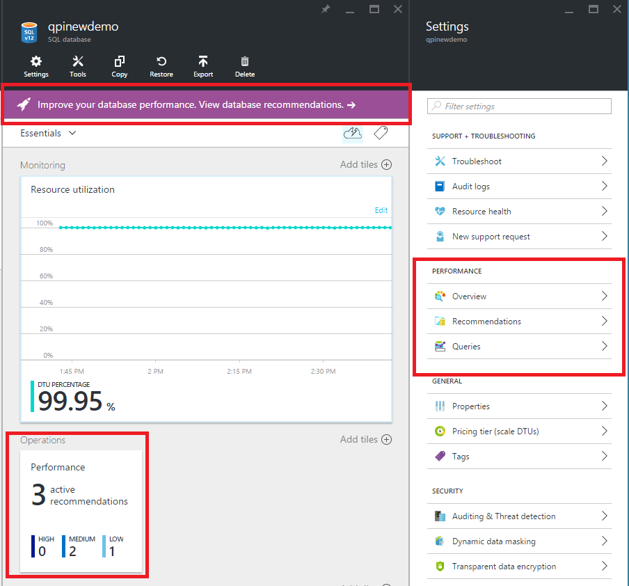
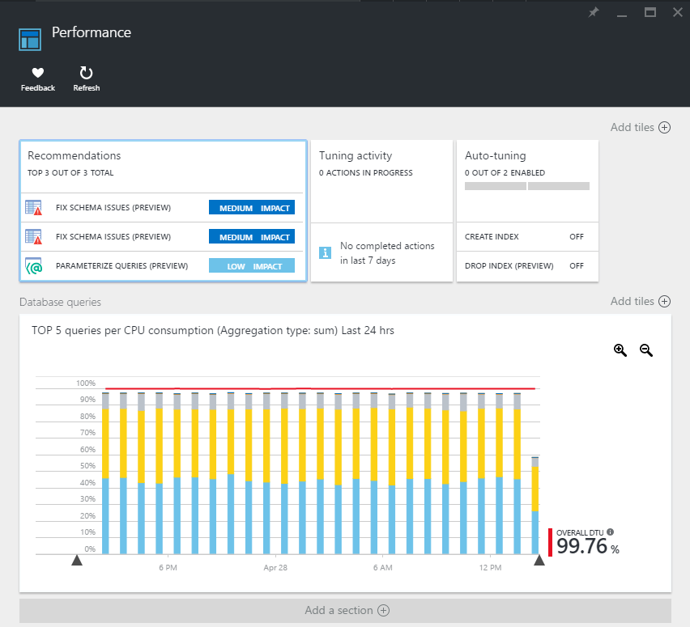

<properties 
   pageTitle="SQL Azure-Datenbank Leistung Einblicke | Microsoft Azure" 
   description="Der SQL Azure-Datenbank bietet Leistungstools, damit Sie Bereiche zu identifizieren, die aktuelle abfrageleistung zu verbessern können." 
   services="sql-database" 
   documentationCenter="" 
   authors="stevestein" 
   manager="jhubbard" 
   editor="monicar"/>

<tags
   ms.service="sql-database"
   ms.devlang="na"
   ms.topic="article"
   ms.tgt_pltfrm="na"
   ms.workload="data-management" 
   ms.date="07/19/2016"
   ms.author="sstein"/>

# SQL-Datenbank Leistung Einblick

Azure SQL-Datenbank bietet Performance Tools, damit Sie erkennen und verbessern die Leistung Ihrer Datenbanken können, indem Sie intelligente Videogeräten Aktionen und Empfehlungen. 

1. Navigieren Sie zu Ihrer Datenbank im [Portal Azure](http://portal.azure.com) und **Alle Einstellungen**auf > **Leistung **  > eine **Übersicht über** die **Leistung** Seite zu öffnen. 

2. Klicken Sie auf **Empfehlungen** , um den [SQL-Datenbank Advisor](#sql-database-advisor)zu öffnen, und klicken Sie auf **Abfragen** , um [Die Leistung Einblick Abfrage](#query-performance-insight)zu öffnen.

    

## Übersicht über die Leistung

**Übersicht** oder klicken Sie auf die Kachel der **Leistung** auf gelangen Sie zum Leistungsdashboard für Ihre Datenbank. Diese Ansicht enthält eine Zusammenfassung der Leistung der Datenbank, und hilft Ihnen, mit der Leistung optimieren von und Problembehandlung. 

- Die Kachel **Empfehlungen** detailliert an, optimieren Empfehlungen für die Datenbank (oberen 3 Empfehlungen werden angezeigt, wenn es mehrere gibt). Auf diese Kachel gelangen Sie **Advisor der SQL-Datenbank**. 
- Die Kachel **Optimieren Aktivität** bietet eine Zusammenfassung der laufenden und abgeschlossenen Aktionen für die Datenbank optimieren, was Ihnen einen schnellen Überblick über den Verlauf der Aktivität optimieren. Auf diese Kachel gelangen zur Vollbildansicht Videogeräten Verlauf anzeigen für die Datenbank.
- Die Kachel **automatische Abstimmung** zeigt die automatische Abstimmung Konfiguration für die Datenbank (welche Aktionen Feinabstimmung Ihrer Datenbank automatisch angewendet werden konfiguriert sind). Auf diese Kachel Öffnet das Dialogfeld Automatisierung Konfiguration.
- Die Kachel **Datenbankabfragen** zeigt die Zusammenfassung der Abfrage Daten für die Datenbank (insgesamt DTU oben und die Verwendung der Ressource Verarbeitung Abfragen). Auf diese Kachel öffnet **Die Leistung Einblick Abfrage**.

## SQL-Datenbank Advisor

[SQL-Datenbank Advisor](sql-database-advisor.md) Leitfaden intelligente Videogeräten, die Ihnen helfen können, die Ihrer Datenbank Leistung zu verbessern. 

- Empfehlungen für welche Indizes zu erstellen oder zu löschen (und eine Option zum Anwenden von Index Empfehlungen automatisch und ohne Benutzereingriff und automatisch Wiederherstellen einer Empfehlungen, die einen negativen Einfluss auf die Leistung haben).
- Empfehlungen für die Planung Schema Probleme in der Datenbank identifiziert werden.
- Empfehlungen für die Planung von Abfragen profitieren können parametrisierte Abfragen.

## Abfrage-Leistung einen Einblick

[Abfrage Leistung Einblicke](sql-database-query-performance.md) können Sie weniger Zeit für Problembehandlung Datenbank Leistung durch das Bereitstellen aufwenden:

- Tieferer Einblick in Ihre Datenbanken Ressourcenverbrauch (DTU). 
- Die verwendete CPU Verarbeitung von Abfragen, die potenziell zum Verbessern der Leistung optimiert werden können. 
- Die Möglichkeit, Drilldown in die Details einer Abfrage. 

## Zusätzliche Ressourcen

- [Azure SQL-Datenbank Leistung Anleitungen für einzelne Datenbanken](sql-database-performance-guidance.md)
- [Wann sollte eine Datenbank flexible Ressourcenpool werden verwendet?](sql-database-elastic-pool-guidance.md)