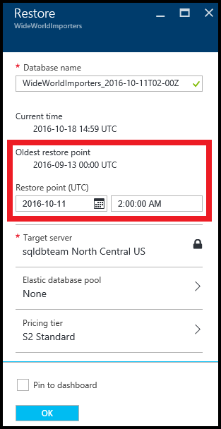

<properties
    pageTitle="Wiederherstellen eine SQL Azure-Datenbank zu einem vorherigen Punkt Zeitpunkt (Azure Portal) | Microsoft Azure"
    description="Wiederherstellen einer SQL Azure-Datenbank zu einem vorherigen Punkt Zeitpunkt an."
    services="sql-database"
    documentationCenter=""
    authors="stevestein"
    manager="jhubbard"
    editor=""/>

<tags
    ms.service="sql-database"
    ms.devlang="NA"
    ms.date="10/18/2016"
    ms.author="sstein"
    ms.workload="NA"
    ms.topic="article"
    ms.tgt_pltfrm="NA"/>

# Wiederherstellen einer SQL Azure-Datenbank zu einem vorherigen Punkt Zeitpunkt mit dem Azure-portal

> [AZURE.SELECTOR]
- [(Übersicht)](sql-database-recovery-using-backups.md)
- [Point-In-Time wiederherstellen: PowerShell](sql-database-point-in-time-restore-powershell.md)

In diesem Artikel wird gezeigt, wie die Datenbank zu einem früheren Zeitpunkt aus [SQL-Datenbank Sicherungskopien automatisierte](sql-database-automated-backups.md) wiederherstellen mithilfe des Azure-Portals.

## Wiederherstellen einer SQL-Datenbank zu einem vorherigen Punkt Zeitpunkt

Wählen Sie eine Datenbank zum Wiederherstellen der Azure-Portal an:

1.  Öffnen Sie das [Azure-Portal](https://portal.azure.com)an.
2.  Wählen Sie auf der linken Seite des Bildschirms, **Weitere Dienste** > **SQL-Datenbanken**.
3.  Klicken Sie auf die Datenbank, die Sie wiederherstellen möchten.
4.  Wählen Sie am oberen Rand der Seite Ihrer Datenbank **Stellen Sie wieder her**:

    

5.  Klicken Sie auf der Seite **Wiederherstellen** wählen Sie zum Wiederherstellen der Datenbank in das Datum und die Uhrzeit (in UTC-Zeit) aus, und klicken Sie dann auf **OK**:

    

## Überwachen des Wiederherstellungsvorgangs

1. Klicken Sie nachdem Sie auf **OK** im vorherigen Schritt auf das Benachrichtigungssymbol oben rechts auf der Seite, und klicken Sie auf die Benachrichtigung **Wiederherstellen SQL-Datenbank** für Details.

    

2. Informationen zum Status der Wiederherstellung wird die Seite wiederherstellen SQL-Datenbank geöffnet. Sie können die Position für weitere Details klicken:

    

 

## Nächste Schritte

- Eine Übersicht über Business-Continuity und Szenarien finden Sie unter [Übersicht über die Business continuity](sql-database-business-continuity.md)
- Weitere Informationen zu Azure SQL-Datenbank automatische Sicherungskopien finden Sie unter [SQL-Datenbank automatische Sicherungskopien](sql-database-automated-backups.md)
- Weitere Informationen zum automatische Sicherungskopien für Wiederherstellung verwenden, finden Sie unter [Wiederherstellen einer Datenbank aus den Dienst initiiert Sicherungskopien](sql-database-recovery-using-backups.md)
- Weitere Informationen zu schneller Wiederherstellungsoptionen finden Sie unter [Aktiv-Geo-Replikation](sql-database-geo-replication-overview.md)  
- Weitere Informationen zum Verwenden automatische Sicherungskopien für Archivierung, finden Sie unter [Datenbank kopieren](sql-database-copy.md)
